# Design Document: LLM Inference at Scale Workshop

## Overview

This workshop provides comprehensive, deep coverage of LLM inference at scale for ML platform engineers at Audible. The workshop follows a "start small, go big and deep" philosophy—building foundational understanding of transformer mechanics before tackling advanced optimization, distributed serving, and production operations. All hands-on work uses AWS as the platform (EC2, EKS, SageMaker, Inferentia2).

### Design Principles

1. **Comprehensive Coverage**: Cover all major technologies deeply (vLLM, SGLang, TensorRT-LLM, Ray, KServe, llm-d, all quantization methods)
2. **AWS as Platform**: All hands-on work on AWS (EC2, EKS, SageMaker, Inferentia2, Bedrock)
3. **Deep, Not Shallow**: Understand internals, not just APIs—participants should be able to explain mechanisms from memory
4. **Production-Ready**: Real deployment patterns, not toy examples
5. **Progressive Complexity**: Each module builds on previous concepts with clear dependencies

### Target Audience

ML platform engineers with:

- Python proficiency
- Basic understanding of neural networks
- AWS account access with appropriate permissions
- Familiarity with Docker and Kubernetes concepts

### Workshop Duration

- **Full Workshop**: 2 days (16 hours)
- **Condensed Version**: 1 day (8 hours) - Modules 0-5 + selected labs
- **Deep Dive Sessions**: 2-hour focused sessions on specific topics

## Architecture

### Workshop File Structure

```
learnings/ml_infra/llm_inference_at_scale/
├── 00_why_llm_inference_is_different.md
├── 01_transformer_inference_mechanics.md
├── 02_gpu_memory_engineering.md
├── 03_optimization_techniques.md
├── 04_inference_engines_deep_dive.md
├── 05_scaling_and_parallelism.md
├── 06_production_serving_architecture.md
├── 07_measurement_and_operations.md
├── 08_aws_deep_dive.md
├── 09_structured_output_guided_decoding.md
├── 10_edge_deployment.md (optional)
├── labs/
│   ├── lab_01_transformer_forward_pass/
│   │   ├── notebook.ipynb
│   │   ├── solutions.py
│   │   └── README.md
│   ├── lab_02_vram_calculation/
│   ├── lab_03_quantization_comparison/
│   ├── lab_04_vllm_deployment/
│   ├── lab_05_sglang_structured_output/
│   ├── lab_06_tensor_parallelism/
│   ├── lab_07_ray_serve_deployment/
│   ├── lab_08_eks_kserve_deployment/
│   ├── lab_09_sagemaker_production/
│   ├── lab_10_benchmarking_monitoring/
│   └── infrastructure/
│       ├── cloudformation/
│       ├── cdk/
│       └── terraform/
├── reference/
│   ├── cheat_sheet.md
│   ├── vllm_quick_reference.md
│   ├── cost_calculator.xlsx
│   └── glossary.md
├── slides/
│   └── workshop_slides.md
└── roadmap.md
```

### Module Dependency Graph

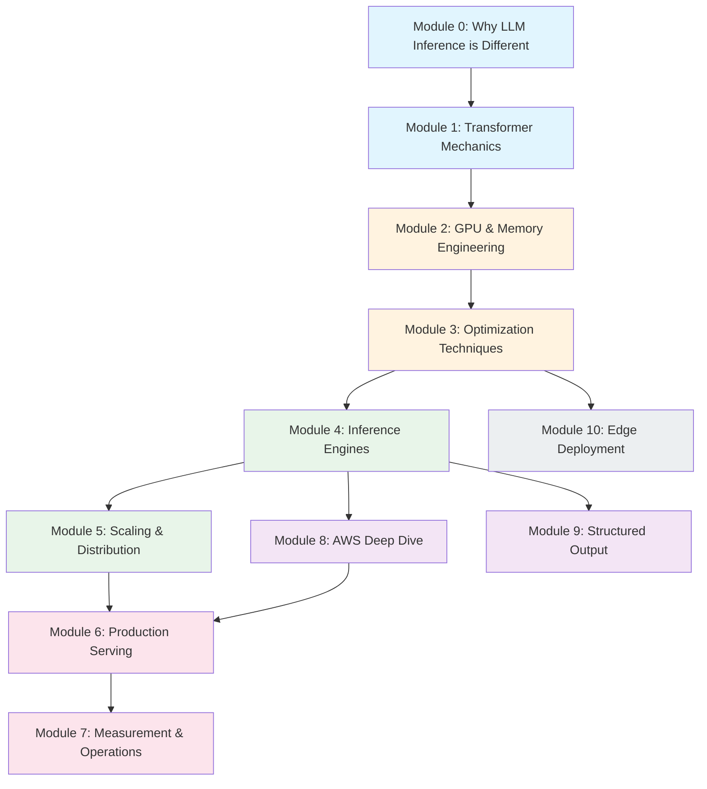

## Components and Interfaces

### Module 0: Why LLM Inference is Different

**Duration**: 30 minutes | **Type**: Lecture + Discussion

#### Learning Objectives

- Articulate 3 key differences between LLM inference and traditional ML inference
- Explain why LLM inference costs dominate ML infrastructure budgets
- Describe the end-to-end inference request lifecycle

#### Content Structure

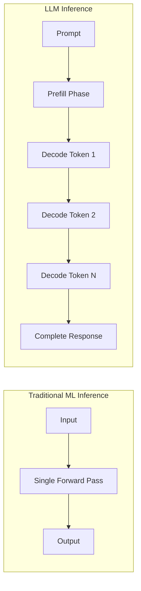

#### Key Concepts

1. **Autoregressive Generation**
   - Each token depends on all previous tokens
   - Cannot parallelize across output tokens
   - Variable output length (unknown at request time)

2. **Two-Phase Inference**

   ```
   Prefill Phase:
   - Process entire prompt in parallel
   - Compute-bound (matrix multiplications dominate)
   - Latency: O(prompt_length)

   Decode Phase:
   - Generate one token at a time
   - Memory-bandwidth-bound (weight reads dominate)
   - Latency: O(output_length × model_size)
   ```

3. **Cost Reality Check**
   | Metric | Traditional ML | LLM Inference |
   |--------|---------------|---------------|
   | Compute per request | Fixed | Variable (10x-1000x) |
   | Memory per request | ~MB | ~GB (KV cache) |
   | Latency | ms | seconds |
   | Cost per 1M requests | $1-10 | $100-10,000 |

#### End-to-End Request Lifecycle

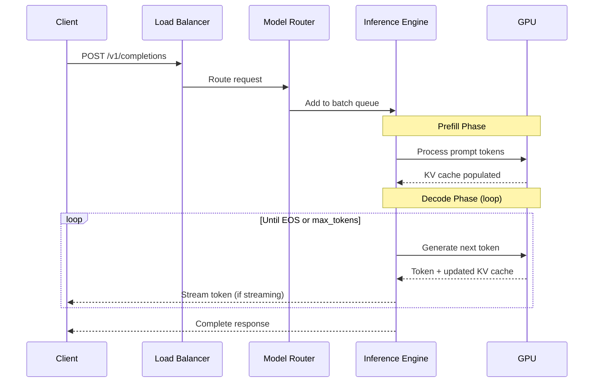

---

### Module 1: Transformer Inference Mechanics

**Duration**: 90 minutes | **Type**: Lecture + Hands-on Lab

#### Learning Objectives

- Trace the complete token generation pipeline from input to output
- Explain KV cache mechanics and why it dominates memory at scale
- Compare attention variants (MHA, MQA, GQA) with memory calculations
- Implement a minimal transformer forward pass demonstrating KV cache

#### Token Generation Pipeline

```mermaid
flowchart LR
    subgraph Input
        T[Text] --> TK[Tokenizer]
    end

    subgraph Embedding
        TK --> E[Token Embeddings]
        E --> PE[+ Position Embeddings]
    end

    subgraph TransformerBlock["Transformer Block (×N layers)"]
        PE --> LN1[LayerNorm]
        LN1 --> ATT[Multi-Head Attention]
        ATT --> R1[+ Residual]
        R1 --> LN2[LayerNorm]
        LN2 --> MLP[MLP/FFN]
        MLP --> R2[+ Residual]
    end

    subgraph Output
        R2 --> FLN[Final LayerNorm]
        FLN --> LM[LM Head]
        LM --> L[Logits]
        L --> S[Sampling]
        S --> NT[Next Token]
    end
```

#### Tensor Shape Annotations

```python
# Llama 3.1 8B Example Shapes
# B = batch_size, S = sequence_length, H = hidden_dim,
# N = num_heads, D = head_dim, V = vocab_size

# Input
input_ids: [B, S]           # [4, 2048] - batch of 4, 2048 tokens each

# After embedding
hidden_states: [B, S, H]    # [4, 2048, 4096] - 4096 hidden dim

# Attention (per layer)
Q: [B, N, S, D]             # [4, 32, 2048, 128] - 32 heads, 128 dim each
K: [B, N_kv, S, D]          # [4, 8, 2048, 128] - GQA: 8 KV heads
V: [B, N_kv, S, D]          # [4, 8, 2048, 128]

# KV Cache (accumulated across decode steps)
K_cache: [B, N_kv, S_total, D]  # Grows with each token
V_cache: [B, N_kv, S_total, D]

# MLP
gate_proj: [B, S, I]        # [4, 2048, 14336] - intermediate dim
up_proj: [B, S, I]          # [4, 2048, 14336]
down_proj: [B, S, H]        # [4, 2048, 4096]

# Output
logits: [B, S, V]           # [4, 2048, 128256] - vocab size
```

#### KV Cache Deep Dive

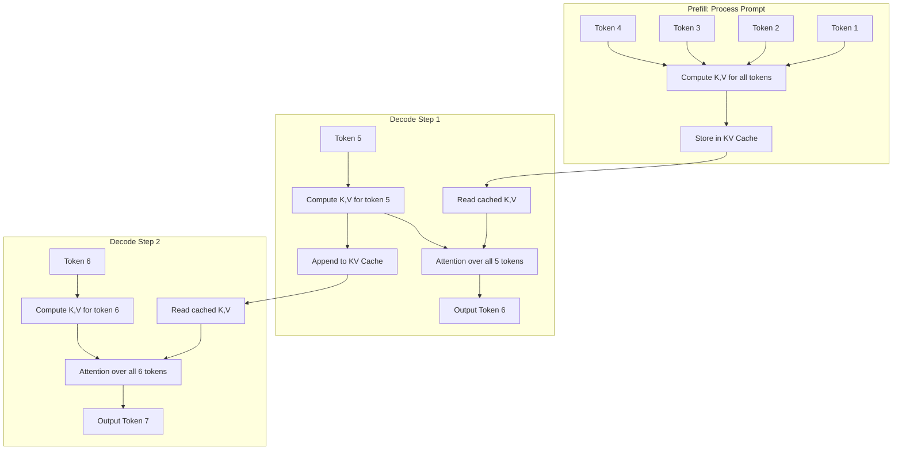

**KV Cache Memory Formula:**

```
KV_cache_size = 2 × num_layers × num_kv_heads × head_dim × seq_length × batch_size × bytes_per_element

Example: Llama 3.1 8B, batch=1, seq=4096, FP16
= 2 × 32 × 8 × 128 × 4096 × 1 × 2 bytes
= 536 MB per request
```

#### Attention Variants Comparison

| Variant             | KV Heads    | Memory  | Compute | Use Case                          |
| ------------------- | ----------- | ------- | ------- | --------------------------------- |
| MHA (Multi-Head)    | N_heads     | Highest | Highest | Original transformers             |
| MQA (Multi-Query)   | 1           | Lowest  | Lowest  | Fast inference, some quality loss |
| GQA (Grouped-Query) | N_heads / G | Medium  | Medium  | Best tradeoff (Llama 2/3)         |

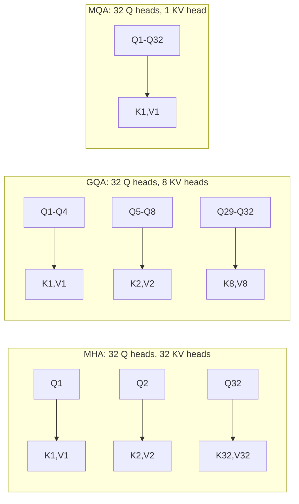

#### Lab 1: Transformer Forward Pass

**Objective**: Implement a minimal transformer forward pass to understand KV cache mechanics.

```python
# lab_01_transformer_forward_pass/notebook.ipynb

import torch
import torch.nn as nn
from typing import Optional, Tuple

class MinimalAttention(nn.Module):
    """Simplified attention with KV cache support."""

    def __init__(self, hidden_dim: int, num_heads: int, num_kv_heads: int):
        super().__init__()
        self.num_heads = num_heads
        self.num_kv_heads = num_kv_heads
        self.head_dim = hidden_dim // num_heads
        self.num_kv_groups = num_heads // num_kv_heads

        self.q_proj = nn.Linear(hidden_dim, num_heads * self.head_dim, bias=False)
        self.k_proj = nn.Linear(hidden_dim, num_kv_heads * self.head_dim, bias=False)
        self.v_proj = nn.Linear(hidden_dim, num_kv_heads * self.head_dim, bias=False)
        self.o_proj = nn.Linear(num_heads * self.head_dim, hidden_dim, bias=False)

    def forward(
        self,
        hidden_states: torch.Tensor,
        kv_cache: Optional[Tuple[torch.Tensor, torch.Tensor]] = None,
        use_cache: bool = True,
    ) -> Tuple[torch.Tensor, Optional[Tuple[torch.Tensor, torch.Tensor]]]:
        batch_size, seq_len, _ = hidden_states.shape

        # Project Q, K, V
        q = self.q_proj(hidden_states)
        k = self.k_proj(hidden_states)
        v = self.v_proj(hidden_states)

        # Reshape for attention
        q = q.view(batch_size, seq_len, self.num_heads, self.head_dim).transpose(1, 2)
        k = k.view(batch_size, seq_len, self.num_kv_heads, self.head_dim).transpose(1, 2)
        v = v.view(batch_size, seq_len, self.num_kv_heads, self.head_dim).transpose(1, 2)

        # Handle KV cache
        if kv_cache is not None:
            k_cache, v_cache = kv_cache
            k = torch.cat([k_cache, k], dim=2)
            v = torch.cat([v_cache, v], dim=2)

        new_cache = (k, v) if use_cache else None

        # Expand KV for GQA
        if self.num_kv_groups > 1:
            k = k.repeat_interleave(self.num_kv_groups, dim=1)
            v = v.repeat_interleave(self.num_kv_groups, dim=1)

        # Scaled dot-product attention
        scale = self.head_dim ** -0.5
        attn_weights = torch.matmul(q, k.transpose(-2, -1)) * scale
        attn_weights = torch.softmax(attn_weights, dim=-1)
        attn_output = torch.matmul(attn_weights, v)

        # Reshape and project output
        attn_output = attn_output.transpose(1, 2).contiguous()
        attn_output = attn_output.view(batch_size, seq_len, -1)
        output = self.o_proj(attn_output)

        return output, new_cache

# Exercise: Track KV cache growth during autoregressive generation
def demonstrate_kv_cache_growth():
    """Show how KV cache grows during decode phase."""
    model = MinimalAttention(hidden_dim=512, num_heads=8, num_kv_heads=2)

    # Prefill: process prompt
    prompt = torch.randn(1, 10, 512)  # 10 tokens
    output, kv_cache = model(prompt, kv_cache=None)
    print(f"After prefill - K cache shape: {kv_cache[0].shape}")

    # Decode: generate tokens one at a time
    for step in range(5):
        new_token = torch.randn(1, 1, 512)  # 1 new token
        output, kv_cache = model(new_token, kv_cache=kv_cache)
        print(f"Decode step {step+1} - K cache shape: {kv_cache[0].shape}")
```

**Expected Output:**

```
After prefill - K cache shape: torch.Size([1, 2, 10, 64])
Decode step 1 - K cache shape: torch.Size([1, 2, 11, 64])
Decode step 2 - K cache shape: torch.Size([1, 2, 12, 64])
Decode step 3 - K cache shape: torch.Size([1, 2, 13, 64])
Decode step 4 - K cache shape: torch.Size([1, 2, 14, 64])
Decode step 5 - K cache shape: torch.Size([1, 2, 15, 64])
```

---

### Module 2: GPU and Memory Engineering

**Duration**: 60 minutes | **Type**: Lecture + Calculation Exercises

#### Learning Objectives

- Apply roofline model thinking to identify compute vs memory bottlenecks
- Calculate VRAM requirements for any model configuration
- Understand GPU memory hierarchy and bandwidth implications
- Compare AWS GPU instance types for inference workloads

#### Roofline Model for LLM Inference

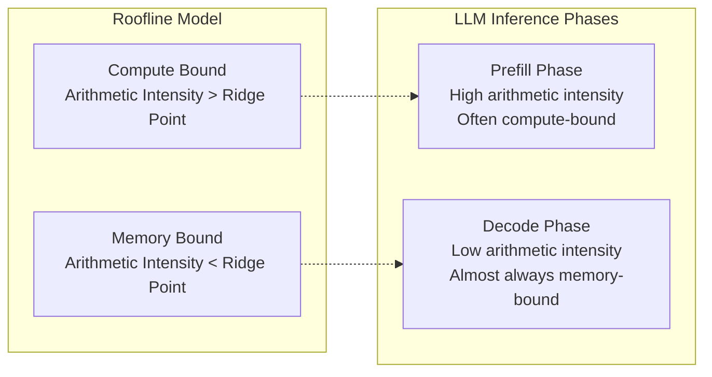

**Arithmetic Intensity Calculation:**

```
Arithmetic Intensity = FLOPs / Bytes Transferred

Prefill (batch of prompts):
- FLOPs: O(batch × seq_len × hidden² × layers)
- Bytes: O(model_params × bytes_per_param)
- AI: High (reuse weights across many tokens)

Decode (single token):
- FLOPs: O(batch × hidden² × layers)
- Bytes: O(model_params × bytes_per_param)
- AI: Low (read entire model for one token)
```

#### GPU Memory Hierarchy

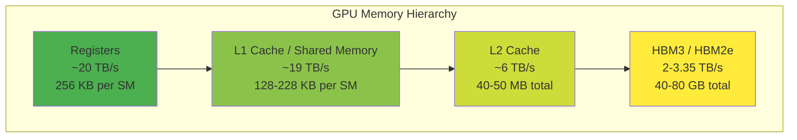

#### AWS GPU Instance Comparison

| Instance      | GPU         | VRAM   | Memory BW | FP16 TFLOPS | $/hr (on-demand) | Best For                 |
| ------------- | ----------- | ------ | --------- | ----------- | ---------------- | ------------------------ |
| g5.xlarge     | A10G        | 24 GB  | 600 GB/s  | 125         | $1.01            | Dev/test, small models   |
| g5.12xlarge   | 4× A10G     | 96 GB  | 2.4 TB/s  | 500         | $5.67            | Multi-GPU small models   |
| p4d.24xlarge  | 8× A100     | 320 GB | 16 TB/s   | 2496        | $32.77           | Large models, TP=8       |
| p5.48xlarge   | 8× H100     | 640 GB | 26.8 TB/s | 15936       | $98.32           | Maximum throughput       |
| inf2.xlarge   | Inferentia2 | 32 GB  | 820 GB/s  | 190         | $0.76            | Cost-optimized inference |
| inf2.48xlarge | 12× Inf2    | 384 GB | 9.8 TB/s  | 2280        | $12.98           | Large model, cost-opt    |

#### VRAM "Napkin Math" Formulas

```python
def calculate_vram_requirements(
    num_params_billions: float,
    precision: str,  # "fp32", "fp16", "int8", "int4"
    batch_size: int,
    seq_length: int,
    num_layers: int,
    num_kv_heads: int,
    head_dim: int,
) -> dict:
    """Calculate VRAM requirements for LLM inference."""

    # Bytes per parameter
    precision_bytes = {"fp32": 4, "fp16": 2, "bf16": 2, "int8": 1, "int4": 0.5}
    bytes_per_param = precision_bytes[precision]

    # Model weights
    model_weights_gb = (num_params_billions * 1e9 * bytes_per_param) / 1e9

    # KV cache per request
    # 2 (K and V) × layers × kv_heads × head_dim × seq_len × bytes
    kv_cache_per_seq = (
        2 * num_layers * num_kv_heads * head_dim * seq_length * 2  # FP16 for KV
    ) / 1e9
    kv_cache_total_gb = kv_cache_per_seq * batch_size

    # Activation memory (rough estimate: ~10% of model for inference)
    activations_gb = model_weights_gb * 0.1

    # CUDA overhead (~500MB-1GB)
    overhead_gb = 1.0

    total_gb = model_weights_gb + kv_cache_total_gb + activations_gb + overhead_gb

    return {
        "model_weights_gb": model_weights_gb,
        "kv_cache_gb": kv_cache_total_gb,
        "activations_gb": activations_gb,
        "overhead_gb": overhead_gb,
        "total_gb": total_gb,
    }

# Example: Llama 3.1 8B
llama_8b = calculate_vram_requirements(
    num_params_billions=8.0,
    precision="fp16",
    batch_size=32,
    seq_length=4096,
    num_layers=32,
    num_kv_heads=8,
    head_dim=128,
)
print(f"Llama 3.1 8B @ batch=32, seq=4096:")
print(f"  Model weights: {llama_8b['model_weights_gb']:.1f} GB")
print(f"  KV cache: {llama_8b['kv_cache_gb']:.1f} GB")
print(f"  Total: {llama_8b['total_gb']:.1f} GB")

# Example: Llama 3.1 70B
llama_70b = calculate_vram_requirements(
    num_params_billions=70.0,
    precision="fp16",
    batch_size=8,
    seq_length=4096,
    num_layers=80,
    num_kv_heads=8,
    head_dim=128,
)
print(f"\nLlama 3.1 70B @ batch=8, seq=4096:")
print(f"  Model weights: {llama_70b['model_weights_gb']:.1f} GB")
print(f"  KV cache: {llama_70b['kv_cache_gb']:.1f} GB")
print(f"  Total: {llama_70b['total_gb']:.1f} GB")
```

**Expected Output:**

```
Llama 3.1 8B @ batch=32, seq=4096:
  Model weights: 16.0 GB
  KV cache: 17.2 GB
  Total: 35.8 GB

Llama 3.1 70B @ batch=8, seq=4096:
  Model weights: 140.0 GB
  KV cache: 10.7 GB
  Total: 165.7 GB
```

---

### Module 3: Optimization Techniques

**Duration**: 90 minutes | **Type**: Lecture + Hands-on Lab

#### Learning Objectives

- Explain quantization methods (INT8, INT4, NF4, FP8, AWQ) with accuracy/performance tradeoffs
- Understand PagedAttention and continuous batching mechanisms
- Apply speculative decoding concepts (draft-verify, Medusa, EAGLE)
- Select appropriate optimization techniques based on workload characteristics

#### Quantization Deep Dive

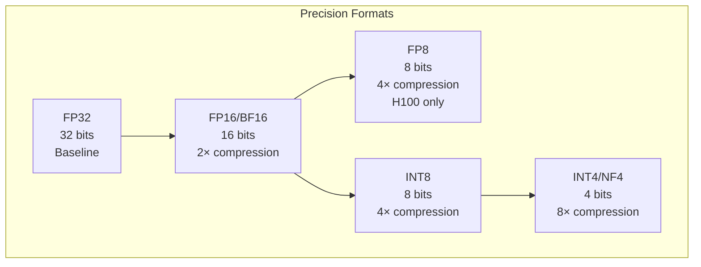

**Quantization Methods Comparison:**

| Method      | Bits | Compression | Quality Loss | Speed Gain | Best For            |
| ----------- | ---- | ----------- | ------------ | ---------- | ------------------- |
| FP16/BF16   | 16   | 2×          | None         | 1.5-2×     | Default choice      |
| FP8 (E4M3)  | 8    | 4×          | Minimal      | 2-3×       | H100 production     |
| INT8 (W8A8) | 8    | 4×          | <1%          | 2×         | Balanced            |
| GPTQ (INT4) | 4    | 8×          | 1-3%         | 2-3×       | Memory-constrained  |
| AWQ (INT4)  | 4    | 8×          | <1%          | 2-3×       | Best INT4 quality   |
| NF4 (QLoRA) | 4    | 8×          | 1-2%         | 2×         | Fine-tuning focused |

```python
# Quantization example with vLLM
from vllm import LLM

# FP16 (default)
llm_fp16 = LLM(model="meta-llama/Llama-3.1-8B-Instruct")

# AWQ INT4
llm_awq = LLM(
    model="casperhansen/llama-3.1-8b-instruct-awq",
    quantization="awq",
)

# GPTQ INT4
llm_gptq = LLM(
    model="TheBloke/Llama-3.1-8B-Instruct-GPTQ",
    quantization="gptq",
)

# FP8 (H100 only)
llm_fp8 = LLM(
    model="meta-llama/Llama-3.1-8B-Instruct",
    quantization="fp8",
)
```

#### PagedAttention

```mermaid
flowchart TB
    subgraph Traditional["Traditional KV Cache"]
        T1[Request 1: 2048 tokens<br/>Contiguous allocation]
        T2[Request 2: 512 tokens<br/>Contiguous allocation]
        T3[Fragmented<br/>Memory]
        T1 --> T3
        T2 --> T3
    end

    subgraph Paged["PagedAttention"]
        subgraph Blocks["Physical Blocks (16 tokens each)"]
            B1[Block 1]
            B2[Block 2]
            B3[Block 3]
            B4[Block 4]
            B5[Block 5]
        end

        subgraph Tables["Block Tables"]
            R1[Request 1: [1,3,5]]
            R2[Request 2: [2,4]]
        end

        R1 --> B1 & B3 & B5
        R2 --> B2 & B4
    end
```

**Key Benefits:**

1. **Near-zero fragmentation**: Allocate in fixed-size blocks
2. **Memory sharing**: Prefix caching across requests
3. **Dynamic allocation**: Grow/shrink as needed
4. **Copy-on-write**: Efficient beam search

#### Continuous Batching vs Static Batching

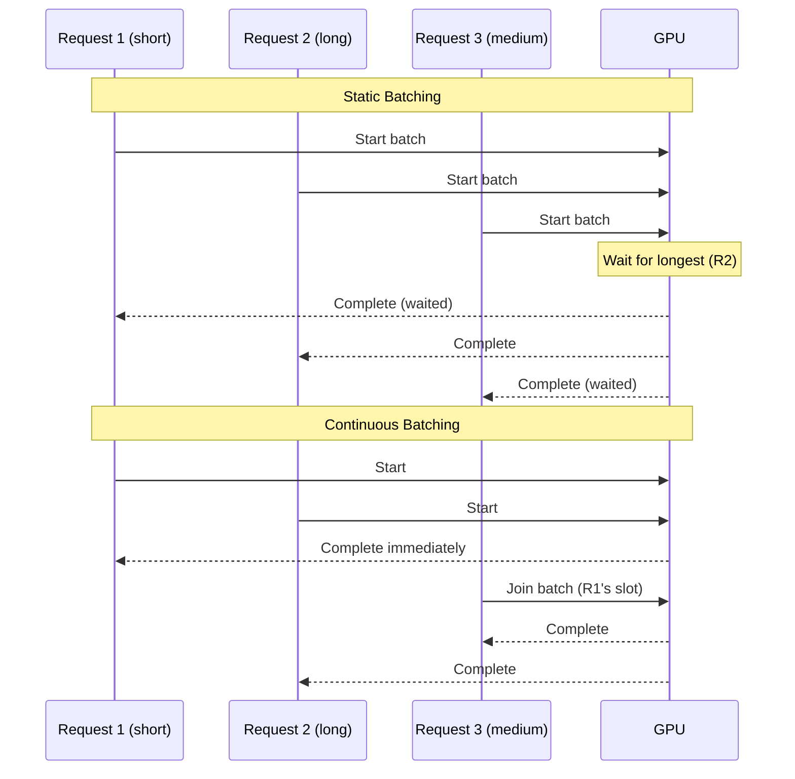

#### Speculative Decoding

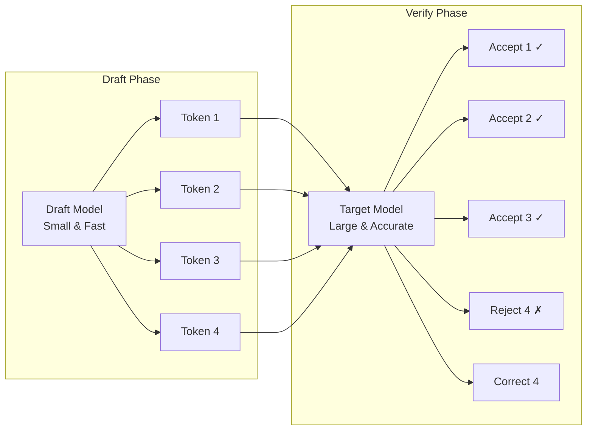

**Speculative Decoding Variants:**

| Method      | Draft Source          | Speedup | Overhead          | Best For         |
| ----------- | --------------------- | ------- | ----------------- | ---------------- |
| Draft Model | Smaller LLM           | 2-3×    | Memory for draft  | General use      |
| Medusa      | Extra heads           | 2-2.5×  | Training required | Single model     |
| EAGLE       | Feature extrapolation | 2-3×    | Training required | High quality     |
| N-gram      | Prompt patterns       | 1.5-2×  | None              | Repetitive tasks |

```python
# vLLM speculative decoding configuration
from vllm import LLM, SamplingParams

# Using a draft model
llm = LLM(
    model="meta-llama/Llama-3.1-70B-Instruct",
    speculative_model="meta-llama/Llama-3.1-8B-Instruct",
    num_speculative_tokens=5,
    speculative_draft_tensor_parallel_size=1,
)

# Using n-gram speculation (no draft model needed)
llm_ngram = LLM(
    model="meta-llama/Llama-3.1-8B-Instruct",
    speculative_model="[ngram]",
    num_speculative_tokens=5,
    ngram_prompt_lookup_max=4,
)
```

#### Chunked Prefill

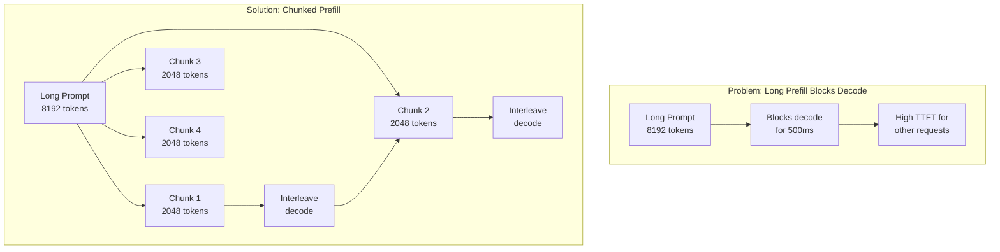

#### Optimization Decision Matrix

| Workload Characteristic | Recommended Optimizations               |
| ----------------------- | --------------------------------------- |
| Memory-constrained      | INT4 quantization (AWQ), PagedAttention |
| Latency-sensitive       | Speculative decoding, chunked prefill   |
| High throughput         | Continuous batching, larger batch sizes |
| Long contexts           | FlashAttention, chunked prefill         |
| Repetitive prompts      | Prefix caching, n-gram speculation      |
| Structured output       | SGLang, guided decoding                 |

---

### Module 4: Inference Engines Deep Dive

**Duration**: 120 minutes | **Type**: Lecture + Hands-on Labs

#### Learning Objectives

- Configure and tune vLLM for production workloads
- Understand SGLang's RadixAttention and when it outperforms vLLM
- Compare TensorRT-LLM's compilation approach
- Select the right engine for specific use cases

#### vLLM Architecture

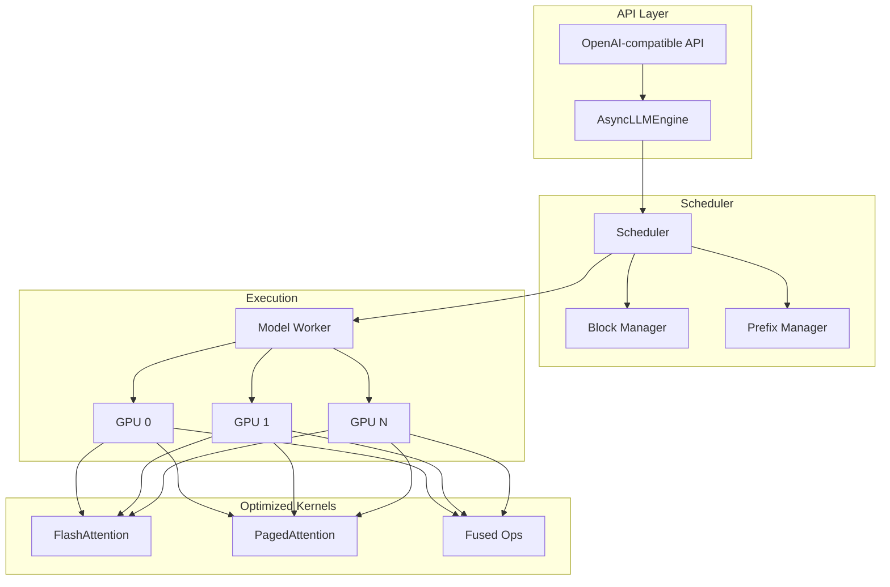

#### vLLM V0 vs V1 Architecture

| Feature               | V0                 | V1               |
| --------------------- | ------------------ | ---------------- |
| Scheduling            | Sync, step-by-step | Async, pipelined |
| Chunked Prefill       | Manual enable      | Default ON       |
| torch.compile         | Limited            | Full integration |
| Multi-step scheduling | No                 | Yes              |
| Performance           | Baseline           | 20-40% faster    |

#### The 6 Critical vLLM Tuning Knobs

```python
# vLLM production configuration
from vllm import LLM, SamplingParams

# Throughput-optimized configuration
llm_throughput = LLM(
    model="meta-llama/Llama-3.1-8B-Instruct",

    # Knob 1: Max batched tokens (biggest throughput lever)
    # Default: ~2048, try 8192-32768 for throughput
    max_num_batched_tokens=16384,

    # Knob 2: GPU memory utilization
    # Default: 0.90, try 0.95 to reclaim headroom
    gpu_memory_utilization=0.95,

    # Knob 3: Max concurrent sequences
    # Default: 256 (V0) / 1024 (V1), increase for bursty traffic
    max_num_seqs=1024,

    # Knob 4: Prefix caching (free win for repeated prompts)
    # Default: OFF
    enable_prefix_caching=True,

    # Knob 5: Chunked prefill (prevents long prompts blocking decode)
    # Default: OFF (V0), ON (V1)
    enable_chunked_prefill=True,

    # Knob 6: Tensor parallelism
    tensor_parallel_size=1,  # Increase for multi-GPU
)

# Latency-optimized configuration
llm_latency = LLM(
    model="meta-llama/Llama-3.1-8B-Instruct",
    max_num_batched_tokens=4096,  # Smaller for lower latency
    max_num_seqs=512,
    enable_chunked_prefill=True,
    gpu_memory_utilization=0.90,
)
```

#### SGLang Architecture

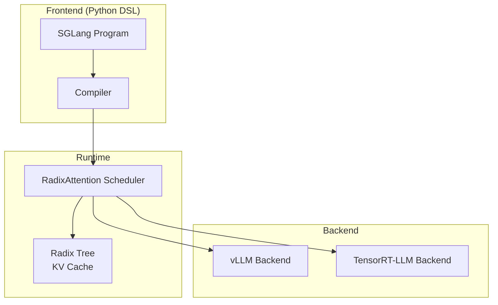

**RadixAttention: Prefix Tree for KV Cache**

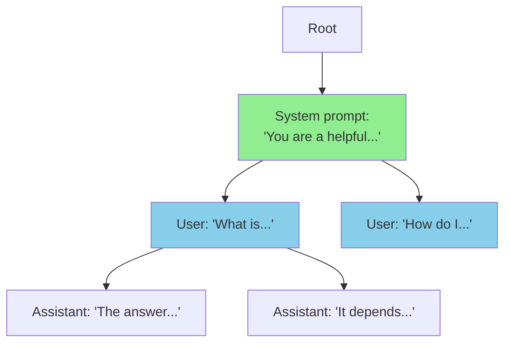

**When SGLang Outperforms vLLM:**

- Multi-turn conversations with shared context
- Structured output generation (JSON, code)
- Branching/tree-based generation
- Complex LLM programs with multiple calls

```python
# SGLang example: Structured JSON generation
import sglang as sgl

@sgl.function
def extract_entities(s, text):
    s += "Extract entities from: " + text + "\n"
    s += "Output JSON:\n"
    s += sgl.gen("json_output",
                 regex=r'\{"name": "[^"]+", "type": "[^"]+"\}')

# Multi-call program with shared prefix
@sgl.function
def multi_step_reasoning(s, question):
    s += "Question: " + question + "\n"
    s += "Step 1: " + sgl.gen("step1", max_tokens=100) + "\n"
    s += "Step 2: " + sgl.gen("step2", max_tokens=100) + "\n"
    s += "Final Answer: " + sgl.gen("answer", max_tokens=50)
```

#### TensorRT-LLM

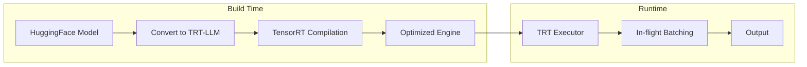

**TensorRT-LLM Compilation:**

```bash
# Convert and build TensorRT-LLM engine
python convert_checkpoint.py \
    --model_dir ./llama-3.1-8b \
    --output_dir ./trt_ckpt \
    --dtype float16

trtllm-build \
    --checkpoint_dir ./trt_ckpt \
    --output_dir ./trt_engine \
    --gemm_plugin float16 \
    --max_batch_size 64 \
    --max_input_len 2048 \
    --max_output_len 512
```

#### Engine Comparison Matrix

| Dimension         | vLLM       | SGLang     | TensorRT-LLM |
| ----------------- | ---------- | ---------- | ------------ |
| Ease of setup     | ⭐⭐⭐⭐⭐ | ⭐⭐⭐⭐   | ⭐⭐         |
| Throughput        | ⭐⭐⭐⭐   | ⭐⭐⭐⭐   | ⭐⭐⭐⭐⭐   |
| Latency           | ⭐⭐⭐⭐   | ⭐⭐⭐⭐   | ⭐⭐⭐⭐⭐   |
| Model support     | ⭐⭐⭐⭐⭐ | ⭐⭐⭐⭐   | ⭐⭐⭐       |
| Structured output | ⭐⭐⭐     | ⭐⭐⭐⭐⭐ | ⭐⭐         |
| AWS compatibility | ⭐⭐⭐⭐⭐ | ⭐⭐⭐⭐   | ⭐⭐⭐⭐     |
| Multi-GPU         | ⭐⭐⭐⭐⭐ | ⭐⭐⭐⭐   | ⭐⭐⭐⭐⭐   |

**Decision Guide:**

```
IF general serving AND fast iteration needed:
    USE vLLM

ELIF structured output OR multi-step programs:
    USE SGLang

ELIF maximum throughput on NVIDIA AND willing to compile:
    USE TensorRT-LLM

ELIF cost optimization on AWS:
    USE Inferentia2 + Neuron SDK
```

---

### Module 5: Scaling and Distribution

**Duration**: 90 minutes | **Type**: Lecture + Hands-on Lab

#### Learning Objectives

- Explain tensor, pipeline, and data parallelism with weight distribution diagrams
- Understand NCCL collectives and interconnect bandwidth requirements
- Configure multi-GPU inference with vLLM
- Understand MoE inference challenges and solutions

#### Parallelism Strategies

```mermaid
flowchart TB
    subgraph DP["Data Parallelism"]
        direction LR
        D1[GPU 0<br/>Full Model<br/>Batch 0-3]
        D2[GPU 1<br/>Full Model<br/>Batch 4-7]
        D3[GPU 2<br/>Full Model<br/>Batch 8-11]
    end

    subgraph TP["Tensor Parallelism"]
        direction LR
        T1[GPU 0<br/>Weights[:, :H/2]]
        T2[GPU 1<br/>Weights[:, H/2:]]
        T1 <--> |AllReduce| T2
    end

    subgraph PP["Pipeline Parallelism"]
        direction LR
        P1[GPU 0<br/>Layers 0-15]
        P2[GPU 1<br/>Layers 16-31]
        P1 --> |Activations| P2
    end
```

#### Tensor Parallelism Deep Dive

```mermaid
flowchart LR
    subgraph Input
        X[Input X<br/>[B, S, H]]
    end

    subgraph GPU0["GPU 0"]
        W0[W[:, :H/2]]
        X --> W0
        W0 --> Y0[Y0]
    end

    subgraph GPU1["GPU 1"]
        W1[W[:, H/2:]]
        X --> W1
        W1 --> Y1[Y1]
    end

    subgraph AllReduce["NCCL AllReduce"]
        Y0 --> AR[AllReduce]
        Y1 --> AR
        AR --> Y[Output Y<br/>[B, S, H]]
    end
```

**Column vs Row Parallelism:**

```python
# Column parallel: split output dimension
# W: [H_in, H_out] -> W0: [H_in, H_out/2], W1: [H_in, H_out/2]
# Y = X @ W -> Y0 = X @ W0, Y1 = X @ W1
# Concat Y0, Y1 (no communication needed yet)

# Row parallel: split input dimension
# W: [H_in, H_out] -> W0: [H_in/2, H_out], W1: [H_in/2, H_out]
# Y = X @ W -> Y0 = X0 @ W0, Y1 = X1 @ W1
# AllReduce Y0 + Y1 (communication required)
```

#### NCCL Collectives

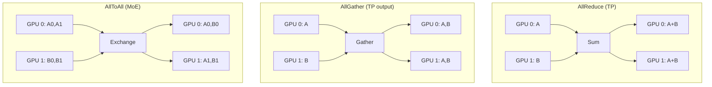

#### Interconnect Bandwidth Requirements

| Interconnect    | Bandwidth           | Latency | Use Case        |
| --------------- | ------------------- | ------- | --------------- |
| PCIe 4.0 x16    | 32 GB/s             | ~1μs    | Single node, DP |
| PCIe 5.0 x16    | 64 GB/s             | ~1μs    | Single node, DP |
| NVLink 3 (A100) | 600 GB/s            | ~1μs    | TP within node  |
| NVLink 4 (H100) | 900 GB/s            | ~1μs    | TP within node  |
| NVSwitch        | 900 GB/s all-to-all | ~1μs    | Full mesh TP    |
| EFA (AWS)       | 400 Gbps            | ~10μs   | Multi-node PP   |

**Rule of Thumb:**

- TP within NVLink-connected GPUs (same node)
- PP across nodes (EFA/InfiniBand)
- DP for independent replicas

#### Multi-GPU vLLM Configuration

```python
# Single node, 8 GPUs with tensor parallelism
from vllm import LLM

llm = LLM(
    model="meta-llama/Llama-3.1-70B-Instruct",
    tensor_parallel_size=8,  # Split across 8 GPUs
    # Pipeline parallelism (if needed)
    # pipeline_parallel_size=2,
)

# Multi-node with Ray
# Node 0: ray start --head
# Node 1: ray start --address=<head_ip>:6379

llm_distributed = LLM(
    model="meta-llama/Llama-3.1-405B-Instruct",
    tensor_parallel_size=8,
    pipeline_parallel_size=2,  # 2 nodes
    distributed_executor_backend="ray",
)
```

#### MoE (Mixture of Experts) Inference

```mermaid
flowchart TB
    subgraph Router["Router"]
        Input[Input Token]
        Gate[Gating Network]
        Input --> Gate
        Gate --> |Top-K| E1[Expert 1]
        Gate --> |Top-K| E3[Expert 3]
    end

    subgraph Experts["Expert Pool (N=8)"]
        E1[Expert 1<br/>GPU 0]
        E2[Expert 2<br/>GPU 0]
        E3[Expert 3<br/>GPU 1]
        E4[Expert 4<br/>GPU 1]
        E5[Expert 5<br/>GPU 2]
        E6[Expert 6<br/>GPU 2]
        E7[Expert 7<br/>GPU 3]
        E8[Expert 8<br/>GPU 3]
    end

    subgraph Output
        E1 --> Combine[Weighted Sum]
        E3 --> Combine
        Combine --> Out[Output]
    end
```

**MoE Inference Challenges:**

1. **Load Imbalance**: Popular experts get more tokens
2. **All-to-All Communication**: Tokens must reach their experts
3. **Memory**: All experts loaded even if sparse activation
4. **Routing Overhead**: Gating computation per token

```python
# MoE model serving with vLLM
llm_moe = LLM(
    model="mistralai/Mixtral-8x7B-Instruct-v0.1",
    tensor_parallel_size=4,  # Experts distributed across GPUs
    # Expert parallelism is automatic in vLLM
)
```

#### VRAM Calculations for Large Models

```python
def calculate_multi_gpu_vram(
    model_params_b: float,
    precision: str,
    tensor_parallel: int,
    pipeline_parallel: int,
    batch_size: int,
    seq_length: int,
    num_layers: int,
    num_kv_heads: int,
    head_dim: int,
) -> dict:
    """Calculate per-GPU VRAM for distributed inference."""

    precision_bytes = {"fp16": 2, "bf16": 2, "int8": 1, "int4": 0.5, "fp8": 1}
    bytes_per_param = precision_bytes[precision]

    total_gpus = tensor_parallel * pipeline_parallel

    # Model weights split across TP dimension
    weights_per_gpu = (model_params_b * 1e9 * bytes_per_param) / tensor_parallel / 1e9

    # KV cache: split across TP, replicated across PP
    layers_per_pp = num_layers // pipeline_parallel
    kv_heads_per_tp = num_kv_heads // tensor_parallel
    kv_per_gpu = (
        2 * layers_per_pp * kv_heads_per_tp * head_dim * seq_length * batch_size * 2
    ) / 1e9

    # Activations (rough estimate)
    activations_per_gpu = weights_per_gpu * 0.1

    total_per_gpu = weights_per_gpu + kv_per_gpu + activations_per_gpu + 1.0

    return {
        "total_gpus": total_gpus,
        "weights_per_gpu_gb": weights_per_gpu,
        "kv_cache_per_gpu_gb": kv_per_gpu,
        "total_per_gpu_gb": total_per_gpu,
    }

# Llama 3.1 70B on 8× A100 (80GB)
result = calculate_multi_gpu_vram(
    model_params_b=70,
    precision="fp16",
    tensor_parallel=8,
    pipeline_parallel=1,
    batch_size=32,
    seq_length=4096,
    num_layers=80,
    num_kv_heads=8,
    head_dim=128,
)
print(f"70B on TP=8: {result['total_per_gpu_gb']:.1f} GB per GPU")

# Llama 3.1 405B on 8× H100 (80GB) - needs PP
result_405b = calculate_multi_gpu_vram(
    model_params_b=405,
    precision="fp8",
    tensor_parallel=8,
    pipeline_parallel=2,  # 2 nodes
    batch_size=16,
    seq_length=4096,
    num_layers=126,
    num_kv_heads=8,
    head_dim=128,
)
print(f"405B on TP=8, PP=2: {result_405b['total_per_gpu_gb']:.1f} GB per GPU")
```

---

### Module 6: Production Serving Architecture

**Duration**: 90 minutes | **Type**: Lecture + Hands-on Lab

#### Learning Objectives

- Design production serving architectures with Ray Serve, KServe, and llm-d
- Configure autoscaling and load balancing for LLM workloads
- Implement canary deployments and model routing
- Apply security best practices for LLM serving

#### The Production Serving Stack

```mermaid
flowchart TB
    subgraph Clients["Clients"]
        C1[Web App]
        C2[Mobile App]
        C3[Internal Service]
    end

    subgraph Gateway["API Gateway / Load Balancer"]
        ALB[AWS ALB]
        Auth[Authentication]
        RL[Rate Limiting]
    end

    subgraph Orchestration["Orchestration Layer"]
        KS[KServe / llm-d]
        Route[Model Router]
        Scale[Autoscaler]
    end

    subgraph Serving["Serving Layer"]
        RS[Ray Serve]
        Rep1[Replica 1]
        Rep2[Replica 2]
        RepN[Replica N]
    end

    subgraph Inference["Inference Engine"]
        VL[vLLM]
        GPU1[GPU 0]
        GPU2[GPU 1]
    end

    C1 & C2 & C3 --> ALB
    ALB --> Auth --> RL --> KS
    KS --> Route --> Scale
    Route --> RS
    RS --> Rep1 & Rep2 & RepN
    Rep1 & Rep2 & RepN --> VL
    VL --> GPU1 & GPU2
```

#### Ray Serve for LLM Deployment

```python
# ray_serve_deployment.py
import ray
from ray import serve
from vllm import LLM, SamplingParams

@serve.deployment(
    ray_actor_options={"num_gpus": 1},
    autoscaling_config={
        "min_replicas": 1,
        "max_replicas": 10,
        "target_num_ongoing_requests_per_replica": 5,
    },
)
class VLLMDeployment:
    def __init__(self):
        self.llm = LLM(
            model="meta-llama/Llama-3.1-8B-Instruct",
            gpu_memory_utilization=0.95,
            max_num_batched_tokens=16384,
        )
        self.sampling_params = SamplingParams(
            temperature=0.7,
            max_tokens=512,
        )

    async def __call__(self, request):
        prompt = request.query_params.get("prompt", "")
        outputs = self.llm.generate([prompt], self.sampling_params)
        return {"text": outputs[0].outputs[0].text}

# Deploy
app = VLLMDeployment.bind()
serve.run(app, host="0.0.0.0", port=8000)
```

#### KServe on EKS

```yaml
# kserve-inferenceservice.yaml
apiVersion: serving.kserve.io/v1beta1
kind: InferenceService
metadata:
  name: llama-3-8b
  annotations:
    serving.kserve.io/autoscalerClass: hpa
    serving.kserve.io/metric: concurrency
    serving.kserve.io/targetUtilizationPercentage: "70"
spec:
  predictor:
    minReplicas: 1
    maxReplicas: 10
    scaleTarget: 5 # target concurrent requests
    scaleMetric: concurrency
    containers:
      - name: kserve-container
        image: vllm/vllm-openai:latest
        args:
          - --model=meta-llama/Llama-3.1-8B-Instruct
          - --gpu-memory-utilization=0.95
          - --max-num-batched-tokens=16384
        resources:
          limits:
            nvidia.com/gpu: 1
            memory: 32Gi
          requests:
            nvidia.com/gpu: 1
            memory: 24Gi
        env:
          - name: HF_TOKEN
            valueFrom:
              secretKeyRef:
                name: hf-secret
                key: token
```

#### llm-d: Disaggregated Prefill/Decode

```mermaid
flowchart TB
    subgraph Router["Intelligent Router"]
        R[llm-d Router]
        PQ[Prefill Queue]
        DQ[Decode Queue]
    end

    subgraph Prefill["Prefill Pool"]
        P1[Prefill Worker 1<br/>Compute-optimized]
        P2[Prefill Worker 2<br/>Compute-optimized]
    end

    subgraph Decode["Decode Pool"]
        D1[Decode Worker 1<br/>Memory-optimized]
        D2[Decode Worker 2<br/>Memory-optimized]
        D3[Decode Worker 3<br/>Memory-optimized]
    end

    subgraph KVStore["KV Cache Transfer"]
        KV[Distributed KV Store]
    end

    R --> PQ --> P1 & P2
    P1 & P2 --> KV
    KV --> D1 & D2 & D3
    R --> DQ --> D1 & D2 & D3
```

**Benefits of Disaggregation:**

1. **Optimized hardware**: Prefill on compute-heavy, decode on memory-heavy
2. **Independent scaling**: Scale prefill and decode separately
3. **Better utilization**: No idle GPUs waiting for long prefills
4. **Cost efficiency**: Use different instance types for each phase

#### Deployment Patterns

```mermaid
flowchart TB
    subgraph Pattern1["Pattern 1: Single Model"]
        LB1[Load Balancer]
        LB1 --> R1[Replica 1]
        LB1 --> R2[Replica 2]
        LB1 --> R3[Replica 3]
    end

    subgraph Pattern2["Pattern 2: Multi-Model Router"]
        LB2[Load Balancer]
        LB2 --> Router[Model Router]
        Router --> M1[Model A<br/>General]
        Router --> M2[Model B<br/>Code]
        Router --> M3[Model C<br/>Reasoning]
    end

    subgraph Pattern3["Pattern 3: Canary Deployment"]
        LB3[Load Balancer]
        LB3 --> |90%| Stable[Stable v1.0]
        LB3 --> |10%| Canary[Canary v1.1]
    end
```

#### Security Considerations

```mermaid
flowchart TB
    subgraph Security["Security Layers"]
        Auth[Authentication<br/>API Keys / OAuth]
        Rate[Rate Limiting<br/>Per-user quotas]
        Input[Input Validation<br/>Prompt injection defense]
        Output[Output Filtering<br/>PII detection]
        Audit[Audit Logging<br/>Request/response logs]
    end

    Request --> Auth --> Rate --> Input --> LLM[LLM Inference]
    LLM --> Output --> Audit --> Response
```

**Security Checklist:**

- [ ] API authentication (API keys, OAuth, IAM)
- [ ] Rate limiting per user/organization
- [ ] Input validation and sanitization
- [ ] Prompt injection detection
- [ ] Output filtering (PII, harmful content)
- [ ] Request/response logging (with PII masking)
- [ ] Network isolation (VPC, security groups)
- [ ] Secrets management (AWS Secrets Manager)

---

### Module 7: Measurement and Operations

**Duration**: 60 minutes | **Type**: Lecture + Hands-on Lab

#### Learning Objectives

- Define and measure key LLM inference metrics (TTFT, TBT, throughput)
- Design benchmarking methodology with representative workloads
- Set SLOs and configure alerting
- Troubleshoot common production issues

#### Key Metrics

```mermaid
flowchart LR
    subgraph Request["Request Timeline"]
        Start[Request Start]
        First[First Token]
        Last[Last Token]
        End[Request End]

        Start --> |TTFT| First
        First --> |TBT × N| Last
        Last --> End
    end

    subgraph Metrics["Key Metrics"]
        TTFT[TTFT<br/>Time to First Token]
        TBT[TBT<br/>Time Between Tokens]
        E2E[E2E Latency<br/>Total request time]
        TPS[Throughput<br/>Tokens/second]
    end
```

**Metric Definitions:**

| Metric      | Definition                       | Target (Chatbot) | Target (Batch) |
| ----------- | -------------------------------- | ---------------- | -------------- |
| TTFT        | Time from request to first token | < 500ms P95      | < 5s P95       |
| TBT         | Time between consecutive tokens  | < 50ms P95       | N/A            |
| E2E Latency | Total request completion time    | < 10s P95        | < 60s P95      |
| Throughput  | Output tokens per second         | > 50 tok/s       | > 500 tok/s    |
| Requests/s  | Concurrent request handling      | > 10 req/s       | > 100 req/s    |

#### Benchmarking Methodology

```python
# benchmark_suite.py
import asyncio
import time
from dataclasses import dataclass
from typing import List
import aiohttp
import numpy as np

@dataclass
class BenchmarkResult:
    ttft_ms: float
    tbt_ms: List[float]
    total_tokens: int
    e2e_latency_ms: float

async def benchmark_request(
    session: aiohttp.ClientSession,
    url: str,
    prompt: str,
    max_tokens: int,
) -> BenchmarkResult:
    """Benchmark a single streaming request."""
    start_time = time.perf_counter()
    first_token_time = None
    token_times = []
    total_tokens = 0

    async with session.post(
        url,
        json={"prompt": prompt, "max_tokens": max_tokens, "stream": True},
    ) as response:
        async for chunk in response.content:
            current_time = time.perf_counter()
            if first_token_time is None:
                first_token_time = current_time
            else:
                token_times.append(current_time)
            total_tokens += 1

    end_time = time.perf_counter()

    # Calculate TBT
    tbt_ms = []
    for i in range(1, len(token_times)):
        tbt_ms.append((token_times[i] - token_times[i-1]) * 1000)

    return BenchmarkResult(
        ttft_ms=(first_token_time - start_time) * 1000,
        tbt_ms=tbt_ms,
        total_tokens=total_tokens,
        e2e_latency_ms=(end_time - start_time) * 1000,
    )

async def run_benchmark(
    url: str,
    prompts: List[str],
    concurrency: int,
    max_tokens: int,
) -> dict:
    """Run benchmark with specified concurrency."""
    connector = aiohttp.TCPConnector(limit=concurrency)
    async with aiohttp.ClientSession(connector=connector) as session:
        tasks = [
            benchmark_request(session, url, prompt, max_tokens)
            for prompt in prompts
        ]
        results = await asyncio.gather(*tasks)

    # Aggregate results
    ttfts = [r.ttft_ms for r in results]
    all_tbts = [tbt for r in results for tbt in r.tbt_ms]
    e2e_latencies = [r.e2e_latency_ms for r in results]
    total_tokens = sum(r.total_tokens for r in results)
    total_time = max(e2e_latencies) / 1000

    return {
        "ttft_p50_ms": np.percentile(ttfts, 50),
        "ttft_p95_ms": np.percentile(ttfts, 95),
        "ttft_p99_ms": np.percentile(ttfts, 99),
        "tbt_p50_ms": np.percentile(all_tbts, 50) if all_tbts else 0,
        "tbt_p95_ms": np.percentile(all_tbts, 95) if all_tbts else 0,
        "e2e_p50_ms": np.percentile(e2e_latencies, 50),
        "e2e_p95_ms": np.percentile(e2e_latencies, 95),
        "throughput_tokens_per_sec": total_tokens / total_time,
        "requests_per_sec": len(results) / total_time,
    }
```

#### Monitoring Dashboard Specification

```yaml
# CloudWatch Dashboard for LLM Inference
dashboard:
  name: llm-inference-monitoring

  widgets:
    - type: metric
      title: "TTFT (Time to First Token)"
      metrics:
        - name: ttft_p50
          statistic: p50
          threshold: 300ms
        - name: ttft_p95
          statistic: p95
          threshold: 500ms
          alarm: true
        - name: ttft_p99
          statistic: p99
          threshold: 1000ms
          alarm: true

    - type: metric
      title: "Throughput"
      metrics:
        - name: tokens_per_second
          statistic: avg
          threshold: 100
        - name: requests_per_second
          statistic: avg

    - type: metric
      title: "GPU Utilization"
      metrics:
        - name: gpu_utilization_percent
          statistic: avg
          threshold: 80
        - name: gpu_memory_used_gb
          statistic: max

    - type: metric
      title: "Queue Depth"
      metrics:
        - name: pending_requests
          statistic: max
          threshold: 100
          alarm: true

    - type: metric
      title: "Error Rate"
      metrics:
        - name: error_rate_percent
          statistic: avg
          threshold: 1
          alarm: true

  alarms:
    - name: high-ttft
      metric: ttft_p95
      threshold: 1000ms
      period: 5m
      action: sns-alert

    - name: low-throughput
      metric: tokens_per_second
      threshold: 50
      comparison: LessThan
      period: 5m
      action: sns-alert

    - name: high-error-rate
      metric: error_rate_percent
      threshold: 5
      period: 5m
      action: pagerduty
```

#### Troubleshooting Guide

| Symptom              | Likely Cause                | Diagnosis                          | Solution                                   |
| -------------------- | --------------------------- | ---------------------------------- | ------------------------------------------ |
| High TTFT            | Long prefill queue          | Check pending_requests metric      | Increase replicas, enable chunked prefill  |
| High TBT             | Memory bandwidth saturation | Check GPU memory utilization       | Reduce batch size, use quantization        |
| OOM errors           | KV cache overflow           | Check max sequence length          | Reduce max_num_seqs, enable PagedAttention |
| Low throughput       | Small batch sizes           | Check batch utilization            | Increase max_num_batched_tokens            |
| Inconsistent latency | Request size variance       | Analyze prompt length distribution | Enable chunked prefill                     |
| GPU underutilization | CPU bottleneck              | Check CPU utilization              | Increase CPU cores, optimize tokenization  |

---

### Module 8: AWS Deep Dive

**Duration**: 90 minutes | **Type**: Lecture + Hands-on Labs

#### Learning Objectives

- Deploy LLM inference on EC2 GPU instances with vLLM
- Configure SageMaker endpoints with LMI containers
- Understand Inferentia2 compilation and deployment
- Compare Bedrock vs self-hosted for different use cases

#### AWS Instance Selection Guide

```mermaid
flowchart TB
    Start[Model Size?]
    Start --> |< 15B params| Small[Small Model]
    Start --> |15-70B params| Medium[Medium Model]
    Start --> |> 70B params| Large[Large Model]

    Small --> |Dev/Test| G5[g5.xlarge<br/>1× A10G, 24GB<br/>$1.01/hr]
    Small --> |Production| G5P[g5.2xlarge<br/>1× A10G, 24GB<br/>$1.21/hr]
    Small --> |Cost-optimized| Inf2S[inf2.xlarge<br/>1× Inf2, 32GB<br/>$0.76/hr]

    Medium --> |Standard| P4D[p4d.24xlarge<br/>8× A100, 320GB<br/>$32.77/hr]
    Medium --> |Cost-optimized| Inf2M[inf2.24xlarge<br/>6× Inf2, 192GB<br/>$6.49/hr]

    Large --> |Maximum perf| P5[p5.48xlarge<br/>8× H100, 640GB<br/>$98.32/hr]
    Large --> |Cost-optimized| Inf2L[inf2.48xlarge<br/>12× Inf2, 384GB<br/>$12.98/hr]
```

#### EC2 + vLLM Deployment

```bash
#!/bin/bash
# deploy_vllm_ec2.sh

# Launch g5.2xlarge instance with Deep Learning AMI
aws ec2 run-instances \
    --image-id ami-0123456789abcdef0 \  # Deep Learning AMI
    --instance-type g5.2xlarge \
    --key-name my-key \
    --security-group-ids sg-xxx \
    --subnet-id subnet-xxx \
    --block-device-mappings '[{"DeviceName":"/dev/sda1","Ebs":{"VolumeSize":200}}]' \
    --tag-specifications 'ResourceType=instance,Tags=[{Key=Name,Value=vllm-server}]'

# On the instance:
pip install vllm

# Start vLLM server
python -m vllm.entrypoints.openai.api_server \
    --model meta-llama/Llama-3.1-8B-Instruct \
    --host 0.0.0.0 \
    --port 8000 \
    --gpu-memory-utilization 0.95 \
    --max-num-batched-tokens 16384 \
    --enable-prefix-caching \
    --enable-chunked-prefill
```

#### SageMaker LMI Deployment

```python
# sagemaker_lmi_deployment.py
import sagemaker
from sagemaker.djl_inference import DJLModel

role = sagemaker.get_execution_role()
sess = sagemaker.Session()

# Define model with vLLM backend
model = DJLModel(
    model_id="meta-llama/Llama-3.1-8B-Instruct",
    role=role,
    task="text-generation",
    # LMI container with vLLM
    image_uri=sagemaker.image_uris.retrieve(
        framework="djl-lmi",
        region=sess.boto_region_name,
        version="0.28.0",
    ),
    env={
        "OPTION_ROLLING_BATCH": "vllm",
        "OPTION_MAX_ROLLING_BATCH_SIZE": "64",
        "OPTION_TENSOR_PARALLEL_DEGREE": "1",
        "OPTION_MAX_MODEL_LEN": "4096",
        "OPTION_GPU_MEMORY_UTILIZATION": "0.95",
    },
)

# Deploy endpoint
predictor = model.deploy(
    instance_type="ml.g5.2xlarge",
    initial_instance_count=1,
    endpoint_name="llama-3-8b-vllm",
    container_startup_health_check_timeout=900,
)

# Configure autoscaling
client = boto3.client("application-autoscaling")
client.register_scalable_target(
    ServiceNamespace="sagemaker",
    ResourceId=f"endpoint/{predictor.endpoint_name}/variant/AllTraffic",
    ScalableDimension="sagemaker:variant:DesiredInstanceCount",
    MinCapacity=1,
    MaxCapacity=10,
)

client.put_scaling_policy(
    PolicyName="llm-scaling-policy",
    ServiceNamespace="sagemaker",
    ResourceId=f"endpoint/{predictor.endpoint_name}/variant/AllTraffic",
    ScalableDimension="sagemaker:variant:DesiredInstanceCount",
    PolicyType="TargetTrackingScaling",
    TargetTrackingScalingPolicyConfiguration={
        "TargetValue": 5.0,  # Target concurrent requests per instance
        "PredefinedMetricSpecification": {
            "PredefinedMetricType": "SageMakerVariantInvocationsPerInstance"
        },
        "ScaleInCooldown": 300,
        "ScaleOutCooldown": 60,
    },
)
```

#### Inferentia2 Deployment

```python
# inferentia2_deployment.py
from optimum.neuron import NeuronModelForCausalLM
from transformers import AutoTokenizer
import torch_neuronx

# Compile model for Inferentia2
model_id = "meta-llama/Llama-3.1-8B-Instruct"

# Export to Neuron format
model = NeuronModelForCausalLM.from_pretrained(
    model_id,
    export=True,
    batch_size=1,
    sequence_length=2048,
    num_cores=2,  # NeuronCores to use
    auto_cast_type="bf16",
)

# Save compiled model
model.save_pretrained("./llama-3-8b-neuron")

# Load and run inference
tokenizer = AutoTokenizer.from_pretrained(model_id)
model = NeuronModelForCausalLM.from_pretrained("./llama-3-8b-neuron")

inputs = tokenizer("Hello, how are you?", return_tensors="pt")
outputs = model.generate(**inputs, max_new_tokens=100)
print(tokenizer.decode(outputs[0]))
```

**Inferentia2 Compilation Options:**

| Parameter       | Description           | Recommendation                           |
| --------------- | --------------------- | ---------------------------------------- |
| batch_size      | Fixed batch size      | Start with 1, increase for throughput    |
| sequence_length | Max input length      | Match your use case (1024-4096)          |
| num_cores       | NeuronCores per model | 2-8 depending on model size              |
| auto_cast_type  | Precision             | bf16 for quality, fp16 for compatibility |

#### Bedrock vs Self-Hosted Comparison

| Dimension          | Bedrock             | Self-Hosted (EC2/SageMaker) |
| ------------------ | ------------------- | --------------------------- |
| Setup time         | Minutes             | Hours to days               |
| Operational burden | None                | High                        |
| Cost (low volume)  | Higher per token    | Higher fixed cost           |
| Cost (high volume) | Higher per token    | Lower per token             |
| Latency            | ~500ms TTFT         | ~200ms TTFT (tuned)         |
| Customization      | Limited             | Full control                |
| Model selection    | Bedrock models only | Any model                   |
| Fine-tuning        | Limited             | Full support                |
| Data privacy       | AWS managed         | Full control                |

**Decision Framework:**

```
IF low volume (< 1M tokens/day) AND standard models sufficient:
    USE Bedrock (simplicity wins)

ELIF high volume OR custom models OR strict latency requirements:
    USE Self-hosted

ELIF cost-sensitive AND can tolerate compilation:
    USE Inferentia2
```

#### AWS Architecture Patterns

```mermaid
flowchart TB
    subgraph Pattern1["Pattern 1: Simple (Bedrock)"]
        C1[Client] --> API1[API Gateway]
        API1 --> Lambda1[Lambda]
        Lambda1 --> BR[Bedrock]
    end

    subgraph Pattern2["Pattern 2: SageMaker Production"]
        C2[Client] --> ALB2[ALB]
        ALB2 --> SM[SageMaker Endpoint]
        SM --> ASG[Auto Scaling]
        ASG --> G5[g5 Instances]
    end

    subgraph Pattern3["Pattern 3: EKS + KServe"]
        C3[Client] --> ALB3[ALB]
        ALB3 --> Ingress[Istio Ingress]
        Ingress --> KS[KServe]
        KS --> Pods[vLLM Pods]
        Pods --> GPU[GPU Nodes]
        GPU --> Karpenter[Karpenter<br/>Auto Scaling]
    end
```

---

### Module 9: Structured Output and Guided Decoding

**Duration**: 45 minutes | **Type**: Lecture + Hands-on Lab

#### Learning Objectives

- Implement JSON schema-constrained generation
- Configure guided decoding backends in vLLM
- Use SGLang for complex structured output
- Apply structured output for function calling and tool use

#### Guided Decoding Approaches

```mermaid
flowchart TB
    subgraph Methods["Guided Decoding Methods"]
        JSON[JSON Schema<br/>Enforce valid JSON structure]
        Regex[Regex<br/>Pattern matching]
        CFG[Context-Free Grammar<br/>Complex structures]
        Choice[Choice<br/>Enum selection]
    end

    subgraph Backends["vLLM Backends"]
        Outlines[outlines<br/>Default, fast]
        LMFormat[lm-format-enforcer<br/>Alternative]
    end

    Methods --> Backends
```

#### vLLM Structured Output

```python
# vllm_structured_output.py
from vllm import LLM, SamplingParams
from pydantic import BaseModel
from typing import List, Optional

# Define output schema
class Entity(BaseModel):
    name: str
    type: str
    confidence: float

class ExtractionResult(BaseModel):
    entities: List[Entity]
    summary: str

# Initialize vLLM with guided decoding
llm = LLM(
    model="meta-llama/Llama-3.1-8B-Instruct",
    guided_decoding_backend="outlines",  # or "lm-format-enforcer"
)

# Generate with JSON schema constraint
sampling_params = SamplingParams(
    temperature=0.7,
    max_tokens=500,
)

prompt = """Extract entities from the following text:
"Apple Inc. announced that CEO Tim Cook will present the new iPhone 16 at their Cupertino headquarters."

Output as JSON:"""

outputs = llm.generate(
    [prompt],
    sampling_params,
    guided_options_request={
        "guided_json": ExtractionResult.model_json_schema(),
    },
)

print(outputs[0].outputs[0].text)
# {"entities": [{"name": "Apple Inc.", "type": "COMPANY", "confidence": 0.95}, ...], "summary": "..."}
```

#### SGLang Structured Generation

```python
# sglang_structured.py
import sglang as sgl
from sglang import RuntimeEndpoint

# Connect to SGLang server
runtime = RuntimeEndpoint("http://localhost:30000")

@sgl.function
def extract_with_schema(s, text):
    s += f"Extract entities from: {text}\n"
    s += "Output JSON with entities array:\n"
    s += sgl.gen(
        "result",
        regex=r'\{"entities": \[(\{"name": "[^"]+", "type": "[^"]+"\},?\s*)+\]\}',
    )

@sgl.function
def function_calling(s, user_query):
    s += f"User query: {user_query}\n"
    s += "Select the appropriate function:\n"
    s += sgl.gen(
        "function",
        choices=["search_web", "get_weather", "send_email", "none"],
    )

    with sgl.match("function"):
        with sgl.case("search_web"):
            s += "\nSearch query: "
            s += sgl.gen("query", max_tokens=50)
        with sgl.case("get_weather"):
            s += "\nLocation: "
            s += sgl.gen("location", regex=r'[A-Za-z\s]+, [A-Z]{2}')
        with sgl.case("send_email"):
            s += "\nRecipient: "
            s += sgl.gen("recipient", regex=r'[a-z]+@[a-z]+\.[a-z]+')
            s += "\nSubject: "
            s += sgl.gen("subject", max_tokens=20)

# Run
result = extract_with_schema.run(
    text="Microsoft CEO Satya Nadella announced Azure AI updates.",
    backend=runtime,
)
print(result["result"])
```

---

### Module 10: Edge Deployment (Optional)

**Duration**: 30 minutes | **Type**: Lecture + Demo

#### Learning Objectives

- Understand llama.cpp architecture and GGUF format
- Configure quantization for edge devices
- Deploy on NVIDIA Jetson and Apple Silicon

#### Edge Deployment Options

| Platform      | Framework      | Memory   | Throughput   | Use Case              |
| ------------- | -------------- | -------- | ------------ | --------------------- |
| CPU (x86)     | llama.cpp      | 8-32 GB  | 10-30 tok/s  | Development, low-cost |
| Apple Silicon | MLX, llama.cpp | 16-64 GB | 30-100 tok/s | Mac development       |
| NVIDIA Jetson | TensorRT-LLM   | 8-64 GB  | 20-50 tok/s  | Edge AI               |
| Mobile        | llama.cpp, MLC | 4-8 GB   | 5-15 tok/s   | On-device             |

```bash
# llama.cpp deployment
git clone https://github.com/ggerganov/llama.cpp
cd llama.cpp
make -j

# Download GGUF model
wget https://huggingface.co/TheBloke/Llama-3.1-8B-Instruct-GGUF/resolve/main/llama-3.1-8b-instruct.Q4_K_M.gguf

# Run inference
./main -m llama-3.1-8b-instruct.Q4_K_M.gguf \
    -p "Hello, how are you?" \
    -n 100 \
    -t 8  # threads
```

## Data Models

### Workshop Configuration Schema

```python
from pydantic import BaseModel
from typing import List, Optional
from enum import Enum

class ModuleType(str, Enum):
    LECTURE = "lecture"
    LAB = "lab"
    DISCUSSION = "discussion"

class DifficultyLevel(str, Enum):
    BEGINNER = "beginner"
    INTERMEDIATE = "intermediate"
    ADVANCED = "advanced"

class Module(BaseModel):
    id: str
    title: str
    duration_minutes: int
    type: ModuleType
    difficulty: DifficultyLevel
    prerequisites: List[str]
    learning_objectives: List[str]
    content_file: str
    lab_file: Optional[str] = None

class Lab(BaseModel):
    id: str
    title: str
    duration_minutes: int
    difficulty: DifficultyLevel
    prerequisites: List[str]
    aws_resources: List[str]
    estimated_cost: float
    notebook_file: str
    infrastructure_template: Optional[str] = None

class WorkshopConfig(BaseModel):
    title: str
    version: str
    total_duration_hours: float
    modules: List[Module]
    labs: List[Lab]
```

### Benchmark Result Schema

```python
from pydantic import BaseModel
from typing import List, Dict
from datetime import datetime

class LatencyMetrics(BaseModel):
    ttft_p50_ms: float
    ttft_p95_ms: float
    ttft_p99_ms: float
    tbt_p50_ms: float
    tbt_p95_ms: float
    e2e_p50_ms: float
    e2e_p95_ms: float

class ThroughputMetrics(BaseModel):
    tokens_per_second: float
    requests_per_second: float
    batch_utilization: float

class ResourceMetrics(BaseModel):
    gpu_utilization_percent: float
    gpu_memory_used_gb: float
    cpu_utilization_percent: float
    memory_used_gb: float

class BenchmarkRun(BaseModel):
    run_id: str
    timestamp: datetime
    model_name: str
    engine: str
    instance_type: str
    configuration: Dict[str, any]
    workload: Dict[str, any]
    latency: LatencyMetrics
    throughput: ThroughputMetrics
    resources: ResourceMetrics
```

## Correctness Properties

_A property is a characteristic or behavior that should hold true across all valid executions of a system—essentially, a formal statement about what the system should do. Properties serve as the bridge between human-readable specifications and machine-verifiable correctness guarantees._

Based on the prework analysis of acceptance criteria, the following correctness properties can be validated through automated testing:

### Property 1: Module Content Completeness

_For any_ module document in the workshop, the document SHALL contain all required sections: learning objectives, content with Mermaid diagrams, code examples with type hints, comparison tables (where applicable), and Key Takeaways.

**Validates: Requirements 11.1, 11.2, 11.3, 11.4, 11.6**

### Property 2: Lab Structure Consistency

_For any_ lab exercise in the workshop, the lab SHALL contain all required sections: prerequisites, step-by-step instructions, expected outputs, AWS cost estimates, cleanup instructions, validation checkpoints, troubleshooting guide, and challenge extensions.

**Validates: Requirements 9.2, 9.3, 9.6, 9.7, 9.8**

### Property 3: Code Example Quality

_For any_ Python code block in the workshop documents, the code SHALL include type hints for function parameters and return values, and SHALL include descriptive comments explaining the purpose of key operations.

**Validates: Requirements 11.3**

### Property 4: Diagram Format Compliance

_For any_ diagram in the workshop documents, the diagram SHALL use Mermaid syntax (flowchart, sequenceDiagram, or graph) and SHALL be renderable without syntax errors.

**Validates: Requirements 11.2**

### Property 5: VRAM Calculation Accuracy

_For any_ model configuration (parameters, precision, batch size, sequence length, KV heads, head dim), the VRAM calculation formula SHALL produce a result within 10% of actual measured VRAM usage when tested on the corresponding hardware.

**Validates: Requirements 3.3, 3.6, 6.5**

### Property 6: Tensor Shape Annotation Completeness

_For any_ tensor operation in the transformer mechanics module, the code SHALL include shape annotations in comments showing dimensions [B, S, H, N, D] as applicable.

**Validates: Requirements 2.7**

### Property 7: Quantization Method Coverage

_For any_ quantization discussion in the workshop, the content SHALL cover all specified methods (INT8, INT4, NF4, FP8, AWQ) with accuracy/performance tradeoff data including specific numerical comparisons.

**Validates: Requirements 4.1**

### Property 8: vLLM Configuration Knob Documentation

_For any_ vLLM tuning section, the content SHALL document all 6 critical knobs (max-num-batched-tokens, gpu-memory-utilization, max-num-seqs, prefix-caching, chunked-prefill, CPU allocation) with default values, recommended ranges, and impact descriptions.

**Validates: Requirements 5.2**

### Property 9: Parallelism Strategy Completeness

_For any_ scaling/distribution module, the content SHALL explain all three parallelism types (tensor, pipeline, data) with diagrams showing weight and activation distribution patterns.

**Validates: Requirements 6.1**

### Property 10: Metrics Definition Completeness

_For any_ measurement/operations module, the content SHALL define all key metrics (TTFT, TBT, tokens/second, requests/second, P50/P95/P99 latencies) with formulas and example target values.

**Validates: Requirements 8.1, 8.3**

### Property 11: AWS Instance Comparison Completeness

_For any_ AWS instance comparison table, the table SHALL include all specified instance types (g5, p4d, p5, inf2) with memory, bandwidth, cost, and use case columns.

**Validates: Requirements 3.5**

### Property 12: Infrastructure Template Existence

_For any_ lab that requires AWS resources, there SHALL exist a corresponding CloudFormation, CDK, or Terraform template in the infrastructure directory.

**Validates: Requirements 9.5**

### Property 13: Benchmark Result Schema Validation

_For any_ benchmark run output, the result SHALL conform to the BenchmarkRun schema with all required fields (latency metrics, throughput metrics, resource metrics) populated.

**Validates: Requirements 8.2, 8.7**

### Property 14: Security Checklist Completeness

_For any_ production serving architecture section, the content SHALL address all security considerations: authentication, rate limiting, input validation, prompt injection defense, output filtering, and audit logging.

**Validates: Requirements 7.8**

### Property 15: Engine Comparison Matrix Completeness

_For any_ inference engine comparison, the matrix SHALL include all specified engines (vLLM, SGLang, TensorRT-LLM) across all specified dimensions (ease of use, throughput, latency, model support, AWS compatibility).

**Validates: Requirements 5.5**

## Error Handling

### Workshop Delivery Errors

| Error Scenario                        | Detection                         | Recovery                               |
| ------------------------------------- | --------------------------------- | -------------------------------------- |
| Lab infrastructure fails to provision | CloudFormation stack status check | Provide manual setup instructions      |
| Model download fails (HuggingFace)    | HTTP error codes, timeout         | Use cached models, alternative mirrors |
| GPU OOM during lab                    | CUDA error detection              | Reduce batch size, use quantization    |
| vLLM server crash                     | Health check failure              | Restart with conservative settings     |
| Benchmark timeout                     | Request timeout > 5 minutes       | Reduce workload, check GPU utilization |

### Content Validation Errors

| Error Scenario               | Detection                 | Recovery                           |
| ---------------------------- | ------------------------- | ---------------------------------- |
| Mermaid diagram syntax error | Mermaid parser validation | Fix syntax, provide fallback image |
| Code example doesn't run     | pytest execution failure  | Fix code, add version pinning      |
| Broken internal links        | Link checker tool         | Update links, add redirects        |
| Missing required section     | Schema validation         | Add missing content                |

## Testing Strategy

### Unit Tests

Unit tests validate specific examples and edge cases:

1. **VRAM Calculator Tests**
   - Test known model configurations against expected values
   - Test edge cases: batch_size=0, seq_length=1, extreme values
   - Test all precision formats

2. **Benchmark Schema Tests**
   - Validate sample benchmark outputs against schema
   - Test missing fields, invalid types
   - Test metric calculation accuracy

3. **Content Parser Tests**
   - Test Mermaid diagram extraction
   - Test code block extraction with language detection
   - Test section heading parsing

### Property-Based Tests

Property tests validate universal properties across generated inputs:

1. **Module Content Property Tests** (Property 1)
   - Generate random module documents
   - Verify all required sections present
   - Minimum 100 iterations

2. **Lab Structure Property Tests** (Property 2)
   - Generate random lab documents
   - Verify all required sections present
   - Minimum 100 iterations

3. **VRAM Calculation Property Tests** (Property 5)
   - Generate random model configurations
   - Verify calculation produces positive, reasonable values
   - Verify monotonicity (larger models = more VRAM)
   - Minimum 100 iterations

4. **Code Quality Property Tests** (Property 3)
   - Extract all Python code blocks
   - Verify type hints present on functions
   - Verify comments present
   - Minimum 100 iterations

### Integration Tests

1. **Lab Execution Tests**
   - Run each lab notebook end-to-end
   - Verify expected outputs match
   - Test on target AWS instance types

2. **Infrastructure Provisioning Tests**
   - Deploy CloudFormation templates
   - Verify resources created correctly
   - Test cleanup procedures

3. **Benchmark Suite Tests**
   - Run benchmark against live vLLM server
   - Verify metrics collected correctly
   - Test with various workload profiles

## Key Takeaways

1. **LLM inference is fundamentally different** from traditional ML inference due to autoregressive generation, variable output length, and the two-phase (prefill/decode) nature of requests.

2. **Memory bandwidth dominates decode performance** - understanding the roofline model and GPU memory hierarchy is essential for optimization.

3. **KV cache is the primary memory consumer** at scale - PagedAttention and continuous batching are critical optimizations.

4. **Engine selection depends on use case** - vLLM for general serving, SGLang for structured output, TensorRT-LLM for maximum NVIDIA throughput.

5. **Parallelism strategy depends on model size and hardware** - tensor parallelism within NVLink-connected GPUs, pipeline parallelism across nodes.

6. **Production serving requires multiple layers** - inference engine → Ray Serve → KServe/llm-d → load balancer, each with specific responsibilities.

7. **Measurement methodology matters** - use representative workloads, measure TTFT/TBT/throughput, set appropriate SLOs for your use case.

8. **AWS offers multiple deployment options** - EC2 for control, SageMaker for managed, Inferentia2 for cost optimization, Bedrock for simplicity.

## References

### Papers

1. [PagedAttention / vLLM](https://arxiv.org/abs/2309.06180) - Efficient Memory Management for Large Language Model Serving
2. [FlashAttention](https://arxiv.org/abs/2205.14135) - Fast and Memory-Efficient Exact Attention
3. [FlashAttention-2](https://arxiv.org/abs/2307.08691) - Faster Attention with Better Parallelism
4. [FlashAttention-3](https://arxiv.org/abs/2407.08608) - Fast and Accurate Attention with Asynchrony and Low-precision
5. [SGLang](https://arxiv.org/abs/2312.07104) - Efficient Execution of Structured Language Model Programs
6. [Speculative Decoding](https://arxiv.org/abs/2211.17192) - Fast Inference from Transformers via Speculative Decoding
7. [Medusa](https://arxiv.org/abs/2401.10774) - Simple LLM Inference Acceleration Framework
8. [DeepSeek-V2](https://arxiv.org/abs/2205.05198) - A Strong, Economical, and Efficient Mixture-of-Experts Language Model

### Documentation

- [vLLM Documentation](https://docs.vllm.ai/)
- [SGLang Documentation](https://sgl-project.github.io/)
- [TensorRT-LLM Documentation](https://nvidia.github.io/TensorRT-LLM/)
- [Ray Serve Documentation](https://docs.ray.io/en/latest/serve/)
- [KServe Documentation](https://kserve.github.io/website/)
- [AWS SageMaker LMI](https://docs.aws.amazon.com/sagemaker/latest/dg/large-model-inference.html)
- [AWS Neuron SDK](https://awsdocs-neuron.readthedocs-hosted.com/)

### Blogs and Resources

- [Anatomy of vLLM](https://blog.vllm.ai/2025/09/05/anatomy-of-vllm.html)
- [Inside vLLM - Aleksa Gordić](https://www.aleksagordic.com/blog/vllm)
- [Awesome LLM Inference](https://github.com/xlite-dev/Awesome-LLM-Inference) - Curated paper list
- [Vizuara AI Workshop](https://inference.vizuara.ai) - LLM inference workshop resources
