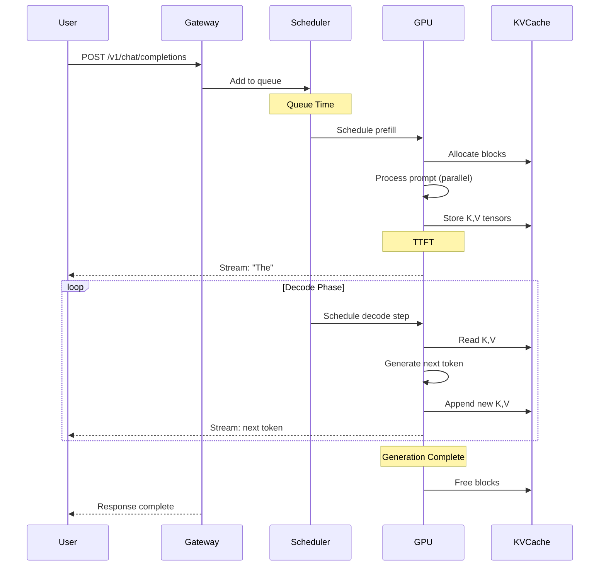

# Module 0: Why LLM Inference is Different

> The first thing to understand about LLM inference is that almost everything you know about ML inference is wrong—or at least, doesn't apply.

---

## Learning Objectives

By the end of this module, you will:

- Understand why LLM inference costs 100x more than traditional ML inference
- Explain the prefill/decode split and why it matters for system design
- Calculate the memory bandwidth wall for any model/GPU combination
- Identify which phase of inference will bottleneck your workload

---

## The Uncomfortable Truth

Here's what nobody tells you when you start working on LLM inference:

**Traditional ML inference is a solved problem. LLM inference is not.**

| Aspect   | Traditional ML       | LLM Inference                   |
| -------- | -------------------- | ------------------------------- |
| Latency  | Predictable (5-20ms) | Unpredictable (100ms-10s)       |
| Memory   | Fixed per request    | Grows during request            |
| Batching | Trivial              | Requires continuous batching    |
| Scaling  | Linear with GPUs     | Sub-linear, communication-bound |
| Cost     | $0.001 per request   | $0.01-0.10 per request          |

The difference isn't 2x or 5x. It's 100x. And the reasons are fundamental, not incidental.

---

## Why LLMs Are Fundamentally Different

### Insight #1: Autoregressive Generation is Sequential

Traditional ML: Input → Model → Output (one forward pass)

LLM: Input → Model → Token₁ → Model → Token₂ → Model → ... → TokenN

```
Traditional ML (Image Classification):
┌─────────────────────────────────────────────────────────────────────┐
│   Image ──────────────► ResNet ──────────────► "cat" (0.97)         │
│                                                                     │
│   Time: 10ms                                                        │
│   Memory: Fixed                                                     │
│   Parallelizable: Yes (batch 1000 images easily)                    │
└─────────────────────────────────────────────────────────────────────┘

LLM (Text Generation):
┌─────────────────────────────────────────────────────────────────────┐
│   "What is" ──► LLM ──► "the" ──► LLM ──► "capital" ──► LLM ──► ... │
│                  │                 │                     │          │
│                  └─────────────────┴─────────────────────┘          │
│                         (KV Cache grows each step)                  │
│                                                                     │
│   Time: 100ms + 10ms × N tokens                                     │
│   Memory: Grows with each token                                     │
│   Parallelizable: No (token N depends on tokens 1..N-1)             │
└─────────────────────────────────────────────────────────────────────┘
```

**Why this matters:** You cannot predict token 5 until you've generated tokens 1-4. This is not a limitation of current technology—it's fundamental to how language models work.

### Insight #2: You Read the Entire Model for Every Token

This is the insight that changes how you think about LLM inference:

```
Llama 3.1 8B generating 100 tokens:

Traditional thinking:
  "8B parameters, 100 tokens, so... 800B operations?"

Reality:
  - Prefill: Read 16 GB of weights once
  - Decode: Read 16 GB of weights 100 times
  - Total: 16 GB × 101 = 1.6 TB of memory reads

For a 200-token response, you read 3.2 TB from memory.
```

**The memory bandwidth wall:**

```
A100 memory bandwidth: 2 TB/s
Model size (FP16): 16 GB
Time to read model once: 16 GB / 2 TB/s = 8 ms

Maximum decode speed = 1 token / 8 ms = 125 tokens/second

This is a HARD CEILING. No optimization can exceed this.
```

---

## The Two Phases: Prefill and Decode

This is the most important concept in LLM inference. Everything else follows from understanding this split.

### Prefill: The Compute-Bound Phase

During prefill, you process the entire prompt in one forward pass:

```
Input: "What is the capital of France?" (7 tokens)

All 7 tokens processed IN PARALLEL through the model.
KV cache created for all 7 tokens.
First output token generated.

Characteristics:
- Compute-bound (many FLOPs per byte of memory)
- Parallelizable across tokens
- Time scales with prompt length
- Dominates TTFT (Time to First Token)
```

**Why prefill is compute-bound:**

```
Prefill with 1000-token prompt on Llama 8B:

FLOPs: ~2 × 8B × 1000 = 16 trillion FLOPs
Bytes read: ~16 GB (model weights, read once)
Arithmetic intensity: 16T / 16G = 1000 FLOPs/byte

A100 ridge point: 312 TFLOPS / 2 TB/s = 156 FLOPs/byte

1000 >> 156 → Prefill is compute-bound
```

### Decode: The Memory-Bound Phase

During decode, you generate one token at a time:

```
Step 1: Generate "The"
  - Read 16 GB of weights
  - Do 16 billion FLOPs
  - Output: "The"

Step 2: Generate "capital"
  - Read 16 GB of weights AGAIN
  - Do 16 billion FLOPs
  - Output: "capital"

... repeat for each token ...

Characteristics:
- Memory-bound (few FLOPs per byte of memory)
- Sequential (cannot parallelize)
- Time scales with output length
- Dominates total generation time
```

**Why decode is memory-bound:**

```
Decode for 1 token on Llama 8B:

FLOPs: ~2 × 8B × 1 = 16 billion FLOPs
Bytes read: ~16 GB (model weights)
Arithmetic intensity: 16B / 16G = 1 FLOP/byte

1 << 156 → Decode is severely memory-bound
```

### The Implication

```
┌─────────────────────────────────────────────────────────────────────┐
│                    THE FUNDAMENTAL ASYMMETRY                        │
├─────────────────────────────────────────────────────────────────────┤
│                                                                     │
│   Prefill: Process 1000 tokens in ~50ms (compute-bound)             │
│   Decode:  Generate 1 token in ~8ms (memory-bound)                  │
│                                                                     │
│   To generate 100 tokens after a 1000-token prompt:                 │
│   - Prefill: 50ms                                                   │
│   - Decode: 100 × 8ms = 800ms                                       │
│   - Total: 850ms                                                    │
│                                                                     │
│   Decode dominates even though prefill processes 10x more tokens!   │
│                                                                     │
└─────────────────────────────────────────────────────────────────────┘
```

**Insight:** Optimizing prefill helps TTFT. Optimizing decode helps throughput. They need different strategies.

---

## Cost Reality Check

### Traditional ML vs LLM Inference

| Metric               | Image Classification | LLM Inference (8B) |
| -------------------- | -------------------- | ------------------ |
| Model Size           | ~100 MB              | ~16 GB             |
| Latency              | 5-20 ms              | 500-5000 ms        |
| GPU Memory           | 2-4 GB               | 20-40 GB           |
| Throughput           | 1000+ req/s          | 10-100 req/s       |
| Cost per 1M requests | $0.50-2              | $50-500            |

### Why LLMs Are 100x More Expensive

1. **Model Size**: 100-1000x larger models
2. **Sequential Generation**: Can't batch across time steps
3. **Memory Bandwidth**: Bottleneck during decode
4. **KV Cache**: Memory grows with context length
5. **Variable Output**: Can't predict compute cost upfront

---

## The Request Lifecycle

```
┌─────────────────────────────────────────────────────────────────────┐
│                    LLM REQUEST LIFECYCLE                            │
└─────────────────────────────────────────────────────────────────────┘

User Request                                              User Response
     │                                                          ▲
     ▼                                                          │
┌─────────┐    ┌─────────┐    ┌─────────┐    ┌─────────┐    ┌─────────┐
│  Queue  │───►│ Prefill │───►│ Decode  │───►│ Decode  │───►│ Stream  │
│  Time   │    │ Phase   │    │ Token 1 │    │Token N  │    │Response │
└─────────┘    └─────────┘    └─────────┘    └─────────┘    └─────────┘
     │              │              │              │              │
     │              │              │              │              │
     ▼              ▼              ▼              ▼              ▼
  Waiting       TTFT Start     First Token    Last Token    Complete
                               Received       Received

Timeline:
├──────────────┼──────────────┼──────────────────────────────┼────────►
0ms          Queue         TTFT            Generation         Total
            (variable)   (100-500ms)      (500-5000ms)       Latency
```

### Key Metrics

| Metric            | Definition                     | Target   |
| ----------------- | ------------------------------ | -------- |
| **Queue Time**    | Time waiting before processing | < 100ms  |
| **TTFT**          | Time to First Token            | < 500ms  |
| **ITL**           | Inter-Token Latency            | < 50ms   |
| **Total Latency** | End-to-end time                | < 5s     |
| **Throughput**    | Tokens per second              | Maximize |

---

## Sequence Diagram: Complete Request Flow



---

## Why This Matters for System Design

### 1. Memory is the Constraint

- Model weights: Fixed, large
- KV cache: Variable, grows with usage
- Must plan for peak memory, not average

### 2. Batching is Complex

- Can't wait for batch to fill (latency)
- Can't process all tokens together (sequential)
- Solution: Continuous batching

### 3. Scaling is Non-Linear

- 2x GPUs ≠ 2x throughput (communication overhead)
- Larger models need tensor parallelism
- Memory bandwidth often limits scaling

### 4. Cost Optimization is Critical

- GPU time is expensive ($1-30/hour)
- Idle GPU time is wasted money
- Quantization and batching are essential

---

## Key Takeaways

1. **LLM inference is fundamentally sequential** - each token depends on all previous tokens

2. **Two distinct phases** - Prefill (compute-bound, parallel) and Decode (memory-bound, sequential)

3. **Memory bandwidth is usually the bottleneck** - not compute capacity

4. **KV cache is the hidden cost** - grows with sequence length and batch size

5. **100x more expensive than traditional ML** - requires careful optimization

6. **Different metrics matter** - TTFT, ITL, and throughput, not just latency

---

## What's Next

In the following modules, we'll dive deep into:

- **Module 1**: How transformers actually work during inference
- **Module 2**: GPU architecture and memory engineering
- **Module 3**: Optimization techniques (quantization, batching, speculation)
- **Module 4**: Inference engines (vLLM, SGLang, TensorRT-LLM)

---

## References

1. Vaswani et al. "Attention Is All You Need" (2017)
2. Kwon et al. "Efficient Memory Management for Large Language Model Serving with PagedAttention" (2023)
3. Pope et al. "Efficiently Scaling Transformer Inference" (2022)
4. Leviathan et al. "Fast Inference from Transformers via Speculative Decoding" (2022)
