# Module 11: Advanced KV Cache Engineering

> The KV cache is the single largest memory consumer in LLM inference at scale. At batch=64 with 8K context, KV cache alone consumes 32 GB on a 70B model—more than the quantized weights. This module covers the 2025-2026 generation of KV-specific optimizations that go far beyond PagedAttention.

---

## Learning Objectives

By the end of this module, you will:

- Classify KV cache compression techniques into a rigorous taxonomy and know when each category wins
- Understand TurboQuant's mathematical foundations—random rotation, Beta distributions, and QJL residuals—and why it achieves 3-bit compression with zero accuracy loss
- Apply thought-adaptive compression (ThinKV) for reasoning models like o1/o3/DeepSeek-R1
- Design multi-tenant context reuse systems (ContextPilot) that eliminate redundant prefill computation
- Implement RL-based learned eviction policies that outperform heuristic approaches
- Make informed decisions about which compression strategy fits your workload

---

## Prerequisites

- Module 3: Optimization Techniques (quantization fundamentals, PagedAttention)
- Module 2: Memory Engineering (KV cache sizing, memory bandwidth analysis)
- Familiarity with attention mechanism mathematics

---

## 1. KV Cache Compression Taxonomy

The KV cache compression landscape has exploded in 2025-2026. Before diving into individual techniques, let's establish a taxonomy:

```mermaid
graph TD
    A[KV Cache Compression] --> B[Quantization-Based]
    A --> C[Eviction-Based]
    A --> D[Hybrid]
    A --> E[Reconstruction-Based]
    A --> F[Unified Frameworks]

    B --> B1[TurboQuant<br/>3-bit, training-free<br/>near-optimal distortion]
    B --> B2[KVComp<br/>LLM-aware lossy<br/>co-designed with system]

    C --> C1[KV Policy<br/>RL-learned eviction<br/>per-head agents]
    C --> C2[H2O / StreamingLLM<br/>Heuristic eviction<br/>attention-score based]

    D --> D1[ThinKV<br/>Thought-adaptive<br/>quant + eviction]

    E --> E1[EchoKV<br/>Similarity-based<br/>on-demand reconstruction]

    F --> F1[LeanKV<br/>Parallel compaction +<br/>differentiated memory]

    style B1 fill:#2d5016,stroke:#4a8c2a
    style D1 fill:#1a3a5c,stroke:#2980b9
    style F1 fill:#5c1a1a,stroke:#c0392b
```



### Category Comparison

| Category | Representative | Compression | Quality Impact | Training Required | Production Ready |
|----------|---------------|-------------|----------------|-------------------|-----------------|
| Quantization | TurboQuant | 5.3× (3-bit) | None at 3.5-bit | No | ✅ vLLM |
| Eviction | KV Policy (RL) | Variable (budget) | Low (learned) | Yes (RL) | ❌ Research |
| Hybrid | ThinKV | 3-5× | None on CoT | No | ❌ Research |
| Reconstruction | EchoKV | 2-4× | Low (similarity) | No | ❌ Research |
| Unified | LeanKV | 3-11× | <5% at 11× | No | ✅ vLLM |
| Heuristic Eviction | H2O | Variable | Medium | No | ⚠️ Limited |

**Insight #1: The field has moved from "one-size-fits-all" compression to workload-aware strategies.** TurboQuant wins for general workloads, ThinKV for reasoning, ContextPilot for multi-tenant, and LeanKV when you need maximum compression with quality budgets.

---

## 2. TurboQuant Deep Dive: Near-Optimal KV Cache Quantization

### The Core Problem

Standard KV cache quantization faces a fundamental challenge: KV vectors have non-uniform distributions with outliers that destroy naive quantization quality. TurboQuant solves this with an elegant mathematical framework.

| Field | Detail |
|-------|--------|
| **Paper** | TurboQuant: Online Vector Quantization with Near-optimal Distortion Rate |
| **Venue** | ICLR 2026 |
| **ArXiv** | arxiv:2504.19874 |
| **Key Result** | 3-bit KV cache, zero accuracy loss, 8× attention speedup on H100 |

### Stage 1: Random Rotation → Beta Distribution

The first insight is that randomly rotating a vector concentrates its coordinate magnitudes into a predictable distribution:

```
┌─────────────────────────────────────────────────────────────────────┐
│              TURBO QUANT: RANDOM ROTATION INSIGHT                    │
├─────────────────────────────────────────────────────────────────────┤
│                                                                     │
│   BEFORE rotation:                                                  │
│   KV vector x ∈ ℝᵈ has arbitrary distribution                       │
│   Some coordinates large (outliers), most small                     │
│   → Naive quantization: scale set by outlier, small values → 0     │
│                                                                     │
│   AFTER rotation by random orthogonal matrix R:                     │
│   y = Rx, where R is a random rotation (Hadamard + random signs)    │
│   Each coordinate yᵢ ≈ ‖x‖/√d × Z, where Z ~ subgaussian          │
│                                                                     │
│   KEY: |yᵢ|²/‖x‖² follows Beta(1/2, (d-1)/2) distribution          │
│                                                                     │
│   For d = 128 (typical head_dim):                                   │
│   • Mean of |yᵢ|²/‖x‖² = 1/d = 1/128                               │
│   • Variance ≈ 2/(d²) = 1/8192                                      │
│   • Coordinates are tightly concentrated around mean                │
│   • NO OUTLIERS after rotation!                                     │
│                                                                     │
└─────────────────────────────────────────────────────────────────────┘
```

The mathematical foundation:

```python
import torch
import numpy as np
from typing import Tuple

def random_rotation_transform(
    x: torch.Tensor,  # Shape: [batch, seq_len, num_heads, head_dim]
    seed: int = 42,
) -> torch.Tensor:
    """
    Apply random orthogonal rotation to concentrate coordinate magnitudes.

    After rotation, each coordinate |y_i|^2 / ||x||^2 ~ Beta(1/2, (d-1)/2).
    This eliminates outliers and enables near-optimal scalar quantization.

    Args:
        x: KV cache tensor, shape [B, S, H, D] where D = head_dim
        seed: Random seed for reproducible rotation matrix

    Returns:
        Rotated tensor with same shape, concentrated coordinate magnitudes
    """
    d = x.shape[-1]  # head_dim, typically 128

    # Fast randomized Hadamard transform (O(d log d) instead of O(d²))
    # Equivalent to multiplication by random orthogonal matrix
    rng = torch.Generator().manual_seed(seed)
    signs = torch.randint(0, 2, (d,), generator=rng).float() * 2 - 1  # Random ±1

    # Apply random signs
    y = x * signs

    # Apply Hadamard transform (recursive, O(d log d))
    y = _fast_hadamard_transform(y)

    # Normalize: Hadamard has norm √d
    y = y / (d ** 0.5)

    return y


def _fast_hadamard_transform(x: torch.Tensor) -> torch.Tensor:
    """In-place Fast Walsh-Hadamard Transform along last dimension."""
    d = x.shape[-1]
    h = 1
    while h < d:
        # Butterfly operation
        x_even = x[..., 0::2*h, ]  # Simplified; actual impl uses view/reshape
        x_odd = x[..., h::2*h, ]
        x[..., 0::2*h] = x_even + x_odd
        x[..., h::2*h] = x_even - x_odd
        h *= 2
    return x
```

### Stage 2: Optimal Scalar Quantization on Beta Distribution

Once coordinates follow a Beta distribution, we can derive the **information-theoretically optimal** scalar quantizer:

```
┌─────────────────────────────────────────────────────────────────────┐
│           OPTIMAL QUANTIZER FOR BETA DISTRIBUTION                   │
├─────────────────────────────────────────────────────────────────────┤
│                                                                     │
│   Given: y_i / ||x|| ~ Beta(1/2, (d-1)/2)^{1/2} (after rotation)   │
│                                                                     │
│   For b-bit quantization with 2^b levels:                           │
│                                                                     │
│   1. Compute optimal quantization boundaries:                       │
│      t_j = F_Beta^{-1}(j / 2^b)  for j = 0, 1, ..., 2^b           │
│      where F_Beta is the Beta CDF                                   │
│                                                                     │
│   2. Compute optimal reconstruction points:                         │
│      r_j = E[Y | t_j ≤ Y < t_{j+1}]                                │
│      (conditional mean within each quantization bin)                │
│                                                                     │
│   3. Distortion rate:                                               │
│      D(b) ≈ (1/12) × 2^{-2b} × Var(Y)                              │
│      Within ~2.7× of Shannon's rate-distortion lower bound!         │
│                                                                     │
│   At 3 bits (8 levels):                                             │
│   • MSE distortion: ~0.0002 per coordinate                          │
│   • Relative error: <0.1% of vector norm                            │
│   • Attention score error: negligible                               │
│                                                                     │
└─────────────────────────────────────────────────────────────────────┘
```

```python
from scipy.stats import beta as beta_dist

def compute_optimal_quantizer(
    head_dim: int,
    num_bits: int,
) -> Tuple[np.ndarray, np.ndarray]:
    """
    Compute optimal scalar quantizer boundaries and reconstruction points
    for Beta(1/2, (d-1)/2) distribution induced by random rotation.

    Args:
        head_dim: Dimension of attention head (typically 128)
        num_bits: Quantization bit-width (e.g., 3)

    Returns:
        boundaries: Quantization thresholds, shape [2^num_bits + 1]
        centroids: Reconstruction values, shape [2^num_bits]
    """
    num_levels = 2 ** num_bits
    alpha, beta_param = 0.5, (head_dim - 1) / 2.0

    # Optimal boundaries: uniform quantiles of the Beta distribution
    boundaries = beta_dist.ppf(
        np.linspace(0, 1, num_levels + 1), alpha, beta_param
    )

    # Optimal reconstruction: conditional mean within each bin
    centroids = np.zeros(num_levels)
    for i in range(num_levels):
        lo, hi = boundaries[i], boundaries[i + 1]
        # E[X | lo ≤ X < hi] for Beta distribution
        # Computed via truncated mean
        centroids[i] = _truncated_beta_mean(alpha, beta_param, lo, hi)

    return boundaries, centroids


def _truncated_beta_mean(a: float, b: float, lo: float, hi: float) -> float:
    """Conditional mean of Beta(a,b) truncated to [lo, hi]."""
    from scipy.integrate import quad
    pdf = lambda x: beta_dist.pdf(x, a, b)
    num, _ = quad(lambda x: x * pdf(x), lo, hi)
    den, _ = quad(pdf, lo, hi)
    return num / den if den > 0 else (lo + hi) / 2
```

### Stage 3: QJL Residual for Unbiased Inner Products

The second stage adds a 1-bit Johnson-Lindenstrauss (QJL) sketch of the quantization residual, ensuring **unbiased** inner product estimation:

```
┌─────────────────────────────────────────────────────────────────────┐
│                    QJL RESIDUAL CORRECTION                          │
├─────────────────────────────────────────────────────────────────────┤
│                                                                     │
│   Problem: Quantization introduces bias in inner products           │
│   ⟨q(x), y⟩ ≠ ⟨x, y⟩  (biased estimate)                            │
│                                                                     │
│   Solution: Store 1-bit sketch of residual r = x - q(x)            │
│                                                                     │
│   QJL Transform:                                                    │
│   s = sign(Φ × r)  where Φ ∈ ℝ^{m×d} is random Gaussian           │
│   (m = head_dim, so 1 extra bit per coordinate)                     │
│                                                                     │
│   Unbiased estimator:                                               │
│   ⟨x, y⟩ ≈ ⟨q(x), y⟩ + (||r|| / √m) × ⟨s, sign(Φy)⟩              │
│                                                                     │
│   Total storage per coordinate:                                     │
│   • 3 bits (MSE quantizer) + 1 bit (QJL residual) = 4 bits          │
│   • Or: 2.5 bits (MSE) + 1 bit (QJL) = 3.5 bits                    │
│                                                                     │
│   Result: Unbiased ⟨x, y⟩ estimation at 3-4 bits total             │
│   with variance bounded by O(||r||² × ||y||² / m)                   │
│                                                                     │
└─────────────────────────────────────────────────────────────────────┘
```

```python
def turbo_quant_encode(
    kv_cache: torch.Tensor,       # [batch, seq, heads, head_dim]
    num_bits: int = 3,
    boundaries: torch.Tensor = None,
    centroids: torch.Tensor = None,
) -> dict:
    """
    Full TurboQuant encoding pipeline.

    Returns compressed representation achieving near-optimal distortion
    at specified bit-width with unbiased inner product estimation.
    """
    B, S, H, D = kv_cache.shape

    # Stage 1: Random rotation (eliminates outliers)
    rotated = random_rotation_transform(kv_cache)

    # Store norms for reconstruction
    norms = torch.norm(rotated, dim=-1, keepdim=True)  # [B, S, H, 1]
    normalized = rotated / (norms + 1e-8)

    # Stage 2: Optimal scalar quantization on normalized coordinates
    # Each coordinate independently quantized using Beta-optimal boundaries
    indices = torch.bucketize(normalized.abs(), boundaries) - 1
    indices = indices.clamp(0, 2**num_bits - 1)
    signs = (normalized >= 0).to(torch.int8)

    # Reconstruct quantized values
    quantized = centroids[indices] * (2 * signs.float() - 1) * norms

    # Stage 3: QJL residual (1-bit sketch for unbiased correction)
    residual = rotated - quantized
    residual_norms = torch.norm(residual, dim=-1, keepdim=True)
    qjl_sketch = (residual >= 0).to(torch.int8)  # 1-bit sign

    return {
        "indices": indices.to(torch.uint8),    # num_bits per coord
        "signs": signs,                         # 1 bit per coord
        "norms": norms.to(torch.float16),       # 16 bits per vector
        "qjl_sketch": qjl_sketch,              # 1 bit per coord
        "residual_norms": residual_norms.to(torch.float16),
    }
```

### Performance Results

```
┌─────────────────────────────────────────────────────────────────────┐
│              TURBO QUANT PERFORMANCE (H100, Llama 3.1)               │
├─────────────────────────────────────────────────────────────────────┤
│                                                                     │
│   Bit-width    Memory Reduction    Attention Speedup    Quality      │
│   ──────────────────────────────────────────────────────────────    │
│   FP16 (16b)   1.0× (baseline)     1.0× (baseline)     baseline    │
│   FP8 (8b)     2.0×                1.8×                 -0.01 ppl   │
│   4-bit        4.0×                4.2×                 -0.02 ppl   │
│   3.5-bit      4.6×                5.1×                 -0.00 ppl   │
│   3-bit        5.3×                8.0×                 -0.01 ppl   │
│   2.5-bit      6.4×                ~10×                 -0.15 ppl   │
│                                                                     │
│   Key insight: 3-bit achieves ZERO meaningful quality loss           │
│   because the Beta-optimal quantizer is information-theoretically   │
│   near-optimal (within 2.7× of Shannon bound).                      │
│                                                                     │
│   The 8× attention speedup comes from:                              │
│   1. Fewer bytes to read from HBM (memory-bound operation)          │
│   2. Smaller working set → better cache utilization                 │
│   3. Compressed dot products via QJL (fewer FLOPs)                  │
│                                                                     │
└─────────────────────────────────────────────────────────────────────┘
```

### vLLM Integration

```python
# TurboQuant is integrated into vLLM (2026+)
from vllm import LLM

llm = LLM(
    model="meta-llama/Llama-3.1-70B-Instruct",
    kv_cache_dtype="turbo_quant_3bit",  # 3-bit TurboQuant
    # Alternative: "turbo_quant_4bit" for maximum safety margin
    tensor_parallel_size=4,
    max_model_len=32768,
    # TurboQuant enables 2× more concurrent sequences
    # at same memory budget vs FP8 KV cache
)
```


---

## 3. Thought-Adaptive Compression: ThinKV for Reasoning Models

### The Reasoning Model Challenge

Models like o1, o3, and DeepSeek-R1 generate long chains of thought (CoT) before producing final answers. This creates a unique KV cache problem:

```
┌─────────────────────────────────────────────────────────────────────┐
│           THE REASONING MODEL KV CACHE PROBLEM                      │
├─────────────────────────────────────────────────────────────────────┤
│                                                                     │
│   Standard model (Llama 3.1):                                       │
│   [System prompt] [User query] [Response]                           │
│   KV cache: ~2K tokens typical                                      │
│                                                                     │
│   Reasoning model (o3, DeepSeek-R1):                                │
│   [System] [Query] [Think step 1] [Think step 2] ... [Think N] [Answer]│
│   KV cache: 10K-100K tokens (thinking dominates!)                   │
│                                                                     │
│   Problem: Not all thinking tokens are equally important.           │
│   • Some thoughts are exploratory dead-ends                         │
│   • Some are critical logical steps                                 │
│   • Some are self-corrections that supersede earlier thoughts       │
│                                                                     │
│   Uniform compression destroys critical reasoning steps.            │
│   Uniform retention wastes memory on dead-end explorations.         │
│                                                                     │
└─────────────────────────────────────────────────────────────────────┘
```

### ThinKV: Thought-Type Identification

| Field | Detail |
|-------|--------|
| **Paper** | ThinKV: Thought-Adaptive KV Cache Compression for Efficient Reasoning Models |
| **Venue** | ICLR 2026 (Oral) |
| **ArXiv** | arxiv:2510.01290 |
| **Key Insight** | Attention sparsity patterns reveal thought importance |

ThinKV identifies thought types by analyzing attention patterns:

```mermaid
graph LR
    A[CoT Tokens] --> B{Attention<br/>Sparsity<br/>Analysis}
    B -->|High attention<br/>from later tokens| C[Critical Thought<br/>Full precision]
    B -->|Medium attention<br/>decaying over time| D[Supporting Thought<br/>Quantized 4-bit]
    B -->|Low attention<br/>rarely referenced| E[Exploratory Thought<br/>Evicted]

    C --> F[Final Answer<br/>Generation]
    D --> F
    E -.->|Freed memory| G[New sequences<br/>or longer context]

    style C fill:#2d5016,stroke:#4a8c2a
    style D fill:#1a3a5c,stroke:#2980b9
    style E fill:#5c1a1a,stroke:#c0392b
```



### Implementation: Differential Precision Assignment

```python
import torch
from dataclasses import dataclass
from enum import Enum

class ThoughtImportance(Enum):
    CRITICAL = "critical"      # Full FP16 precision
    SUPPORTING = "supporting"  # 4-bit quantized
    EXPLORATORY = "exploratory"  # Evicted (freed)

@dataclass
class ThoughtSegment:
    start_idx: int
    end_idx: int
    importance: ThoughtImportance
    attention_score: float  # Average attention received from subsequent tokens

def classify_thought_importance(
    attention_weights: torch.Tensor,  # [num_heads, seq_len, seq_len]
    thought_boundaries: list[int],     # Token indices where thoughts start
    decay_window: int = 512,
) -> list[ThoughtSegment]:
    """
    Classify thought segments by importance using attention sparsity.

    Key metric: How much attention do LATER tokens pay to this thought?
    If a thought is rarely attended to after generation, it's exploratory.

    Args:
        attention_weights: Full attention matrix from recent forward pass
        thought_boundaries: Start indices of each thought segment
        decay_window: Window to measure attention decay

    Returns:
        Classified thought segments with importance labels
    """
    num_heads, seq_len, _ = attention_weights.shape
    segments = []

    for i in range(len(thought_boundaries) - 1):
        start = thought_boundaries[i]
        end = thought_boundaries[i + 1]

        # Measure attention this segment receives from tokens AFTER it
        future_start = min(end + decay_window, seq_len)
        if future_start >= seq_len:
            # Recent thought — keep at full precision (can't assess yet)
            importance = ThoughtImportance.CRITICAL
            score = 1.0
        else:
            # Average attention from future tokens to this segment
            attn_to_segment = attention_weights[
                :, future_start:, start:end
            ].mean().item()

            # Classify based on attention thresholds
            if attn_to_segment > 0.05:  # >5% attention = critical
                importance = ThoughtImportance.CRITICAL
            elif attn_to_segment > 0.01:  # 1-5% = supporting
                importance = ThoughtImportance.SUPPORTING
            else:  # <1% attention = exploratory (safe to evict)
                importance = ThoughtImportance.EXPLORATORY
            score = attn_to_segment

        segments.append(ThoughtSegment(start, end, importance, score))

    return segments


def apply_thinKV_compression(
    kv_cache: torch.Tensor,           # [layers, 2, batch, seq, heads, dim]
    segments: list[ThoughtSegment],
) -> torch.Tensor:
    """
    Apply differential compression based on thought importance.

    Critical: Keep FP16 (no compression)
    Supporting: Quantize to 4-bit (4× compression)
    Exploratory: Evict entirely (∞ compression, memory freed)
    """
    for segment in segments:
        s, e = segment.start_idx, segment.end_idx

        if segment.importance == ThoughtImportance.EXPLORATORY:
            # Zero out and mark for memory reclamation
            kv_cache[:, :, :, s:e, :, :] = 0
            # In practice: free these PagedAttention blocks

        elif segment.importance == ThoughtImportance.SUPPORTING:
            # Quantize to 4-bit (using per-channel absmax)
            chunk = kv_cache[:, :, :, s:e, :, :]
            scale = chunk.abs().amax(dim=-1, keepdim=True) / 7.0
            quantized = torch.round(chunk / scale).clamp(-8, 7)
            kv_cache[:, :, :, s:e, :, :] = quantized * scale

        # CRITICAL: no modification (keep FP16)

    return kv_cache
```

### Results on Reasoning Benchmarks

```
┌─────────────────────────────────────────────────────────────────────┐
│         THINKOV RESULTS (DeepSeek-R1, MATH-500 benchmark)           │
├─────────────────────────────────────────────────────────────────────┤
│                                                                     │
│   Method              Memory   Accuracy   Tokens/s   Notes          │
│   ──────────────────────────────────────────────────────────────    │
│   No compression      100%     92.4%      baseline   Full KV cache  │
│   Uniform 4-bit       25%      87.1%      1.8×       Loses critical │
│   H2O eviction (50%)  50%      83.6%      1.5×       Random loss    │
│   ThinKV              35%      92.1%      2.4×       Thought-aware  │
│                                                                     │
│   Key insight: ThinKV achieves 65% memory reduction with only       │
│   0.3% accuracy loss because it preserves critical reasoning        │
│   steps while aggressively compressing/evicting dead-end thoughts.  │
│                                                                     │
│   Uniform compression at the same ratio loses 5+ points because     │
│   it damages critical logical steps equally with exploratory ones.  │
│                                                                     │
└─────────────────────────────────────────────────────────────────────┘
```

**Insight #2: For reasoning models, thought-adaptive compression is not optional—it's the difference between 0.3% and 5%+ quality loss at the same compression ratio.** As reasoning models become dominant (o3, DeepSeek-R1), ThinKV-style approaches become essential.

---

## 4. Context Reuse at Scale: ContextPilot

### The Multi-Tenant Redundancy Problem

In production multi-tenant deployments, enormous amounts of prefill computation are redundant:

```
┌─────────────────────────────────────────────────────────────────────┐
│              THE MULTI-TENANT REDUNDANCY PROBLEM                    │
├─────────────────────────────────────────────────────────────────────┤
│                                                                     │
│   RAG Application (1000 users, shared knowledge base):              │
│                                                                     │
│   User A: [System prompt] [Doc chunk 1, 2, 5] [Query A]            │
│   User B: [System prompt] [Doc chunk 1, 3, 5] [Query B]            │
│   User C: [System prompt] [Doc chunk 2, 5, 7] [Query C]            │
│   ...                                                               │
│                                                                     │
│   Overlap analysis:                                                 │
│   • System prompt: 100% shared (1K tokens × 1000 users = wasted)   │
│   • Doc chunks: ~40% overlap (same popular docs retrieved)          │
│   • Total redundant prefill: 50-70% of all computation             │
│                                                                     │
│   Without ContextPilot:                                             │
│   Each user gets independent prefill → 1000 × full computation     │
│                                                                     │
│   With ContextPilot:                                                │
│   Shared context indexed → deduplicated → reused                    │
│   Effective prefill: 300-500 × full computation (3× reduction)      │
│                                                                     │
└─────────────────────────────────────────────────────────────────────┘
```

### ContextPilot Architecture

| Field | Detail |
|-------|--------|
| **Paper** | ContextPilot: Fast Long-Context Inference via Context Reuse |
| **Venue** | MLSys 2026 |
| **ArXiv** | arxiv:2511.03475 |
| **Code** | github.com/EfficientContext/ContextPilot |
| **Key Result** | 3× prefill latency reduction via cross-request KV reuse |

```mermaid
graph TD
    subgraph "ContextPilot System"
        A[Incoming Request] --> B[Context Analyzer]
        B --> C{Context Index<br/>Hash-based lookup}
        C -->|Hit: blocks found| D[KV Cache Pool<br/>Shared blocks]
        C -->|Miss: new content| E[Prefill Engine]
        E --> D
        D --> F[Attention Computation<br/>Mixed cached + fresh KV]
        F --> G[Response]
    end

    subgraph "Context Index"
        H[Block Hash Table]
        I[Usage Counter<br/>LRU eviction]
        J[Ordering Metadata<br/>Position-aware reuse]
    end

    C --> H
    C --> I
    C --> J

    style D fill:#2d5016,stroke:#4a8c2a
    style C fill:#1a3a5c,stroke:#2980b9
```



### Implementation: Context Indexing and Deduplication

```python
import hashlib
from dataclasses import dataclass, field

@dataclass
class ContextBlock:
    """A reusable block of KV cache with position metadata."""
    token_ids: tuple[int, ...]  # Immutable token sequence
    block_hash: str             # Content-addressable hash
    kv_data: torch.Tensor       # [layers, 2, block_size, heads, dim]
    position_offset: int        # Original position in sequence
    ref_count: int = 0          # Number of active users
    last_access: float = 0.0    # For LRU eviction

class ContextIndex:
    """
    Hash-based index for cross-request KV cache block reuse.

    Blocks are content-addressed: same tokens at same position = same KV.
    This enables deduplication across users sharing context (RAG, system prompts).
    """

    def __init__(self, block_size: int = 64, max_blocks: int = 10000):
        self.block_size = block_size
        self.max_blocks = max_blocks
        self.index: dict[str, ContextBlock] = {}

    def compute_block_hash(
        self, token_ids: tuple[int, ...], position: int
    ) -> str:
        """Content + position hash for cache lookup."""
        content = f"{token_ids}:{position}".encode()
        return hashlib.sha256(content).hexdigest()[:16]

    def lookup(
        self, token_ids: list[int], start_position: int
    ) -> list[ContextBlock | None]:
        """
        Find cached KV blocks for a token sequence.

        Returns list of blocks (or None for misses) covering the input.
        Typical hit rate for RAG workloads: 40-70%.
        """
        blocks = []
        for i in range(0, len(token_ids), self.block_size):
            chunk = tuple(token_ids[i:i + self.block_size])
            if len(chunk) < self.block_size:
                blocks.append(None)  # Partial block = miss
                continue

            block_hash = self.compute_block_hash(chunk, start_position + i)
            block = self.index.get(block_hash)
            if block:
                block.ref_count += 1
                block.last_access = _now()
            blocks.append(block)

        return blocks

    def insert(
        self, token_ids: list[int], kv_data: torch.Tensor, position: int
    ) -> None:
        """Store computed KV blocks in index for future reuse."""
        for i in range(0, len(token_ids), self.block_size):
            chunk = tuple(token_ids[i:i + self.block_size])
            if len(chunk) < self.block_size:
                continue

            block_hash = self.compute_block_hash(chunk, position + i)
            if block_hash not in self.index:
                self._maybe_evict()
                kv_slice = kv_data[:, :, i:i+self.block_size, :, :]
                self.index[block_hash] = ContextBlock(
                    token_ids=chunk,
                    block_hash=block_hash,
                    kv_data=kv_slice.clone(),
                    position_offset=position + i,
                    ref_count=1,
                    last_access=_now(),
                )

    def _maybe_evict(self) -> None:
        """LRU eviction when index is full."""
        if len(self.index) >= self.max_blocks:
            # Evict least recently used block with ref_count == 0
            candidates = [
                (h, b) for h, b in self.index.items() if b.ref_count == 0
            ]
            if candidates:
                oldest = min(candidates, key=lambda x: x[1].last_access)
                del self.index[oldest[0]]
```

### Prefill Reduction Analysis

```
┌─────────────────────────────────────────────────────────────────────┐
│         CONTEXTPILOT PREFILL REDUCTION BY WORKLOAD                  │
├─────────────────────────────────────────────────────────────────────┤
│                                                                     │
│   Workload Type          Hit Rate    Prefill Reduction    TTFT      │
│   ──────────────────────────────────────────────────────────────    │
│   RAG (shared corpus)    65-80%      2.5-3.5×             -65%      │
│   Chatbot (system prompt) 95%+       1.5-2.0×             -40%      │
│   Multi-turn (history)   40-60%      1.5-2.5×             -50%      │
│   Unique prompts         <5%         1.0× (no benefit)    +2% overhead│
│                                                                     │
│   Memory overhead: ~10% additional for context index                │
│   Compute overhead: <1ms per request for hash lookup                │
│                                                                     │
│   Break-even: ContextPilot pays for itself when hit rate > 15%      │
│                                                                     │
└─────────────────────────────────────────────────────────────────────┘
```

**Insight #3: ContextPilot transforms prefix caching from "same exact prefix" to "any shared subsequence."** Traditional prefix caching requires identical token sequences from position 0. ContextPilot enables reuse of arbitrary shared blocks at any position, dramatically increasing hit rates for RAG and multi-tenant workloads.


---

## 5. Learned Eviction: KV Policy (RL-Based)

### Beyond Heuristic Eviction

Traditional eviction policies (H2O, StreamingLLM) use hand-crafted heuristics:
- H2O: Keep tokens with highest cumulative attention scores
- StreamingLLM: Keep initial tokens + recent window

These heuristics fail because attention importance is **head-specific, layer-specific, and context-dependent**:

```
┌─────────────────────────────────────────────────────────────────────┐
│              WHY HEURISTIC EVICTION FAILS                           │
├─────────────────────────────────────────────────────────────────────┤
│                                                                     │
│   Head 0 (positional): Attends to nearby tokens → recency works    │
│   Head 5 (retrieval): Attends to semantically similar tokens       │
│   Head 12 (structural): Attends to punctuation/delimiters          │
│   Head 31 (global): Attends to first/last tokens                   │
│                                                                     │
│   H2O's "keep high-attention tokens" strategy:                      │
│   ✓ Works for Head 31 (global patterns are stable)                  │
│   ✗ Fails for Head 5 (important tokens change with query)           │
│   ✗ Fails for Head 0 (recent tokens always have high attention)     │
│                                                                     │
│   A single eviction policy cannot serve all heads optimally.        │
│   Solution: Learn a separate policy per head.                       │
│                                                                     │
└─────────────────────────────────────────────────────────────────────┘
```

### KV Policy: RL Agents for Eviction

| Field | Detail |
|-------|--------|
| **Paper** | KV Policy: Learning to Evict from Key-Value Cache |
| **Published** | 2026 (preprint) |
| **Key Insight** | Per-head RL agents trained on pre-computed generation traces |

```mermaid
graph TD
    subgraph "Training Phase (Offline)"
        A[Pre-computed<br/>Generation Traces] --> B[Per-Head<br/>Reward Signal]
        B --> C[RL Agent Training<br/>PPO, per head × layer]
        C --> D[Trained Eviction<br/>Policies]
    end

    subgraph "Inference Phase (Online)"
        E[New Token<br/>Generated] --> F{Cache Full?}
        F -->|No| G[Append to Cache]
        F -->|Yes| H[Per-Head RL Agent<br/>Ranks tokens]
        H --> I[Evict Lowest-Ranked<br/>Token per head]
        I --> G
    end

    D --> H

    style C fill:#1a3a5c,stroke:#2980b9
    style H fill:#2d5016,stroke:#4a8c2a
```



### Implementation: Lightweight RL Eviction Agent

```python
import torch
import torch.nn as nn

class KVEvictionAgent(nn.Module):
    """
    Lightweight per-head RL agent that scores tokens for eviction.

    Architecture: 2-layer MLP taking token features → eviction score.
    Trained via PPO on pre-computed generation traces where reward =
    output quality preservation after eviction.

    Total overhead: ~0.1% of model parameters (tiny MLPs per head).
    """

    def __init__(self, head_dim: int = 128, hidden_dim: int = 64):
        super().__init__()
        # Input features per token: [key_norm, value_norm, position, recency,
        #                             cumulative_attention, recent_attention]
        self.feature_dim = 6
        self.scorer = nn.Sequential(
            nn.Linear(self.feature_dim, hidden_dim),
            nn.ReLU(),
            nn.Linear(hidden_dim, 1),  # Eviction score (lower = evict first)
        )

    def compute_features(
        self,
        keys: torch.Tensor,          # [seq_len, head_dim]
        values: torch.Tensor,        # [seq_len, head_dim]
        attention_history: torch.Tensor,  # [seq_len] cumulative attention
        current_step: int,
        positions: torch.Tensor,     # [seq_len] original positions
    ) -> torch.Tensor:
        """Extract per-token features for eviction scoring."""
        seq_len = keys.shape[0]

        features = torch.stack([
            keys.norm(dim=-1),                          # Key magnitude
            values.norm(dim=-1),                        # Value magnitude
            positions.float() / current_step,           # Relative position
            (current_step - positions).float() / current_step,  # Recency
            attention_history,                          # Cumulative attention
            attention_history / (current_step - positions + 1).float(),  # Avg attention
        ], dim=-1)  # [seq_len, 6]

        return features

    def select_eviction_target(
        self,
        keys: torch.Tensor,
        values: torch.Tensor,
        attention_history: torch.Tensor,
        current_step: int,
        positions: torch.Tensor,
        num_protected: int = 4,  # Never evict first N tokens (attention sinks)
    ) -> int:
        """
        Select which token to evict from the KV cache.

        Returns index of token with lowest importance score.
        Protected tokens (attention sinks) are never evicted.
        """
        features = self.compute_features(
            keys, values, attention_history, current_step, positions
        )
        scores = self.scorer(features).squeeze(-1)  # [seq_len]

        # Protect attention sink tokens (first few positions)
        scores[:num_protected] = float('inf')

        # Evict token with lowest score
        return scores.argmin().item()


class KVPolicyManager:
    """
    Manages per-head eviction agents across all layers.

    Total agents: num_layers × num_heads (e.g., 32 × 32 = 1024)
    Total parameters: ~1024 × (6×64 + 64×1) ≈ 0.5M (negligible)
    """

    def __init__(self, num_layers: int, num_heads: int, head_dim: int):
        self.agents = nn.ModuleList([
            nn.ModuleList([
                KVEvictionAgent(head_dim) for _ in range(num_heads)
            ]) for _ in range(num_layers)
        ])

    def evict(
        self,
        layer_idx: int,
        head_idx: int,
        keys: torch.Tensor,
        values: torch.Tensor,
        attention_history: torch.Tensor,
        current_step: int,
        positions: torch.Tensor,
    ) -> int:
        """Get eviction target for a specific layer/head."""
        agent = self.agents[layer_idx][head_idx]
        return agent.select_eviction_target(
            keys, values, attention_history, current_step, positions
        )
```

### KV Policy vs Heuristic Eviction

```
┌─────────────────────────────────────────────────────────────────────┐
│       KV POLICY vs HEURISTIC EVICTION (Llama 3.1 8B, 50% budget)   │
├─────────────────────────────────────────────────────────────────────┤
│                                                                     │
│   Method          LongBench   MMLU    HumanEval   Overhead          │
│   ──────────────────────────────────────────────────────────────    │
│   Full cache      42.1        78.3    72.0        baseline          │
│   H2O (50%)       35.8        74.1    68.5        ~0ms              │
│   StreamingLLM    31.2        72.8    65.3        ~0ms              │
│   KV Policy (50%) 40.3        77.5    71.2        ~0.5ms/step       │
│                                                                     │
│   KV Policy recovers 85% of the quality gap between H2O and full   │
│   cache, with only 0.5ms overhead per decode step.                  │
│                                                                     │
│   Why it works:                                                     │
│   • Per-head policies capture head-specific attention patterns      │
│   • RL reward directly optimizes for output quality preservation    │
│   • Learned features detect "will be needed later" patterns         │
│     that heuristics miss                                            │
│                                                                     │
│   Limitation: Requires per-model training (~2 GPU-hours on A100)    │
│   Not yet integrated into production frameworks.                    │
│                                                                     │
└─────────────────────────────────────────────────────────────────────┘
```

**Insight #4: Learned eviction outperforms heuristics because attention importance is head-specific and context-dependent.** The 0.5ms overhead per step is negligible compared to the quality improvement. The main barrier is the per-model training requirement.

---

## 6. Conflicting Approaches: When Each Wins and Loses

Not all KV cache optimizations are compatible. Some conflict, some compose well. This decision matrix helps you choose:

### Decision Matrix

| Scenario | Best Approach | Avoid | Why |
|----------|---------------|-------|-----|
| **Short sequences (<128 tokens)** | No compression | TurboQuant | Rotation overhead exceeds savings; KV cache is tiny |
| **Long context + memory constrained** | TurboQuant 3-bit or LeanKV | Eviction (H2O) | Eviction permanently loses information; quantization preserves all tokens |
| **Reasoning models (CoT, 10K+ thinking tokens)** | ThinKV | Uniform compression | Thought-adaptive preserves critical reasoning steps |
| **Multi-tenant RAG (shared docs)** | ContextPilot + TurboQuant | Per-request prefill | 40-70% of prefill is redundant across users |
| **Unique prompts (no sharing)** | TurboQuant only | ContextPilot | Indexing overhead with no reuse benefit |
| **Extreme memory budget (>80% reduction)** | LeanKV (unified) | Single technique | Only unified framework achieves 11× safely |
| **Quality-critical (medical, legal)** | TurboQuant 4-bit | Any eviction | Quantization at 4-bit has provably zero quality loss |
| **Latency-critical (real-time)** | TurboQuant 3-bit | KV Policy (RL) | RL adds 0.5ms/step; TurboQuant is decode-time free |
| **Training your own model** | Train for compressibility | Post-hoc methods | Architectural changes > post-hoc compression |

### Composability Matrix

```
┌─────────────────────────────────────────────────────────────────────┐
│              TECHNIQUE COMPOSABILITY                                 │
├─────────────────────────────────────────────────────────────────────┤
│                                                                     │
│              TurboQ  ThinKV  Context  KVPolicy  LeanKV  EchoKV      │
│   TurboQuant   —      ✅      ✅       ⚠️        ❌      ⚠️          │
│   ThinKV      ✅       —      ✅       ✅        ❌      ❌          │
│   ContextPilot ✅      ✅       —       ✅        ✅      ✅          │
│   KV Policy   ⚠️      ✅      ✅        —        ❌      ✅          │
│   LeanKV      ❌      ❌      ✅       ❌         —      ❌          │
│   EchoKV      ⚠️      ❌      ✅       ✅        ❌       —          │
│                                                                     │
│   ✅ = Composes well (complementary)                                │
│   ⚠️ = Partial compatibility (diminishing returns)                  │
│   ❌ = Conflicts (choose one)                                       │
│                                                                     │
│   Best combinations:                                                │
│   1. ContextPilot + TurboQuant (reuse + compress remaining)         │
│   2. ThinKV + ContextPilot (reasoning + multi-tenant)               │
│   3. ThinKV + KV Policy (adaptive precision + learned eviction)     │
│                                                                     │
│   Anti-patterns:                                                    │
│   • LeanKV + TurboQuant (both do quantization, redundant)           │
│   • LeanKV + KV Policy (both do eviction, conflicting policies)     │
│   • EchoKV + ThinKV (reconstruction conflicts with eviction)        │
│                                                                     │
└─────────────────────────────────────────────────────────────────────┘
```

### Production Recommendation by Workload

```python
# Decision function for KV cache strategy selection
def recommend_kv_strategy(
    workload_type: str,
    max_seq_len: int,
    batch_size: int,
    memory_budget_gb: float,
    quality_tolerance: str,  # "zero_loss", "minimal", "moderate"
    is_reasoning_model: bool,
    is_multi_tenant: bool,
) -> dict:
    """
    Recommend KV cache compression strategy based on workload characteristics.

    Returns configuration dict for the serving framework.
    """
    strategy = {"techniques": [], "expected_compression": 1.0}

    # Layer 1: Context reuse (always beneficial for multi-tenant)
    if is_multi_tenant:
        strategy["techniques"].append("contextpilot")
        strategy["expected_compression"] *= 2.0  # ~50% hit rate typical

    # Layer 2: Thought-adaptive (for reasoning models)
    if is_reasoning_model and max_seq_len > 4096:
        strategy["techniques"].append("thinKV")
        strategy["expected_compression"] *= 2.5  # 60% thought eviction

    # Layer 3: Quantization (almost always beneficial)
    if quality_tolerance == "zero_loss":
        strategy["techniques"].append("turbo_quant_4bit")
        strategy["expected_compression"] *= 4.0
    elif quality_tolerance == "minimal":
        strategy["techniques"].append("turbo_quant_3bit")
        strategy["expected_compression"] *= 5.3
    else:
        strategy["techniques"].append("leanKV_aggressive")
        strategy["expected_compression"] *= 8.0

    # Layer 4: Learned eviction (if quality budget allows and not using LeanKV)
    if (quality_tolerance != "zero_loss"
        and "leanKV_aggressive" not in strategy["techniques"]
        and max_seq_len > 8192):
        strategy["techniques"].append("kv_policy")
        strategy["expected_compression"] *= 1.5

    return strategy
```

---

## 7. Key Takeaways

1. **KV cache compression is now a first-class optimization target.** At scale, KV cache consumes more memory than model weights. The 2025-2026 generation of techniques (TurboQuant, ThinKV, LeanKV) delivers 3-11× compression with minimal quality impact.

2. **TurboQuant achieves the information-theoretic optimum.** Random rotation → Beta distribution → optimal scalar quantizer → QJL residual. This pipeline is provably near-optimal (within 2.7× of Shannon bound) and achieves 3-bit compression with zero accuracy loss. It's training-free and already in vLLM.

3. **Reasoning models need thought-adaptive compression.** Uniform compression destroys critical reasoning steps. ThinKV's attention-sparsity-based thought classification enables 65% memory reduction with <0.3% quality loss on CoT tasks.

4. **Multi-tenant deployments waste 50-70% of prefill on redundant computation.** ContextPilot's content-addressable KV block index enables cross-request reuse, delivering 3× prefill latency reduction for RAG workloads.

5. **Learned eviction beats heuristics by a wide margin.** KV Policy's per-head RL agents recover 85% of the quality gap between heuristic eviction and full cache, because attention importance is head-specific and context-dependent.

6. **Techniques compose—but not all combinations work.** ContextPilot + TurboQuant is the universal best combination. LeanKV conflicts with other quantization/eviction methods. Always check the composability matrix before stacking techniques.

7. **The right strategy depends on your workload.** Short sequences need nothing. Long-context quality-critical workloads need TurboQuant. Reasoning models need ThinKV. Multi-tenant RAG needs ContextPilot. There is no single best approach.

---

## What's Next

In the hands-on lab, you'll benchmark these techniques head-to-head:
- Compare: No compression vs TurboQuant 3-bit vs LeanKV vs H2O eviction
- Measure: Memory savings, throughput gain, quality impact (perplexity + task accuracy)
- Model: Llama 3.1 8B on g5.2xlarge with vLLM

In Module 12, we'll cover Speculative Decoding 2.0—how Saguaro, Mirror-SD, and SpecKV represent the next generation of parallel, adaptive, and compression-aware speculation.

---

## References

1. Zandieh et al. "TurboQuant: Online Vector Quantization with Near-optimal Distortion Rate" ICLR 2026. arXiv:2504.19874
2. Ramachandran et al. "ThinKV: Thought-Adaptive KV Cache Compression for Efficient Reasoning Models" ICLR 2026 (Oral). arXiv:2510.01290
3. Jiang et al. "ContextPilot: Fast Long-Context Inference via Context Reuse" MLSys 2026. arXiv:2511.03475
4. "KV Policy: Learning to Evict from Key-Value Cache" 2026 preprint.
5. "LeanKV: Unifying KV Cache Compression for Large Language Models" arXiv:2412.03131
6. "EchoKV: Efficient KV Cache Compression via Similarity-Based Reconstruction" arXiv:2603.22910
7. "KVComp: High-Performance, LLM-Aware, Lossy Compression Framework" arXiv:2509.00579
8. Kwon et al. "Efficient Memory Management for Large Language Model Serving with PagedAttention" SOSP 2023.
9. "Training Transformers for KV Cache Compressibility" arXiv:2605.05971
