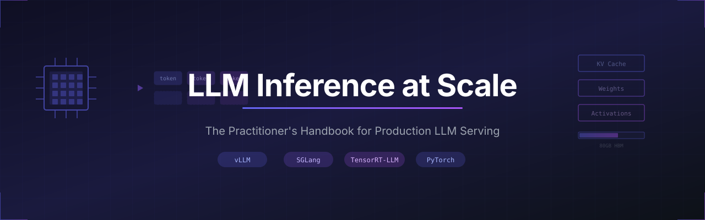

<p align="center">
  
</p>

<p align="center">
  <strong>The definitive guide to serving large language models in production.</strong>
</p>

<p align="center">
  <a href="#-quick-start">Quick Start</a> •
  <a href="#-table-of-contents">Contents</a> •
  <a href="#-labs">Labs</a> •
  <a href="#-community">Community</a> •
  <a href="#-contributing">Contributing</a>
</p>

<p align="center">
  
  
  
</p>

<p align="center">
  
  
  
  
  
</p>

---

## Why This Exists

LLM inference is hard. Not "read the docs and figure it out" hard — **fundamentally different from everything else in ML** hard.

Traditional ML inference is a solved problem. You batch requests, run a forward pass, return results. Latency is predictable, memory is fixed, scaling is linear.

LLM inference breaks all of these assumptions:
- **Latency is unpredictable** — a 10-token response takes 100ms, a 1000-token response takes 10 seconds
- **Memory grows during requests** — the KV cache expands with every generated token
- **Scaling is sub-linear** — communication overhead dominates as you add GPUs
- **Cost is 100x higher** — $0.001/request becomes $0.10/request

This handbook exists because we needed it and couldn't find it. The knowledge is scattered across papers, blog posts, tribal knowledge, and source code comments. We've consolidated years of production experience and research into one comprehensive resource.

**This is the guide we wish existed when we started.**

---

> 📬 **Follow the build** — New chapters, explained in plain English with production context.
> Subscribe to [The Engineer's Digest](https://harshuljain.substack.com) to get notified
> when new content drops. **[Subscribe free →](https://harshuljain.substack.com)**

💬 [Join the discussion](https://github.com/harshuljain13/llm-inference-at-scale/discussions) 
— questions, feedback, and corrections welcome
---

## 🎯 What You'll Learn

<table>
<tr>
<td width="50%">

### Foundations
- Why LLM inference costs 100x more than traditional ML
- The memory bandwidth wall and how to work around it
- Prefill vs decode: two completely different problems
- KV cache mechanics at the byte level

</td>
<td width="50%">

### Production Skills
- Choosing between vLLM, SGLang, and TensorRT-LLM
- Quantization tradeoffs (INT8, INT4, FP8, FP4)
- Tensor parallelism and multi-GPU serving
- Capacity planning and SLO management

</td>
</tr>
<tr>
<td width="50%">

### Optimization Techniques
- PagedAttention and memory-efficient serving
- Continuous batching for throughput
- Speculative decoding for latency
- FlashAttention and kernel-level optimizations

</td>
<td width="50%">

### Advanced Topics
- Disaggregated serving (prefill/decode separation)
- MoE inference and expert routing
- KV cache compression and eviction
- Edge deployment with llama.cpp

</td>
</tr>
</table>

---

## 🚀 Quick Start

### Prerequisites

- Python 3.10+
- CUDA 12.0+ (for GPU labs)
- Basic PyTorch familiarity

### Installation

```bash
git clone https://github.com/harshuljain13/llm-inference-at-scale.git
cd llm-inference-at-scale

# Create virtual environment
python -m venv .venv
source .venv/bin/activate  # On Windows: .venv\Scripts\activate

# Install dependencies
pip install -r requirements.txt
```

### Start Reading

```bash
# Open the first chapter
open content/00_foundations/00.0_transformer_anatomy_and_memory/transformer_anatomy_and_memory.md
```

Or browse the [Table of Contents](#-table-of-contents) below.

---

## 📚 Table of Contents

### Part I: Foundations

*"I can explain why LLM inference is memory-bound, trace every byte, and predict performance from first principles."*

**Ch 00 — Transformer Anatomy: Where Every Byte of GPU Memory Goes**

| Module | Title | Description |
|:------:|-------|-------------|
| 0.0 | [Transformer Architecture & Memory](content/00_foundations/00.0_transformer_anatomy_and_memory/transformer_anatomy_and_memory.md) | Architecture, anchor values, KV cache as scaling constraint |
| 0.1 | [What is LLM Inference?](content/00_foundations/00.1_what_is_llm_inference/what_is_llm_inference.md) | Tokenization, prefill, decode, sampling, key metrics |
| 0.2 | [Why LLM Inference is Different](content/00_foundations/00.2_why_llm_inference_is_different/why_llm_inference_is_different.md) | 100x cost gap, memory bandwidth wall, roofline model |

**Ch 01 — GPU Fundamentals: Finding Your Hardware Bottleneck**

| Module | Title | Description |
|:------:|-------|-------------|
| 1.1 | [GPU Memory & Hierarchy](content/01_gpu_fundamentals/01.1_gpu_memory/gpu_memory.md) | HBM, VRAM budgeting, instance selection |
| 1.2 | [Roofline Model](content/01_gpu_fundamentals/01.2_roofline_model/roofline_model.md) | Arithmetic intensity, compute vs memory bound |
| 1.3 | [FlashAttention](content/01_gpu_fundamentals/01.3_flash_attention/flash_attention.md) | IO-aware attention, online softmax, tiling |

**Ch 02 — Attention Mechanisms: How Design Choices Shape Your KV Cache**

| Module | Title | Description |
|:------:|-------|-------------|
| 2.1 | [KV Caching](content/02_attention_mechanisms/02.1_kv_caching/kv_caching.md) | Why KV cache exists, memory formulas, growth |
| 2.2 | [Attention Mechanisms](content/02_attention_mechanisms/02.2_attention_mechanisms/attention_mechanisms.md) | MHA to MQA to GQA evolution |
| 2.5 | [Multi-Latent Attention](content/02_attention_mechanisms/02.3_multi_latent_attention/multi_latent_attention.md) | DeepSeek MLA, low-rank KV compression, LMCache |

**Ch 03 — KV Cache Engineering: From PagedAttention to Cross-Request Sharing**

| Module | Title | Description |
|:------:|-------|-------------|
| 3.1 | [PagedAttention](content/03_kv_cache_engineering/03.1_paged_attention/paged_attention.md) | Virtual memory for KV cache |
| 3.2 | [KV Cache Compression](content/03_kv_cache_engineering/03.2_kv_cache_compression/kv_cache_compression.md) | Quantized KV, eviction, TurboQuant |

---

### Part II: Optimizations

*"I can make the same model serve 10x more users on the same hardware."*

**Ch 04 — Quantization and Speculative Decoding: Doubling Throughput on the Same Hardware**

| Module | Title | Description |
|:------:|-------|-------------|
| 4.1 | [Quantization](content/04_optimization/04.1_quantization/quantization.md) | INT8, INT4, FP8, GPTQ, AWQ |
| 4.2 | [TurboQuant](content/04_optimization/04.2_turboquant/turboquant.md) | KV cache-specific quantization |
| 4.3 | [Continuous Batching](content/04_optimization/04.3_continuous_batching/continuous_batching.md) | Dynamic batch scheduling |
| 4.4 | [Speculative Decoding](content/04_optimization/04.4_speculative_decoding/speculative_decoding.md) | Draft-verify, EAGLE, Medusa |
| 4.5 | [Chunked Prefill](content/04_optimization/04.5_chunked_prefill/chunked_prefill.md) | Splitting prefill to reduce decode latency |

**Ch 05 — Inference Engines: Choosing vLLM, SGLang, or TRT-LLM**

| Module | Title | Description |
|:------:|-------|-------------|
| 5.1 | [vLLM](content/05_engines/05.1_vllm/vllm.md) | PagedAttention engine, production tuning |
| 5.2 | [SGLang](content/05_engines/05.2_sglang/sglang.md) | RadixAttention, structured generation |
| 5.3 | [TensorRT-LLM](content/05_engines/05.3_tensorrt_llm/tensorrt_llm.md) | NVIDIA compiled runtime |

**Ch 06 — Parallelism: Fitting Models That Don't Fit on One GPU**

| Module | Title | Description |
|:------:|-------|-------------|
| 6.1 | [Tensor Parallelism](content/06_scaling/06.1_tensor_parallelism/tensor_parallelism.md) | Splitting across GPUs, AllReduce, NVLink |
| 6.2 | [MoE Inference](content/06_scaling/06.2_moe_inference/moe_inference.md) | Expert parallelism, routing, load balancing |
| 6.3 | [Distillation](content/06_scaling/06.3_distillation/distillation.md) | Compressing models for efficient serving |

---

### Part III: Operationalization

*"I can run inference in production for millions of users, globally, without burning money."*

**Ch 07 — Serving: From Single Request to Production Fleet**

| Module | Title | Description |
|:------:|-------|-------------|
| 7.1 | [Ray Serve](content/07_serving/07.1_ray_serve/ray_serve.md) | Scalable LLM services with Ray |
| 7.2 | [EKS + KServe](content/07_serving/07.2_eks_kserve/eks_kserve.md) | Kubernetes-native LLM deployment |
| 7.3 | [SageMaker](content/07_serving/07.3_sagemaker/sagemaker.md) | AWS managed inference |
| 7.4 | [Disaggregated Serving](content/07_serving/07.4_disaggregated_serving/disaggregated_serving.md) | Prefill/decode separation |
| 7.5 | [Cold Start](content/07_serving/07.5_cold_start/cold_start.md) | Model loading latency mitigation |
| 7.6 | [Cache-Aware Routing](content/07_serving/07.6_cache_aware_routing/cache_aware_routing.md) | Prefix routing, semantic caching, session affinity |

**Ch 08 — Operations: The Metrics That Actually Predict Outages**

| Module | Title | Description |
|:------:|-------|-------------|
| 8.1 | [Benchmarking](content/08_operations/08.1_benchmarking/benchmarking.md) | Measuring inference performance |
| 8.2 | [Structured Output](content/08_operations/08.2_structured_output/structured_output.md) | JSON schemas, constrained decoding |
| 8.3 | [Edge Deployment](content/08_operations/08.3_edge_deployment/edge_deployment.md) | llama.cpp, GGUF, mobile inference |
| 8.4 | [Inference Metrics & Goodput](content/08_operations/08.4_inference_metrics/inference_metrics.md) | SLOs, percentiles, monitoring, cost |
| 8.5 | [Multi-Region KV Locality](content/08_operations/08.5_multi_region_kv_locality/multi_region_kv_locality.md) | RDMA, KV transfer, DistServe, Mooncake |

**Ch 09 — Production Stories: How Meta and Databricks Run at Scale**

| Module | Title | Description |
|:------:|-------|-------------|
| 9.1 | [Meta Inference Platform](content/09_production_stories/09.1_meta_inference_platform/meta_inference_platform.md) | Model Runner, TP+CP+EP at 100K GPUs |
| 9.2 | [Databricks Multi-Tenant Serving](content/09_production_stories/09.2_databricks_multi_tenant/databricks_multi_tenant.md) | Model Units, LoRA multiplexing |
| 9.3 | [Mixed Workload Management](content/09_production_stories/09.3_mixed_workload_management/mixed_workload_management.md) | Scheduling, preemption, fleet economics |

**Ch 10 — System Designs: Architecting Inference for 1M Concurrent Users**

| Module | Title | Description |
|:------:|-------|-------------|
| 10.1 | [ChatGPT-Scale Chatbot](content/10_system_designs/10.1_chatgpt_scale_chatbot/chatgpt_scale_chatbot.md) | 1M concurrent, multi-region, session affinity |
| 10.2 | [Code Copilot](content/10_system_designs/10.2_code_copilot/code_copilot.md) | <200ms TTFT, 128K context, speculative decoding |
| 10.3 | [Enterprise RAG](content/10_system_designs/10.3_enterprise_rag/enterprise_rag.md) | Multi-model cascade, batch + real-time |
| 10.4 | [Multi-Model Gateway](content/10_system_designs/10.4_multi_model_gateway/multi_model_gateway.md) | Route 405B/70B/8B/1.5B by SLO and cost |
| 10.5 | [Agentic Workload](content/10_system_designs/10.5_agentic_workload/agentic_workload.md) | Multi-step KV, tool calls, session persistence |

---

## 📐 Key Equations

Formulas you'll use constantly when working with LLM inference:

### Memory Bandwidth Ceiling

The theoretical maximum decode speed, limited by how fast you can read model weights:

```
max_tokens_per_second = memory_bandwidth / model_size_bytes
```

**Example:** Llama 8B (16GB FP16) on A100 (2 TB/s) → 125 tokens/sec maximum

### KV Cache Size

Memory required for the key-value cache:

```
kv_cache_bytes = 2 × num_layers × num_kv_heads × head_dim × seq_len × batch_size × dtype_bytes
```

**Example:** Llama 8B, batch=1, seq=4096, FP16 → 512 MB

### Arithmetic Intensity

Determines whether a workload is compute-bound or memory-bound:

```
arithmetic_intensity = FLOPs / bytes_transferred
```

**Rule of thumb:** Below the ridge point (~156 FLOPs/byte on A100) = memory-bound

---

## 🗂️ Repository Structure

```
llm-inference-at-scale/
├── content/                      # 📖 Handbook chapters
│   ├── 00_foundations/           #    Part I: Foundations
│   ├── 01_gpu_fundamentals/      #    Part II: GPU Fundamentals
│   ├── 02_attention_and_kv/      #    Part III: Attention & KV Cache
│   ├── 03_optimization/          #    Part IV: Optimization Techniques
│   ├── 04_engines/               #    Part V: Inference Engines
│   ├── 05_scaling/               #    Part VI: Scaling
│   ├── 06_serving/               #    Part VII: Production Serving
│   ├── 07_operations/            #    Part VIII: Operations
│   └── utils/                    #    Visualization utilities
├── labs/                         # 🧪 Hands-on exercises
├── reference/                    # 📋 Quick references
│   ├── cheat_sheet.md            #    One-page summary
│   ├── glossary.md               #    Terminology
│   ├── vllm_quick_reference.md   #    vLLM commands
│   └── cost_calculator.py        #    Inference cost estimation
├── assets/                       # 🎨 Images and diagrams
└── slides/                       # 📊 Presentation materials
```

---

## 🎓 Learning Paths

### 🏃 Speed Run (2 hours)

For engineers who need to deploy an LLM this week:

1. [0.0 Transformer Anatomy & Memory](content/00_foundations/00.0_transformer_anatomy_and_memory/transformer_anatomy_and_memory.md) — 15 min
2. [0.1 What is LLM Inference?](content/00_foundations/00.1_what_is_llm_inference/what_is_llm_inference.md) — 20 min
3. [3.1 Quantization](content/04_optimization/04.1_quantization/quantization.md) — 20 min
4. [4.1 vLLM](content/05_engines/05.1_vllm/vllm.md) — 30 min
5. [Lab 04: vLLM Deployment](labs/lab_04_vllm_deployment/) — 45 min

### 📚 Deep Dive (1 day)

For engineers building inference infrastructure:

- **Morning:** Part I (Foundations) + Part II (GPU Fundamentals)
- **Afternoon:** Part IV (Optimization) + Part V (Engines)
- **Labs:** 01, 02, 03, 04

### 🎯 Complete Coverage (3 days)

For teams standardizing on LLM serving:

- **Day 1:** Parts I, II, III — Foundations through KV Cache
- **Day 2:** Parts IV, V, VI — Optimization through Scaling
- **Day 3:** Parts VII, VIII — Production Serving and Operations
- **Labs:** All 10 labs

---

## 🌟 Community

### Presentations

This material has been presented at:

- *More talks coming — if you'd like this at your conference or meetup, open an issue.*

### Citation

If you use this material in research or internal documentation, please cite:

```bibtex
@misc{llm-inference-at-scale,
  title={LLM Inference at Scale: A Practitioner's Handbook},
  author={Jain, Harshul},
  year={2025},
  url={https://github.com/harshuljain13/llm-inference-at-scale}
}
```

### Star History

If you find this useful, please ⭐ the repo — it helps others discover it.

---

## 🤝 Contributing

Contributions are welcome. This is a living document.

### Ways to Contribute

- **Fix errors** — Typos, outdated information, incorrect formulas
- **Improve clarity** — Better explanations, additional examples
- **Add content** — New chapters, labs, or reference materials

### Process

1. Fork the repository
2. Create a feature branch (`git checkout -b improve-kv-cache-chapter`)
3. Make your changes
4. Submit a pull request

> To report errors or suggest corrections, open a GitHub Issue.

---

## 👤 About the Author

**Harshul Jain** is a Senior ML Infrastructure Engineer at Audible (Amazon), where he owns the ML Feature Store, a GenAI semantic search platform serving millions of customers, and real-time streaming pipelines at scale. He has been building and operating ML infrastructure in production for 4+ years and mentors 300+ engineers through an eMentoring program.

- GitHub: [@harshuljain13](https://github.com/harshuljain13)
- Newsletter: [The Engineer's Digest](https://harshuljain.substack.com) — LLM inference, deeply explained

---

## ⚠️ Disclaimer

The views, techniques, and opinions expressed in this handbook are solely those of the author and **do not represent the views of Audible, Amazon, or any affiliated organization**. No proprietary, confidential, or internal Amazon/Audible systems, data, or information has been included. All content is based on publicly available research, open-source tooling, and the author's independent experience and analysis.

This handbook is provided for **educational purposes only**. Production infrastructure decisions should be validated against your specific workload, hardware, and organizational constraints. The author makes no guarantees about the accuracy, completeness, or fitness for purpose of any content herein.

---

## 📄 License & Copyright

© 2026 Harshul Jain. All rights reserved.

No part of this work — including the framework, diagrams, models, terminology, chapter structure, or related materials — may be reproduced, distributed, modified, adapted, or used in whole or in part without prior written permission from the author. This includes but is not limited to use in courses, training programs, consulting engagements, publications, presentations, software, or organizational materials.

### Framework

The framework presented in this work is the intellectual property of Harshul Jain. It may not be copied, adapted, taught, commercialized, incorporated into derivative works, or used in any professional, commercial, or organizational context — including consulting, training, software, presentations, publications, or organizational materials — without prior written permission.

> To request permission, open a GitHub Issue or contact via the profile above.

---

## 🙏 Acknowledgments

This handbook builds on the work of many researchers and engineers:

- The [vLLM](https://github.com/vllm-project/vllm) team for PagedAttention and continuous batching
- The [SGLang](https://github.com/sgl-project/sglang) team for RadixAttention
- Tri Dao for [FlashAttention](https://github.com/Dao-AILab/flash-attention)
- The authors of foundational papers: Attention Is All You Need, GQA, Medusa, EAGLE, and many others

---

📬 **Stay updated** — [Subscribe to The Engineer's Digest](https://harshuljain.substack.com) for chapter releases and build-in-public updates.

---

<p align="center">
  <strong>Built with ❤️ for the ML infrastructure community</strong>
</p>

<p align="center">
  <a href="#llm-inference-at-scale">Back to top ↑</a>
</p>
