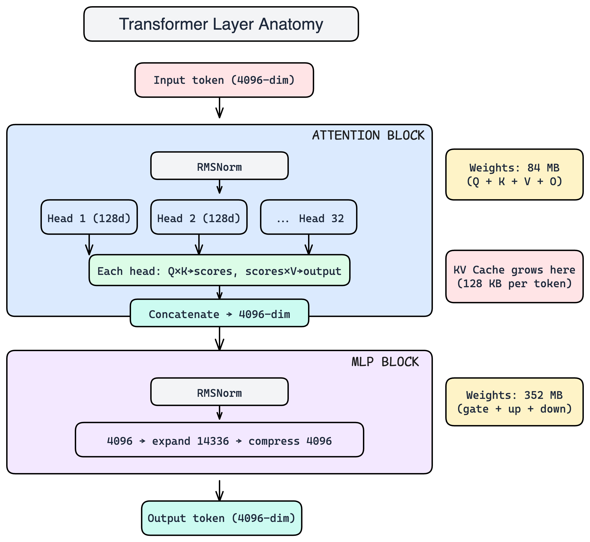
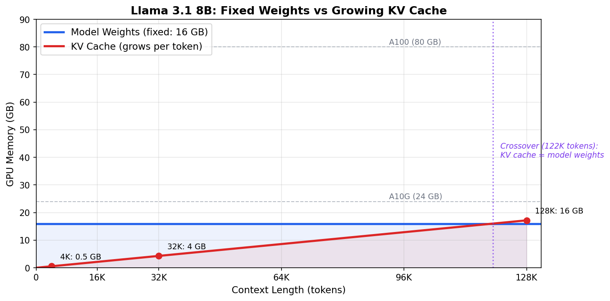
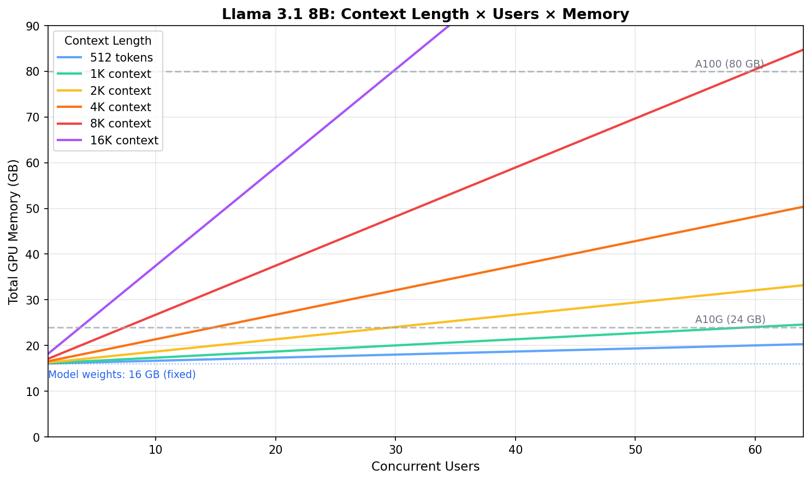

# Transformer Anatomy & Memory

> This chapter explains what a transformer IS — its architecture, building blocks, and how billions of parameters are organized into layers. By the end, you'll be able to look at any model config and understand exactly what's inside.

---

## What this chapter covers

A transformer is the architecture behind every modern LLM (GPT-4, Llama, Claude, Gemini). Before understanding inference, optimization, or deployment, you need to know what the machine looks like on the inside.

We'll use **Llama 3.1 8B** as our reference — it's open-weight, well-documented, and representative of the family.

**Key terms you'll encounter:**
- **FP16 (half-precision):** Each number stored as 2 bytes instead of 4. Standard for inference.
- **RMSNorm:** A normalization step that keeps values from growing too large between layers.
- **SwiGLU:** An activation function that gates information flow — the reason MLP has 3 matrices instead of 2.
- **GQA (Grouped-Query Attention):** A memory optimization where multiple query heads share Key/Value weights — reduces memory without losing quality.

---

## The Architecture: Llama 3.1 8B from Top to Bottom

A transformer has five components stacked in sequence. We'll start with the full picture, then zoom into each part.



---

## The Embedding Table

The first real component. Converts token IDs into dense vectors.

```python
# Shape: [vocab_size, hidden_dim] = [128256, 4096]
# Size:  128256 × 4096 × 2 bytes (FP16) = 1.05 GB
#
# What it does: looks up a row per token.
# Input:  [5 token IDs]
# Output: [5, 4096] — each token is now a 4096-dim vector
```

Think of it as a dictionary where every "word" has a 4096-number definition that encodes its meaning. The model learned these definitions during training.

---

## The Transformer Layer (×32)

This is where 95% of the model's parameters live. Every layer has the same structure: **Attention** then **MLP**, each preceded by a normalization step.

### RMSNorm (the stabilizer)

Before attention and before the MLP, the input passes through RMSNorm. It scales the vector to have unit magnitude — prevents numbers from growing uncontrollably across 32 layers.

```python
# Weights: [4096] = 8 KB per norm (tiny)
# Operation: x / rms(x) × learned_scale
#   where rms(x) = sqrt(mean(x²))
# Two norms per layer × 32 layers = 512 KB total (negligible)
```

You can forget about RMSNorm for capacity planning — it's <0.01% of the model.

### Attention Block

Attention answers: **"Which other tokens in the sequence are relevant to me right now?"**

It works by projecting each token into three views through learned weight matrices:

| Matrix | Shape | What it produces |
|--------|-------|-----------------|
| **W_q** (Query) | [4096, 4096] | "What am I looking for?" — 32 heads × 128 dims |
| **W_k** (Key) | [4096, 1024] | "What do I contain?" — 8 KV heads × 128 dims |
| **W_v** (Value) | [4096, 1024] | "What info do I carry?" — 8 KV heads × 128 dims |
| **W_o** (Output) | [4096, 4096] | Recombines all heads back to 4096 |

**Why is K/V 4× smaller than Q?** This is GQA (Grouped-Query Attention). Instead of 32 independent Key/Value heads, Llama uses only 8 — each shared across 4 query heads. The quality impact is negligible, but the memory savings during inference are massive (we'll see why in Chapter 02).

**How attention actually works:**

```python
# Input: [batch, seq_len, 4096]

# 1. Project into Q, K, V
Q = input @ W_q   # → [batch, seq_len, 4096] then reshape to [batch, 32, seq_len, 128]
K = input @ W_k   # → [batch, seq_len, 1024] then reshape to [batch, 8, seq_len, 128]
V = input @ W_v   # → [batch, seq_len, 1024] then reshape to [batch, 8, seq_len, 128]

# 2. Each query head attends using its assigned KV head (4 query heads per KV head)
scores = Q @ K.transpose(-2, -1) / sqrt(128)   # → [batch, 32, seq_len, seq_len]
weights = softmax(scores)
attended = weights @ V                           # → [batch, 32, seq_len, 128]

# 3. Concatenate all 32 heads and project back
output = concat(attended) @ W_o                  # → [batch, seq_len, 4096]
```

The key insight: attention has **32 query perspectives** but only **8 sets of keys/values**. The query heads are grouped in fours, and each group shares a KV head. This is purely an architectural choice to reduce memory — it doesn't change the fundamental computation.

### MLP Block

After attention decides "what to look at," the MLP processes "what to do with it." It's a simple expand → activate → compress pattern:

```python
# Llama uses SwiGLU, which needs 3 matrices instead of 2:

W_gate: [4096, 14336]   # Controls which dimensions "fire"
W_up:   [4096, 14336]   # Expands the representation
W_down: [14336, 4096]   # Compresses back
```

```python
# The computation:
gate = silu(input @ W_gate)    # silu(x) = x * sigmoid(x), a smooth gating function
up   = input @ W_up            # Expand to 14336 dims
hidden = gate * up             # Gated activation
output = hidden @ W_down       # Compress back to 4096
```

**Why 3 matrices?** Classic transformers use 2 (expand + compress with ReLU between). SwiGLU adds a "gate" that learns which dimensions to activate — like a dimmer switch instead of an on/off switch. The extra matrix costs 50% more parameters but produces better quality.

**Why 14336?** It's 3.5× the hidden dimension (4096 × 3.5 = 14336). This ratio is a design choice — wider = more capacity but more memory. GPT-2 used 4×, Llama uses 3.5×.

---

## The LM Head

The final component. Converts the 4096-dim representation back into a token prediction.

```python
# Shape: [4096, 128256] = 1.05 GB
# Same size as the embedding table (some models share them, Llama doesn't)
#
# Input:  [batch, seq_len, 4096]
# Output: [batch, seq_len, 128256] — probability score for every possible next token
```

---

## The Numbers: A Step-by-Step Derivation

Every model has hundreds of config values, but you only need **three anchors** — everything else derives from them:

| Anchor | What it controls | Llama 8B | Llama 70B | Llama 405B |
|--------|-----------------|----------|-----------|------------|
| **d** (hidden size) | Width of every token | 4096 | 8192 | 16384 |
| **L** (layers) | Depth of the model | 32 | 80 | 126 |
| **P** (parameters) | Total memory needed | 8B | 70B | 405B |

So when someone says "we're switching from Llama 8B to 70B," you instantly know: hidden size doubles (4096→8192), layers go from 32→80, memory goes from 16 GB→140 GB, and KV cache per token quadruples.

From these anchors, you can derive everything else for Llama 8B:

**Step 1: How wide is each attention head?**

The hidden dimension (4096) gets split equally across all query heads. With 32 heads, each head gets a 128-dimensional "view" of each token:

```
head_dim = d / n_heads = 4096 / 32 = 128
```

This is always a clean power-of-2 (64, 128, or 256) because GPU hardware has specialized circuits (tensor cores) that multiply matrices fastest when dimensions are powers of 2.

**Step 2: How big is the model in memory?**

Every parameter takes 2 bytes in FP16 (half-precision, the standard serving format):

```
model_size = 2 bytes × 8 billion parameters = 16 GB
```

This is the fixed cost — 16 GB of GPU memory just to *hold* the model, before any user sends a request.

**Step 3: What's inside each layer?**

Each of the 32 layers has two main blocks: attention and MLP. Let's see how much weight each one carries.

**Attention weights per layer** (the part that enables tokens to "look at" each other):

```
Q projection:  [4096 × 4096]  = 32 MB    (one per query head group)
K projection:  [4096 × 1024]  = 8 MB     (smaller — only 8 KV heads × 128)
V projection:  [4096 × 1024]  = 8 MB     (same size as K)
O projection:  [4096 × 4096]  = 32 MB    (combines all heads back together)
───────────────────────────────────────
Total attention per layer:       80 MB
```

**MLP weights per layer** (the part that stores the model's "knowledge"):

Llama uses SwiGLU, which needs three weight matrices instead of the usual two:

```
Gate projection: [4096 × 14336] = 117 MB  (controls what information passes)
Up projection:   [4096 × 14336] = 117 MB  (transforms input to wider space)
Down projection: [14336 × 4096] = 117 MB  (compresses back to hidden size)
────────────────────────────────────────
Total MLP per layer:              351 MB
```

Why is the MLP 3.5× wider than the hidden dim? More width means more capacity to store learned patterns — it's a design choice that trades memory for intelligence.

**Step 4: Where does all the memory go?**

```
Attention:  80 MB × 32 layers  =  2.6 GB  (16% of model)
MLP:       351 MB × 32 layers  = 11.2 GB  (70% of model)
Embedding + LM Head:           =  2.1 GB  (13% of model)
────────────────────────────────────────────────────────
Total:                           ~16 GB   (matches our Step 2 calculation ✓)
```

**The surprise:** Most people assume attention is the expensive part — it gets all the headlines. But the MLP holds **4× more weights**. When you quantize a model from FP16 to INT4 (storing each number in 0.5 bytes instead of 2), 70% of your savings come from shrinking the MLP.

**Step 5: The KV cache — the part that grows**

Everything above is the fixed cost — 16 GB that sits on the GPU regardless of whether anyone is using the model. But there's one more piece of memory that isn't fixed: the KV cache.

During attention, the model computes Keys and Values for every token it has seen so far. Rather than recompute them from scratch for every new token, it stores them. This stored memory is the KV cache, and it grows with every token in the conversation:

```
Per token, per layer: 2 × kv_heads × head_dim × 2 bytes = 2 × 8 × 128 × 2 = 4 KB
Per token, all layers: 4 KB × 32 = 128 KB
```

So every single token in a conversation costs 128 KB of GPU memory. A 4096-token conversation costs 512 MB. 128k tokens cost 16GB. 




**Why users matter:**  Serve 32 users simultaneously and that's also 16 GB — the same size as the model itself. Each concurrent user gets their own KV cache. The GPU memory budget after loading the model is:

```
Available for KV cache = GPU memory − model weights
A100 (80 GB):  80 − 16 = 64 GB for KV caches
A10G (24 GB):  24 − 16 = 8 GB for KV caches

Max concurrent users (at 4K context each):
  A100: 64 GB ÷ 512 MB = 128 users
  A10G:  8 GB ÷ 512 MB = 16 users

Max concurrent users (at 128K context each):
  A100: 64 GB ÷ 16 GB = 4 users
  A10G:  8 GB ÷ 16 GB = 0 (can't even fit one!)
```



This is why the KV cache dominates inference discussions. We'll explore it deeply in Module 0.1.

**The mental model to carry forward:**

A token enters as a 4096-dimensional vector. It passes through 32 layers. In each layer, attention asks "what should I look at?" (80 MB of weights) and the MLP asks "given what I'm looking at, what do I know?" (351 MB of weights). After 32 rounds of this refinement, the LM head maps the final vector to a probability over 128K possible next tokens.

The model weights are the fixed cost (16 GB, paid once). The KV cache is the variable cost (128 KB per token, paid per user, per conversation turn, growing until the context window fills). When you're serving real users, it's the KV cache — not the weights — that determines how many people your GPU can handle simultaneously.

---

## What's Next

Now that you know what a transformer looks like on the inside:

- **Module 0.1 — What is LLM Inference:** What happens when you actually *run* this architecture (prefill, decode, KV cache)
- **Module 0.2 — Why LLM Inference is Different:** Why serving this is 100× harder than traditional ML models

---

## References

1. Vaswani et al. "Attention Is All You Need" (2017)
2. Touvron et al. "Llama 2: Open Foundation and Fine-Tuned Chat Models" (2023)
3. Meta AI. "Llama 3.1 Model Card" (2024)
4. Ainslie et al. "GQA: Training Generalized Multi-Query Transformer Models from Multi-Head Checkpoints" (2023)
5. Shazeer. "GLU Variants Improve Transformer" (2020) — SwiGLU paper
6. Zhang & Sennrich. "Root Mean Square Layer Normalization" (2019)
