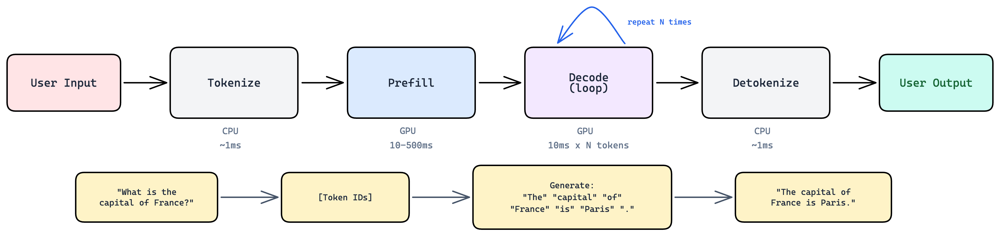
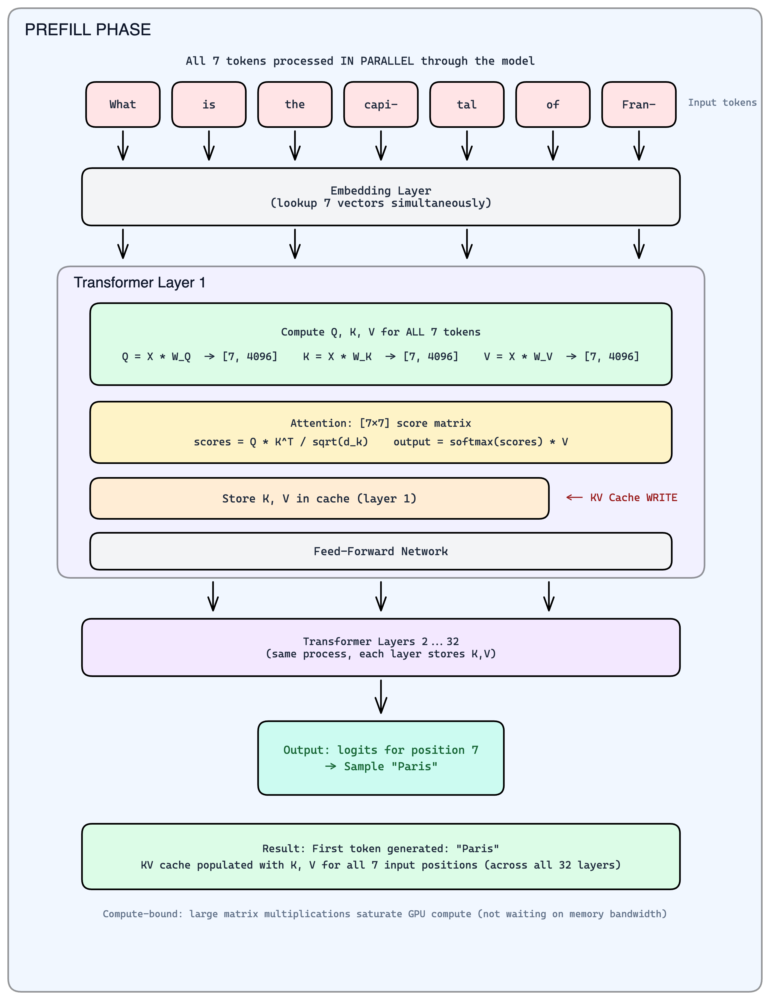
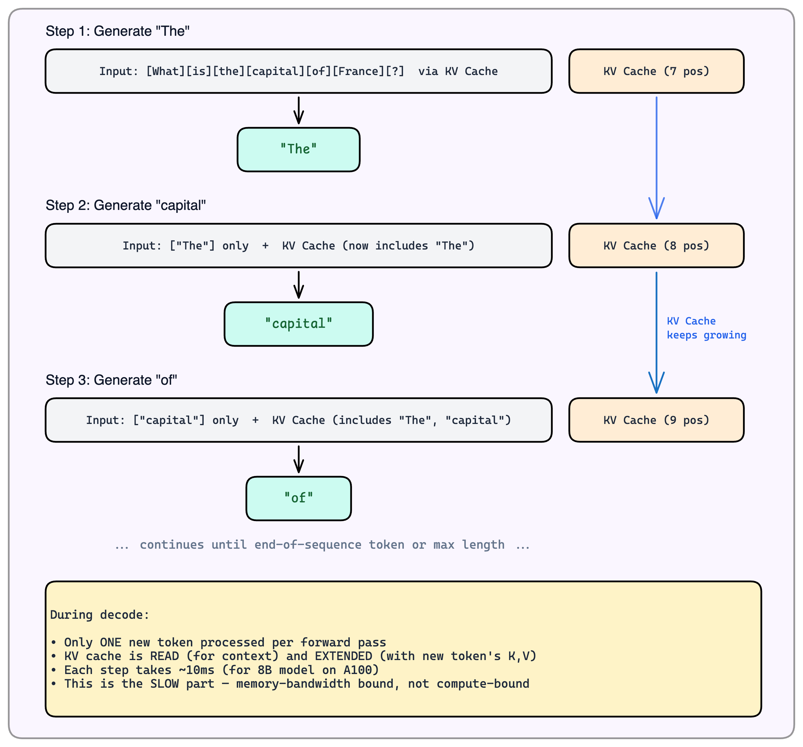
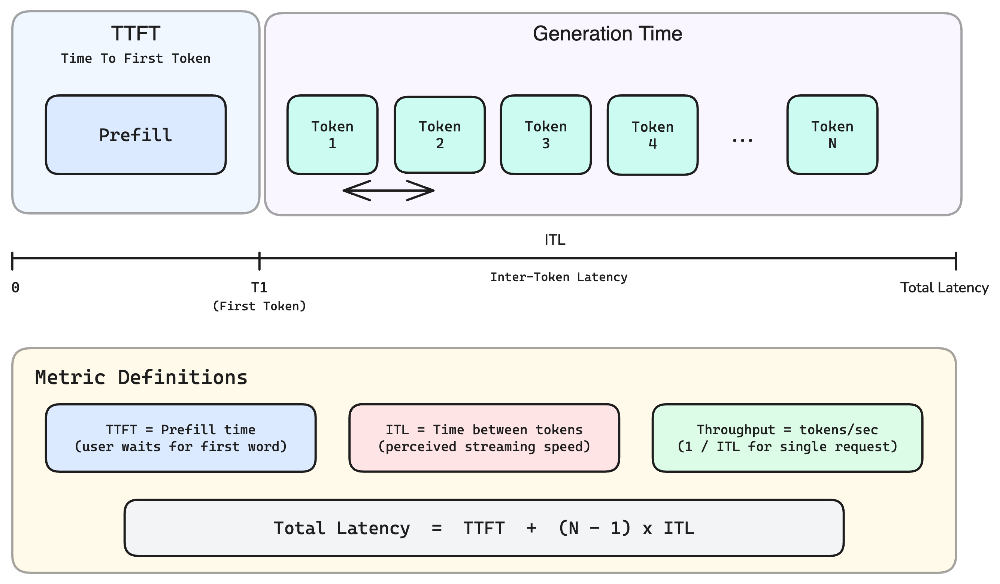

# 0.1 What is LLM Inference

> Now that you understand transformer architecture (Module 0.0), let's see what happens when you actually send a prompt to an LLM and get a response back.

---

## Learning Objectives

By the end of this module, you will:

- Understand the end-to-end flow of an LLM inference request
- Know the key stages: tokenization, prefill, decode, and detokenization
- Understand what the KV cache is and why it exists
- Be familiar with the key metrics: TTFT, ITL, throughput, and latency

---

## The Big Picture

**Inference** is the act of using a trained model to produce outputs — in the case of an LLM, generating text. Unlike training (which takes weeks on thousands of GPUs and happens once), inference happens every time someone sends a prompt. It's the "using" phase — the model's weights are frozen, and it's just reading inputs and writing outputs.

What makes LLM inference unique compared to, say, image classification:
- **It's iterative** — the model generates one token at a time, feeding each output back as input for the next step
- **It's variable-length** — a response could be 5 tokens or 5,000, and you don't know in advance
- **It has two distinct phases** — processing your prompt (fast, parallel) and generating the response (slow, sequential)

Let's trace through the complete journey of a request — from the moment you hit "send" to the moment the response appears.


*The complete LLM inference pipeline: tokenization, prefill, decode loop, and detokenization.*

---

## Stage 1: Tokenization

Before the model can process your text, it needs to be converted into numbers. This is tokenization.

```
Input:  "What is the capital of France?"

Tokenizer breaks this into subword tokens:
  "What" → 1724
  " is"  → 374
  " the" → 279
  " capital" → 6864
  " of"  → 315
  " France" → 9822
  "?"    → 30

Output: [1724, 374, 279, 6864, 315, 9822, 30]  (7 tokens)
```

**Key points:**
- Tokenization happens on CPU and is very fast (~1ms)
- Different models use different tokenizers (GPT uses BPE, Llama uses SentencePiece)
- A "token" is roughly 3-4 characters on average in English
- The vocabulary size is typically 32K-128K tokens

---

## Stage 2: Prefill (Processing the Prompt)

Once tokenized, the prompt goes to the GPU for the **prefill** phase. This is where the model "reads" and "understands" your entire prompt.


*During prefill, all prompt tokens are processed in parallel through the transformer layers. The KV cache is populated and the first output token is generated.*


**What is the KV Cache?**

During prefill, the model computes intermediate values called Keys (K) and Values (V) for each token at every layer. These are stored in the **KV cache** so they don't need to be recomputed during decode.

Think of it like this: the model "takes notes" while reading your prompt, and refers back to these notes when generating each output token.

Recall from Module 0.0 that Llama 3.1 8B has 8 KV heads × 128 dimensions per head across 32 layers. The KV cache stores both K and V, so:

```
KV cache per token = 2 (K+V) × 32 layers × 8 heads × 128 dims × 2 bytes = 128 KB
```

For a 4096-token conversation: 128 KB × 4096 = **512 MB** of GPU memory just for one user's context. This linear growth with sequence length is why KV cache management is a central challenge in LLM serving (explored in Chapter 02).

---

## Stage 3: Decode (Generating the Response)

After prefill, the model enters the **decode** phase. This is where it generates the response, one token at a time. This process is **autoregressive** — each generated token becomes input for the next step.


*During decode, tokens are generated one at a time. Each step reads from the KV cache and appends the new token's K,V to it.*

**The autoregressive loop:**

```
Step 1: Model outputs logits → sample → "The"
Step 2: Feed "The" back in → model outputs logits → sample → " capital"
Step 3: Feed " capital" back in → ...
...until stop condition is met.
```

Each step produces a probability distribution over all 128K possible next tokens. The model doesn't "choose" a token — a **sampling strategy** does:

| Strategy | How it works | When to use |
|----------|-------------|-------------|
| **Greedy** | Always pick highest probability | Deterministic, but repetitive |
| **Top-k** | Sample from the top k candidates | Good general default (k=50) |
| **Top-p (nucleus)** | Sample from smallest set whose probabilities sum to p | Adaptive — fewer choices when model is confident |
| **Temperature** | Scale logits before softmax (T<1 = sharper, T>1 = flatter) | Controls creativity vs. precision |

**When does generation stop?**
- The model generates an **EOS (end-of-sequence) token** — a special token that means "I'm done"
- The system hits a **max_tokens limit** (e.g., 4096) — a safety cutoff to prevent runaway generation
- The application applies custom stop sequences (e.g., stop at `"\n\n"`)

**Why is decode slow?**

Each decode step requires reading the entire model from memory, but only generates one token. The GPU spends most of its time waiting for data, not computing. We'll explore this in detail in Module 0.2.

---

## Stage 4: Detokenization

Finally, the generated token IDs are converted back to text:

```
Output tokens: [791, 6864, 315, 9822, 374, 12366, 13]

Detokenizer converts back to text:
  791   → "The"
  6864  → " capital"
  315   → " of"
  9822  → " France"
  374   → " is"
  12366 → " Paris"
  13    → "."

Output: "The capital of France is Paris."
```

---

## Key Metrics

When evaluating LLM inference performance, these are the metrics that matter:


*The key metrics for LLM inference: TTFT (time to first token), ITL (inter-token latency), throughput, and total latency.*

| Metric | Definition | Why It Matters |
|--------|------------|----------------|
| **TTFT** | Time to First Token | How long until user sees response start |
| **ITL** | Inter-Token Latency | Time between consecutive tokens (streaming speed) |
| **Throughput** | Tokens per second | System capacity, affects cost |
| **Total Latency** | End-to-end time | Complete request time |

**Typical values (Llama 8B on A100):**
- TTFT: 50-200ms (depends on prompt length)
- ITL: 8-15ms per token
- Throughput: 80-120 tokens/second (single request)

---

## The Complete Picture

Let's put it all together with a concrete example:

```
Request: "What is the capital of France?" → "The capital of France is Paris."

Timeline:
┌──────────────────────────────────────────────────────────────────────────────┐
│                                                                              │
│  0ms        1ms              50ms                                    120ms   │
│   │          │                │                                        │     │
│   ▼          ▼                ▼                                        ▼     │
│ ┌────┐    ┌──────────────┐  ┌────────────────────────────────────────────┐  │
│ │Tok-│    │              │  │                                            │  │
│ │en- │───►│   Prefill    │─►│              Decode (7 tokens)             │  │
│ │ize │    │   (7 tokens) │  │  "The" "capital" "of" "France" "is" "Paris"│  │
│ └────┘    └──────────────┘  └────────────────────────────────────────────┘  │
│  CPU           GPU                          GPU                              │
│  ~1ms         ~49ms                    7 × 10ms = 70ms                       │
│                                                                              │
│  TTFT = 50ms                                                                 │
│  Total Latency = 120ms                                                       │
│  Throughput = 7 tokens / 0.07s = 100 tok/s                                  │
│                                                                              │
└──────────────────────────────────────────────────────────────────────────────┘
```

---

## Summary

LLM inference has four main stages:

1. **Tokenization** (CPU, fast): Convert text to token IDs
2. **Prefill** (GPU, compute-bound): Process entire prompt, build KV cache, generate first token
3. **Decode** (GPU, memory-bound): Generate remaining tokens one at a time
4. **Detokenization** (CPU, fast): Convert token IDs back to text

The key insight is that **prefill and decode have very different characteristics**:
- Prefill is parallel and compute-bound
- Decode is sequential and memory-bound

Understanding this split is essential for optimizing LLM inference, which we'll explore in the next module.

---

## What's Next

- **Module 0.2: Why LLM Inference is Different** — Deep dive into why decode is slow, the bandwidth wall, and how it differs from traditional ML
- **Chapter 01: GPU Fundamentals** — Memory hierarchy, roofline model, and hardware selection
