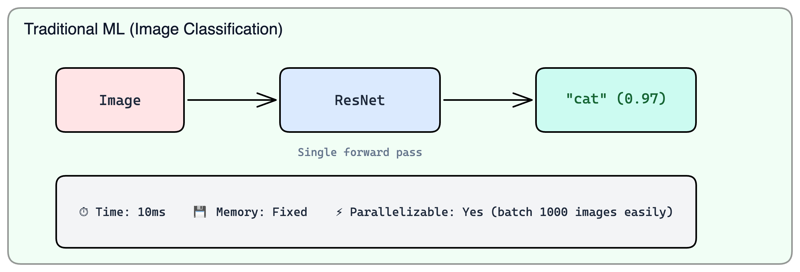
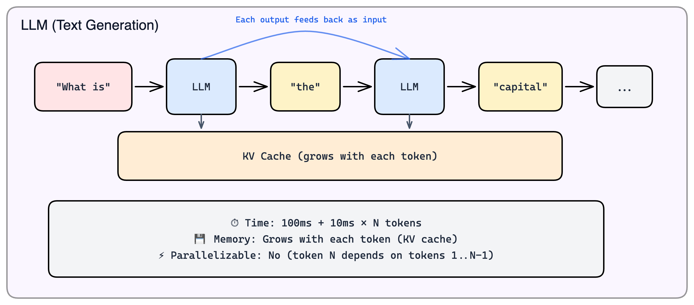
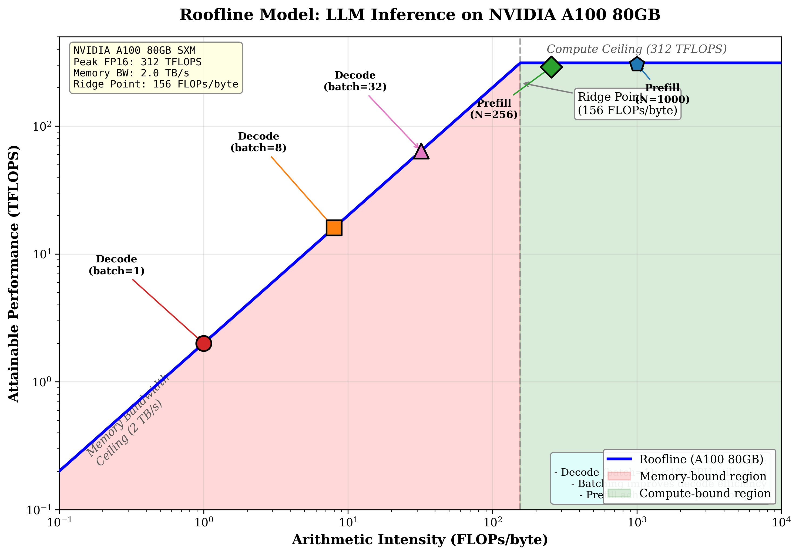

# Module 0.1: Why LLM Inference is Different

> The first thing to understand about LLM inference is that almost everything you know about ML inference is wrong—or at least, doesn't apply.

---

## Learning Objectives

By the end of this module, you will:

- Understand why LLM inference costs 100x more than traditional ML inference
- Grasp the fundamental difference between traditional ML and autoregressive generation
- Know the two phases of LLM inference (prefill and decode) at a high level
- Understand the memory bandwidth wall that limits decode speed

---

## The Uncomfortable Truth

Here's what nobody tells you when you start working on LLM inference:

**Traditional ML inference is a solved problem. LLM inference is not.**

| Aspect   | Traditional ML       | LLM Inference                   |
| -------- | -------------------- | ------------------------------- |
| Latency  | Predictable (5-20ms) | Unpredictable (100ms-10s)       |
| Memory   | Fixed per request    | Grows during request            |
| Batching | Trivial              | Requires continuous batching    |
| Scaling  | Linear with GPUs     | Sub-linear, communication-bound |
| Cost     | $0.001 per request   | $0.01-0.10 per request          |

The difference isn't 2x or 5x—it's 100x. And the reasons are fundamental, not incidental.

---

## Why LLMs Are Fundamentally Different

### The Sequential Nature of Text Generation

The core difference comes down to one word: **autoregressive**.

In traditional ML, inference is a single forward pass. You feed an image into ResNet, the data flows through the network once, and you get your classification. Done.


*Traditional ML inference: one input, one forward pass, one output. Time is fixed, memory is constant, and batching is trivial.*

LLMs work completely differently. When you ask "What is the capital of France?", the model doesn't produce the answer in one shot. It generates one token at a time: "The" → "capital" → "of" → "France" → "is" → "Paris". Each token requires a separate forward pass through the entire model.


*LLM inference: each output token requires its own forward pass. Token N cannot be generated until tokens 1 through N-1 exist.*

This isn't a limitation to be engineered away—it's how autoregressive language models work by design. The probability distribution for token 5 depends on what tokens 1-4 actually are.


### You Read the Entire Model for Every Token

Here's the insight that changes how you think about LLM inference:

```
Llama 3.1 8B generating 100 tokens:

Each token generation requires a full forward pass through the model.
A forward pass means reading ALL 8 billion parameters from memory.

  - Token 1:   Read 16 GB of weights
  - Token 2:   Read 16 GB of weights again
  - Token 3:   Read 16 GB of weights again
  - ...
  - Token 100: Read 16 GB of weights again

  Total memory reads: 16 GB × 100 = 1.6 TB
```

Neural networks don't "remember" their weights between operations. Every matrix multiplication requires loading the weight matrix from GPU memory (HBM) into the compute units. Generate 100 tokens, load the weights 100 times.

### The Memory Bandwidth Wall

This leads to a hard physical limit:

```
A100 memory bandwidth: 2 TB/s
Model size (FP16):     16 GB
Time to read model:    16 GB / 2 TB/s = 8 ms

Maximum decode speed = 1 token / 8 ms = 125 tokens/second
```

**This is a hard ceiling.** No software optimization can exceed it. The only ways past this wall are:
- Reduce model size (quantization)
- Increase memory bandwidth (better hardware or more GPUs)
- Generate multiple tokens per weight read (speculative decoding)

---

## The Two Phases: Prefill and Decode

Every LLM request goes through two distinct phases with completely different characteristics:

| Phase | What Happens | Bottleneck | When It Runs |
|-------|--------------|------------|--------------|
| **Prefill** | Process entire prompt at once | Compute (TFLOPS) | Once per request |
| **Decode** | Generate one token at a time | Memory bandwidth (TB/s) | Once per output token |

### Prefill: The Compute-Bound Phase

During prefill, all prompt tokens are processed in parallel through the model. This is where the KV cache is built.

**Why prefill is compute-bound:** The GPU sees large matrices (e.g., [1000, 4096] × [4096, 4096] for a 1000-token prompt). There's enough parallel work to keep the compute units busy. The bottleneck is how many FLOPs the GPU can execute per second.

### Decode: The Memory-Bound Phase

During decode, tokens are generated one at a time. Each token requires reading the entire model from memory.

**Why decode is memory-bound:** The GPU sees tiny matrices (e.g., [1, 4096] × [4096, 4096]). There's not enough parallel work to keep the compute units busy. The GPU spends most of its time waiting for data to arrive from memory.

```
┌─────────────────────────────────────────────────────────────────────┐
│                    THE DECODE BOTTLENECK                            │
├─────────────────────────────────────────────────────────────────────┤
│                                                                     │
│   What the GPU CAN do:     312 TFLOPS (312 trillion ops/second)     │
│   What the GPU DOES do:    ~16 GFLOPS (limited by memory bandwidth) │
│                                                                     │
│   GPU Utilization during decode: 16 / 312,000 ≈ 0.005%              │
│                                                                     │
│   The GPU is 99.995% IDLE during decode!                            │
│                                                                     │
│   This is why:                                                      │
│   • Decode is slow despite "less work"                              │
│   • Faster GPUs don't help much (memory bandwidth is similar)       │
│   • Batching is critical (amortize weight reads across requests)    │
│   • Quantization helps (smaller weights = faster reads)             │
│                                                                     │
└─────────────────────────────────────────────────────────────────────┘
```

### Visualizing the Parallelism Difference

```
                    PREFILL: Embarrassingly Parallel
    
    GPU sees large matrices → High utilization
    
    ┌─────────────────────────────────────────────────────────────┐
    │  Processing 1000 tokens simultaneously:                     │
    │                                                             │
    │  Q matrix: [1000, 4096]    K matrix: [1000, 4096]          │
    │  ┌─────────────────────┐   ┌─────────────────────┐         │
    │  │█████████████████████│   │█████████████████████│         │
    │  │█████████████████████│   │█████████████████████│         │
    │  │█████████████████████│   │█████████████████████│         │
    │  │█████████████████████│ × │█████████████████████│         │
    │  │█████████████████████│   │█████████████████████│         │
    │  │█████████████████████│   │█████████████████████│         │
    │  └─────────────────────┘   └─────────────────────┘         │
    │                                                             │
    │  → Millions of multiply-adds happening in parallel          │
    │  → GPU cores fully utilized                                 │
    │  → Compute-bound: limited by TFLOPS                         │
    └─────────────────────────────────────────────────────────────┘

                    DECODE: Fundamentally Sequential
    
    GPU sees tiny vectors → Low utilization
    
    ┌─────────────────────────────────────────────────────────────┐
    │  Processing 1 token at a time:                              │
    │                                                             │
    │  Q vector: [1, 4096]       K matrix: [4096, seq_len]       │
    │  ┌─────────────────────┐   ┌─────────────────────┐         │
    │  │█                    │   │█████████████████████│         │
    │  └─────────────────────┘ × │█████████████████████│         │
    │   (just one row!)          │█████████████████████│         │
    │                            │█████████████████████│         │
    │                            └─────────────────────┘         │
    │                                                             │
    │  → Most GPU cores sit idle                                  │
    │  → Waiting for memory reads                                 │
    │  → Memory-bound: limited by TB/s                            │
    └─────────────────────────────────────────────────────────────┘
```

### The Fundamental Asymmetry

Here's the counterintuitive part:

```
Example: 1000-token prompt, generate 100 tokens

Prefill:
  • Process 1000 tokens in ONE forward pass
  • Time: ~50ms (compute-bound)

Decode:
  • Process 1 token per forward pass × 100 passes
  • Time: 100 × 8ms = 800ms (memory-bound)

Total: 850ms
  • Prefill: 6% of time (processed 1000 tokens)
  • Decode: 94% of time (processed 100 tokens)
```

**Decode dominates even though it processes 10× fewer tokens.** This asymmetry drives everything in LLM inference optimization.

---

## The Roofline Model

The roofline model visualizes why prefill and decode behave so differently. It shows the relationship between computational intensity and achievable performance.


*The roofline model shows why prefill and decode have fundamentally different bottlenecks. Decode sits deep in the memory-bound region, while prefill operates in the compute-bound region.*

**Key insight:** Workloads left of the ridge point (156 FLOPs/byte on A100) are memory-bound. Workloads to the right are compute-bound. Decode has an arithmetic intensity of ~1 FLOP/byte; prefill has ~1000 FLOPs/byte.

This is why **batching helps decode**—processing multiple requests together increases arithmetic intensity, moving you up the diagonal toward better efficiency.

---

## Key Takeaways

1. **LLM inference is fundamentally sequential** — each token depends on all previous tokens

2. **Two phases, two bottlenecks:**
   - Prefill: compute-bound, parallel, efficient
   - Decode: memory-bound, sequential, inefficient

3. **Memory bandwidth is the wall** — decode speed is limited by `model_size / bandwidth`

4. **100x more expensive than traditional ML** — this isn't going away with better software

5. **Different optimizations for different phases** — prefill needs compute, decode needs bandwidth

---

## What's Next

Now that you understand *why* LLM inference is different, the next module dives into *how* it actually works at the byte level:

- **Module 0.2: Transformer Inference Mechanics** — Detailed walkthrough of attention, KV cache, GQA, and memory access patterns with concrete numbers

Then we'll cover the hardware and optimization techniques:

- **Module 1: GPU Fundamentals** — Memory hierarchy, roofline analysis, FlashAttention
- **Module 2: Attention and KV Cache** — PagedAttention, cache compression, memory management
- **Module 3: Optimization Techniques** — Quantization, continuous batching, speculative decoding

---

## References

1. Vaswani et al. "Attention Is All You Need" (2017) — The original transformer paper
2. Pope et al. "Efficiently Scaling Transformer Inference" (2022) — Google's analysis of inference scaling
3. Kwon et al. "Efficient Memory Management for Large Language Model Serving with PagedAttention" (2023) — vLLM
