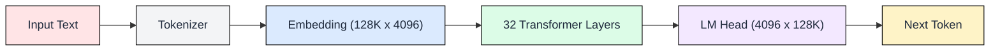
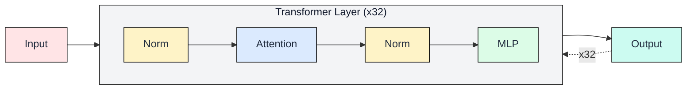
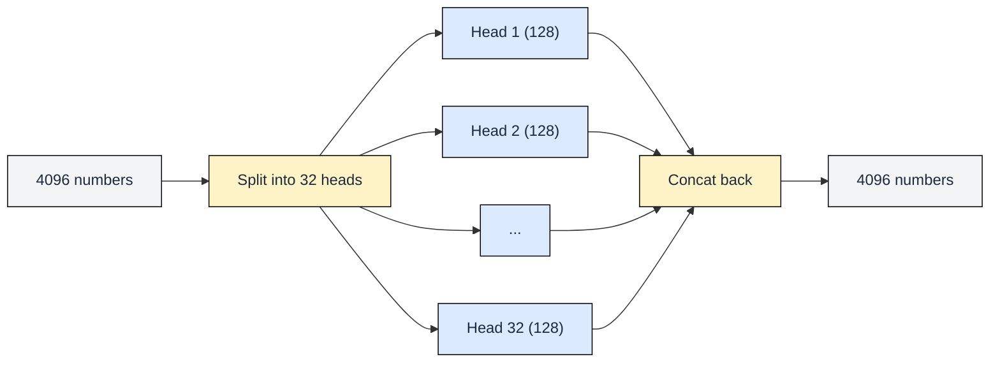
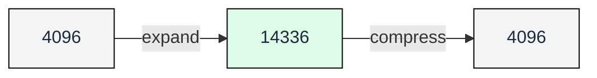

# 0.1 Transformer Architecture

 

This module shows you what lives inside a transformer and how big each piece is. You cannot optimize inference without knowing what the machine looks like on the inside.

---

## The Full Pipeline

A transformer takes text and produces the next word. Here is the complete pipeline:

What each piece does:

- **Tokenizer:** Splits text into integer IDs. "Hello world" becomes [15496, 995].
- **Embedding:** Looks up a 4,096-number vector for each token ID. Like a dictionary where every word has a 4,096-number definition.
- **32 Transformer Layers:** The core of the model. Refines the vectors by looking at relationships between tokens. This is where 95% of compute happens.
- **LM Head:** Converts the final vector into scores over the vocabulary (128K words). The highest score becomes the next token.

The 32 layers are where all the interesting (and expensive) work happens. Let's zoom in.

---

## Inside One Layer

Each layer receives a **hidden state**: a list of 4,096 numbers for each token. Think of it as a description that gets sharper with each layer.

Every layer applies two operations:

The output of layer 1 feeds into layer 2, which feeds into layer 3, all the way through layer 32. Same structure each time, different learned weights.

### Norm: "Keep values stable"

Before attention and before MLP, a normalization step rescales the numbers. Without it, values would grow out of control after 32 layers.

Norm has almost no parameters (just 4,096 scaling factors per layer). It costs negligible memory and compute, but without it the model would not train or run.

### Attention: "Which tokens matter?"

Attention answers one question: for the current token, which earlier tokens should influence its meaning?

To do this, it splits the 4,096 numbers into **32 heads** of 128 numbers each. Each head looks for a different kind of pattern:

Each head independently decides which tokens matter, then the 32 answers are glued back together into 4,096 numbers.

Why 32 heads? One head might learn to track grammar. Another might track what "it" refers to. Another might track the topic. Splitting into independent heads lets the model track many types of relationships in parallel.

The exact math of how each head works (Q, K, V projections and dot-product scores) is covered in Chapter 3.

### MLP: "Transform the representation"

After attention updates the token based on context, the MLP processes it independently. It expands 4,096 to 14,336 (giving room to compute), then compresses back:

The MLP is where the model stores factual knowledge and does reasoning. It is also the largest component in each layer (42% of all parameters).

---

## How Big Is Each Piece?

All numbers below are for **Llama 3.1 8B** stored in BFloat16 (2 bytes per parameter):

| Component | Size | % of Model |
|-----------|------|-----------|
| Embedding (128K vocab x 4096) | 1.0 GB | 6% |
| Attention weights (x32 layers) | 8.0 GB | 50% |
| MLP weights (x32 layers) | 6.8 GB | 42% |
| Norm + other | < 0.1 GB | < 1% |
| **Total** | **~16 GB** | **100%** |

Three things to notice:

1. **Attention + MLP make up 92% of the model.** Everything else is negligible.
2. **The total is 16 GB** because 8 billion parameters x 2 bytes = 16 GB.
3. **Every decode step reads all 16 GB.** This is the key fact for inference.

---

## Why This Matters for Inference

Every time the model produces one token, it reads all 16 GB of weights from memory. Not some. All. Every single token.

On an A100 GPU (2 TB/s bandwidth), reading 16 GB takes at minimum 8 milliseconds. That gives a ceiling of ~125 tokens per second for a single user, regardless of how fast the math units are.

This is why LLM inference is a memory bandwidth problem, not a compute problem. Chapter 1 explores this deeply using the roofline model.

---

## FAQ

**Q1: Why 16 GB for an "8 billion" parameter model?**

Each parameter takes 2 bytes in BFloat16. 8B x 2 = 16 GB. With INT8 quantization it halves to 8 GB. With INT4 it drops to 4 GB.

**Q2: Do all 32 layers have the same size?**

Yes. Every layer has identical shapes (same attention size, same MLP size). Only the learned values differ. This uniformity is what makes LLM inference predictable.

**Q3: What does "tied embedding" mean in the table?**

The LM Head reuses the embedding matrix (transposed). Instead of storing 128K x 4096 twice, the model shares one copy for both input and output. Saves ~1 GB.

**Q4: Why is the MLP wider than the hidden state (14336 vs 4096)?**

Wider MLPs give the model more capacity to store facts and do computation. The 3.5x expansion (4096 to 14336) is a design choice balancing capability against cost.

**Q5: If reading 16 GB per token is the bottleneck, why not use faster memory?**

The fastest GPU memory (SRAM) is only 20-40 MB. The model is 400x larger than SRAM. It must stream from the slower HBM. Chapter 1 covers this hierarchy in detail.

---

## References

1. Vaswani, A. et al. "Attention Is All You Need." NeurIPS 2017.
2. Dubey, A. et al. "The Llama 3 Herd of Models." Meta AI, 2024.
3. Zhang, B. and Sennrich, R. "Root Mean Square Layer Normalization." NeurIPS 2019.
4. Shazeer, N. "GLU Variants Improve Transformer." arXiv:2002.05202, 2020.
