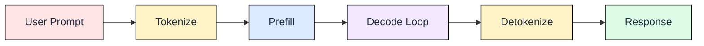
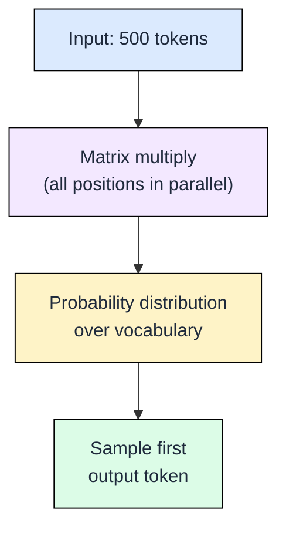
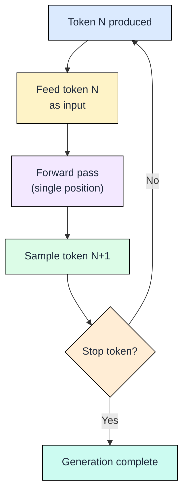
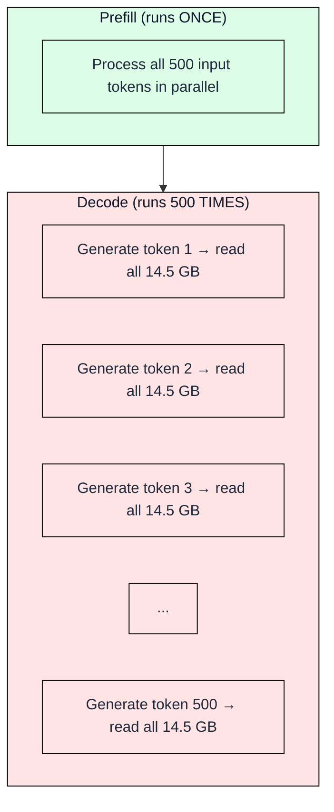

# 0.2 What Happens During Inference

Module 0.1 showed the transformer architecture: layers, attention heads, weight matrices. This module shows what happens when you actually use it to generate text.

## The Request Lifecycle

Every LLM request follows the same five-stage pipeline, regardless of model size or serving framework:

The first and last stages (tokenize, detokenize) are cheap string operations. The middle two stages (prefill, decode) consume GPU compute. Understanding the split between prefill and decode is the single most important concept in LLM inference performance.

## Tokenization: Text Becomes Numbers

Transformers operate on integers, not characters. A tokenizer splits input text into subword units and maps each to an integer ID from a fixed vocabulary. For example, the string "Hello world" might map to token IDs `[15496, 995]` in GPT-2's vocabulary.

Vocabulary sizes range from 32,000 (Llama 2) to 128,000 (GPT-4). Larger vocabularies represent more words as single tokens, reducing sequence length at the cost of a larger embedding matrix. Tokenization runs on CPU and takes microseconds relative to the GPU stages that follow.

## Prefill: Processing the Input

During prefill, the model processes all input tokens simultaneously in one forward pass. If your prompt contains 500 tokens, the model performs a single large matrix multiplication across all 500 positions in parallel.

Prefill is fast because GPUs excel at large parallel matrix multiplications. Processing 500 tokens takes roughly the same wall-clock time as processing 50, because the GPU's thousands of cores divide the work. The output of prefill is a probability distribution over the entire vocabulary, from which the model samples its first generated token.

## Decode: One Token at a Time

Decode is where generation actually happens. The model takes the token it just produced, feeds it back as input, and generates the next token. Then it feeds that token back, generates another, and repeats until it produces a stop token or hits a length limit.

Each decode step produces exactly one token. This is inherently sequential: token N+1 depends on token N, which depends on token N-1, all the way back to the first generated token. You cannot parallelize this chain. If the model generates 500 tokens, it executes 500 sequential forward passes.

## Detokenization: Numbers Back to Text

The reverse of tokenization: integer IDs map back to text strings. This is a lookup table operation that takes negligible time. Streaming responses send each token to the user as it is produced, so detokenization happens incrementally during decode rather than as a separate final stage.

## Why Decode Dominates Inference Cost

Prefill runs once per request. Decode runs once per output token. For a typical response of 500 tokens, the ratio is 1 prefill pass versus 500 decode passes.

Each decode step must read the entire model from GPU memory. For Mistral-7B in float16, that is 14.5 GB read from HBM per step. Generating 500 tokens means reading 500 x 14.5 GB = 7.25 TB of data. The GPU spends most of its time waiting for these memory reads rather than doing useful arithmetic.

This creates a fundamental asymmetry: prefill is compute-limited (matrix multiplications over many tokens in parallel), while decode is memory-limited (reading the full model for one token at a time). Nearly every optimization in LLM serving targets this decode bottleneck.

---

---

## Key Metrics

Four metrics define LLM inference performance. This timeline shows where each one lives:

```mermaid
gantt
    title Request Timeline: "What is the capital of France?"
    dateFormat X
    axisFormat %s ms

    section Phases
    Tokenize (CPU)         :tok, 0, 1
    Prefill (GPU)          :pf, 1, 50
    Decode token 1 "The"   :d1, 50, 60
    Decode token 2 "capital" :d2, 60, 70
    Decode token 3 "of"    :d3, 70, 80
    Decode token 4 "France" :d4, 80, 90
    Decode token 5 "is"    :d5, 90, 100
    Decode token 6 "Paris"  :d6, 100, 110
    Decode token 7 "."      :d7, 110, 120

    section Metrics
    TTFT = 50ms            :milestone, ttft, 50, 50
    ITL = 10ms             :milestone, itl, 60, 60
```

| Metric | What it is | Formula | This example |
|--------|-----------|---------|-------------|
| **TTFT** | Time until first token appears | tokenize + prefill | 1 + 49 = **50 ms** |
| **ITL** | Gap between tokens streaming | model_size / bandwidth | 14.5 GB / 2 TB/s = **~10 ms** |
| **Total Latency** | Full response time | TTFT + (tokens x ITL) | 50 + (7 x 10) = **120 ms** |
| **Throughput** | System output rate | tokens / decode_time | 7 / 0.07s = **100 tok/s** |

**Key insight:** TTFT depends on prompt length (longer prompt = longer prefill). ITL is nearly constant (same model = same bandwidth cost per token). Total latency depends on output length, which is unpredictable before generation starts.

**Different apps, different priorities:**

| Application | Optimize for | Why |
|-------------|-------------|-----|
| Chatbot | Low TTFT + low ITL | Users expect instant, smooth streaming |
| Batch pipeline | High throughput | Cost per million tokens matters, latency does not |
| Code copilot | Low total latency | Entire completion must arrive in <200ms |

## FAQ

**Q1: Why can't the model generate all output tokens at once, like it processes all input tokens at once?**

Because each output token depends on every token generated before it. The model needs to know token 5 before it can produce token 6. Input tokens, by contrast, are all known in advance, so they can be processed in parallel.

**Q2: What determines when generation stops?**

Three mechanisms: (1) the model produces a special end-of-sequence (EOS) token, (2) the output reaches a configured maximum length, or (3) a stop string appears in the decoded text. Most serving frameworks support all three.

**Q3: Is prefill always faster than decode?**

In wall-clock time per step, yes. Prefill processes hundreds or thousands of tokens in one pass. But for very long prompts (100K+ tokens), prefill itself can take seconds and consume significant GPU memory. The relative cost depends on the input-to-output length ratio.

**Q4: What happens if the input exceeds the model's context length?**

The model either truncates the input (dropping early tokens) or raises an error. Some models use positional interpolation to handle longer inputs than their training length, but performance typically degrades beyond the trained context window.

**Q5: Does batch size help with decode speed?**

Yes. By batching multiple decode requests together, the GPU reads model weights once and applies them to several sequences simultaneously. This amortizes the memory bandwidth cost across requests. Batching is the primary technique for improving decode throughput in production.

---

## References

1. Vaswani, A. et al. "Attention Is All You Need." NeurIPS 2017.
2. Pope, R. et al. "Efficiently Scaling Transformer Inference." MLSys 2023.
3. Kwon, W. et al. "Efficient Memory Management for Large Language Model Serving with PagedAttention." SOSP 2023.
4. Hugging Face Transformers documentation: tokenization pipeline. https://huggingface.co/docs/transformers/tokenizer_summary
5. NVIDIA Technical Blog: "Mastering LLM Techniques: Inference Optimization." 2023.
