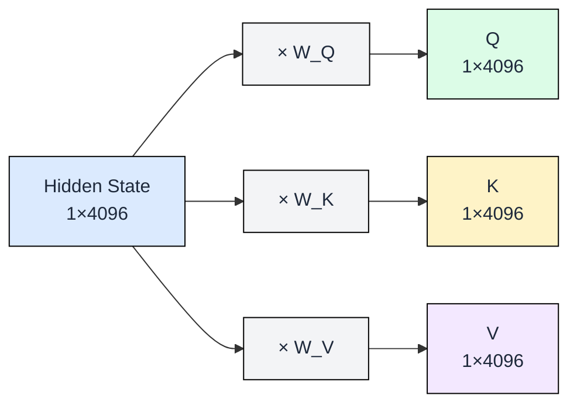
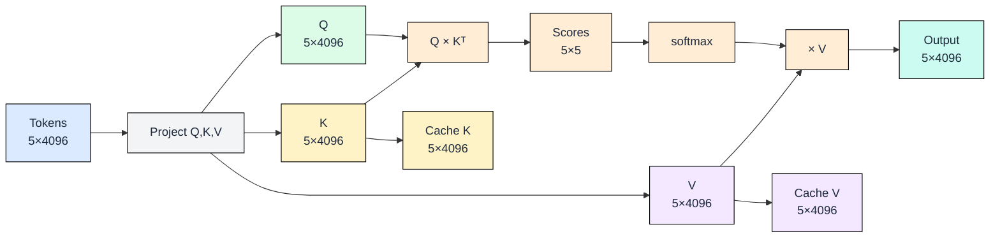
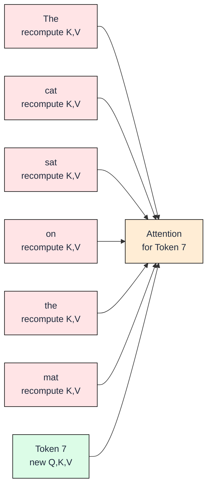
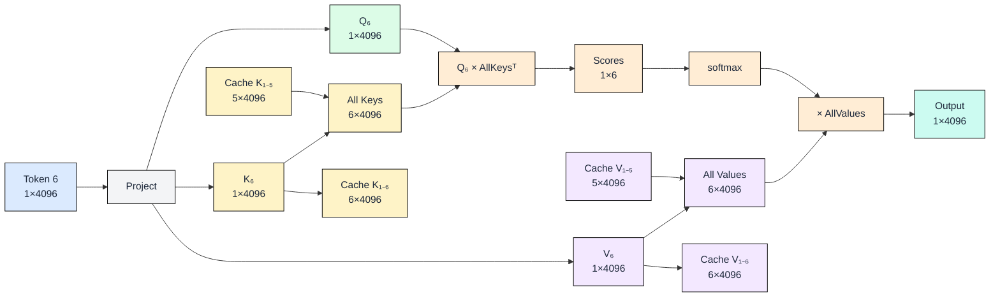

# 0.3 Attention Mechanism and the KV Cache

In Module 0.2, we watched decode slow down as the sequence grew longer. Each new token took more time than the last. This module explains *why*: the attention mechanism must look at every previous token before producing the next one. Then we introduce the KV cache, the optimization that makes this bearable, and calculate exactly what it costs in memory.

We will trace a single running example throughout: the sequence "The cat sat on the" (5 tokens), generating "mat" as token 6.

## What Q, K, V Are

Every token in a transformer passes through three learned linear projections. The hidden state (a 4096-dimensional vector for a 7B model) is multiplied by three separate weight matrices to produce Query (Q), Key (K), and Value (V) vectors.

- **Query**: "What am I looking for?"
- **Key**: "What do I contain?"
- **Value**: "What information do I carry?"

The dot product between a Query and all Keys produces attention scores: how relevant is each previous token to the current one?

Three projections from one vector. The weight matrices are learned during training and remain fixed during inference. Now let us see how these projections work when processing an entire prompt at once.

## Prefill: All Tokens at Once

When the prompt "The cat sat on the" arrives, all 5 tokens are processed simultaneously. Each token gets its own Q, K, and V vector. The attention computation produces a 5×5 score matrix: every token attends to every token that came before it (including itself).

The critical detail: after computing attention, we **store K and V in a cache**. The output gives us the first generated token ("mat"), and the cache holds everything we need to continue generating. But what happens if we do not cache?

## Decode Without Caching: The Problem

Suppose we want to produce token 7 after generating "mat". Without a cache, we must recompute K and V for *all previous tokens* (tokens 1 through 6) just to attend to them. Every single decode step repeats work already done.

The rose-colored nodes represent **wasted computation**: we already computed these K and V vectors during prefill and during earlier decode steps. With N tokens in the sequence, each decode step does O(N) projections. Over a full generation of N tokens, total work becomes O(N²). At sequence length 4096, that means recomputing millions of vectors we already have. This is where the KV cache eliminates the waste.

## Decode With Caching: The Fix

With a KV cache, each decode step only computes Q, K, and V for the **single new token**. The cached K and V from all previous tokens are simply read from memory and concatenated with the new values.

For token 6 ("mat"), the process looks like this:

The score matrix is now 1×6 instead of 6×6. We project one token instead of six. After attention completes, K₆ and V₆ are appended to the cache for the next step. Each decode step does O(1) projection work and O(N) for the dot product with cached keys, reducing total generation from O(N²) projections to O(N) projections. The tradeoff: we exchanged compute for memory. How much memory?

## What the Cache Costs

For each token in the cache, we store one K vector and one V vector **per layer**. In a typical 7B model with 32 layers and 4096-dimensional hidden state (stored in float16, so 2 bytes per element):

**Per token, per layer**: 4096 × 2 bytes × 2 (K and V) = 16 KB

**Per token, all layers**: 16 KB × 32 layers = **512 KB**

| Sequence Length | Cache Size | Context |
|---|---|---|
| 100 tokens | 50 MB | Short prompt |
| 1,000 tokens | 500 MB | Typical conversation |
| 4,096 tokens | 2 GB | Standard context window |
| 32,768 tokens | 16 GB | Long-context model |

At 32K tokens, the KV cache alone consumes 16 GB, which is the entire VRAM of a T4 GPU. The model weights for a 7B model take another 14 GB in float16. This is why long-context inference requires careful memory management, and why techniques like KV cache compression (covered in Chapter 4) become essential at scale.

## FAQ

**Q1: Why not just store the attention scores instead of K and V?**
Attention scores are specific to each query. When a new token arrives, its query vector is different, so it produces entirely new scores against all keys. The keys and values are reusable because they depend only on their own token, not on the query.

**Q2: Does the KV cache grow forever?**
Yes, linearly with sequence length. Every new token adds 512 KB (for a 7B model). This is why models have a maximum context length: it is a memory budget constraint, not a fundamental architectural limit.

**Q3: Is the KV cache stored on GPU or CPU?**
On GPU (HBM) for fast access during attention computation. Some systems offload older cache entries to CPU RAM when GPU memory runs low, but this adds latency from PCIe transfers.

**Q4: Why is the cache per-layer and not shared?**
Each transformer layer learns different attention patterns. Layer 3 might attend to syntactic structure while layer 20 attends to semantic meaning. Sharing would destroy this specialization.

**Q5: Does batching multiply the cache cost?**
Yes. Each request in a batch maintains its own KV cache. Batch size 8 with 4096-token sequences costs 8 × 2 GB = 16 GB of KV cache alone. This is the primary constraint on batch size in production.

## References

1. Vaswani, A. et al. "Attention Is All You Need." NeurIPS 2017. (Original Q, K, V formulation and scaled dot-product attention)
2. Pope, R. et al. "Efficiently Scaling Transformer Inference." MLSys 2023. (KV cache memory analysis and optimization strategies)
3. Shazeer, N. "Fast Transformer Decoding: One Write-Head is All You Need." arXiv 2019. (Multi-Query Attention, first KV cache reduction technique)
4. Kwon, W. et al. "Efficient Memory Management for Large Language Model Serving with PagedAttention." SOSP 2023. (vLLM and paged KV cache management)
