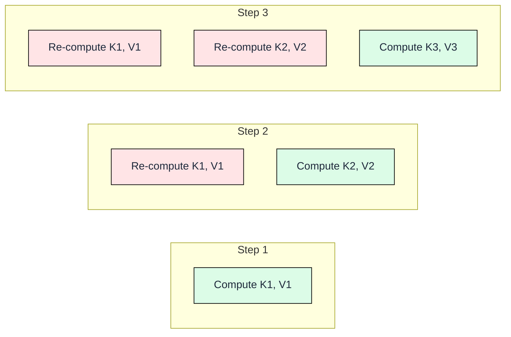
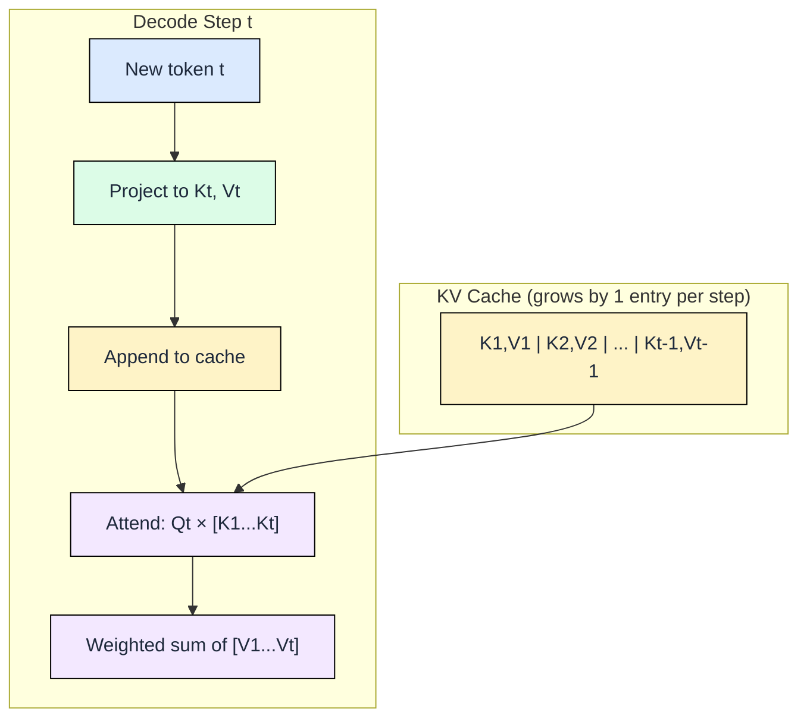

# 0.3 The KV Cache

 

In module 0.2, we observed that naive autoregressive decode gets slower with every token because the model re-processes the entire sequence each step. This module explains why that happens at the attention level and introduces the KV cache as the fix.

## The Problem: Redundant Computation

During attention, each new token must compute a score against every previous token. The scores come from the dot product between the new token's Query vector and the Key vectors of all previous tokens. Without caching, the model re-projects Keys and Values for tokens it already processed in earlier steps.

The waste compounds with sequence length:

- Step 1: compute K1, V1 (1 projection)
- Step 2: re-compute K1, V1, then compute K2, V2 (3 projections, 1 wasted)
- Step 3: re-compute K1, V1, K2, V2, then compute K3, V3 (5 projections, 3 wasted)
- Step N: re-compute all N-1 previous pairs, then compute the new one (2N-1 projections, 2(N-1) wasted)

Total projections across N steps: 1 + 3 + 5 + ... + (2N-1) = N². For a 1000-token response, that is 1,000,000 projection operations when only 1,000 are unique.

The rose-colored boxes are redundant work. By step 100, 99% of projections repeat what earlier steps already computed.

## The Solution: Cache K and V

The fix is straightforward: after computing K and V for a token, store them in a buffer (the KV cache). On the next step, only compute K and V for the single new token, then concatenate the cached vectors for attention scoring.

- Before caching: O(N²) total projections across N decode steps
- After caching: O(N) total projections (exactly one per token, stored permanently)

Each decode step does constant work (one projection) regardless of how long the sequence has become. The attention scoring still reads all cached keys, but reading is cheap compared to re-projecting through weight matrices.

## What the Cache Stores

Per layer and per token, the cache holds one Key vector and one Value vector. The head dimension (the size of each vector) is typically 128 numbers in modern models.

For Mistral-7B with GQA (8 KV heads, 32 layers, head_dim=128, FP16):

**Per token:** 32 layers × 8 heads × 128 dim × 2 bytes × 2 (K+V) = 131,072 bytes = **128 KB**

| Sequence length | KV cache size (one request) |
|---|---|
| 100 tokens | 12.5 MB |
| 1,000 tokens | 125 MB |
| 4,096 tokens | 512 MB |
| 32,768 tokens | 4 GB |

A single 32K-context conversation consumes 4 GB of GPU memory just for its KV cache, separate from the model weights themselves.

## The Tradeoff

The KV cache trades memory for compute. Every cached token eliminates redundant projection work but occupies GPU memory for the entire lifetime of that request. This creates three direct consequences:

1. **Long conversations eat memory.** A 32K-context chat uses 4 GB of cache on a GPU that might only have 24 GB total (after model weights take 14 GB).

2. **Fewer concurrent users.** If each user's cache costs 512 MB at 4K tokens, a 24 GB GPU (with 10 GB free after weights) serves at most 20 concurrent requests.

3. **Cache cannot be shared across requests.** Each conversation has unique tokens, so each needs its own cache allocation.

The cache is not optional. Without it, a 7B-parameter model generating 1000 tokens would perform one trillion redundant multiply-accumulate operations. The memory cost is the price of practical inference speed.

## What Comes Next

Chapter 1 quantifies how GPU memory limits constrain the cache size and batch capacity. Chapter 3 introduces attention variants like GQA that reduce the 128 KB per token cost. Chapter 4 covers PagedAttention, which manages cache memory with virtual-memory-style allocation to eliminate fragmentation.

---

## FAQ

**Q1: Does the KV cache exist during prefill or only during decode?**
The cache is populated during prefill (all input tokens' K and V are computed in one pass and stored) and then extended one entry at a time during decode. Prefill is where the cache gets its initial contents.

**Q2: Why cache K and V but not Q?**
The Query vector is only needed for the current token's attention computation. Previous tokens' Queries are never re-used because attention scores are always computed from the perspective of the newest token looking back at all previous tokens.

**Q3: Is the KV cache stored in GPU VRAM or CPU RAM?**
In standard inference, the cache lives in GPU VRAM for fast access during attention. Some systems offload older cache entries to CPU RAM when GPU memory is scarce, at the cost of transfer latency.

**Q4: Does the cache grow indefinitely?**
The cache grows until the request finishes or hits the model's maximum context length. At that point, the entire cache for that request is freed. Some systems use sliding-window attention to bound cache size at the cost of forgetting distant tokens.

**Q5: If the cache saves so much compute, why is decode still slow?**
Even with caching, each decode step performs a memory-bound operation: reading all cached K vectors to compute attention scores. The bottleneck shifts from redundant computation to memory bandwidth. Module 0.2 showed this as the fundamental decode bottleneck.

---

## References

1. Vaswani, A. et al. "Attention Is All You Need." NeurIPS 2017. (Original transformer, establishes K/V/Q projection)
2. Pope, R. et al. "Efficiently Scaling Transformer Inference." MLSys 2023. (KV cache memory analysis at scale)
3. Shazeer, N. "Fast Transformer Decoding: One Write-Head is All You Need." arXiv 2019. (Multi-Query Attention, motivates cache reduction)
4. Radford, A. et al. "Language Models are Unsupervised Multitask Learners." OpenAI 2019. (GPT-2, early autoregressive caching implementation)
