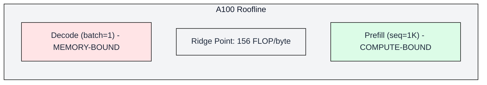
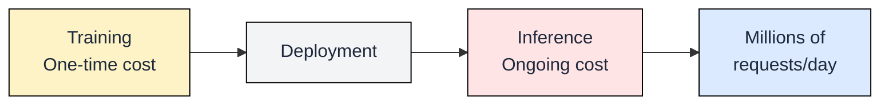

[](https://colab.research.google.com/github/harshuljain13/llm-inference-at-scale/blob/master/content/00_transformer_at_inference_time/00.4_why_llm_inference_is_different/lab.ipynb) [](https://molab.marimo.io/github/harshuljain13/llm-inference-at-scale/blob/master/content/00_transformer_at_inference_time/00.4_why_llm_inference_is_different/lab.ipynb)

# 0.4 Why LLM Inference is Different

You now know how LLM inference works: the transformer architecture (0.1), the prefill/decode loop with its metrics (0.2), and the KV cache that grows with every token (0.3). This module answers the question those mechanics raise: why is this fundamentally harder and more expensive than any other ML workload?

## Traditional ML vs LLM Inference

Most ML models in production are simple: a request arrives, the model runs one forward pass, and a result returns in milliseconds. Image classifiers, fraud detectors, recommendation rankers all follow this pattern. LLM inference breaks every assumption these systems rely on.


*Traditional ML: one request in, one forward pass, one result out. Fixed time, fixed memory.*


*LLM inference: one prefill, then N decode steps. Memory grows, latency is variable.*

| Aspect | Traditional ML | LLM Inference |
|--------|---------------|---------------|
| Latency | Fixed (5-20ms) | Variable (100ms-10s) |
| Memory | Constant per request | Grows during request (KV cache) |
| Compute | One forward pass | N forward passes (one per token) |
| Cost | ~$0.001/request | $0.01-0.10/request |
| Batching | Simple (same-shape inputs) | Complex (different sequence lengths) |

The variable-length nature is the core difficulty. A traditional model processes a batch of identically-shaped tensors in one shot. An LLM generates tokens one at a time, each request at a different stage of completion, each consuming a different amount of KV cache memory. This makes scheduling, batching, and memory management orders of magnitude harder.

## The Bandwidth Wall

Every decode step must read the entire model from memory. No software trick changes this: you cannot generate a token without touching every parameter. The minimum time per token is:

```
minimum_decode_time = model_size_bytes / memory_bandwidth
```

For a 7B parameter model in FP16 on an A100 (2 TB/s bandwidth):

```
14.5 GB / 2,000 GB/s = 7.25 ms per token
```

That is the floor. You cannot go faster without either shrinking the model (quantization, Ch05) or increasing bandwidth (better hardware, Ch01). Every other optimization in this book works within or around this constraint.


*Decode sits in the memory-bound region. No amount of compute helps.*

The roofline model visualizes this: decode sits firmly in the memory-bound region (left side), where performance is limited by how fast you can read weights, not how fast you can multiply. Ch01 explores the GPU memory hierarchy and roofline analysis in depth.

## The Cost Reality

Training happens once. Inference runs millions of times per day, indefinitely.

Training a GPT-4 class model costs roughly $100M in compute. Serving it costs millions per month, and that cost never stops. Within months of deployment, cumulative inference spend exceeds total training cost. At scale, inference dominates the economics of any LLM application.



This is why the rest of this book exists. Every technique from Ch03 through Ch11, whether it is FlashAttention, KV cache compression, quantization, or continuous batching, targets one goal: reducing the per-token cost of inference while maintaining quality and latency.

## What the Rest of This Book Covers

Each subsequent chapter attacks a specific dimension of the inference cost problem:

- **Ch01 GPU Hardware**: Understanding the memory hierarchy and bandwidth constraints that set the performance floor.
- **Ch02 Sizing and Serving**: Calculating exactly how much VRAM a model needs and how batch size affects throughput.
- **Ch03 Attention Variants**: MHA, GQA, MLA, and FlashAttention, reducing the compute and memory cost of attention.
- **Ch04 KV Cache Engineering**: Compression, eviction, and caching strategies to manage the memory that grows with every token.
- **Ch05 Quantization**: Shrinking model weights to move more parameters per memory read.
- **Ch06 Serving Engines**: vLLM, SGLang, TensorRT-LLM, the systems that orchestrate all these optimizations together.
- **Ch07-Ch11 Production**: Scaling, orchestration, monitoring, and cost optimization at fleet scale.

You now have the complete conceptual foundation. Starting with Ch01, we shift from understanding the problem to solving it.

---

## FAQ

**Is LLM inference always expensive?**
Not necessarily. Small models (1-3B parameters) on quantized weights can run on consumer GPUs at low cost. The expense scales with model size, context length, and request volume. A personal chatbot costs pennies per day; a production API serving millions of users costs millions per month.

**Can I just use a smaller model?**
Often yes, and you should. A 7B model fine-tuned for your task frequently outperforms a general 70B model on that specific task, at 10x lower serving cost. Model selection is the single highest-leverage optimization decision.

**Why not just buy bigger GPUs?**
Bigger GPUs help (more bandwidth, more VRAM), but the fundamental memory-bound nature remains. An H100 with 3.35 TB/s bandwidth is only 1.7x faster than an A100 at 2 TB/s for decode. You cannot buy your way out of the bandwidth wall; you need algorithmic and systems-level optimizations.

**How much does it cost to serve Llama 70B?**
On cloud GPUs (2x A100 80GB), roughly $3-5/hour for the instances alone. At 30 tokens/second throughput with continuous batching, that translates to approximately $0.02-0.05 per 1000 output tokens. Quantization to INT4 can halve the hardware requirement and cost.

**Will inference get cheaper over time?**
Yes, through three vectors: better hardware (each GPU generation adds ~2x bandwidth), better algorithms (speculative decoding, better attention), and better models (architectures designed for efficient inference). Costs have dropped roughly 10x per year since 2023.

---

## References

1. Patterson, D. et al. "Carbon Emissions and Large Neural Network Training." arXiv:2104.10350 (2021).
2. Pope, R. et al. "Efficiently Scaling Transformer Inference." MLSys (2023).
3. Kwon, W. et al. "Efficient Memory Management for Large Language Model Serving with PagedAttention." SOSP (2023).
4. Williams, S. et al. "Roofline: An Insightful Visual Performance Model for Multicore Architectures." CACM (2009).
5. Dao, T. et al. "FlashAttention: Fast and Memory-Efficient Exact Attention with IO-Awareness." NeurIPS (2022).
