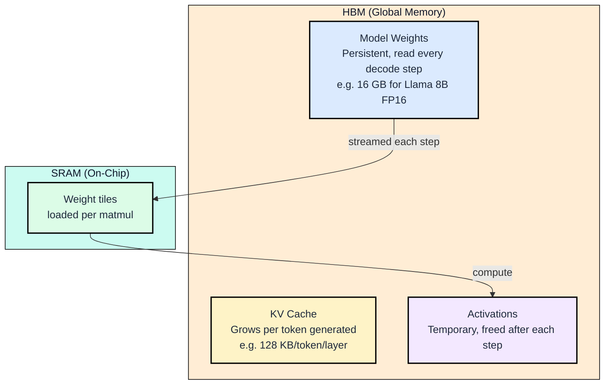
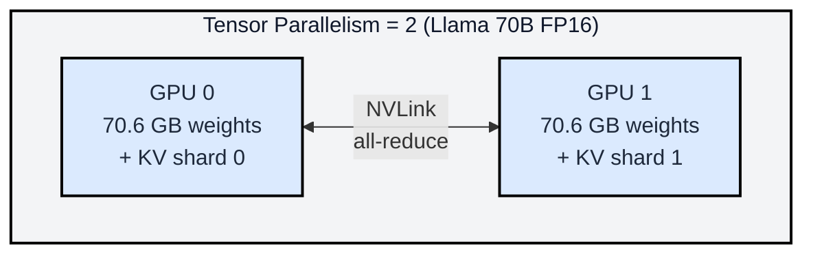

# 1.1 GPU Memory Hierarchy

Modern GPUs contain a hierarchy of memory subsystems, each with different capacity, bandwidth, and latency characteristics. Understanding this hierarchy is essential for LLM inference because the placement of model weights, activations, and KV cache entries across these levels determines throughput. This module derives VRAM requirements from first principles and provides worked examples for production model sizing.

---

## GPU Memory Hierarchy

A GPU organizes memory into four distinct levels. Each level trades capacity for bandwidth: the fastest memories are the smallest, and the largest memories are the slowest.

```mermaid
block-beta
    columns 1
    block:GPU["GPU Memory Hierarchy (A100)"]
        REG["Registers | 256 KB/SM | ~19 TB/s | 1 cycle"]
        SRAM["Shared Memory / L1 | 192 KB/SM | ~19 TB/s | ~28 cycles"]
        L2["L2 Cache | 40 MB | ~5 TB/s | ~200 cycles"]
        HBM["HBM2e | 80 GB | 2.0 TB/s | ~400 cycles"]
    end

    style REG fill:#dcfce7,stroke:#000,stroke-width:2px,color:#1e293b
    style SRAM fill:#dbeafe,stroke:#000,stroke-width:2px,color:#1e293b
    style L2 fill:#f3e8ff,stroke:#000,stroke-width:2px,color:#1e293b
    style HBM fill:#ffedd5,stroke:#000,stroke-width:2px,color:#1e293b
    style GPU fill:#f3f4f6,stroke:#000,stroke-width:2px,color:#0f172a
```



During inference, model weights and KV cache reside in HBM. FlashAttention (Chapter 2.4) works by restructuring computation to keep intermediate results in shared memory, avoiding repeated round-trips to HBM.

### Register File

Registers are the fastest storage on the GPU. Each streaming multiprocessor (SM) contains a register file that feeds operands directly to the arithmetic units with zero additional latency.

| GPU | Registers per SM | Total Register File | Bandwidth |
|-----|-----------------|--------------------:|----------:|
| A100 | 65,536 (32-bit) | 256 KB per SM | ~19 TB/s per SM |
| H100 | 65,536 (32-bit) | 256 KB per SM | ~34 TB/s per SM |
| B200 | 65,536 (32-bit) | 256 KB per SM | ~40 TB/s per SM |

Registers hold the intermediate values during matrix multiply-accumulate operations. During a GEMM (general matrix multiplication), tile fragments reside in registers while the SM computes partial products. The register file is not programmer-addressable for persistent storage; the compiler assigns registers automatically.

### Shared Memory (SRAM)

Shared memory is an on-chip scratchpad that all threads within a thread block can access. It sits physically adjacent to the SM and provides bandwidth roughly 10x higher than HBM. The critical property of shared memory is that programmers explicitly control what data resides there.

| GPU | Shared Memory per SM | Total On-Chip SRAM | Bandwidth |
|-----|--------------------:|-----------------:|----------:|
| A100 | up to 164 KB | 20 MB (108 SMs) | ~19 TB/s aggregate |
| H100 | up to 228 KB | 33 MB (132 SMs) | ~33 TB/s aggregate |
| B200 | up to 228 KB | 36 MB (144 SMs) | ~40 TB/s aggregate |

FlashAttention exploits shared memory by tiling the attention computation so that Q, K, V blocks fit entirely in SRAM. Without this tiling, naive attention must read and write the full N x N attention matrix to HBM, consuming bandwidth that limits throughput. With tiling, the attention matrix never materializes in HBM at all.

### L2 Cache

The L2 cache is a hardware-managed cache that sits between the SMs and HBM. Unlike shared memory, programmers do not explicitly control L2 contents; the hardware eviction policy determines what stays cached.

| GPU | L2 Cache Size | Bandwidth |
|-----|-------------:|----------:|
| A100 | 40 MB | ~5 TB/s |
| H100 | 50 MB | ~12 TB/s |
| B200 | 64 MB | ~14 TB/s |

For LLM inference, the L2 cache helps when the same weight tensor is accessed by multiple thread blocks in quick succession. However, model weights for large LLMs far exceed L2 capacity (a 7B parameter model in FP16 occupies 14 GB, roughly 350x the L2 size), so weight data streams through L2 without meaningful reuse during decode.

### High Bandwidth Memory (HBM)

HBM is the main GPU memory, the VRAM reported by nvidia-smi. It uses stacked DRAM dies connected to the GPU via a wide interface (typically 4096 or 5120 bits). HBM provides the capacity needed to hold model weights and KV caches, but at bandwidth far below on-chip memories.

| GPU | HBM Generation | Capacity | Bandwidth | Interface Width |
|-----|---------------|--------:|---------:|----------------:|
| A100 SXM | HBM2e | 80 GB | 2.0 TB/s | 5120-bit |
| H100 SXM | HBM3 | 80 GB | 3.35 TB/s | 5120-bit |
| H200 SXM | HBM3e | 141 GB | 4.8 TB/s | 5120-bit |
| B200 SXM | HBM3e | 192 GB | 8.0 TB/s | 8192-bit |

These bandwidth numbers define the theoretical maximum tokens per second during decode. Since decode requires reading all model weights for each generated token, the time to generate one token is at minimum:

```
t_decode >= model_size_bytes / hbm_bandwidth
```

For a 70B model in FP16 (140 GB) on H100:

```
t_decode >= 140 GB / 3.35 TB/s = 41.8 ms per token = 23.9 tokens/second
```

This is the memory bandwidth wall. No amount of compute optimization can push single-batch decode below this floor.

### Summary of the Hierarchy

```
Level          Capacity    Bandwidth     Latency      Programmer Control
---------------------------------------------------------------------------
Registers      256 KB/SM   ~19-40 TB/s   0 cycles     Compiler-managed
Shared Memory  164-228 KB  ~19-40 TB/s   ~20 cycles   Explicit (programmer)
L2 Cache       40-64 MB    ~5-14 TB/s    ~200 cycles  Hardware-managed
HBM            80-192 GB   2.0-8.0 TB/s  ~400 cycles  Explicit (allocate/free)
```

The 1000x bandwidth gap between registers and HBM explains why data movement, not arithmetic, dominates LLM inference cost. The GPU can perform 312 TFLOPS of FP16 computation on A100, but can only feed data from HBM at 2 TB/s. For workloads with low arithmetic intensity (few FLOPs per byte read), the compute units sit idle waiting for data.

---

## Where Model Weights Live During Inference

During inference, the entire model must reside in HBM (or be distributed across multiple GPUs' HBM). The inference engine loads the model at startup and the weights persist in HBM for the lifetime of the serving process.



Each decode step streams the full weight tensor from HBM through SRAM for computation. The weights are never modified, only read. This read-every-step pattern is why memory bandwidth (not capacity) is the bottleneck for decode.

The memory consumed by weights depends on two factors: parameter count and numerical precision.

### Weight Memory Formula

```
weight_memory = num_parameters * bytes_per_parameter
```

Standard precisions and their per-parameter costs:

| Precision | Bytes per Parameter | Bits | Use Case |
|-----------|-------------------:|-----:|----------|
| FP32 | 4 | 32 | Training (rarely inference) |
| FP16 / BF16 | 2 | 16 | Default inference precision |
| INT8 (W8A8) | 1 | 8 | Post-training quantization |
| INT4 (W4A16) | 0.5 | 4 | Aggressive quantization (GPTQ, AWQ) |
| FP8 (E4M3) | 1 | 8 | H100/B200 native format |

### Weight Memory for Common Models

| Model | Parameters | FP16 | INT8 | INT4 |
|-------|----------:|------:|-----:|-----:|
| Llama 3.1 8B | 8.03B | 16.06 GB | 8.03 GB | 4.02 GB |
| Llama 3.1 70B | 70.6B | 141.2 GB | 70.6 GB | 35.3 GB |
| Llama 3.1 405B | 405B | 810 GB | 405 GB | 202.5 GB |
| Mixtral 8x7B | 46.7B | 93.4 GB | 46.7 GB | 23.4 GB |
| DeepSeek-V3 | 671B | 1,342 GB | 671 GB | 335.5 GB |

These numbers represent weights alone. The total VRAM requirement is substantially higher once KV cache, activations, and framework overhead are included.

### Multi-GPU Weight Distribution

When a model exceeds single-GPU capacity, tensor parallelism splits weight matrices across GPUs. Each GPU holds 1/N of the weight tensors and performs 1/N of the computation, with all-reduce operations synchronizing results.



For Llama 70B in FP16 (141.2 GB weights):
- 1x H100 80GB: does not fit
- 2x H100 80GB: 70.6 GB per GPU (fits with room for KV cache)
- 4x A100 80GB: 35.3 GB per GPU (comfortable margin)
- 1x H200 141GB: fits on a single GPU

The choice of parallelism degree involves a tradeoff: more GPUs reduce per-GPU memory pressure but introduce communication overhead from all-reduce operations over NVLink or InfiniBand.

---

