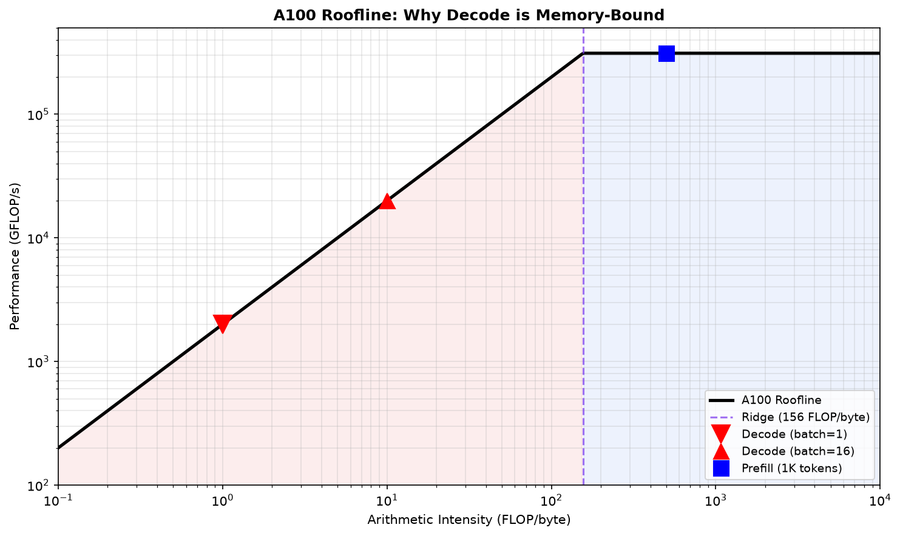
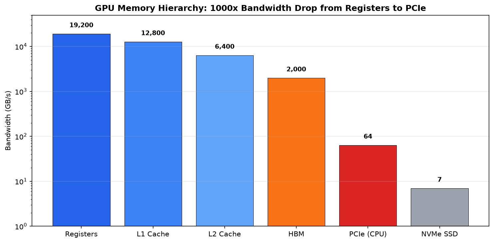
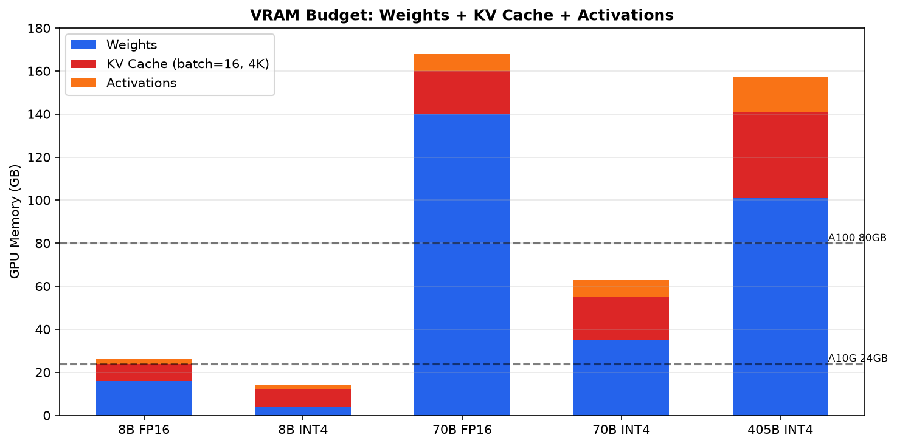
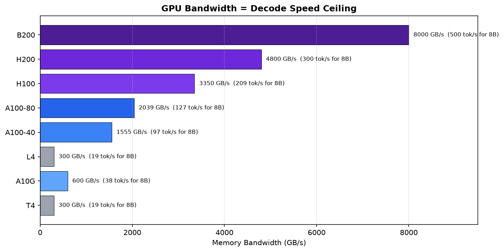

# 1.1 GPU Memory Architecture

> The roofline model is the single most useful mental tool for LLM inference engineering. Once you internalize it, you'll never again wonder "why is my GPU at 30% utilization but inference is slow?"

---

## Learning Objectives

By the end of this module, you will:

- Apply roofline thinking to instantly identify whether a workload is compute-bound or memory-bound
- Understand the GPU memory hierarchy at a level where you can explain why FlashAttention works
- Calculate VRAM requirements from first principles—and know when the formulas lie
- Make informed AWS instance selection decisions based on bandwidth, not just VRAM
- Understand why "GPU utilization" is a misleading metric for LLM inference

---

## The Insight That Changes Everything

Here's what most engineers get wrong about GPU performance:

**They look at GPU utilization and think "30% utilization = 70% headroom."**

This is wrong. For LLM decode, 30% utilization might mean you're already at the theoretical maximum.

The reason: **LLM decode is memory-bandwidth-bound, not compute-bound.** The GPU's compute units are idle because they're waiting for data to arrive from memory. Adding more compute won't help—you need more memory bandwidth.

This reveals a critical misunderstanding in how engineers interpret metrics: GPU utilization measures compute utilization, not memory bandwidth utilization. For memory-bound workloads, low GPU utilization is expected and correct. The metric you should watch is memory bandwidth utilization, but NVIDIA doesn't expose this directly in nvidia-smi.

---

## The Roofline Model: Your New Best Friend

The roofline model is a visual way to understand performance limits. It answers: "Given my hardware, what's the maximum performance I can achieve for this workload?"

### The Two Ceilings

Every workload hits one of two ceilings:

1. **Compute ceiling**: How fast the GPU can do math (FLOPS)
2. **Memory ceiling**: How fast the GPU can read/write data (bytes/second)

The roofline model plots these two ceilings on a log-log chart. Every workload lands somewhere on this chart based on its arithmetic intensity (how much math it does per byte of memory it reads). Workloads to the left of the "ridge point" are memory-bound; workloads to the right are compute-bound.



The critical insight for LLM inference: **decode (batch=1) sits at arithmetic intensity ~1**, deep in the memory-bound region. Even with the world's fastest GPU, decode speed is limited by how fast you can read weights from HBM. Prefill, by contrast, sits in the compute-bound region because it processes many tokens in parallel.

### The Ridge Point: Where Everything Changes

The **ridge point** is where the two ceilings meet:

```
Ridge Point = Peak Compute / Memory Bandwidth

A100 80GB:
  Peak FP16 Compute: 312 TFLOPS
  Memory Bandwidth: 2 TB/s
  Ridge Point: 312 TFLOPS / 2 TB/s = 156 FLOPs/byte

H100 SXM:
  Peak FP16 Compute: 990 TFLOPS
  Memory Bandwidth: 3.35 TB/s
  Ridge Point: 990 TFLOPS / 3.35 TB/s = 296 FLOPs/byte
```

The ridge point tells you the minimum arithmetic intensity needed to be compute-bound. If your workload does fewer than 156 FLOPs per byte of memory accessed on A100, you're memory-bound. Period.

### Arithmetic Intensity: The Key Metric

**Arithmetic intensity** = FLOPs / Bytes transferred

This single number tells you which ceiling you'll hit:

```
If arithmetic_intensity < ridge_point:
    You're memory-bound. More compute won't help.

If arithmetic_intensity > ridge_point:
    You're compute-bound. More bandwidth won't help.
```

Let's calculate arithmetic intensity for LLM inference:

```python
# Llama 3.1 8B decode (batch=1, generating 1 token)

# FLOPs per token (approximate)
# Each layer: attention + MLP
# Attention: 4 * hidden² (Q, K, V, O projections) + attention computation
# MLP: 3 * hidden * intermediate (gate, up, down)

hidden = 4096
intermediate = 14336
layers = 32

flops_attention = 4 * hidden * hidden  # ~67M per layer
flops_mlp = 3 * hidden * intermediate  # ~176M per layer
flops_per_layer = flops_attention + flops_mlp  # ~243M
total_flops = flops_per_layer * layers * 2  # ×2 for multiply-add
# ≈ 15.6 billion FLOPs

# Bytes transferred (must read all weights)
model_bytes = 8e9 * 2  # 8B params × 2 bytes (FP16) = 16 GB

# Arithmetic intensity
intensity = total_flops / model_bytes
# = 15.6B / 16B = 0.975 FLOPs/byte

# Compare to ridge point
ridge_point_a100 = 156  # FLOPs/byte

print(f"Decode arithmetic intensity: {intensity:.2f} FLOPs/byte")
print(f"A100 ridge point: {ridge_point_a100} FLOPs/byte")
print(f"Ratio: {intensity/ridge_point_a100:.1%}")
# Decode is at 0.6% of the ridge point!
```

The numbers make the situation stark: LLM decode has arithmetic intensity of roughly 1 FLOP/byte, while the ridge point sits at approximately 150 FLOPs/byte. Decode operates 150× below the ridge point. This is why decode is so severely memory-bound; you're nowhere near utilizing the GPU's compute capacity.

### Prefill vs Decode on the Roofline

```
Performance
(TFLOPS)
    │
312 ┤─────────────────────────────────────── Compute Ceiling
    │                              ╱
    │                            ╱
    │                          ╱   ★ Prefill (seq=1000)
    │                        ╱       AI ≈ 1000 FLOPs/byte
    │                      ╱         (compute-bound)
    │                    ╱
    │                  ╱
    │                ╱
    │              ╱
    │            ╱
    │          ╱
    │        ╱
    │      ╱
    │    ╱
    │  ╱  ★ Decode (batch=1)
    │╱      AI ≈ 1 FLOP/byte
    └──────────────────────────────────────────────────────────
         1        10       100      156     1000
                  Arithmetic Intensity (FLOPs/byte)
```

What the chart makes visually obvious is that prefill and decode live in completely different regions of the roofline. Prefill (with long sequences) is compute-bound. Decode is memory-bound. This is why they need different optimization strategies, and increasingly, different hardware.

### Batching Moves You Up the Roofline

Here's the key insight about batching:

```
Batch=1:  Read 16 GB weights, do 16B FLOPs  → AI = 1 FLOP/byte
Batch=8:  Read 16 GB weights, do 128B FLOPs → AI = 8 FLOPs/byte
Batch=32: Read 16 GB weights, do 512B FLOPs → AI = 32 FLOPs/byte
Batch=128: Read 16 GB weights, do 2T FLOPs  → AI = 128 FLOPs/byte
```

**Batching amortizes the weight reads across multiple sequences.** You read the weights once but do N× the compute.

```
Performance
(TFLOPS)
    │
312 ┤─────────────────────────────────────── Compute Ceiling
    │                              ╱
    │                            ╱
    │                          ╱
    │                        ╱   ★ Batch=256 (AI=256)
    │                      ╱       Finally compute-bound!
    │                    ╱
    │                  ╱   ★ Batch=128 (AI=128)
    │                ╱       Still memory-bound
    │              ╱
    │            ╱   ★ Batch=32 (AI=32)
    │          ╱
    │        ╱   ★ Batch=8 (AI=8)
    │      ╱
    │    ╱
    │  ╱  ★ Batch=1 (AI=1)
    │╱
    └──────────────────────────────────────────────────────────
         1        10       100      156     1000
```

Following this progression, you need batch size ~156 to become compute-bound on A100. But here's the catch: KV cache grows with batch size. At batch=156 with 4K context, you need 156 × 512 MB = 80 GB just for KV cache. That's the entire A100 80GB!

**This is the fundamental constraint of LLM inference: you can never batch enough to become compute-bound because KV cache eats all your memory first.**

---

## GPU Memory Hierarchy: Why It Matters

Understanding the memory hierarchy explains why FlashAttention works and why naive attention implementations are slow. The GPU has multiple levels of memory, each trading capacity for speed. The bandwidth drops by orders of magnitude as you move from registers to HBM to CPU memory:



### The Hierarchy

```
┌─────────────────────────────────────────────────────────────────────┐
│                      GPU MEMORY HIERARCHY                           │
├─────────────────────────────────────────────────────────────────────┤
│                                                                     │
│   Level          Size           Bandwidth      Latency              │
│   ─────────────────────────────────────────────────────────────    │
│   Registers      256 KB/SM      ~20 TB/s       ~1 cycle             │
│   L1/Shared      192 KB/SM      ~19 TB/s       ~30 cycles           │
│   L2 Cache       40-50 MB       ~5 TB/s        ~200 cycles          │
│   HBM (VRAM)     40-80 GB       2-3.35 TB/s    ~400 cycles          │
│                                                                     │
│   The gap between L2 and HBM is where performance dies.             │
│                                                                     │
└─────────────────────────────────────────────────────────────────────┘
```

The critical takeaway from this hierarchy is the 10× bandwidth gap between L2 cache and HBM. If your working set fits in L2 (50 MB), you get 5 TB/s. If it spills to HBM, you drop to 2 TB/s. This 2.5× difference is why kernel optimization matters so much.

### Why FlashAttention Works: An L2 Cache Story

Standard attention computes the full N×N attention matrix:

```python
# Standard attention (simplified)
Q, K, V = project(x)  # Each is [batch, heads, seq, dim]

# This creates an N×N matrix in HBM!
attention_scores = Q @ K.transpose(-2, -1)  # [batch, heads, seq, seq]
attention_probs = softmax(attention_scores)
output = attention_probs @ V

# For seq_len=4096, heads=32:
# attention_scores size = 32 × 4096 × 4096 × 2 bytes = 1 GB
# This doesn't fit in L2 cache (50 MB)!
```

**The problem:** The N×N attention matrix is huge and must be written to HBM, then read back for softmax, then read again for the V multiplication. Three HBM round-trips for one attention layer.

**FlashAttention's insight:** Never materialize the full N×N matrix. Process attention in tiles that fit in shared memory (L1).

```python
# FlashAttention (conceptual)
# Process in tiles of size B (e.g., 64 tokens)

for q_tile in tiles(Q):           # Iterate over query tiles
    for kv_tile in tiles(K, V):   # Iterate over KV tiles
        # Compute partial attention in shared memory
        # Tile size chosen to fit in L1 (~192 KB)
        partial_scores = q_tile @ kv_tile.T  # Fits in L1!
        # Accumulate with online softmax
        update_output_accumulator(partial_scores, v_tile)
```

This is the core of why FlashAttention achieves 2-4× speedup: not because it does less compute, but because it does the same compute with 10× less HBM traffic. It trades extra compute (recomputing softmax normalization) for reduced memory bandwidth. This is a good trade because we're memory-bound.

### The Numbers That Prove It

```
Standard Attention (seq=4096, hidden=4096, heads=32):
  HBM reads:  Q, K, V = 3 × 4096 × 4096 × 2 = 100 MB
  HBM writes: attention_scores = 32 × 4096 × 4096 × 2 = 1 GB
  HBM reads:  attention_scores (for softmax) = 1 GB
  HBM writes: attention_probs = 1 GB
  HBM reads:  attention_probs (for V multiply) = 1 GB
  Total HBM traffic: ~4.1 GB

FlashAttention:
  HBM reads:  Q, K, V = 100 MB (same)
  HBM writes: output = 32 MB
  Total HBM traffic: ~132 MB

Reduction: 4.1 GB → 132 MB = 31× less HBM traffic!
```

The numbers confirm the design: FlashAttention reduces HBM traffic by 30×, which translates to a 2-4× speedup. The speedup is less than 30× because there's overhead from the tiling and online softmax computation. But for memory-bound attention, this is a massive win.

---

## VRAM Budgeting: The Real Formula

The chart below shows exactly how VRAM is consumed for different model configurations. Notice how KV cache (red) becomes the dominant consumer at high batch sizes, and how quantization (INT4) dramatically reduces the weights component but doesn't touch the KV cache.



Everyone knows the basic formula:

```
VRAM = Model Weights + KV Cache + Activations + Overhead
```

But the devil is in the details. Let's get precise.

### Model Weights

```python
def model_weight_bytes(params_billions: float, dtype: str) -> int:
    """Calculate model weight memory."""
    dtype_bytes = {
        "fp32": 4,
        "fp16": 2,
        "bf16": 2,
        "fp8": 1,
        "int8": 1,
        "int4": 0.5,
    }
    return int(params_billions * 1e9 * dtype_bytes[dtype])

# Examples:
# Llama 8B FP16:  8B × 2 = 16 GB
# Llama 8B INT4:  8B × 0.5 = 4 GB
# Llama 70B FP16: 70B × 2 = 140 GB
# Llama 70B INT4: 70B × 0.5 = 35 GB
```

A subtle but important point: INT4 quantization gives you 4× memory reduction for weights, but the KV cache is usually still FP16. A "4-bit model" doesn't mean 4× less total VRAM because the KV cache often dominates at high batch sizes.

### KV Cache: Where the Formula Gets Tricky

The standard formula:

```
KV_cache = 2 × layers × kv_heads × head_dim × seq_len × batch × dtype_bytes
```

Let's verify with Llama 3.1 8B:

```python
# Llama 3.1 8B KV cache
layers = 32
kv_heads = 8  # GQA with 8 KV heads
head_dim = 128
seq_len = 4096
batch = 1
dtype_bytes = 2  # FP16

kv_cache = 2 * layers * kv_heads * head_dim * seq_len * batch * dtype_bytes
# = 2 × 32 × 8 × 128 × 4096 × 1 × 2
# = 536,870,912 bytes = 512 MB per sequence
```

**But here's what the formula doesn't tell you:**

**Trap #1: PagedAttention block overhead**

vLLM allocates KV cache in blocks (default: 16 tokens). If your sequence is 4097 tokens, you allocate 4112 tokens worth of cache.

```python
block_size = 16
actual_seq = 4097
allocated_tokens = ((actual_seq + block_size - 1) // block_size) * block_size
# = 4112 tokens (15 tokens wasted)

# Overhead: 15/4097 = 0.4% for long sequences
# But for short sequences (e.g., 17 tokens → 32 allocated):
# Overhead: 15/17 = 88%!
```

The practical consequence is that PagedAttention overhead is negligible for long sequences but can nearly double memory usage for short sequences. If you're serving many short requests, this matters.

**Trap #2: KV cache is FP16 even with INT4 weights**

Most quantized deployments use FP16 KV cache because quantizing KV hurts quality more than quantizing weights. Your "4-bit model" has 16-bit KV cache.

```python
# "4-bit" Llama 8B at batch=64, seq=4096:
model_weights = 8e9 * 0.5  # 4 GB (INT4)
kv_cache = 2 * 32 * 8 * 128 * 4096 * 64 * 2  # 32 GB (FP16!)

# KV cache is 8× larger than the model!
```

**Trap #3: Speculative decoding multiplies KV cache**

If you're verifying 4 draft tokens at once, you need KV cache space for all 4 potential continuations.

```python
# With speculative decoding (k=4 draft tokens):
# You need to store KV for positions [n], [n+1], [n+2], [n+3], [n+4]
# That's 5× the single-token KV cache growth per step
```

**Trap #4: Prefix caching shares memory (in your favor)**

If 10 requests share the same system prompt, vLLM stores one copy of that prefix's KV cache.

```python
# 10 requests, each with 1000-token system prompt + 3000-token conversation
# Without prefix caching: 10 × 4000 tokens of KV cache
# With prefix caching: 1 × 1000 (shared) + 10 × 3000 (unique)
# Savings: 9000 tokens = 9 MB per request for Llama 8B
```

### Activations: The Hidden Memory Consumer

During the forward pass, intermediate tensors consume memory:

```python
# Per-layer activation memory (approximate)
# Assuming batch=1, seq=4096, hidden=4096

# After each operation, we have tensors in flight:
hidden_states = batch * seq * hidden * 2  # 32 MB
attention_output = batch * seq * hidden * 2  # 32 MB
mlp_intermediate = batch * seq * intermediate * 2  # 117 MB (14336 intermediate)

# Peak activation memory per layer: ~150-200 MB
# But with careful memory management, only ~50-100 MB sustained
```

In practice, activation memory is roughly 5-10% of model size for inference. Training needs much more (for gradients), but inference can reuse buffers across layers.

### The Complete VRAM Calculator

```python
def calculate_vram(
    params_b: float,
    layers: int,
    kv_heads: int,
    head_dim: int,
    batch_size: int,
    seq_length: int,
    weight_dtype: str = "fp16",
    kv_dtype: str = "fp16",
) -> dict:
    """
    Calculate VRAM requirements with all the gotchas.
    """
    # Weight dtype bytes
    weight_bytes = {"fp32": 4, "fp16": 2, "bf16": 2, "fp8": 1, "int8": 1, "int4": 0.5}
    kv_bytes = {"fp32": 4, "fp16": 2, "bf16": 2, "fp8": 1}

    # Model weights
    model_gb = (params_b * 1e9 * weight_bytes[weight_dtype]) / 1e9

    # KV cache (with 5% PagedAttention overhead estimate)
    kv_raw = 2 * layers * kv_heads * head_dim * seq_length * batch_size * kv_bytes[kv_dtype]
    kv_with_overhead = kv_raw * 1.05
    kv_gb = kv_with_overhead / 1e9

    # Activations (~10% of model for inference)
    activation_gb = model_gb * 0.10

    # CUDA context + allocator overhead
    cuda_overhead_gb = 0.5 + (0.1 * batch_size)  # Base + per-batch

    # Total
    total_gb = model_gb + kv_gb + activation_gb + cuda_overhead_gb

    return {
        "model_weights_gb": round(model_gb, 2),
        "kv_cache_gb": round(kv_gb, 2),
        "activations_gb": round(activation_gb, 2),
        "cuda_overhead_gb": round(cuda_overhead_gb, 2),
        "total_gb": round(total_gb, 2),
        "kv_per_sequence_mb": round(kv_raw / batch_size / 1e6, 2),
    }

# Example calculations
configs = [
    ("Llama 8B, batch=1, seq=4K, FP16", 8, 32, 8, 128, 1, 4096, "fp16"),
    ("Llama 8B, batch=32, seq=4K, FP16", 8, 32, 8, 128, 32, 4096, "fp16"),
    ("Llama 8B, batch=32, seq=4K, INT4", 8, 32, 8, 128, 32, 4096, "int4"),
    ("Llama 70B, batch=1, seq=4K, FP16", 70, 80, 8, 128, 1, 4096, "fp16"),
    ("Llama 70B, batch=8, seq=4K, INT4", 70, 80, 8, 128, 8, 4096, "int4"),
]

for name, params, layers, kv_heads, head_dim, batch, seq, dtype in configs:
    result = calculate_vram(params, layers, kv_heads, head_dim, batch, seq, dtype)
    print(f"{name}:")
    print(f"  Model: {result['model_weights_gb']} GB")
    print(f"  KV Cache: {result['kv_cache_gb']} GB ({result['kv_per_sequence_mb']} MB/seq)")
    print(f"  Total: {result['total_gb']} GB")
    print()
```

**Output:**

```
Llama 8B, batch=1, seq=4K, FP16:
  Model: 16.0 GB
  KV Cache: 0.54 GB (512.0 MB/seq)
  Total: 18.64 GB

Llama 8B, batch=32, seq=4K, FP16:
  Model: 16.0 GB
  KV Cache: 17.2 GB (512.0 MB/seq)
  Total: 38.5 GB

Llama 8B, batch=32, seq=4K, INT4:
  Model: 4.0 GB
  KV Cache: 17.2 GB (512.0 MB/seq)  ← Still FP16!
  Total: 25.3 GB

Llama 70B, batch=1, seq=4K, FP16:
  Model: 140.0 GB
  KV Cache: 1.34 GB (1280.0 MB/seq)
  Total: 156.34 GB

Llama 70B, batch=8, seq=4K, INT4:
  Model: 35.0 GB
  KV Cache: 10.75 GB (1280.0 MB/seq)
  Total: 50.55 GB
```

The pattern is clear from these numbers: at high batch sizes, KV cache dominates VRAM, even more than model weights. For Llama 8B at batch=32, KV cache is larger than the model itself. This is why batch size is limited by memory, not compute.

---

## AWS GPU Instance Selection: A Bandwidth-First Approach

Most people select GPU instances by VRAM. This is wrong for LLM inference.

**The right approach: Select by memory bandwidth first, then verify VRAM is sufficient.**



### The Instance Landscape

```
┌─────────────────────────────────────────────────────────────────────────────────┐
│                        AWS GPU INSTANCES FOR LLM INFERENCE                      │
├─────────────────────────────────────────────────────────────────────────────────┤
│                                                                                 │
│ Instance       GPU        VRAM    Bandwidth   FP16 TFLOPS  $/hr    $/GB-BW/hr  │
│ ─────────────────────────────────────────────────────────────────────────────  │
│ g5.xlarge      1×A10G     24 GB   600 GB/s    125          $1.01   $1.68       │
│ g5.2xlarge     1×A10G     24 GB   600 GB/s    125          $1.21   $2.02       │
│ g5.12xlarge    4×A10G     96 GB   2.4 TB/s    500          $5.67   $2.36       │
│ g5.48xlarge    8×A10G     192 GB  4.8 TB/s    1000         $16.29  $3.39       │
│                                                                                 │
│ p4d.24xlarge   8×A100-40  320 GB  12.8 TB/s   2496         $32.77  $2.56       │
│ p4de.24xlarge  8×A100-80  640 GB  16.3 TB/s   2496         $40.97  $2.51       │
│                                                                                 │
│ p5.48xlarge    8×H100     640 GB  26.8 TB/s   7916         $98.32  $3.67       │
│                                                                                 │
│ inf2.xlarge    1×Inf2     32 GB   820 GB/s    190          $0.76   $0.93       │
│ inf2.8xlarge   1×Inf2     32 GB   820 GB/s    190          $1.97   $2.40       │
│ inf2.24xlarge  6×Inf2     192 GB  4.9 TB/s    1140         $6.49   $1.32       │
│ inf2.48xlarge  12×Inf2    384 GB  9.8 TB/s    2280         $12.98  $1.32       │
│                                                                                 │
│ $/GB-BW/hr = Cost per GB/s of bandwidth per hour (lower is better)             │
│                                                                                 │
└─────────────────────────────────────────────────────────────────────────────────┘
```

Looking at the cost-efficiency column, Inferentia2 has the best cost per bandwidth. At $1.32 per GB/s per hour, inf2.24xlarge is 2× more cost-efficient than g5 instances for memory-bound workloads. The catch: you need to compile your model with Neuron SDK.

### Theoretical Maximum Throughput

Remember the memory bandwidth wall from Module 1:

```
max_tokens_per_second = memory_bandwidth / model_size_bytes
```

Let's calculate for each instance:

```python
instances = {
    "g5.xlarge (1×A10G)": {"bw_gbs": 600, "vram_gb": 24},
    "g5.12xlarge (4×A10G)": {"bw_gbs": 2400, "vram_gb": 96},
    "p4d.24xlarge (8×A100-40)": {"bw_gbs": 12800, "vram_gb": 320},
    "p4de.24xlarge (8×A100-80)": {"bw_gbs": 16300, "vram_gb": 640},
    "p5.48xlarge (8×H100)": {"bw_gbs": 26800, "vram_gb": 640},
    "inf2.48xlarge (12×Inf2)": {"bw_gbs": 9800, "vram_gb": 384},
}

models = {
    "Llama 8B FP16": 16,
    "Llama 8B INT4": 4,
    "Llama 70B FP16": 140,
    "Llama 70B INT4": 35,
}

print("Theoretical Max Decode Tokens/sec (batch=1):")
print("-" * 70)
for model_name, model_gb in models.items():
    print(f"\n{model_name} ({model_gb} GB):")
    for inst_name, specs in instances.items():
        if specs["vram_gb"] >= model_gb * 1.2:  # Need 20% headroom
            max_tps = specs["bw_gbs"] / model_gb
            print(f"  {inst_name}: {max_tps:.0f} tok/s")
        else:
            print(f"  {inst_name}: Insufficient VRAM")
```

**Output:**

```
Theoretical Max Decode Tokens/sec (batch=1):

Llama 8B FP16 (16 GB):
  g5.xlarge (1×A10G): 37 tok/s
  g5.12xlarge (4×A10G): 150 tok/s
  p4d.24xlarge (8×A100-40): 800 tok/s
  p4de.24xlarge (8×A100-80): 1019 tok/s
  p5.48xlarge (8×H100): 1675 tok/s
  inf2.48xlarge (12×Inf2): 612 tok/s

Llama 8B INT4 (4 GB):
  g5.xlarge (1×A10G): 150 tok/s
  g5.12xlarge (4×A10G): 600 tok/s
  p4d.24xlarge (8×A100-40): 3200 tok/s
  ...

Llama 70B FP16 (140 GB):
  g5.xlarge (1×A10G): Insufficient VRAM
  g5.12xlarge (4×A10G): Insufficient VRAM
  p4d.24xlarge (8×A100-40): 91 tok/s
  p4de.24xlarge (8×A100-80): 116 tok/s
  p5.48xlarge (8×H100): 191 tok/s
  inf2.48xlarge (12×Inf2): Insufficient VRAM

Llama 70B INT4 (35 GB):
  g5.xlarge (1×A10G): Insufficient VRAM
  g5.12xlarge (4×A10G): 68 tok/s
  p4d.24xlarge (8×A100-40): 365 tok/s
  ...
```

The throughput numbers confirm a principle from the roofline analysis: INT4 quantization gives you 4× higher theoretical throughput because you read 4× fewer bytes. This is why quantization is so powerful for inference; it directly attacks the memory bandwidth bottleneck.

### Instance Selection Decision Framework

```
┌─────────────────────────────────────────────────────────────────────┐
│                 INSTANCE SELECTION DECISION TREE                    │
└─────────────────────────────────────────────────────────────────────┘

Step 1: What's your model size (with quantization)?
        │
        ├─── ≤8 GB (e.g., 8B INT4, 7B INT4)
        │    └─── g5.xlarge ($1.01/hr) - Single A10G is sufficient
        │
        ├─── 8-24 GB (e.g., 8B FP16, 13B INT4)
        │    └─── g5.xlarge or g5.2xlarge - Still fits on A10G
        │
        ├─── 24-80 GB (e.g., 70B INT4, 30B FP16)
        │    └─── g5.12xlarge (4×A10G) or p4d.24xlarge (8×A100)
        │
        └─── >80 GB (e.g., 70B FP16, 405B INT4)
             └─── p4de.24xlarge (8×A100-80) or p5.48xlarge (8×H100)

Step 2: What's your latency requirement?
        │
        ├─── Latency-sensitive (TTFT < 200ms, ITL < 30ms)
        │    └─── Prioritize bandwidth: H100 > A100 > A10G
        │    └─── Consider smaller batch sizes
        │
        └─── Throughput-focused (maximize tokens/$ )
             └─── Prioritize cost-efficiency: inf2 > g5 > p4d
             └─── Maximize batch size within VRAM

Step 3: Can you use Inferentia2?
        │
        ├─── Yes (model compiles cleanly, no exotic ops)
        │    └─── inf2.xlarge for dev, inf2.24xlarge+ for prod
        │    └─── 50-70% cost savings vs GPU
        │
        └─── No (custom ops, frequent model updates, need flexibility)
             └─── Stick with GPU instances
```

### Real-World Instance Recommendations

| Use Case             | Model    | Recommended Instance | Why                                    |
| -------------------- | -------- | -------------------- | -------------------------------------- |
| Development/Testing  | 8B       | g5.xlarge            | Cheapest GPU, sufficient for iteration |
| Low-latency prod     | 8B       | g5.2xlarge or p4d    | More CPU for preprocessing             |
| High-throughput prod | 8B       | inf2.24xlarge        | Best cost/token                        |
| Enterprise (70B)     | 70B INT4 | p4d.24xlarge         | Fits with quantization                 |
| Maximum quality      | 70B FP16 | p4de.24xlarge        | Full precision, 8×A100-80              |
| Frontier models      | 405B     | p5.48xlarge          | Only option with enough VRAM           |

---

## The Memory Bandwidth Wall: Revisited

Let's put everything together with a concrete example.

### Case Study: Llama 3.1 8B on A100 80GB

```python
# Hardware
gpu = "A100 80GB"
memory_bandwidth = 2039  # GB/s
vram = 80  # GB
fp16_tflops = 312

# Model
model = "Llama 3.1 8B"
params = 8e9
model_size_fp16 = 16  # GB
layers = 32
kv_heads = 8
head_dim = 128

# Derived limits
ridge_point = fp16_tflops * 1e12 / (memory_bandwidth * 1e9)  # 153 FLOPs/byte

# Theoretical max decode speed (batch=1)
max_decode_tps = memory_bandwidth / model_size_fp16  # 127 tok/s

# KV cache per sequence at 4K context
kv_per_seq = 2 * layers * kv_heads * head_dim * 4096 * 2 / 1e9  # 0.54 GB

# Max batch size (leaving 20% headroom for activations)
available_for_kv = (vram * 0.8) - model_size_fp16  # 48 GB
max_batch = int(available_for_kv / kv_per_seq)  # 88 sequences

# At max batch, what's our arithmetic intensity?
flops_per_token = 2 * params  # ~16B FLOPs
total_flops = flops_per_token * max_batch  # 1.4T FLOPs
bytes_read = model_size_fp16 * 1e9 + (kv_per_seq * 1e9 * max_batch)  # 63 GB
arithmetic_intensity = total_flops / bytes_read  # 22 FLOPs/byte

print(f"Max decode speed (batch=1): {max_decode_tps:.0f} tok/s")
print(f"Max batch size (4K context): {max_batch}")
print(f"Arithmetic intensity at max batch: {arithmetic_intensity:.1f} FLOPs/byte")
print(f"Ridge point: {ridge_point:.0f} FLOPs/byte")
print(f"Still memory-bound: {arithmetic_intensity < ridge_point}")
```

**Output:**

```
Max decode speed (batch=1): 127 tok/s
Max batch size (4K context): 88
Arithmetic intensity at max batch: 22 FLOPs/byte
Ridge point: 153 FLOPs/byte
Still memory-bound: True
```

The calculation proves the fundamental constraint: even at maximum batch size, LLM decode is still memory-bound. At batch=88 (the max that fits), arithmetic intensity is 22 FLOPs/byte, still 7× below the ridge point. You literally cannot batch enough to become compute-bound because KV cache fills memory first.

### The Fundamental Constraint Visualized

```
┌─────────────────────────────────────────────────────────────────────┐
│           THE FUNDAMENTAL CONSTRAINT OF LLM INFERENCE               │
├─────────────────────────────────────────────────────────────────────┤
│                                                                     │
│   VRAM                                                              │
│   80 GB ┤ ████████████████████████████████████████████████████████  │
│         │ ████████████████████████████████████████████████████████  │
│         │ ████████████████████████████████████████████████████████  │
│   60 GB ┤ ████████████████████████████████████████████████████████  │
│         │ ████████████████████████████████████████████████████████  │
│         │ ████████████████████████████████████████████████████████  │
│   40 GB ┤ ████████████████████████████████████████████████████████  │
│         │ ████████████████████████████████████████████████████████  │
│         │ ████████████████████████████████████████████████████████  │
│   20 GB ┤ ████████████████████████████████████████████████████████  │
│         │ ████████████████████████████████████████████████████████  │
│         │ ████████████████████████████████████████████████████████  │
│    0 GB ┤ ████████████████████████████████████████████████████████  │
│         └────────────────────────────────────────────────────────── │
│              1    10    20    40    60    80   100   120   150      │
│                           Batch Size                                │
│                                                                     │
│   ████ Model Weights (16 GB, fixed)                                 │
│   ████ KV Cache (grows with batch × seq_len)                        │
│   ████ Activations + Overhead (~5 GB)                               │
│                                                                     │
│   At batch=88, VRAM is full. But arithmetic intensity is only       │
│   22 FLOPs/byte—still 7× below the ridge point (153 FLOPs/byte).    │
│                                                                     │
│   YOU CAN NEVER BATCH ENOUGH TO BECOME COMPUTE-BOUND.               │
│                                                                     │
└─────────────────────────────────────────────────────────────────────┘
```

---

## Practical Implications

### 1. Stop Looking at GPU Utilization

For LLM decode, low GPU utilization is expected. Instead, estimate memory bandwidth utilization:

```python
# Rough bandwidth utilization estimate
actual_tps = 95  # Measured tokens/second
theoretical_max_tps = 127  # From bandwidth calculation
bandwidth_utilization = actual_tps / theoretical_max_tps
print(f"Bandwidth utilization: {bandwidth_utilization:.1%}")  # ~75%
```

To put this concretely: 75% bandwidth utilization with 30% GPU utilization is excellent for decode. The GPU utilization metric is misleading; you're actually close to the hardware limit.

### 2. Quantization is a Bandwidth Optimization

Quantization reduces model size, which means:

- Fewer bytes to read per token
- Higher theoretical throughput
- More VRAM for KV cache (larger batches)

```
FP16 → INT8: 2× bandwidth improvement
FP16 → INT4: 4× bandwidth improvement
```

### 3. Tensor Parallelism Multiplies Bandwidth

With tensor parallelism across N GPUs:

- Aggregate bandwidth = N × single GPU bandwidth
- But: Communication overhead reduces effective gain to ~0.7-0.9× linear

```
1× A100: 2 TB/s
8× A100 (TP=8): ~12-14 TB/s effective (not 16 TB/s)
```

### 4. Prefill and Decode Need Different Hardware

This is why disaggregated serving is emerging:

- **Prefill nodes**: Optimize for compute (H100 with high TFLOPS)
- **Decode nodes**: Optimize for bandwidth (more GPUs, or Inferentia2)

---

## Key Takeaways

1. **The roofline model is your diagnostic tool.** Calculate arithmetic intensity to know if you're compute-bound or memory-bound.

2. **LLM decode is always memory-bound.** Arithmetic intensity ~1 FLOP/byte vs ridge point ~150 FLOPs/byte.

3. **Batching helps but can't solve the problem.** KV cache fills memory before you can batch enough to become compute-bound.

4. **FlashAttention works by reducing HBM traffic, not compute.** 30× less memory traffic → 2-4× speedup.

5. **Select instances by bandwidth, not just VRAM.** Memory bandwidth determines decode throughput.

6. **Quantization is a bandwidth optimization.** INT4 gives 4× bandwidth improvement, directly translating to throughput.

7. **GPU utilization is misleading for LLM inference.** Low utilization with high bandwidth utilization is expected and correct.

---

## What's Next

In Module 3, we'll dive into optimization techniques:

- Quantization methods (INT8, INT4, FP8, AWQ, GPTQ) and their tradeoffs
- PagedAttention: How vLLM eliminates memory fragmentation
- Continuous batching: Why it's essential for production
- Speculative decoding: Breaking the sequential generation barrier

In Lab 2, you'll implement the VRAM calculator and predict memory requirements for various configurations, then verify against actual vLLM measurements.

---

## References

1. Williams, Waterman, Patterson. "Roofline: An Insightful Visual Performance Model for Multicore Architectures" (2009)
2. Dao et al. "FlashAttention: Fast and Memory-Efficient Exact Attention with IO-Awareness" (2022)
3. Dao. "FlashAttention-2: Faster Attention with Better Parallelism and Work Partitioning" (2023)
4. NVIDIA A100 Tensor Core GPU Architecture Whitepaper
5. NVIDIA H100 Tensor Core GPU Architecture Whitepaper
6. AWS EC2 Instance Types Documentation
7. Kwon et al. "Efficient Memory Management for Large Language Model Serving with PagedAttention" (2023)
