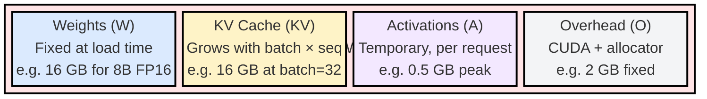

# 1.2 VRAM Budgeting

Sizing a GPU for inference requires accounting for four memory consumers that compete for the same HBM. This module derives the complete budget formula and works through production examples.

---

## VRAM Budget Formula

The total GPU memory consumed during inference has four components:



```
VRAM_total = W + KV + A + O
```

Where:
- **W** = Model weights
- **KV** = KV cache (grows with batch size and sequence length)
- **A** = Activation memory (temporary, per-request)
- **O** = Framework overhead (CUDA contexts, memory allocator fragmentation, buffers)

Each component is derived below.

### Component 1: Weights (W)

As established above:

```
W = num_parameters * bytes_per_parameter
```

This is constant once the model is loaded. It does not change with batch size or sequence length.

### Component 2: KV Cache (KV)

The KV cache stores the key and value projections for all previously generated tokens. This allows the model to avoid recomputing attention over the full sequence at each decode step. The KV cache is the dominant variable-size memory consumer during inference.

For a single sequence at position t (t tokens generated so far):

```
kv_per_token_per_layer = 2 * num_kv_heads * head_dim * bytes_per_element
```

The factor of 2 accounts for both K and V tensors. For the full model across all layers:

```
kv_per_token = num_layers * 2 * num_kv_heads * head_dim * bytes_per_element
```

For a batch of B sequences, each at maximum context length S:

```
KV = B * S * num_layers * 2 * num_kv_heads * head_dim * bytes_per_element
```

#### KV Cache Derivation for Llama 3.1 8B

Llama 3.1 8B architecture parameters:
- num_layers = 32
- num_kv_heads = 8 (GQA with 8 KV heads, 32 query heads)
- head_dim = 128
- bytes_per_element = 2 (FP16)

Per-token KV cache:

```
kv_per_token = 32 * 2 * 8 * 128 * 2 bytes
             = 32 * 2 * 8 * 128 * 2
             = 131,072 bytes
             = 128 KB per token
```

For a single sequence at 4096 tokens:

```
kv_single_seq = 128 KB * 4096 = 512 MB
```

For a batch of 32 sequences at 4096 tokens:

```
kv_batch_32 = 512 MB * 32 = 16.38 GB
```

This 16 GB of KV cache is on top of the 16 GB of weights. Even for a relatively small model, KV cache can match or exceed weight memory at moderate batch sizes.

#### KV Cache Derivation for Llama 3.1 70B

Architecture parameters:
- num_layers = 80
- num_kv_heads = 8 (GQA)
- head_dim = 128
- bytes_per_element = 2 (FP16)

Per-token KV cache:

```
kv_per_token = 80 * 2 * 8 * 128 * 2 bytes
             = 327,680 bytes
             = 320 KB per token
```

For a single sequence at 4096 tokens:

```
kv_single_seq = 320 KB * 4096 = 1.28 GB
```

For a batch of 16 sequences at 4096 tokens:

```
kv_batch_16 = 1.28 GB * 16 = 20.48 GB
```

The 70B model already requires 141 GB for weights in FP16 (needing 2 GPUs). Adding 20 GB of KV cache further constrains available headroom per GPU.

#### KV Cache Derivation for Llama 3.1 405B

Architecture parameters:
- num_layers = 126
- num_kv_heads = 8 (GQA)
- head_dim = 128
- bytes_per_element = 2 (FP16)

Per-token KV cache:

```
kv_per_token = 126 * 2 * 8 * 128 * 2 bytes
             = 516,096 bytes
             = 504 KB per token
```

For a single sequence at 4096 tokens:

```
kv_single_seq = 504 KB * 4096 = 2.02 GB
```

For a batch of 8 sequences at 4096 tokens:

```
kv_batch_8 = 2.02 GB * 8 = 16.13 GB
```

Even with only 8 concurrent sequences, the 405B model needs 16 GB of KV cache distributed across its tensor-parallel GPUs.

#### GQA Reduces KV Cache

Grouped Query Attention (GQA) reduces KV cache by sharing KV heads across multiple query heads. The ratio of query heads to KV heads determines the savings:

| Model | Query Heads | KV Heads | GQA Ratio | KV Savings vs MHA |
|-------|----------:|--------:|---------:|------------------:|
| Llama 2 7B (MHA) | 32 | 32 | 1:1 | baseline |
| Llama 3.1 8B (GQA) | 32 | 8 | 4:1 | 75% reduction |
| Llama 3.1 70B (GQA) | 64 | 8 | 8:1 | 87.5% reduction |

Without GQA, the 70B model would need 8x more KV cache (2.56 GB per sequence instead of 320 KB per token * 4096 = 1.28 GB). GQA is the primary reason modern LLMs can serve long contexts at reasonable batch sizes.

### Component 3: Activation Memory (A)

Activations are the intermediate tensors computed during the forward pass. Unlike weights (persistent) and KV cache (growing), activations are temporary: allocated when a layer begins computation and freed when the layer completes.

The peak activation memory for a transformer layer during inference:

```
A_peak = batch_size * seq_len * hidden_dim * bytes_per_element * multiplier
```

The multiplier accounts for intermediate expansions in the MLP (typically 4x or 3.5x hidden_dim) and attention score matrices. For Llama 3.1 8B with batch=32, seq_len=1 (decode):

```
A_peak = 32 * 1 * 4096 * 2 * 4  (MLP intermediate is 14336 = 3.5x hidden)
       = 1.05 MB
```

During prefill with long sequences, activations are larger:

```
A_peak_prefill = 32 * 4096 * 4096 * 2 * 4
              = 4.29 GB
```

However, this is transient. Inference engines allocate and free activation buffers layer by layer, so only one layer's activations exist at any time. The practical impact: activation memory is small during decode (the steady-state phase) and briefly large during prefill (the initialization phase).

### Component 4: Framework Overhead (O)

The CUDA runtime, memory allocator, and inference framework consume baseline memory before any model is loaded:

| Component | Typical Size | Notes |
|-----------|------------:|-------|
| CUDA context | 300-800 MB | Per-GPU, varies by driver version |
| cuBLAS workspace | 100-500 MB | Pre-allocated for GEMM operations |
| Memory allocator fragmentation | 5-15% of total | PyTorch/vLLM allocator waste |
| Communication buffers (NCCL) | 200-500 MB | Per-GPU, for tensor parallelism |
| Temporary buffers | 100-300 MB | Sampling, rotary embeddings, norms |

A practical rule of thumb: reserve 1.5 to 3 GB per GPU for overhead. This is why a model that theoretically fits in 78 GB often fails to load on an 80 GB GPU.

### Complete VRAM Budget: Worked Examples

#### Example 1: Llama 3.1 8B on A100 80GB (FP16)

```
W  = 8.03B * 2 bytes                    = 16.06 GB
KV = 32 * 4096 * 32 * 2 * 8 * 128 * 2   = 16.38 GB  (batch=32, ctx=4096)
A  = ~0.001 GB (decode) to ~4 GB (prefill peak)
O  = ~2 GB

Total (decode steady-state) = 16.06 + 16.38 + 0.001 + 2 = 34.4 GB
Total (prefill peak)        = 16.06 + 16.38 + 4.0 + 2   = 38.4 GB
```

Available headroom: 80 - 38.4 = 41.6 GB. This allows increasing batch size to approximately 80 concurrent sequences at 4096 context length.

Maximum batch size calculation:

```
available_for_kv = 80 - W - O - A = 80 - 16.06 - 2 - 4 = 57.94 GB
kv_per_sequence = 4096 * 128 KB = 512 MB
max_batch = 57.94 GB / 0.512 GB = 113 sequences
```

#### Example 2: Llama 3.1 70B on 2x H100 80GB (FP16, TP=2)

Per-GPU allocation with tensor parallelism degree 2:

```
W  = 141.2 GB / 2 GPUs                  = 70.6 GB per GPU
KV = 16 * 4096 * 80 * 2 * 8 * 128 * 2   = 20.48 GB total
   = 20.48 / 2                           = 10.24 GB per GPU  (KV also sharded)
A  = ~0.001 GB (decode)
O  = ~2.5 GB (includes NCCL buffers)

Total per GPU = 70.6 + 10.24 + 0.001 + 2.5 = 83.3 GB  -- DOES NOT FIT
```

The 70B model in FP16 with batch=16 at 4096 context does not fit on 2x H100 80GB. Solutions:
1. Reduce batch size to 8: KV drops to 5.12 GB/GPU, total = 78.2 GB (tight fit)
2. Use INT8 quantization: W = 35.3 GB/GPU, total = 47.8 GB (comfortable)
3. Use 4x H100: W = 35.3 GB/GPU, KV = 5.12 GB/GPU, total = 42.9 GB

#### Example 3: Llama 3.1 70B on 4x A100 80GB (INT8, TP=4)

```
W  = 70.6 GB / 4 GPUs                   = 17.65 GB per GPU
KV = 32 * 4096 * 80 * 2 * 8 * 128 * 1   = 20.48 GB total (INT8 KV)
   = 20.48 / 4                           = 5.12 GB per GPU
A  = ~0.001 GB
O  = ~2.5 GB

Total per GPU = 17.65 + 5.12 + 0.001 + 2.5 = 25.3 GB
Available headroom per GPU = 80 - 25.3 = 54.7 GB
```

This leaves abundant room for higher batch sizes. Solving for maximum batch:

```
available_for_kv_per_gpu = 80 - 17.65 - 2.5 - 0.001 = 59.85 GB
kv_per_seq_per_gpu = 4096 * 80 * 2 * 8 * 128 * 1 / 4 = 160 MB
max_batch = 59.85 GB / 0.160 GB = 374 sequences
```

In practice, you would not run 374 concurrent sequences due to latency SLA requirements (each decode step reads all 70.6 GB of weights; spreading bandwidth across 374 sequences increases per-token latency).

#### Example 4: Llama 3.1 405B on 8x H100 80GB (FP8, TP=8)

```
W  = 405B * 1 byte (FP8)                = 405 GB total
   = 405 / 8                             = 50.6 GB per GPU
KV = 8 * 131072 * 126 * 2 * 8 * 128 * 1 = 131 GB total (FP8 KV, ctx=131072)
   = 131 / 8                             = 16.4 GB per GPU
A  = ~0.01 GB
O  = ~3 GB (8-way NCCL)

Total per GPU = 50.6 + 16.4 + 0.01 + 3 = 70.0 GB
Available headroom = 80 - 70 = 10 GB per GPU
```

The 405B model fits on 8x H100 with FP8, but headroom is thin. Increasing batch size or context length requires either more GPUs or aggressive KV cache compression.

---
