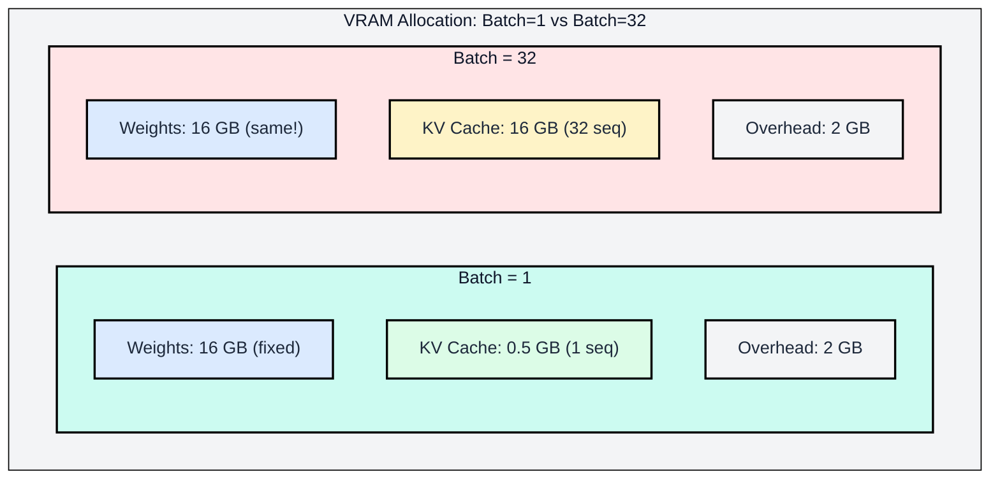
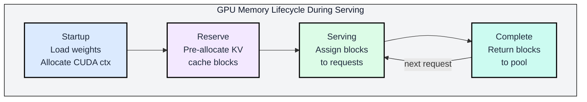

# 1.3 Batch Size and Instance Selection

Batch size determines how many concurrent users your GPU serves. Instance selection determines your cost-per-token. Both are constrained by the VRAM budget derived in Module 1.2.

---

## Batch Size Impact on Memory

Batch size interacts with memory in a nuanced way. Weights are shared across all sequences in a batch (read once, used N times), but KV cache is private to each sequence (allocated per-sequence). This creates a fundamental asymmetry.



Weights stay constant regardless of batch size. KV cache scales linearly. This is why increasing batch size is "free" throughput up to the point where KV cache exhausts remaining VRAM.

### Memory Growth Model

```
VRAM(B) = W + B * kv_per_sequence + A(B) + O
```

Where B is batch size. The key observation: W and O are constants, while KV grows linearly with B. Activation memory A(B) also grows with B but is typically negligible during decode.

### Batch Size vs. VRAM for Llama 8B on A100 80GB (FP16, ctx=4096)

| Batch Size | Weights | KV Cache | Overhead | Total | Utilization |
|----------:|---------:|--------:|--------:|------:|----------:|
| 1 | 16.06 GB | 0.51 GB | 2.0 GB | 18.6 GB | 23% |
| 8 | 16.06 GB | 4.10 GB | 2.0 GB | 22.2 GB | 28% |
| 32 | 16.06 GB | 16.38 GB | 2.0 GB | 34.4 GB | 43% |
| 64 | 16.06 GB | 32.77 GB | 2.0 GB | 50.8 GB | 64% |
| 96 | 16.06 GB | 49.15 GB | 2.0 GB | 67.2 GB | 84% |
| 113 | 16.06 GB | 57.86 GB | 2.0 GB | 75.9 GB | 95% |

At batch size 113, memory utilization reaches 95%, leaving minimal headroom for allocation spikes during prefill. Production deployments typically target 85-90% peak utilization, suggesting batch size 96 as the practical maximum.

### Throughput vs. Latency Tradeoff

Increasing batch size improves throughput (tokens per second across all requests) but degrades latency (time per token for individual requests). The mechanism:

1. **Weights are read once per decode step regardless of batch size.** Time to read weights = W / bandwidth.
2. **KV cache reads scale with batch size.** Each sequence's cached keys must be read for attention.
3. **Compute scales with batch size.** But since decode is memory-bound, increased compute does not increase wall-clock time until the workload becomes compute-bound.

The net effect: at small batch sizes, adding sequences is "free" in latency because the memory bandwidth is underutilized. Once total data reads (weights + KV) saturate HBM bandwidth, each additional sequence adds proportional latency.

The crossover point where adding batch size begins hurting latency:

```
B_crossover = W / (S * kv_per_token)
```

For Llama 8B FP16 on A100 (W=16 GB, S=4096, kv_per_token=128 KB):

```
B_crossover = 16 GB / (4096 * 128 KB) = 16 GB / 512 MB = 31.25
```

At batch sizes above ~32, the KV cache reads begin to dominate over weight reads, and per-token latency starts increasing measurably.

---

## Practical Instance Selection

Selecting the right GPU instance for a deployment requires matching three constraints: capacity (does the model fit?), bandwidth (what is the per-token latency?), and cost (what is the dollar-per-token?).

### GPU Instance Comparison

| Instance | GPU | VRAM | HBM BW | Interconnect | Cost ($/hr, approx) |
|----------|-----|-----:|-------:|------------:|--------------------:|
| p4d.24xlarge | 8x A100 80GB | 640 GB | 16 TB/s | NVSwitch 600 GB/s | $32.77 |
| p5.48xlarge | 8x H100 80GB | 640 GB | 26.8 TB/s | NVSwitch 900 GB/s | $98.32 |
| p5e.48xlarge | 8x H200 141GB | 1,128 GB | 38.4 TB/s | NVSwitch 900 GB/s | ~$120 |
| g5.xlarge | 1x A10G 24GB | 24 GB | 0.6 TB/s | PCIe Gen4 | $1.006 |
| g6.xlarge | 1x L4 24GB | 24 GB | 0.3 TB/s | PCIe Gen4 | $0.805 |
| g6e.xlarge | 1x L40S 48GB | 48 GB | 0.86 TB/s | PCIe Gen4 | $1.86 |

### Selection Decision Framework

The selection process follows a strict ordering of constraints:

**Step 1: Does it fit?**

Calculate total VRAM needed at target batch size:

```
required_vram = W + B_target * kv_per_seq + O
```

If required_vram > instance_vram, the instance is eliminated. Consider quantization to reduce W, or multi-GPU to distribute the total.

**Step 2: What is the decode latency?**

Minimum time per token (bandwidth-limited):

```
t_token = (W + B * S * kv_per_token) / hbm_bandwidth
```

This gives inter-token latency. If the SLA requires < 50ms per token and the calculated latency is 80ms, the instance fails the latency constraint even though the model fits.

**Step 3: What is the cost per token?**

```
cost_per_million_tokens = (instance_cost_per_hour / tokens_per_second) * 1e6 / 3600
```

Where tokens_per_second = batch_size / t_token.

### Worked Instance Selection: Llama 70B at 50 tok/s Target

Requirements: Llama 3.1 70B, max latency 50ms/token, batch size 16, context 4096.

**Option A: 2x H100 80GB (FP16, TP=2)**

```
W per GPU = 70.6 GB
KV per GPU = 10.24 GB
Total per GPU = 83.3 GB -- DOES NOT FIT (80 GB limit)
```

Eliminated.

**Option B: 4x H100 80GB (FP16, TP=4)**

```
W per GPU = 35.3 GB
KV per GPU = 5.12 GB
Total per GPU = 42.9 GB -- fits

t_token = (141.2 GB + 20.48 GB) / (4 * 3.35 TB/s) = 161.7 GB / 13.4 TB/s = 12.1 ms
Latency: 12.1 ms < 50 ms SLA -- passes

Throughput: 16 sequences / 12.1 ms = 1322 tokens/second
Cost: ~$196/hr for p5.48xlarge (using 4 of 8 GPUs)
Cost per 1M tokens: $196 / 1322 * 1e6 / 3600 = $41.2
```

**Option C: 2x H100 80GB (INT8, TP=2)**

```
W per GPU = 35.3 GB
KV per GPU = 5.12 GB (INT8 KV cache)
Total per GPU = 42.9 GB -- fits

t_token = (70.6 GB + 10.24 GB) / (2 * 3.35 TB/s) = 80.8 GB / 6.7 TB/s = 12.1 ms
Latency: 12.1 ms < 50 ms -- passes

Throughput: 16 / 12.1 ms = 1322 tokens/second
Cost: ~$49/hr (2 GPUs from p5 instance)
Cost per 1M tokens: $49 / 1322 * 1e6 / 3600 = $10.3
```

Option C achieves the same latency at 4x lower cost by using quantization to halve the per-GPU memory and bandwidth requirements. This illustrates why INT8 quantization is nearly universal in production deployments: it doubles effective bandwidth (half the bytes to read per weight) with minimal quality degradation for most models.

### When to Choose More GPUs vs. Quantization

| Approach | Advantage | Disadvantage |
|----------|-----------|--------------|
| More GPUs (higher TP) | No quality impact | Higher cost, more communication overhead |
| INT8 quantization | 2x effective bandwidth, lower cost | Slight quality loss (usually < 1% on benchmarks) |
| INT4 quantization | 4x effective bandwidth, lowest cost | Measurable quality loss, especially on reasoning tasks |
| FP8 (H100/B200 only) | Native hardware support, no dequantization cost | Limited to newer hardware |

The general recommendation: start with INT8 quantization (AWQ or GPTQ) and validate quality on your specific use case. If quality degrades unacceptably, scale to more GPUs with FP16 or FP8. Reserve INT4 for latency-insensitive applications where cost dominates.

---

## Memory Allocation in Practice



Understanding theoretical VRAM budgets is necessary but not sufficient. Actual deployments encounter practical allocation behaviors that affect usable capacity.

### Memory Fragmentation

GPU memory allocators (PyTorch's caching allocator, vLLM's block allocator) cannot perfectly pack variable-size tensors. Fragmentation wastes 5-15% of total VRAM:

```
usable_vram = total_vram * (1 - fragmentation_factor)
            = 80 GB * 0.90    (assuming 10% fragmentation)
            = 72 GB
```

vLLM mitigates fragmentation through its PagedAttention mechanism, which allocates KV cache in fixed-size blocks (similar to OS virtual memory pages). This eliminates internal fragmentation of KV cache specifically, but weight tensors and activation buffers still fragment normally.

### Memory Reservation at Startup

Inference engines typically pre-allocate the KV cache pool at startup based on configured maximum capacity:

```python
# vLLM KV cache allocation (simplified)
max_num_blocks = (total_gpu_memory - model_memory - overhead) / block_size
kv_cache_pool = allocate_contiguous(max_num_blocks * block_size)
```

This means the KV cache pool occupies its maximum configured size from the moment the server starts, regardless of current batch size. Monitoring nvidia-smi will show high memory usage even with zero active requests.

### OOM Scenarios and Prevention

Out-of-memory errors during inference typically occur during:

1. **Prefill of long sequences**: The activation memory spike during prefill of a 128K token sequence can exceed available headroom. Solution: cap max prefill length or chunk prefill into smaller pieces.

2. **Batch size exceeding KV cache pool**: If more requests arrive than the pre-allocated KV cache can hold, the engine must either queue requests or reject them. Solution: configure max_num_seqs conservatively.

3. **Model loading with insufficient headroom**: A model that consumes 78 GB of an 80 GB GPU may fail to load because the CUDA context and allocator metadata consume the remaining 2 GB first. Solution: always leave 3+ GB headroom below physical VRAM.

---

## Summary

The VRAM budget for LLM inference is determined by four components with distinct scaling behaviors:

| Component | Scales With | Typical Magnitude | Optimization Lever |
|-----------|-------------|------------------:|-------------------|
| Weights (W) | Parameter count, precision | 4-810 GB | Quantization (INT8, INT4, FP8) |
| KV Cache (KV) | Batch size * context length | 0.5-40+ GB | GQA, KV quantization, eviction |
| Activations (A) | Batch size * seq_len (transient) | 0.001-4 GB | Chunked prefill |
| Overhead (O) | GPU count, framework | 1.5-3 GB | Minimal control |

The practical workflow for capacity planning:

1. Calculate W for your model at target precision
2. Determine KV per sequence at target context length
3. Compute maximum batch size given available VRAM after W + O
4. Verify per-token latency at that batch size against SLA
5. Compare cost across GPU instances that satisfy all constraints

The next module (1.2) examines the roofline model, which explains why decode is memory-bandwidth-bound and connects the memory hierarchy presented here to actual throughput predictions.

---

## References

- NVIDIA A100 Tensor Core GPU Architecture Whitepaper (2020)
- NVIDIA H100 Tensor Core GPU Architecture Whitepaper (2022)
- NVIDIA Blackwell Architecture Whitepaper (2024)
- Dao et al., "FlashAttention: Fast and Memory-Efficient Exact Attention with IO-Awareness," NeurIPS 2022
- Ainslie et al., "GQA: Training Generalized Multi-Query Transformer Models from Multi-Head Checkpoints," EMNLP 2023
- Kwon et al., "Efficient Memory Management for Large Language Model Serving with PagedAttention," SOSP 2023
- Liu et al., "DeepSeek-V3 Technical Report," 2024
