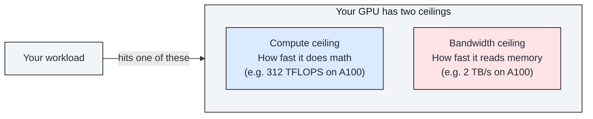
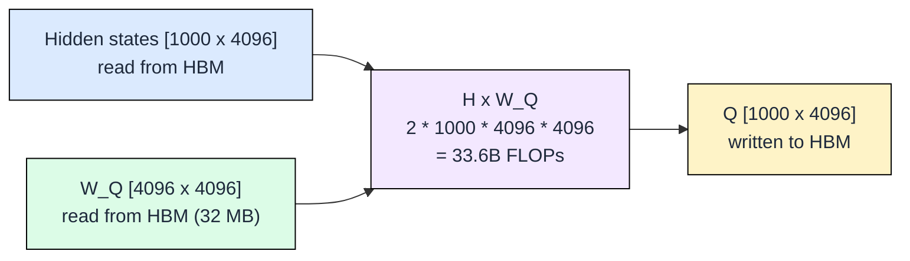
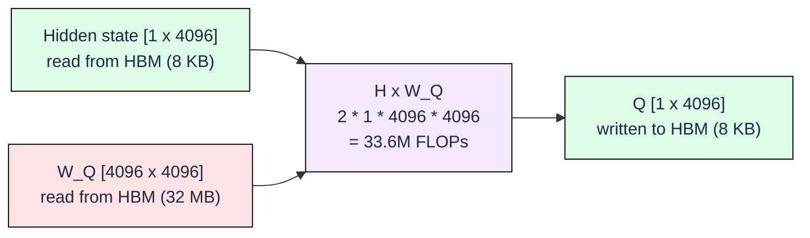
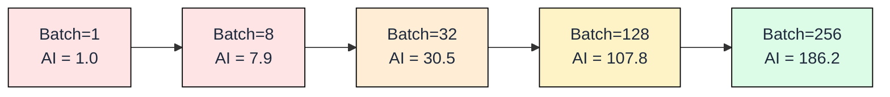
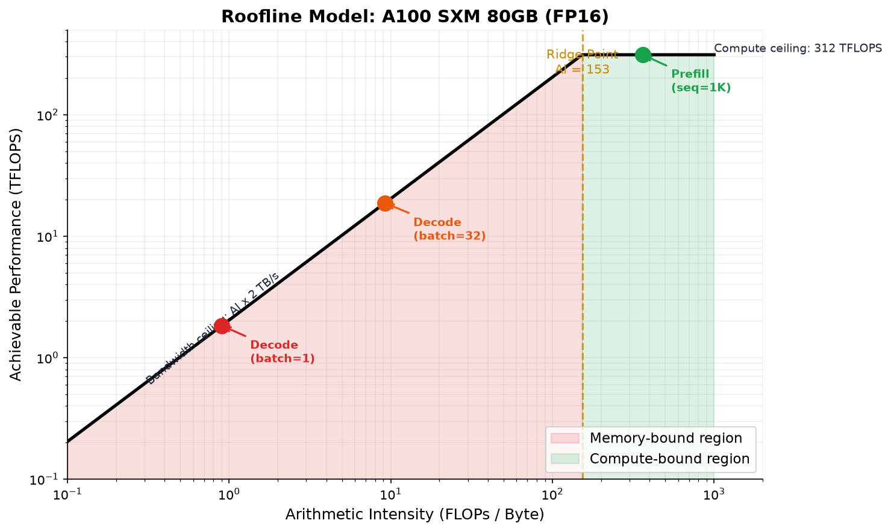

# 1.2 The Roofline Model

[](https://colab.research.google.com/github/harshuljain13/llm-inference-at-scale/blob/master/content/01_gpu_hardware/01.2_roofline_model/lab.ipynb) [](https://molab.marimo.io/github/harshuljain13/llm-inference-at-scale/blob/master/content/01_gpu_hardware/01.2_roofline_model/lab.ipynb)

Every GPU has two speed limits: how fast it can **do math** (compute) and how fast it can **read data** from memory (bandwidth). The roofline model is a simple visual tool that tells you which limit your workload hits.

For LLM inference, the answer is almost always: **decode is limited by memory bandwidth, not compute.** The GPU finishes its math and then waits for the next chunk of data. This module proves that with numbers.



The question the roofline answers: **"Is my workload starved for compute or starved for data?"** If it's starved for data (memory-bound), buying a faster GPU won't help. You need more bandwidth or less data to read.

---

## What Arithmetic Intensity Means

To know which ceiling you hit, you need one number: **arithmetic intensity (AI)**. It measures how much math you do per byte of data you read.

```
AI = FLOPs performed / Bytes read from HBM
```

Think of it like a factory:
- AI = 0.5 means: for every byte that arrives from the warehouse, you do 0.5 operations. The workers are mostly idle, waiting for deliveries. **Memory-bound.**
- AI = 200 means: for every byte that arrives, you do 200 operations. The warehouse is idle, workers are overwhelmed. **Compute-bound.**

The GPU's **ridge point** is the AI where both ceilings are hit simultaneously. Below the ridge → memory-bound. Above → compute-bound. For the A100, the ridge point is about 156 FLOPs/byte.

### Calculating Arithmetic Intensity for Matrix Multiplication

Let's compute AI for the operations you already know from Module 0.3:

**Prefill: Computing Q for 1000 tokens**



```
FLOPs = 2 * 1000 * 4096 * 4096 = 33.6 billion
Bytes = (1000*4096 + 4096*4096 + 1000*4096) * 2 = 49.5 MB
AI = 33.6B / 49.5MB = 679 FLOPs/byte → compute-bound
```

**Decode: Computing Q for 1 token**



```
FLOPs = 2 * 1 * 4096 * 4096 = 33.6 million
Bytes = (1*4096 + 4096*4096 + 1*4096) * 2 = 32 MB (W_Q dominates!)
AI = 33.6M / 32MB = 1.05 FLOPs/byte → memory-bound
```

Same weight matrix W_Q. Same operation. But 1000 tokens (prefill) gives AI=679, while 1 token (decode) gives AI=1. The weight matrix costs 32 MB to read regardless of how many tokens you process.

```
FLOPs = 2 * 1 * K * N = 2*K*N
Bytes = 2 * (1*K + K*N + 1*N) = 2*(K + K*N + N)

For K = N = 4096:
  FLOPs = 2 * 4096 * 4096 = 33,554,432
  Bytes = 2 * (4096 + 16,777,216 + 4096) = 33,570,816
  AI    = 33,554,432 / 33,570,816 = 1.0 FLOPs/byte
```

The weight matrix dominates the byte count. Reading K*N weights dwarfs the input vector and output vector. The result: matrix-vector multiplication has arithmetic intensity of approximately 1.0 regardless of the dimension size. This is the fundamental reason LLM decode is memory-bound.

### How Batch Size Changes Arithmetic Intensity

With batch size B, the weight matrix is read once but used for B inputs. More batching = more math per byte = higher AI:



Batch=1 is deep in memory-bound territory (AI=1). By batch=256, AI reaches 186 which crosses the ridge point (156 on A100). This is why batching is the primary tool for improving GPU utilization during decode.

The math (for weight matrix [4096 x 4096], FP16):

```
FLOPs = 2 * B * 4096 * 4096
Bytes = 2 * (B*4096 + 4096*4096 + B*4096)

B=1:   AI = 1.0    (memory-bound)
B=32:  AI = 30.5   (still memory-bound)
B=128: AI = 107.8  (approaching ridge)
B=256: AI = 186.2  (compute-bound!)
```

The weight matrix (4096 x 4096 = 32MB) dominates bytes at small B. As B grows, FLOPs grow linearly but bytes grow slowly (weights are read only once).

---

## The Two Ceilings

Your GPU has two hard limits:

| Ceiling | What it limits | A100 value | H100 value |
|---------|---------------|-----------|-----------|
| **Compute** | Max math per second | 312 TFLOPS | 990 TFLOPS |
| **Bandwidth** | Max data read per second | 2 TB/s | 3.35 TB/s |

If your workload's AI is low (few FLOPs per byte), you hit the bandwidth ceiling first. If AI is high, you hit the compute ceiling first. The **ridge point** is where both ceilings meet: AI = Peak FLOPS / Bandwidth.

The chart below shows this visually. The red region is memory-bound (decode lives here). The green region is compute-bound (prefill lives here):



Three workloads are plotted:
- **Red dot (Decode, batch=1):** AI = 0.9. Deep in memory-bound territory. GPU compute is 99% idle.
- **Orange dot (Decode, batch=32):** AI = 9.2. Better, but still 17x below the ridge.
- **Green dot (Prefill, 1K tokens):** AI = 362. Above the ridge. Compute is the bottleneck here.

This single chart explains why decode is slow, why prefill is fast, and why batching helps but cannot fully solve the problem.

---

## Ridge Point Calculation for Modern GPUs

The ridge point is the arithmetic intensity at which the bandwidth ceiling meets the compute ceiling. Below this point, the workload is memory-bound. Above it, the workload is compute-bound. The formula is:

```
Ridge Point = Peak Compute (FLOPS) / Memory Bandwidth (bytes/s)
```

### A100 SXM 80GB

```
Peak FP16 Compute = 312 TFLOPS = 312 * 10^12 FLOPS
Memory Bandwidth  = 2,039 GB/s = 2,039 * 10^9 bytes/s

Ridge Point = (312 * 10^12) / (2,039 * 10^9)
            = 312,000 / 2,039
            = 153 FLOPs/byte
```

Any workload with arithmetic intensity below 153 FLOPs/byte on A100 is memory-bound. Any workload above 153 FLOPs/byte is compute-bound.

### H100 SXM 80GB

```
Peak FP16 Compute = 990 TFLOPS = 990 * 10^12 FLOPS
Memory Bandwidth  = 3,352 GB/s = 3,352 * 10^9 bytes/s

Ridge Point = (990 * 10^12) / (3,352 * 10^9)
            = 990,000 / 3,352
            = 295 FLOPs/byte
```

H100 has a higher ridge point than A100. This means a workload must achieve nearly twice the data reuse to become compute-bound on H100. The compute ceiling grew faster (3.2x) than the bandwidth ceiling (1.6x), pushing the ridge point higher. Memory-bound workloads benefit less from the A100-to-H100 upgrade than compute-bound workloads do.

### B200 SXM

```
Peak FP16 Compute = 2,250 TFLOPS = 2,250 * 10^12 FLOPS
Memory Bandwidth  = 8,000 GB/s = 8,000 * 10^9 bytes/s

Ridge Point = (2,250 * 10^12) / (8,000 * 10^9)
            = 2,250,000 / 8,000
            = 281 FLOPs/byte
```

B200 brings the ridge point back down slightly relative to H100 because bandwidth grew proportionally faster (2.4x bandwidth vs 2.3x compute relative to H100). This is deliberate: NVIDIA recognized that memory-bound LLM workloads dominate GPU data center revenue, and invested disproportionately in bandwidth for Blackwell.

### Ridge Point Summary Table

| GPU | Peak FP16 (TFLOPS) | Bandwidth (GB/s) | Ridge Point (FLOPs/byte) |
|-----|--------------------:|------------------:|-------------------------:|
| A100 SXM | 312 | 2,039 | 153 |
| H100 SXM | 990 | 3,352 | 295 |
| B200 SXM | 2,250 | 8,000 | 281 |

The key insight: ridge points for modern GPUs are in the range of 150 to 300 FLOPs/byte. Any workload below this threshold gains nothing from additional compute capacity. It needs more bandwidth.

---

## Where LLM Prefill Lands: Compute-Bound Derivation

During prefill, the model processes the entire input prompt in parallel. If the prompt has S tokens, the input to each linear layer is a matrix of shape [S, hidden_dim]. This means prefill performs matrix-matrix multiplication, not matrix-vector multiplication.

### Derivation for a Single Linear Layer

Consider one linear projection in the attention block: input [S, d] multiplied by weight [d, d], where d is the hidden dimension.

```
FLOPs = 2 * S * d * d = 2 * S * d^2
Bytes = 2 * (S*d + d*d + S*d) = 2 * (2*S*d + d^2)   [FP16]
AI    = (2 * S * d^2) / (2 * (2*S*d + d^2))
      = (S * d^2) / (2*S*d + d^2)
      = (S * d) / (2*S + d)
```

For Llama 8B with d = 4096:

```
S = 512:   AI = (512 * 4096) / (2*512 + 4096)  = 2,097,152 / 5,120  = 410
S = 1024:  AI = (1024 * 4096) / (2*1024 + 4096) = 4,194,304 / 6,144 = 683
S = 2048:  AI = (2048 * 4096) / (2*2048 + 4096) = 8,388,608 / 8,192 = 1024
S = 4096:  AI = (4096 * 4096) / (2*4096 + 4096) = 16,777,216 / 12,288 = 1365
```

Even at modest sequence lengths of 512 tokens, the arithmetic intensity (410) far exceeds the ridge point of any current GPU (153 for A100, 295 for H100). Prefill is firmly compute-bound.

### Why Prefill is Compute-Bound

The mathematical explanation: with S tokens processed simultaneously, the weight matrix [d, d] is read once but used S times (once per token). The amortization factor is S. Since typical sequence lengths range from hundreds to thousands of tokens, and the ridge point is only 150 to 300, prefill achieves 2x to 10x more data reuse than needed to saturate compute.

This has a practical consequence: prefill throughput scales linearly with compute capacity. Doubling TFLOPS (e.g., A100 to H100) roughly doubles prefill speed. Doubling bandwidth has minimal impact on prefill.

### Full Model Prefill Calculation

For Llama 3.1 8B processing a 2048-token prompt:

```
Parameters breakdown:
  Attention projections (Q, K, V, O): 4 * d * d = 4 * 4096^2 per layer
  MLP (gate, up, down): 3 * d * d_ff = 3 * 4096 * 14336 per layer
  Total per layer: 4 * 4096^2 + 3 * 4096 * 14336 = 67M + 176M = 243M params
  Total model: 32 layers * 243M = 7.78B params (close to stated 8B)

Total FLOPs for prefill (2048 tokens):
  = 2 * num_params * seq_len
  = 2 * 7.78 * 10^9 * 2048
  = 31.9 * 10^12 FLOPs = 31.9 TFLOPS

Total bytes read (model weights, FP16):
  = 7.78 * 10^9 * 2 = 15.56 GB

Arithmetic intensity:
  AI = 31.9 * 10^12 / 15.56 * 10^9 = 2050 FLOPs/byte
```

At AI = 2050, prefill is 13x above the A100 ridge point (153) and 7x above the H100 ridge point (295). This confirms prefill is deeply compute-bound on all current hardware.

### Time to Complete Prefill

```
On A100 (312 TFLOPS peak, ~250 TFLOPS sustained at 80% efficiency):
  Time = 31.9 TFLOPS / 250 TFLOPS = 0.128 seconds = 128 ms

On H100 (990 TFLOPS peak, ~790 TFLOPS sustained):
  Time = 31.9 TFLOPS / 790 TFLOPS = 0.040 seconds = 40 ms
```

H100 prefills 3.2x faster than A100, tracking the compute ratio closely. This would not be the case for memory-bound workloads.

---


## FAQ

**Q1: What does arithmetic intensity physically mean?**

Arithmetic intensity measures how much computational work a kernel extracts from each byte it moves between memory and compute units. A value of 10 FLOPs/byte means for every byte transferred across the memory bus, the hardware performs 10 floating-point operations on it. Low arithmetic intensity (below the ridge point) means the workload starves compute units because memory cannot deliver data fast enough. High arithmetic intensity means compute is the bottleneck and the memory bus has idle cycles. It is a property of the algorithm and data layout, not the hardware.

**Q2: Why are there two ceilings and not one?**

Hardware imposes two independent physical limits: the maximum rate of arithmetic operations (compute ceiling, in FLOPS) and the maximum rate of data transfer (bandwidth ceiling, in bytes/second). These correspond to different silicon resources: tensor cores versus memory controllers. A workload cannot exceed either limit, but only one is active at a time for a given arithmetic intensity. The roofline model makes both visible simultaneously so you can identify which resource is the actual bottleneck without profiling.

**Q3: Is the ridge point the same for all workloads?**

No. The ridge point is a hardware property, not a workload property. It equals peak compute divided by peak bandwidth for a specific GPU and precision mode. All workloads on the same GPU share the same ridge point, but each workload has its own arithmetic intensity that determines which side of the ridge it falls on. Changing precision (FP16 to FP8) changes the compute ceiling and therefore shifts the ridge point. A100 FP16 has ridge point 153; H100 FP16 has ridge point 295. The same matmul kernel is memory-bound on one and compute-bound on neither depending on its AI relative to each GPU's ridge.

**Q4: How do I measure arithmetic intensity for my workload?**

Count total FLOPs (multiply-adds count as 2 operations) and total bytes transferred between HBM and the streaming multiprocessors for one kernel invocation. For matrix operations, use the formulas: matmul [M,K] x [K,N] has FLOPs = 2MKN and bytes = element_size * (MK + KN + MN). For fused kernels, sum FLOPs across all operations but count bytes only for HBM transfers (register and shared memory traffic is internal). Tools like NVIDIA Nsight Compute report both metrics directly via the `sm__sass_thread_inst_executed_op_*` and `dram__bytes` counters.

**Q5: Why does batch size improve arithmetic intensity for decode?**

During decode, weight matrices dominate the byte count because they are read from HBM regardless of batch size. With batch size B, FLOPs scale as 2*B*K*N (linear in B) while bytes remain approximately 2*K*N (the weight matrix read, which dominates). The ratio FLOPs/bytes therefore scales approximately linearly with B. Physically, you are reusing the same weight data across B independent token computations in a single kernel launch, amortizing the memory transfer cost across more useful work.

**Q6: Can a workload be both memory-bound and compute-bound simultaneously?**

Not for a single kernel at a single moment. Each kernel invocation is limited by exactly one resource at a time. However, a full inference pass contains many kernels: attention scores may be compute-bound while the subsequent softmax normalization is memory-bound. End-to-end latency is the sum of individual kernel times, each constrained by its own bottleneck. This is why optimizing inference requires kernel-level analysis, not just model-level arithmetic intensity averaging.

**Q7: How does quantization shift a workload on the roofline?**

Quantization (e.g., FP16 to INT8 or INT4) reduces the bytes transferred per parameter by 2x or 4x. Since arithmetic intensity = FLOPs / bytes, halving bytes doubles AI, pushing the workload rightward on the roofline plot toward the compute-bound regime. Simultaneously, lower-precision tensor cores often have higher peak FLOPS (H100 FP8 is 2x FP16), which raises the compute ceiling and shifts the ridge point. The net effect: quantized models move rightward faster than the ridge shifts, making them more likely to become compute-bound at smaller batch sizes.

---

## References

1. Williams, S., Waterman, A., & Patterson, D. (2009). "Roofline: An Insightful Visual Performance Model for Multicore Architectures." Communications of the ACM, 52(4), 65-76.
2. NVIDIA. (2023). "NVIDIA H100 Tensor Core GPU Architecture Whitepaper." NVIDIA Corporation.
3. NVIDIA. (2024). "NVIDIA Blackwell Architecture Technical Brief." NVIDIA Corporation.
4. Ofenbeck, G., Steinmann, R., Caparros, V., Leber, D., & Puschel, M. (2014). "Applying the Roofline Model." IEEE International Symposium on Performance Analysis of Systems and Software (ISPASS).
5. Kim, S., et al. (2023). "Full Stack Optimization of Transformer Inference: a Survey." arXiv:2302.14017.
6. Pope, R., et al. (2022). "Efficiently Scaling Transformer Inference." MLSys 2023.
7. NVIDIA. (2024). "Nsight Compute Documentation: Roofline Analysis." NVIDIA Developer.
