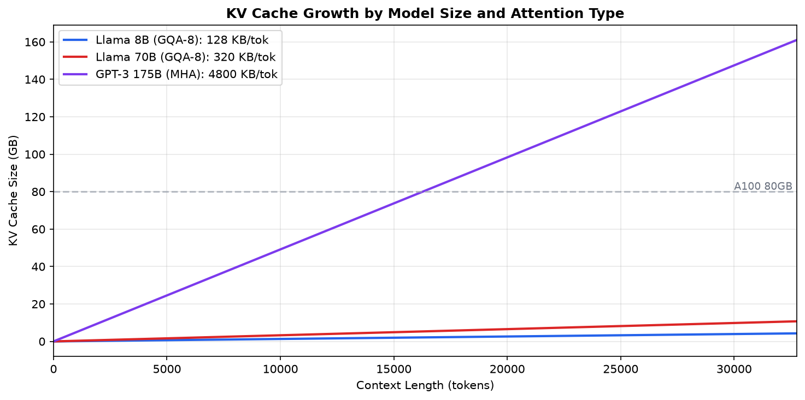

# 2.1 KV Caching

> The difference between understanding transformers and _really_ understanding them is knowing exactly which bytes move where, and why that determines everything about your inference costs.

---

## Prerequisites and Context

From Module 00.0, you know the transformer has 32 layers with attention and MLP blocks. From Module 01.1, you know GPU memory is limited and the bandwidth wall constrains decode speed. This module explains the KV cache: the memory structure that grows with every generated token and ultimately determines how many users your GPU can serve.

---

## Learning Objectives

By the end of this module, you will:

- Trace tensor shapes through every operation and explain _why_ each shape is what it is
- Understand the KV cache at the byte level: not just "it caches K and V" but exactly what is stored and why
- Calculate KV cache memory requirements from first principles (and know when the formulas lie)
- Explain why GQA exists, what problem it solves, and the exact tradeoff it makes
- Understand the prefill/decode split at a level where you can predict which phase will bottleneck

---




## The Insight That Changes Everything

Here is what most tutorials get wrong: they explain transformers as a sequence of operations. But for inference engineering, you need to think about transformers as a **memory access pattern**.

Every forward pass is fundamentally:

1. Read weights from HBM, do math, write activations
2. Read activations from HBM, do math, write activations
3. Repeat

The "do math" part is almost free on modern GPUs. The reads and writes are what cost you.

**The single most important number in LLM inference:**

```
Llama 3.1 8B decode step:
- Weights to read: 16 GB (FP16)
- FLOPs to compute: ~16 billion
- A100 memory bandwidth: 2 TB/s
- A100 FP16 compute: 312 TFLOPS

Time to read weights: 16 GB / 2 TB/s = 8 ms
Time to compute = 0.05 ms

The GPU spends 99.4% of decode time waiting for memory.
```

This is why everything in LLM inference optimization is about memory, not compute.

---

## The Token Generation Pipeline: A Byte-Level View

To understand the KV cache, you first need to see where it fits in the full generation pipeline. The following trace walks through what actually happens when you generate one token, not at a conceptual level but at the level of actual bytes moving through the GPU memory hierarchy.

### Step 1: Tokenization (CPU, negligible)

Tokenization converts raw text into integer IDs that index into the embedding table. This step runs on the CPU and is never a bottleneck for inference performance.

```python
# Input: "The capital of France is"
# Output: [464, 3139, 286, 4881, 318]  (5 tokens)

# Memory: 5 x 4 bytes = 20 bytes (int32 token IDs)
# This is nothing. Tokenization is never your bottleneck.
```

### Step 2: Embedding Lookup (GPU, memory-bound)

The embedding table maps each token ID to a dense vector. This is a pure gather operation: you read a few rows from a large table stored in HBM. No arithmetic is involved.

```python
# Embedding table: [vocab_size, hidden_dim] = [128256, 4096]
# Size: 128256 x 4096 x 2 bytes = 1.05 GB

# Operation: Gather 5 rows from the table
# Output: [5, 4096] = 40 KB

# This is a pure memory operation, no compute.
# You read 5 x 4096 x 2 = 40 KB from a 1 GB table.
```

The embedding table is 1 GB but you only ever read tiny slices of it. This is why embedding tables do not benefit much from quantization: you are not reading the whole thing, just scattered rows. The memory bandwidth cost comes from the random access pattern, not the table size.

### Step 3: The Transformer Block (where the money is)

The transformer block accounts for 95%+ of your inference time. Every layer applies the same sequence of operations: normalization, attention projections, the attention computation itself, and the MLP. The following breakdown traces each sub-operation with exact tensor shapes and byte counts so you can see precisely where time is spent.

#### 3a: RMSNorm (cheap, memory-bound)

RMSNorm is a lightweight normalization applied before each attention and MLP block. It stabilizes training and inference but contributes negligible time to the overall forward pass.

```python
# Input: [batch, seq, hidden] = [1, 5, 4096]
# Weights: [hidden] = [4096] = 8 KB
# Output: [1, 5, 4096]

# Operation: x * rsqrt(mean(x^2) + eps) * weight
# FLOPs: ~3 x batch x seq x hidden = 61K FLOPs
# Memory: Read 40 KB input + 8 KB weights, write 40 KB output

# This is so cheap it is essentially free.
```

#### 3b: Attention Projections (the first big memory read)

This is where things get expensive. The attention mechanism requires projecting the input hidden state into queries, keys, and values through four large weight matrices. These projections dominate the attention block's memory footprint.

```python
# Llama 3.1 8B uses GQA: 32 query heads, 8 KV heads, 128 dim per head

W_q: [4096, 4096]   = 32 MB   # 32 heads x 128 dim = 4096
W_k: [4096, 1024]   = 8 MB    # 8 KV heads x 128 dim = 1024
W_v: [4096, 1024]   = 8 MB    # 8 KV heads x 128 dim = 1024
W_o: [4096, 4096]   = 32 MB   # Output projection

Total per layer: 80 MB
Total for 32 layers: 2.56 GB  # Just the attention projections!
```

The Q and O projections are 4x larger than K and V projections. This is the GQA tradeoff: you save memory on KV cache but the projection weights are still dominated by Q and O. GQA does not reduce model size, only KV cache size.

```python
# The actual computation:
# Input: [1, 5, 4096]

Q = input @ W_q  # [1, 5, 4096] @ [4096, 4096] -> [1, 5, 4096]
K = input @ W_k  # [1, 5, 4096] @ [4096, 1024] -> [1, 5, 1024]
V = input @ W_v  # [1, 5, 4096] @ [4096, 1024] -> [1, 5, 1024]

# Reshape for multi-head attention:
Q = Q.view(1, 5, 32, 128).transpose(1, 2)  # [1, 32, 5, 128]
K = K.view(1, 5, 8, 128).transpose(1, 2)   # [1, 8, 5, 128]
V = V.view(1, 5, 8, 128).transpose(1, 2)   # [1, 8, 5, 128]
```

#### 3c: The Attention Computation (where GQA gets interesting)

Here is where most explanations gloss over the details. With GQA, you have 32 query heads but only 8 KV heads. The mechanism works by having groups of query heads share the same key-value representations, which is what makes the KV cache so much smaller than in traditional multi-head attention.

```python
# GQA: Each KV head serves 4 query heads (32/8 = 4)
#
# Query heads 0-3   share KV head 0
# Query heads 4-7   share KV head 1
# Query heads 8-11  share KV head 2
# ...
# Query heads 28-31 share KV head 7

# Implementation: Expand K and V to match Q's head count
K_expanded = K.repeat_interleave(4, dim=1)  # [1, 8, 5, 128] -> [1, 32, 5, 128]
V_expanded = V.repeat_interleave(4, dim=1)  # [1, 8, 5, 128] -> [1, 32, 5, 128]

# Now standard attention:
scores = Q @ K_expanded.transpose(-2, -1) / sqrt(128)  # [1, 32, 5, 5]
attn_weights = softmax(scores, dim=-1)                  # [1, 32, 5, 5]
attn_output = attn_weights @ V_expanded                 # [1, 32, 5, 128]
```

The `repeat_interleave` does not actually copy memory in optimized implementations. FlashAttention and PagedAttention use index arithmetic to avoid the expansion. Conceptually, each query head is attending to the same KV cache, just with different learned query projections.

The attention matrix has shape [seq_len, seq_len]. For a 4096-token context, that is 16M elements per head, 512M elements total. This is why FlashAttention matters: it never materializes this full matrix in HBM, instead computing attention tile-by-tile in SRAM.

#### 3d: The MLP Block (the other half of the parameters)

The MLP is deceptively simple but contains roughly two-thirds of the model's parameters. While attention gets most of the conceptual attention, the MLP is where the majority of HBM reads happen during each forward pass.

```python
# Llama uses SwiGLU activation, which means 3 projections instead of 2:

W_gate: [4096, 14336]  = 117 MB
W_up:   [4096, 14336]  = 117 MB
W_down: [14336, 4096]  = 117 MB

Total per layer: 351 MB
Total for 32 layers: 11.2 GB  # The MLP is 70% of the model!
```

```python
# The computation:
gate = input @ W_gate           # [1, 5, 4096] @ [4096, 14336] -> [1, 5, 14336]
up = input @ W_up               # [1, 5, 4096] @ [4096, 14336] -> [1, 5, 14336]
hidden = silu(gate) * up        # Element-wise, [1, 5, 14336]
output = hidden @ W_down        # [1, 5, 14336] @ [14336, 4096] -> [1, 5, 4096]
```

The intermediate dimension (14336) is 3.5x the hidden dimension (4096). This ratio is a design choice: larger intermediate means more capacity but more memory. Llama chose 3.5x while GPT-2 used 4x. This is why the MLP dominates model size.

SwiGLU requires 3 weight matrices instead of the 2 that classic transformers use. Classic transformers compute `relu(x @ W1) @ W2`. SwiGLU computes `silu(x @ W_gate) * (x @ W_up) @ W_down`. The extra matrix is why Llama's MLP is 50% larger than you would expect from the intermediate dimension alone.

### Step 4: The LM Head (one more big matrix)

The final layer projects from hidden dimension back to vocabulary size to produce logits. This matrix is the same shape as the embedding table, though Llama 3.1 keeps them as separate parameters rather than tying their weights.

```python
# LM Head: [hidden, vocab] = [4096, 128256]
# Size: 4096 x 128256 x 2 = 1.05 GB

# Many models tie these weights (share the same matrix as embedding).
# Llama 3.1 does NOT tie weights, it has separate embedding and LM head.

logits = final_hidden @ W_lm_head  # [1, 5, 4096] @ [4096, 128256] -> [1, 5, 128256]

# For generation, you only need the last token's logits:
next_token_logits = logits[:, -1, :]  # [1, 128256]
```

The LM head is 1 GB but you only use one row of output during generation. You compute logits for all 128K vocab entries, but you only sample one token. This is unavoidable because you need the full probability distribution to sample from.

---

## The KV Cache: Why It Exists and What It Actually Stores

### The Problem KV Cache Solves

The fundamental issue with autoregressive generation is that attention is causal: each token attends to all previous tokens. Without caching, this means recomputing key and value projections for the entire history at every step.

Without KV cache, generating 100 tokens requires:

```
Token 1:  Compute attention over 1 token
Token 2:  Compute attention over 2 tokens (recompute token 1's K,V)
Token 3:  Compute attention over 3 tokens (recompute tokens 1-2's K,V)
...
Token 100: Compute attention over 100 tokens (recompute tokens 1-99's K,V)

Total K,V computations: 1 + 2 + 3 + ... + 100 = 5,050
```

With KV cache:

```
Token 1:  Compute K,V for token 1, store in cache
Token 2:  Compute K,V for token 2, read token 1's K,V from cache
Token 3:  Compute K,V for token 3, read tokens 1-2's K,V from cache
...
Token 100: Compute K,V for token 100, read tokens 1-99's K,V from cache

Total K,V computations: 100 (one per token)
```

**The KV cache trades memory for compute: O(N) memory to avoid O(N^2) compute.**

### What Is Actually in the KV Cache

Let us be precise about what gets stored. For each layer, the cache holds the projected key and value tensors for every token seen so far:

```python
# Per layer, per sequence:
K_cache: [num_kv_heads, seq_len, head_dim]  # [8, seq_len, 128]
V_cache: [num_kv_heads, seq_len, head_dim]  # [8, seq_len, 128]

# For Llama 3.1 8B with seq_len=4096:
K_cache per layer: 8 x 4096 x 128 x 2 bytes = 8 MB
V_cache per layer: 8 x 4096 x 128 x 2 bytes = 8 MB
Total per layer: 16 MB

# For all 32 layers:
Total KV cache: 32 x 16 MB = 512 MB per sequence
```

The KV cache stores the _projected_ K and V, not the original hidden states. You cannot reconstruct the hidden states from the KV cache. This is important: if you want to branch the generation (beam search), you need to copy the KV cache, not recompute from hidden states.

### The KV Cache Memory Formula (and when it lies)

The standard formula provides a first-order estimate of KV cache memory consumption. Understanding both the formula and its limitations is essential for capacity planning.

```
KV_cache_bytes = 2 x num_layers x num_kv_heads x head_dim x seq_len x batch_size x dtype_bytes
```

Let us verify with Llama 3.1 8B:

```python
# Llama 3.1 8B, batch=1, seq=4096, FP16
kv_cache = 2 x 32 x 8 x 128 x 4096 x 1 x 2
         = 536,870,912 bytes
         = 512 MB
```

**When the formula lies:**

1. **PagedAttention adds overhead.** vLLM allocates KV cache in blocks (typically 16 tokens). If your sequence is 4097 tokens, you allocate 4112 tokens worth of cache. This is roughly 1% overhead for long sequences, but more significant for short ones.

2. **FP16 KV cache even with INT4 weights.** Most quantized models still use FP16 for KV cache because quantizing KV hurts quality more than quantizing weights. Your "4-bit model" still has 16-bit KV cache.

3. **Speculative decoding multiplies KV cache.** If you are verifying 4 draft tokens at once, you need KV cache space for all 4 potential paths.

4. **Prefix caching shares memory.** If 10 requests share the same system prompt, vLLM stores one copy of that prefix's KV cache. The formula assumes no sharing.

### KV Cache Growth Visualization

The following diagram shows how the KV cache grows through prefill and decode phases. Notice that each generated token adds a fixed amount of memory across all 32 layers.

```
PREFILL: Process "The capital of France is" (5 tokens)
+---------------------------------------------------------------------+
| Layer 0:  K[8, 5, 128]  V[8, 5, 128]   = 20 KB                    |
| Layer 1:  K[8, 5, 128]  V[8, 5, 128]   = 20 KB                    |
| ...                                                                 |
| Layer 31: K[8, 5, 128]  V[8, 5, 128]   = 20 KB                    |
|                                                                     |
| Total after prefill: 32 x 20 KB = 640 KB                           |
+---------------------------------------------------------------------+

DECODE: Generate "Paris" (1 token)
+---------------------------------------------------------------------+
| Layer 0:  K[8, 6, 128]  V[8, 6, 128]   = 24 KB  (+4 KB)           |
| Layer 1:  K[8, 6, 128]  V[8, 6, 128]   = 24 KB  (+4 KB)           |
| ...                                                                 |
| Layer 31: K[8, 6, 128]  V[8, 6, 128]   = 24 KB  (+4 KB)           |
|                                                                     |
| Total after 1 decode: 32 x 24 KB = 768 KB  (+128 KB)               |
+---------------------------------------------------------------------+

After 1000 generated tokens:
+---------------------------------------------------------------------+
| Total KV cache: 32 x 8 x 1005 x 128 x 2 x 2 = 131 MB             |
|                                                                     |
| That is 128 KB per generated token, or 128 MB per 1000 tokens.     |
+---------------------------------------------------------------------+
```

KV cache grows linearly with sequence length, but the _rate_ of growth depends on num_kv_heads. Llama 3.1 8B grows at 128 KB/token. Llama 3.1 70B also grows at 128 KB/token (same 8 KV heads). But a model with 96 KV heads (estimated for GPT-4 class) would grow at roughly 1.5 MB/token.

---

## Attention Variants: The Memory-Quality Tradeoff

### Why MQA and GQA Exist

The original transformer (2017) used Multi-Head Attention (MHA): each query head has its own K and V heads. This means KV cache scales linearly with num_heads, which becomes prohibitive for large models.

```
MHA KV cache per token = 2 x num_layers x num_heads x head_dim x dtype_bytes

GPT-3 175B (96 heads, 128 dim, 96 layers):
= 2 x 96 x 96 x 128 x 2 = 4.7 MB per token

At 4096 tokens: 19 GB of KV cache. Per sequence.
```

This is why Google invented Multi-Query Attention (MQA) in 2019: all query heads share a single K and V head.

```
MQA KV cache per token = 2 x num_layers x 1 x head_dim x dtype_bytes

Same model with MQA:
= 2 x 96 x 1 x 128 x 2 = 49 KB per token

96x reduction in KV cache!
```

The problem with MQA is that it hurts model quality. All those query heads are fighting over one KV representation, which limits the model's ability to attend to different aspects of the input simultaneously.

The solution is Grouped-Query Attention (GQA), introduced in 2023. GQA provides a middle ground where groups of query heads share KV heads, balancing memory efficiency against representational capacity.

### GQA: The Math

```
GQA with G groups:
- num_query_heads query heads
- num_kv_heads = num_query_heads / G  KV heads
- Each KV head serves G query heads

Llama 3.1 8B: 32 query heads, 8 KV heads, G=4
Llama 3.1 70B: 64 query heads, 8 KV heads, G=8
```

Larger models use more aggressive grouping. Llama 8B uses G=4 (4x KV reduction). Llama 70B uses G=8 (8x KV reduction). The larger model can afford more sharing because it has more capacity elsewhere in the network to compensate.

### The Quality Impact

From the GQA paper (Ainslie et al., 2023):

```
Model          Attention   MMLU    HellaSwag   Relative KV Cache
---------------------------------------------------------------
Llama 7B       MHA         35.1    76.1        1.0x (baseline)
Llama 7B       MQA         33.8    74.9        0.03x (32x smaller)
Llama 7B       GQA-4       34.9    75.8        0.125x (8x smaller)
Llama 7B       GQA-8       34.7    75.6        0.0625x (16x smaller)
```

GQA-4 recovers almost all MHA quality while using 8x less KV cache. The quality loss from MHA to GQA-4 is roughly 0.3% on MMLU. The memory savings is 8x. This tradeoff is so favorable that every modern large language model uses GQA.

### Visualizing the Difference

The following diagrams show how query heads map to KV heads under each attention variant. The key insight is how dramatically the number of KV tensors stored per layer decreases as you move from MHA to GQA to MQA.

```
MHA (32 query heads, 32 KV heads):
+---------------------------------------------------------------------+
| Q0 -> K0,V0    Q8 -> K8,V8     Q16-> K16,V16   Q24-> K24,V24       |
| Q1 -> K1,V1    Q9 -> K9,V9     Q17-> K17,V17   Q25-> K25,V25       |
| Q2 -> K2,V2    Q10-> K10,V10   Q18-> K18,V18   Q26-> K26,V26       |
| Q3 -> K3,V3    Q11-> K11,V11   Q19-> K19,V19   Q27-> K27,V27       |
| Q4 -> K4,V4    Q12-> K12,V12   Q20-> K20,V20   Q28-> K28,V28       |
| Q5 -> K5,V5    Q13-> K13,V13   Q21-> K21,V21   Q29-> K29,V29       |
| Q6 -> K6,V6    Q14-> K14,V14   Q22-> K22,V22   Q30-> K30,V30       |
| Q7 -> K7,V7    Q15-> K15,V15   Q23-> K23,V23   Q31-> K31,V31       |
|                                                                     |
| KV cache: 32 K tensors + 32 V tensors = 64 tensors per layer       |
+---------------------------------------------------------------------+

GQA-4 (32 query heads, 8 KV heads):
+---------------------------------------------------------------------+
| Q0 -+            Q8 -+            Q16-+            Q24-+            |
| Q1 -+-> K0,V0   Q9 -+-> K2,V2   Q17-+-> K4,V4   Q25-+-> K6,V6    |
| Q2 -+            Q10-+            Q18-+            Q26-+            |
| Q3 -+            Q11-+            Q19-+            Q27-+            |
|                                                                     |
| Q4 -+            Q12-+            Q20-+            Q28-+            |
| Q5 -+-> K1,V1   Q13-+-> K3,V3   Q21-+-> K5,V5   Q29-+-> K7,V7    |
| Q6 -+            Q14-+            Q22-+            Q30-+            |
| Q7 -+            Q15-+            Q23-+            Q31-+            |
|                                                                     |
| KV cache: 8 K tensors + 8 V tensors = 16 tensors per layer         |
| 4x smaller than MHA!                                                |
+---------------------------------------------------------------------+

MQA (32 query heads, 1 KV head):
+---------------------------------------------------------------------+
| Q0 -+                                                               |
| Q1 -+                                                               |
| Q2 -+                                                               |
| ... +-------------------> K0,V0                                     |
| Q30-+                                                               |
| Q31-+                                                               |
|                                                                     |
| KV cache: 1 K tensor + 1 V tensor = 2 tensors per layer            |
| 32x smaller than MHA! But quality suffers.                          |
+---------------------------------------------------------------------+
```

---

## Prefill vs Decode: Two Completely Different Problems

This is the most important section for inference engineering. Prefill and decode have different bottlenecks, different optimization strategies, and increasingly, different hardware. Understanding this split is the key to making correct capacity planning decisions.

### Prefill: Compute-Bound (Usually)

During prefill, you process the entire prompt in one forward pass. Because you are computing attention over many tokens simultaneously, the arithmetic intensity is high enough to saturate the GPU's compute units.

```python
# Prefill for 1000-token prompt:
Input: [1, 1000, 4096]

# Attention computation:
Q @ K^T: [1, 32, 1000, 128] @ [1, 32, 128, 1000] -> [1, 32, 1000, 1000]
         = 32 x 1000 x 128 x 1000 = 4.1 billion FLOPs

# MLP computation (per layer):
x @ W_gate: [1, 1000, 4096] @ [4096, 14336] = 58.7 billion FLOPs
x @ W_up:   [1, 1000, 4096] @ [4096, 14336] = 58.7 billion FLOPs
h @ W_down: [1, 1000, 14336] @ [14336, 4096] = 58.7 billion FLOPs

# Total per layer: ~180 billion FLOPs
# Total for 32 layers: ~5.8 trillion FLOPs
```

**Arithmetic intensity during prefill:**

```
FLOPs: 5.8 trillion
Bytes read: ~16 GB (model weights, read once)
Arithmetic intensity: 5.8T / 16G = 362 FLOPs/byte

A100 ridge point: 312 TFLOPS / 2 TB/s = 156 FLOPs/byte

362 > 156 -> Prefill is compute-bound on A100
```

Prefill arithmetic intensity scales with sequence length. Longer prompts produce more FLOPs for the same weight reads, pushing the operation further into compute-bound territory. A 100-token prompt might be memory-bound; a 10,000-token prompt is definitely compute-bound.

### Decode: Memory-Bound (Always)

During decode, you generate one token at a time. The arithmetic intensity drops by three orders of magnitude compared to prefill because you are reading the entire model's weights to produce a single output token.

```python
# Decode for 1 new token (with 1000 tokens already in cache):
Input: [1, 1, 4096]

# Attention computation:
Q @ K^T: [1, 32, 1, 128] @ [1, 32, 128, 1001] -> [1, 32, 1, 1001]
         = 32 x 1 x 128 x 1001 = 4.1 million FLOPs

# MLP computation (per layer):
x @ W_gate: [1, 1, 4096] @ [4096, 14336] = 58.7 million FLOPs
x @ W_up:   [1, 1, 4096] @ [4096, 14336] = 58.7 million FLOPs
h @ W_down: [1, 1, 14336] @ [14336, 4096] = 58.7 million FLOPs

# Total per layer: ~180 million FLOPs
# Total for 32 layers: ~5.8 billion FLOPs
```

**Arithmetic intensity during decode:**

```
FLOPs: 5.8 billion
Bytes read: ~16 GB (model weights) + ~130 MB (KV cache for 1000 tokens)
Arithmetic intensity: 5.8B / 16.1G = 0.36 FLOPs/byte

0.36 << 156 -> Decode is extremely memory-bound
```

Decode arithmetic intensity is roughly 1000x lower than prefill. This is why decode is always memory-bound: you are reading the entire model to generate one token, and no amount of compute optimization can change that fundamental ratio.

### The Batching Insight

Batching multiple decode requests together is the primary mechanism for improving GPU utilization during decode. The key observation is that model weights are read once from HBM but used for all sequences in the batch.

```python
# Decode for 32 sequences simultaneously:
Input: [32, 1, 4096]

# FLOPs: 32 x 5.8 billion = 186 billion
# Bytes read: ~16 GB (weights, shared) + ~4.2 GB (32 x 130 MB KV cache)
# Arithmetic intensity: 186B / 20.2G = 9.2 FLOPs/byte

# Still memory-bound, but 25x better than batch=1!
```

Batching amortizes weight reads across sequences. With batch=32, you read the weights once but do 32x the compute. This is why high-throughput serving systems use large batches.

However, there is a fundamental tension: KV cache scales with batch size. At some point, you run out of memory for KV cache before you can batch enough to become compute-bound.

```
Llama 3.1 8B on A100 80GB:
- Model weights: 16 GB
- Available for KV cache: ~60 GB
- KV cache per sequence (4096 tokens): 512 MB
- Max batch size: 60 GB / 512 MB = 117 sequences

At batch=117:
- Arithmetic intensity: 117 x 5.8B / (16G + 60G) = 8.9 FLOPs/byte
- Still memory-bound! But much better than batch=1.
```

You can never make decode compute-bound through batching alone. The KV cache grows with batch size, so you hit memory limits before reaching the ridge point. This is the fundamental constraint of LLM inference and the reason why so much research focuses on reducing KV cache size.

---

## The Memory Bandwidth Wall

The memory bandwidth wall represents the theoretical maximum decode speed for any given model on any given hardware. It is derived from first principles and cannot be exceeded by any software optimization.

```
Llama 3.1 8B on A100 80GB:
- Model weights: 16 GB (FP16)
- Memory bandwidth: 2 TB/s
- Time to read weights: 16 GB / 2 TB/s = 8 ms

Theoretical max decode speed = 1 token / 8 ms = 125 tokens/sec

This is a HARD CEILING. No optimization can exceed this.
```

The memory bandwidth wall is defined by `model_size / bandwidth`. This is the most important equation in LLM inference:

```
max_tokens_per_second = memory_bandwidth / model_size_bytes
```

Let us verify with real benchmarks:

| Model            | Size (FP16) | A100 BW | Theoretical Max | Actual (vLLM) | Efficiency |
| ---------------- | ----------- | ------- | --------------- | ------------- | ---------- |
| Llama 8B         | 16 GB       | 2 TB/s  | 125 tok/s       | 95-110 tok/s  | 76-88%     |
| Llama 70B        | 140 GB      | 2 TB/s  | 14.3 tok/s      | 11-13 tok/s   | 77-91%     |
| Llama 70B (TP=8) | 17.5 GB/GPU | 16 TB/s | 914 tok/s       | 650-750 tok/s | 71-82%     |

Real systems achieve 70-90% of theoretical bandwidth utilization. The gap comes from KV cache reads (not just weights), kernel launch overhead, memory access patterns that are not perfectly sequential, and synchronization in multi-GPU setups.

### Breaking the Wall: Your Options

Given that the bandwidth wall is a hard physical constraint, the only ways to increase decode speed are to reduce the bytes read or increase the available bandwidth:

1. **Quantization**: Reduce model size to read fewer bytes
   - INT8: 2x faster theoretical max
   - INT4: 4x faster theoretical max
   - Tradeoff: quality degradation that varies by model and task

2. **Tensor Parallelism**: More GPUs provide more aggregate bandwidth
   - TP=8 on A100: 16 TB/s aggregate bandwidth
   - Tradeoff: communication overhead, diminishing returns past 8 GPUs

3. **Speculative Decoding**: Generate multiple tokens per weight read
   - Draft model proposes N tokens, target verifies in one pass
   - Tradeoff: acceptance rate below 100%, draft model overhead

4. **Batching**: Amortize weight reads across sequences
   - Tradeoff: KV cache limits batch size

---

## Putting It All Together: A Complete Example

The following end-to-end trace demonstrates how all the concepts in this module combine in a real inference request. Pay attention to how prefill and decode have completely different performance characteristics despite running on the same hardware.

**Setup:**

- Model: Llama 3.1 8B
- Hardware: A100 80GB
- Prompt: 500 tokens
- Generation: 200 tokens
- Batch size: 1

**Prefill Phase:**

```
Input: [1, 500, 4096]

Memory reads:
- Model weights: 16 GB (read once)
- No KV cache yet

Compute:
- Attention: 500^2 x 32 x 128 x 32 layers = 32.8B FLOPs
- MLP: 500 x 4096 x 14336 x 3 x 32 layers = 2.8T FLOPs
- Total: ~2.8T FLOPs

Time estimate:
- Memory time: 16 GB / 2 TB/s = 8 ms
- Compute time: 2.8T / 312T = 9 ms
- Prefill is roughly balanced, ~17 ms total

Output:
- KV cache populated: 500 tokens x 128 KB/token = 64 MB
- First token generated
```

**Decode Phase (200 tokens):**

```
Per token:
- Memory reads: 16 GB weights + growing KV cache
- Compute: ~5.8B FLOPs
- Time: ~8-10 ms per token (memory-bound)

Total decode time: 200 x 9 ms = 1.8 seconds

Final KV cache: 700 tokens x 128 KB/token = 90 MB
```

**Total Request:**

- TTFT (Time to First Token): ~17 ms
- TBT (Time Between Tokens): ~9 ms
- Total time: 17 ms + 200 x 9 ms = 1.82 seconds
- Throughput: 200 tokens / 1.82 s = 110 tokens/sec

---

## Key Takeaways

1. **LLM inference is a memory bandwidth problem, not a compute problem.** The GPU spends most of decode time waiting for memory transfers.

2. **The KV cache is the critical resource.** It determines your max batch size, max sequence length, and memory efficiency.

3. **GQA reduces KV cache 4-8x with minimal quality loss.** This is why every modern model uses it.

4. **Prefill is compute-bound, decode is memory-bound.** They need different optimizations (and increasingly, different hardware).

5. **The memory bandwidth wall is `model_size / bandwidth`.** This is the theoretical maximum decode speed.

6. **Batching helps but does not solve the problem.** KV cache grows with batch size, limiting how much you can batch.

7. **The formulas are approximations.** Real systems have overhead from PagedAttention blocks, kernel launches, and synchronization.

---

## What's Next

In Module 02.2, we dive into the attention variants (MHA, MQA, GQA) in much greater depth, examining the training dynamics and architectural decisions that led to GQA becoming the universal standard.

In Lab 2.1, you will implement a minimal transformer with KV cache and measure the memory/compute tradeoffs yourself.

---

## References

1. Vaswani et al. "Attention Is All You Need" (2017) - Original transformer
2. Shazeer "Fast Transformer Decoding: One Write-Head is All You Need" (2019) - MQA
3. Ainslie et al. "GQA: Training Generalized Multi-Query Transformer Models" (2023) - GQA
4. Kwon et al. "Efficient Memory Management for Large Language Model Serving with PagedAttention" (2023) - vLLM
5. Dao et al. "FlashAttention: Fast and Memory-Efficient Exact Attention" (2022)
6. Llama 3.1 Model Card - Meta AI
