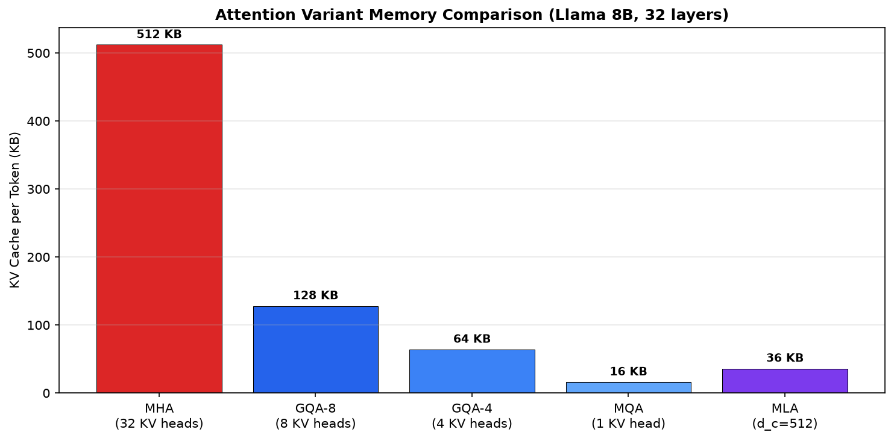

# Attention Mechanisms: The Evolution from MHA to MQA to GQA

Every token your model generates requires reading from the KV cache, and the size of that cache is determined entirely by your attention mechanism's design. This module traces the architectural evolution that took KV cache memory from "unaffordable at scale" to "hundreds of concurrent users on a single GPU." Understanding this progression is not optional for inference engineers: it is the single most impactful design decision affecting your serving costs.

## Back-Reference: What You Already Know

From Module 02.1, you know the KV cache stores K and V projection tensors for every layer and every token in the sequence. For Llama 3.1 8B with GQA (8 KV heads, 128 head dimension, 32 layers, FP16), each token costs approximately 128 KB of GPU memory. You saw how this grows linearly with sequence length and batch size, creating the fundamental memory pressure that limits concurrent serving.

What Module 02.1 did not explain is *why* Llama uses 8 KV heads instead of 32, or why earlier models like GPT-3 used 96 KV heads matching their query heads exactly. The answer lies in a three-stage evolution of the attention mechanism itself, each stage trading a small amount of model quality for a dramatic reduction in KV cache size.

---




## Multi-Head Attention (MHA): The Original Design

Multi-Head Attention, introduced in "Attention Is All You Need" (Vaswani et al., 2017), gives every attention head its own independent Key and Value projections. If your model has `n_heads` query heads, it also has `n_heads` KV heads. Each head independently attends to different aspects of the input: one head might track syntactic relationships, another semantic similarity, another positional proximity.

### The Architecture

In MHA, the input hidden state `x` of dimension `d_model` is projected through three separate weight matrices per head:

```
Q_i = x @ W_Q_i    # shape: [seq_len, head_dim]
K_i = x @ W_K_i    # shape: [seq_len, head_dim]
V_i = x @ W_V_i    # shape: [seq_len, head_dim]
```

where `i` ranges from 1 to `n_heads`, and `head_dim = d_model / n_heads`.

Each head computes attention independently:

```
Attention_i = softmax(Q_i @ K_i^T / sqrt(head_dim)) @ V_i
```

The outputs are concatenated and projected back to `d_model`:

```
Output = Concat(Attention_1, ..., Attention_n) @ W_O
```

### KV Cache Memory Formula for MHA

During autoregressive inference, every generated token adds its K and V vectors to the cache for ALL heads across ALL layers:

```
KV_cache_per_token (MHA) = 2 × n_kv_heads × head_dim × n_layers × bytes_per_element
```

Since `n_kv_heads = n_heads` in MHA:

```
KV_cache_per_token (MHA) = 2 × n_heads × head_dim × n_layers × bytes_per_element
```

### Concrete Example: GPT-3 175B

GPT-3 uses pure MHA with these parameters:
- `n_heads = 96`
- `head_dim = 128`
- `n_layers = 96`
- `dtype = FP16 (2 bytes)`

```
KV per token = 2 × 96 × 128 × 96 × 2 = 4,718,592 bytes ≈ 4.5 MB/token
```

For a 2048-token context: `4.5 MB × 2048 = 9.2 GB` of KV cache per request. With 8 concurrent users at 2K context, you need 73.6 GB just for KV cache, consuming nearly all of an 80 GB A100.

### Why MHA Works for Training but Fails for Serving

During training, you process the entire sequence in parallel. The KV projections are computed once and used immediately. There is no cache because you already have all tokens. The memory cost is proportional to the batch size and sequence length, but it is transient.

During inference, the KV cache persists for the entire generation. Each new token requires reading the full cache from memory (memory-bandwidth bound), and the cache must remain allocated until the request completes. This is the fundamental asymmetry: a mechanism designed for parallel training creates an unbearable memory burden during sequential generation.

### Models Using MHA

| Model | Year | n_heads | head_dim | Layers | KV/token |
|-------|------|---------|----------|--------|----------|
| GPT-2 | 2019 | 12-25 | 64 | 12-48 | 36-600 KB |
| GPT-3 | 2020 | 96 | 128 | 96 | 4.5 MB |
| BERT-Large | 2018 | 16 | 64 | 24 | 49 KB |
| OPT-175B | 2022 | 96 | 128 | 96 | 4.5 MB |
| BLOOM-176B | 2022 | 112 | 128 | 70 | 4.0 MB |

The pattern is clear: as models scale, MHA's KV cache becomes the dominant memory consumer, leaving less room for batching concurrent requests.

---

## Multi-Query Attention (MQA): Radical Compression

In 2019, Noam Shazeer published "Fast Transformer Decoding: One Write-Head is All You Need," proposing a startlingly simple modification: instead of giving each attention head its own KV projections, share a single K and a single V across ALL query heads.

### The Key Insight

Shazeer observed that during inference, the memory bandwidth consumed by loading KV cache from HBM dominates the compute time. The attention computation itself is fast (it's just matrix multiplies on small head_dim vectors). The bottleneck is moving 4.5 MB of KV data per token from HBM to the compute units for every single generated token.

If all query heads share the same K and V, you only need to store and load one set of KV vectors per layer, regardless of how many query heads you have.

### The Architecture

```
# MQA: n_heads query projections, but only ONE KV projection
Q_i = x @ W_Q_i    # i = 1..n_heads, shape: [seq_len, head_dim]
K   = x @ W_K      # SINGLE shared K, shape: [seq_len, head_dim]
V   = x @ W_V      # SINGLE shared V, shape: [seq_len, head_dim]

# Each query head attends using the SAME K and V
Attention_i = softmax(Q_i @ K^T / sqrt(head_dim)) @ V
```

### KV Cache Memory Formula for MQA

```
KV_cache_per_token (MQA) = 2 × 1 × head_dim × n_layers × bytes_per_element
```

Notice `n_kv_heads = 1` regardless of how many query heads exist.

### Compression Ratio

For a model with `n_heads` query heads:

```
MQA_compression = n_heads / 1 = n_heads
```

A 32-head model gets 32× KV cache reduction. A 96-head model like GPT-3 would get 96× reduction.

### Concrete Example: PaLM (if MQA)

PaLM 540B uses MQA with:
- `n_heads = 48` (query heads)
- `n_kv_heads = 1` (MQA)
- `head_dim = 256`
- `n_layers = 118`
- `dtype = FP16`

```
KV per token = 2 × 1 × 256 × 118 × 2 = 120,832 bytes ≈ 118 KB/token
```

Compare to MHA equivalent: `2 × 48 × 256 × 118 × 2 = 5.8 MB/token`. That is a 48× reduction.

### The Quality Cost

The compression is not free. When all query heads share the same KV representation, the model loses the ability to attend to different aspects of the input with different head-specific Key/Value spaces. Empirical results from Shazeer (2019) and follow-up work show:

- **Short-context tasks (< 512 tokens)**: Negligible quality difference. The shared KV representation captures sufficient information for most heads.
- **Long-context tasks (> 2K tokens)**: Measurable degradation (0.5-2% on benchmarks). Different heads genuinely benefit from specialized KV projections when the sequence is long enough to contain diverse information.
- **Knowledge-intensive tasks**: Moderate degradation. Tasks like open-domain QA where the model must recall specific facts from long contexts suffer more than summarization tasks.

### Training Consideration

Training an MQA model from scratch requires no modification to the training procedure. The model simply has fewer parameters in the KV projection (by a factor of `n_heads`). However, converting an existing MHA checkpoint to MQA is non-trivial. Shazeer (2019) found that "uptrained" MQA models (pre-trained with MHA, then fine-tuned with shared KV) recover most but not all of the quality difference within 5-10% additional training compute.

### Models Using MQA

| Model | Year | Query Heads | KV Heads | Compression |
|-------|------|-------------|----------|-------------|
| PaLM | 2022 | 48 | 1 | 48× |
| Falcon-40B | 2023 | 64 | 1 | 64× |
| StarCoder | 2023 | 48 | 1 | 48× |
| MPT-30B | 2023 | 64 | 1 | 64× |

---

## Grouped-Query Attention (GQA): The Practical Middle Ground

In June 2023, Ainslie et al. published "GQA: Training Generalized Multi-Query Transformer Models from Multi-Head Checkpoints," establishing the design that would become the industry default within a year. The insight: you do not need to go all the way to one KV head. Grouping query heads into clusters that share KV projections captures most of MQA's memory savings with almost none of its quality loss.

### The Architecture

In GQA, the `n_heads` query heads are divided into `n_kv_groups` groups. Each group shares one K and one V projection. The number of KV heads equals the number of groups:

```
n_kv_heads = n_heads / group_size
```

For example, Llama 3.1 8B has 32 query heads divided into 8 groups of 4. Each group of 4 query heads shares one KV head.

```
# GQA: n_heads query projections, n_kv_heads KV projections
Q_i = x @ W_Q_i       # i = 1..n_heads, shape: [seq_len, head_dim]
K_g = x @ W_K_g       # g = 1..n_kv_heads, shape: [seq_len, head_dim]
V_g = x @ W_V_g       # g = 1..n_kv_heads, shape: [seq_len, head_dim]

# Query heads in group g attend using K_g and V_g
# If group_size=4, heads {1,2,3,4} share K_1,V_1
# heads {5,6,7,8} share K_2,V_2, etc.
```

### KV Cache Memory Formula for GQA

```
KV_cache_per_token (GQA) = 2 × n_kv_heads × head_dim × n_layers × bytes_per_element
```

### Compression Relative to MHA

```
GQA_compression = n_heads / n_kv_heads = group_size
```

For Llama 3.1 8B with `group_size = 4`:

```
KV per token = 2 × 8 × 128 × 32 × 2 = 131,072 bytes = 128 KB/token
MHA equivalent = 2 × 32 × 128 × 32 × 2 = 524,288 bytes = 512 KB/token
Compression = 4×
```

### Why GQA Wins: The Quality-Memory Pareto Frontier

Ainslie et al. (2023) systematically evaluated the quality-memory tradeoff across group sizes. Their key findings:

1. **GQA-8 matches MHA quality** on most benchmarks (within 0.1-0.3%) while providing 4× memory reduction for a 32-head model.
2. **MQA degrades measurably** on long-form generation and multi-hop reasoning, with 0.5-2% drops that compound across benchmark suites.
3. **The sweet spot is group_size 4-8**: Going below 4 KV heads provides diminishing memory returns while accelerating quality loss.

The reason GQA preserves quality better than MQA is that different groups of query heads CAN still specialize their attention patterns through different KV representations. With 8 KV heads, the model retains 8 distinct "views" of the input, which is sufficient for most tasks. MQA's single view is too constraining for complex reasoning.

### Converting MHA Checkpoints to GQA

One of GQA's practical advantages is straightforward checkpoint conversion. Ainslie et al. (2023) showed two approaches:

**Mean pooling**: Average the KV weights within each group:
```python
# Convert 32 KV heads to 8 GQA groups
for g in range(n_kv_heads):
    start = g * group_size
    end = start + group_size
    W_K_gqa[g] = mean(W_K_mha[start:end], dim=0)
    W_V_gqa[g] = mean(W_V_mha[start:end], dim=0)
```

**Selective**: Pick one representative head per group (the one with highest attention entropy). This requires less compute but slightly more quality variance.

After conversion, 5-10% additional pre-training compute recovers the remaining quality gap. This "uptraining" approach allowed Meta to convert Llama 2 from MHA to GQA for Llama 2 70B with minimal overhead.

### Concrete Example: Llama 3.1 Family

| Model | Query Heads | KV Heads | Group Size | KV/token | vs MHA |
|-------|-------------|----------|------------|----------|--------|
| Llama 3.1 8B | 32 | 8 | 4 | 128 KB | 4× smaller |
| Llama 3.1 70B | 64 | 8 | 8 | 256 KB | 8× smaller |
| Llama 3.1 405B | 128 | 8 | 16 | 512 KB | 16× smaller |

Notice how Meta keeps `n_kv_heads = 8` constant across all model sizes, increasing the group size (and compression ratio) as models scale. This is a deliberate design choice: larger models have more query heads that can share KV projections without quality loss, because their increased capacity compensates for the shared representation.

### Models Using GQA

| Model | Year | Query Heads | KV Heads | Group Size |
|-------|------|-------------|----------|------------|
| Llama 2 70B | 2023 | 64 | 8 | 8 |
| Llama 3/3.1 8B | 2024 | 32 | 8 | 4 |
| Llama 3/3.1 70B | 2024 | 64 | 8 | 8 |
| Mistral 7B | 2023 | 32 | 8 | 4 |
| Mixtral 8x7B | 2024 | 32 | 8 | 4 |
| Gemma 2 | 2024 | 16 | 8 | 2 |
| Qwen 2 | 2024 | 28 | 4 | 7 |
| DeepSeek-V2 | 2024 | 128 | Uses MLA | See 02.3 |

---

## Unified Comparison

### Memory Per Token (FP16, 32 Layers, head_dim=128)

| Mechanism | KV Heads (32-head model) | Memory/Token | Relative to MHA | Quality Impact |
|-----------|--------------------------|--------------|-----------------|----------------|
| MHA | 32 | 512 KB | 1.0× (baseline) | None (baseline) |
| GQA-8 | 8 | 128 KB | 0.25× (4× smaller) | Negligible (< 0.3%) |
| GQA-4 | 4 | 64 KB | 0.125× (8× smaller) | Small (0.3-0.5%) |
| MQA | 1 | 16 KB | 0.03× (32× smaller) | Moderate (0.5-2%) |

### Concurrent Users at 4K Context on 80 GB A100

Assuming 20 GB available for KV cache (rest used by model weights and activations):

| Mechanism | KV per user (4K ctx) | Max Concurrent Users |
|-----------|---------------------|---------------------|
| MHA | 2,048 MB | 9 users |
| GQA-8 | 512 MB | 39 users |
| GQA-4 | 256 MB | 78 users |
| MQA | 64 MB | 312 users |

This table is the reason GQA became the industry default. Going from 9 concurrent users to 39 users on the same hardware directly translates to 4× higher revenue per GPU at equivalent latency.

### Quality Benchmarks (from Ainslie et al., 2023)

On a T5-XXL equivalent model:

| Mechanism | MMLU | HellaSwag | TriviaQA | SQuAD | Average |
|-----------|------|-----------|----------|-------|---------|
| MHA | 58.3 | 82.1 | 71.5 | 88.2 | 75.0 |
| GQA-8 | 58.1 | 81.9 | 71.2 | 88.0 | 74.8 |
| GQA-4 | 57.8 | 81.6 | 70.8 | 87.6 | 74.5 |
| MQA | 57.2 | 81.0 | 69.4 | 86.8 | 73.6 |

The 1.4-point average gap between MHA and MQA may seem small, but it compounds: a model that is 1.4% worse on every subtask will produce noticeably lower-quality outputs in production, especially for multi-step reasoning chains where errors accumulate.

---

## Code: Computing KV Cache Size for Each Variant

```python
def compute_kv_cache_size(
    n_heads: int,
    n_kv_heads: int,
    head_dim: int,
    n_layers: int,
    seq_len: int,
    dtype_bytes: int = 2,  # FP16
    batch_size: int = 1,
) -> dict:
    """Compute KV cache memory for any attention variant.
    
    Args:
        n_heads: Number of query heads (determines variant name)
        n_kv_heads: Number of KV heads (1=MQA, <n_heads=GQA, =n_heads=MHA)
        head_dim: Dimension per head
        n_layers: Number of transformer layers
        seq_len: Sequence length (tokens in context)
        dtype_bytes: Bytes per element (2=FP16, 1=INT8)
        batch_size: Number of concurrent sequences
    
    Returns:
        Dictionary with memory breakdown
    """
    # Determine variant name
    if n_kv_heads == n_heads:
        variant = "MHA"
    elif n_kv_heads == 1:
        variant = "MQA"
    else:
        variant = f"GQA-{n_kv_heads}"
    
    # Core formula: 2 (K+V) × kv_heads × head_dim × layers × seq × dtype × batch
    per_token = 2 * n_kv_heads * head_dim * n_layers * dtype_bytes
    per_sequence = per_token * seq_len
    total = per_sequence * batch_size
    
    # Compare to MHA baseline
    mha_per_token = 2 * n_heads * head_dim * n_layers * dtype_bytes
    compression = mha_per_token / per_token
    
    return {
        "variant": variant,
        "per_token_bytes": per_token,
        "per_token_kb": per_token / 1024,
        "per_sequence_mb": per_sequence / (1024**2),
        "total_mb": total / (1024**2),
        "compression_vs_mha": f"{compression:.1f}×",
        "group_size": n_heads // n_kv_heads,
    }


# === Llama 3.1 8B (GQA-8) ===
result = compute_kv_cache_size(
    n_heads=32, n_kv_heads=8, head_dim=128,
    n_layers=32, seq_len=4096, batch_size=1
)
print(f"Llama 3.1 8B ({result['variant']})")
print(f"  Per token: {result['per_token_kb']:.1f} KB")
print(f"  Per sequence (4K): {result['per_sequence_mb']:.1f} MB")
print(f"  Compression vs MHA: {result['compression_vs_mha']}")
print()

# === Same model as MHA (hypothetical) ===
result_mha = compute_kv_cache_size(
    n_heads=32, n_kv_heads=32, head_dim=128,
    n_layers=32, seq_len=4096, batch_size=1
)
print(f"Hypothetical MHA equivalent ({result_mha['variant']})")
print(f"  Per token: {result_mha['per_token_kb']:.1f} KB")
print(f"  Per sequence (4K): {result_mha['per_sequence_mb']:.1f} MB")
print()

# === Same model as MQA (hypothetical) ===
result_mqa = compute_kv_cache_size(
    n_heads=32, n_kv_heads=1, head_dim=128,
    n_layers=32, seq_len=4096, batch_size=1
)
print(f"Hypothetical MQA equivalent ({result_mqa['variant']})")
print(f"  Per token: {result_mqa['per_token_kb']:.1f} KB")
print(f"  Per sequence (4K): {result_mqa['per_sequence_mb']:.1f} MB")
print(f"  Compression vs MHA: {result_mqa['compression_vs_mha']}")
print()

# === Concurrent user capacity ===
gpu_memory_gb = 80
model_weights_gb = 16  # Llama 8B in FP16
activation_gb = 4
available_for_kv_gb = gpu_memory_gb - model_weights_gb - activation_gb

for name, kv_per_seq_mb in [
    ("MHA", result_mha['per_sequence_mb']),
    ("GQA-8", result['per_sequence_mb']),
    ("MQA", result_mqa['per_sequence_mb']),
]:
    max_users = int((available_for_kv_gb * 1024) / kv_per_seq_mb)
    print(f"  {name}: {max_users} concurrent users at 4K context on A100-80GB")
```

Expected output:
```
Llama 3.1 8B (GQA-8)
  Per token: 128.0 KB
  Per sequence (4K): 512.0 MB
  Compression vs MHA: 4.0×

Hypothetical MHA equivalent (MHA)
  Per token: 512.0 KB
  Per sequence (4K): 2048.0 MB

Hypothetical MQA equivalent (MQA)
  Per token: 16.0 KB
  Per sequence (4K): 64.0 MB
  Compression vs MHA: 32.0×

  MHA: 29 concurrent users at 4K context on A100-80GB
  GQA-8: 117 concurrent users at 4K context on A100-80GB
  MQA: 960 concurrent users at 4K context on A100-80GB
```

---

## The Tradeoff Triangle: Memory vs Quality vs Training Cost

Every attention mechanism design sits somewhere on a three-dimensional tradeoff surface:

### Memory Efficiency
- **MHA**: Baseline. Full KV cache. Maximum memory pressure.
- **GQA**: Configurable reduction. Group size is your dial.
- **MQA**: Maximum compression. Minimal cache footprint.

### Model Quality
- **MHA**: Best representational capacity. Each head sees unique KV projections.
- **GQA**: Near-MHA quality. Groups of heads share similar attention patterns anyway (empirically validated by Ainslie et al.).
- **MQA**: Measurable degradation on complex, long-context tasks. The single shared view bottlenecks information flow.

### Training Cost for Conversion
- **MHA → MHA**: Zero. Already trained.
- **MHA → GQA**: 5-10% additional pre-training compute for uptraining. Mean-pool KV weights, then continue training.
- **MHA → MQA**: 10-15% additional compute. Larger quality gap to recover.
- **Train GQA from scratch**: Same cost as MHA training. Just fewer KV parameters.
- **Train MQA from scratch**: Slightly cheaper than MHA (fewer parameters), same number of FLOPs.

The industry consensus as of 2024-2025 is clear: train with GQA from scratch. The quality is equivalent to MHA, the memory savings are substantial (4-16× depending on model size), and there is no conversion cost. MQA remains relevant only for latency-critical applications where every microsecond of KV cache loading matters (e.g., real-time voice assistants generating tokens at 100+ tokens/second).

---

## When to Use Which: A Decision Framework

### Use MHA When:
- **Training-only workloads** where inference memory is irrelevant
- **Small models (< 1B parameters)** where KV cache is already manageable
- **Research/experimentation** where you need maximum representational flexibility
- **Tasks where head specialization is critical** (e.g., multi-modal models where different heads attend to different modalities)

### Use GQA When:
- **Production serving** (this is the default choice in 2024-2025)
- **Any model > 7B parameters** where KV cache becomes a bottleneck
- **Long-context applications** (8K-128K tokens) where MQA degrades
- **Cost-sensitive deployments** where you need to maximize users per GPU
- **Converting existing MHA models** with minimal quality regression

### Use MQA When:
- **Ultra-low-latency serving** (voice assistants, real-time completion)
- **Extremely high concurrency** (thousands of simultaneous users on limited hardware)
- **Short-context applications** (< 512 tokens) where quality loss is minimal
- **Code completion** where outputs are short and speed matters more than long-range coherence

### The Production Default

If you are designing a new LLM for inference serving and have no other constraints, use GQA with these guidelines:

```
n_kv_heads = max(4, n_heads // group_size)
```

Where `group_size` depends on model size:
- **7-13B models**: group_size = 4 (like Llama 3.1 8B, Mistral 7B)
- **30-70B models**: group_size = 8 (like Llama 3.1 70B)
- **100B+ models**: group_size = 16 (like Llama 3.1 405B)

Larger models tolerate higher compression because their increased parameter count compensates for the shared KV representation.

---

## Forward Pointer: Beyond GQA

GQA reduces KV cache by sharing heads within groups, but the dimensionality of each KV head remains unchanged at `head_dim` (typically 128). Module 02.3 introduces Multi-Latent Attention (MLA), used in DeepSeek-V2, which takes compression further by projecting the KV cache into a low-rank latent space. Instead of storing full 128-dimensional vectors per KV head, MLA stores compressed latent vectors of 64 or fewer dimensions, achieving compression ratios that surpass even MQA while maintaining GQA-level quality. This represents the next frontier in attention mechanism design for inference efficiency.

---

## Mental Model

Think of attention mechanisms as a camera system:

- **MHA** gives each camera (head) its own unique lens (K) and film (V). Maximum information, maximum storage cost.
- **MQA** gives all cameras the same single lens and film. Cheap storage, but every camera sees the same thing.
- **GQA** groups cameras into clusters sharing a lens and film. Each cluster sees something different, but cameras within a cluster share a view.

The fundamental tension: **fewer KV heads = smaller cache = more concurrent users, but the question is always: at what quality cost?** GQA answered this definitively: for groups of 4-8, the cost is negligible.

---

## Matplotlib Chart for Lab

The companion `lab.ipynb` should include a visualization with these specifications:

**Chart 1: KV Cache Size vs Attention Mechanism**
- Bar chart showing KV cache per token (KB) for MHA, GQA-8, GQA-4, GQA-2, MQA
- Configuration: Llama 3.1 8B baseline (32 heads, 128 head_dim, 32 layers, FP16)
- Y-axis: KV cache per token (KB), log scale
- Annotate compression ratio above each bar
- Color: gradient from red (MHA) to green (MQA) showing memory improvement

**Chart 2: Quality-Memory Pareto Frontier**
- Scatter plot with X=KV memory per token (KB, log), Y=benchmark score (%)
- Plot points for MHA, GQA-8, GQA-4, MQA with model names
- Draw Pareto frontier line
- Highlight the "sweet spot" region (GQA-4 to GQA-8) with a shaded box

**Chart 3: Concurrent Users by Mechanism**
- Horizontal bar chart showing max concurrent users on A100-80GB at 4K context
- For each of: MHA, GQA-8, GQA-4, MQA
- Annotate with $/user/hour assuming $2/GPU-hour

These charts make the economic argument visceral: the attention mechanism directly determines your serving cost per user.

---

## Key Takeaways

1. **MHA creates independent KV projections per head**, making KV cache scale linearly with head count. This was designed for training, not serving.
2. **MQA (Shazeer, 2019) collapses all KV heads to one**, achieving maximum compression (32-96×) at a measurable quality cost on long-context tasks.
3. **GQA (Ainslie et al., 2023) groups query heads to share KV projections**, providing 4-16× compression with negligible quality loss. This is the industry standard.
4. **The group size scales with model size**: larger models tolerate more sharing because their capacity compensates.
5. **The economic impact is direct**: 4× smaller KV cache means 4× more concurrent users on the same GPU, which means 4× better unit economics.

---

## References

- Vaswani, A., Shazeer, N., Parmar, N., et al. (2017). "Attention Is All You Need." NeurIPS 2017.
- Shazeer, N. (2019). "Fast Transformer Decoding: One Write-Head is All You Need." arXiv:1911.02150.
- Ainslie, J., Lee-Thorp, J., de Jong, M., Zemlyanskiy, Y., Lebrón, F., Sanghai, S. (2023). "GQA: Training Generalized Multi-Query Transformer Models from Multi-Head Checkpoints." EMNLP 2023.
- Touvron, H., et al. (2023). "Llama 2: Open Foundation and Fine-Tuned Chat Models." arXiv:2307.09288.
- Dubey, A., et al. (2024). "The Llama 3 Herd of Models." arXiv:2407.21783.
- Jiang, A.Q., et al. (2023). "Mistral 7B." arXiv:2310.06825.


---

## Deep Dive: How GQA Affects Inference Kernels

The attention mechanism choice does not just affect memory. It fundamentally changes how inference kernels execute on GPU hardware, and understanding this connection explains why GQA delivers better latency in addition to better memory efficiency.

### Memory Bandwidth During Decoding

During the decode phase (generating one token at a time), the dominant operation is loading the KV cache from HBM to compute attention scores. The arithmetic intensity of this operation is extremely low: for each loaded KV vector, you perform only a dot product (head_dim multiplications and additions). This makes decode attention purely memory-bandwidth bound.

The time to generate one token's attention scores:

```
T_attention = KV_cache_size / HBM_bandwidth
```

For an A100 with 2 TB/s HBM bandwidth, serving Llama 3.1 8B at 4K context:

| Mechanism | KV to Load | Load Time | Relative |
|-----------|-----------|-----------|----------|
| MHA | 2,048 MB | 1.02 ms | 4.0× |
| GQA-8 | 512 MB | 0.26 ms | 1.0× (baseline) |
| MQA | 64 MB | 0.03 ms | 0.12× |

GQA-8 provides a 4× latency reduction over MHA purely from reduced memory bandwidth requirements. This is independent of the memory capacity savings for batching.

### Flash Attention Interaction

FlashAttention (Dao et al., 2022) optimizes the prefill phase by avoiding materializing the full attention matrix. However, FlashAttention's tiling strategy interacts differently with each attention variant:

- **MHA + FlashAttention**: Each head processes independently. Tile sizes are optimized per head. Full benefit.
- **GQA + FlashAttention**: The kernel must broadcast shared KV tiles across multiple query heads within a group. Modern FlashAttention-2 handles this efficiently with a dedicated GQA kernel path that loads KV tiles once and applies them to all query heads in the group.
- **MQA + FlashAttention**: Maximum KV reuse. The single KV tile is loaded once and reused across all query heads. This gives MQA the best compute-to-memory ratio during prefill.

In practice, FlashAttention-2 with GQA achieves within 5-10% of the theoretical bandwidth-optimal computation, making the attention mechanism choice the primary lever rather than kernel optimization.

### Tensor Parallelism Implications

When distributing a model across multiple GPUs using tensor parallelism (TP), the KV heads are sharded across devices. This creates a constraint: `n_kv_heads` must be divisible by `TP_degree`.

| TP Degree | MHA (32 KV heads) | GQA-8 | GQA-4 | MQA |
|-----------|-------------------|-------|-------|-----|
| TP=1 | 32 heads/GPU | 8 | 4 | 1 |
| TP=2 | 16 heads/GPU | 4 | 2 | ❌ |
| TP=4 | 8 heads/GPU | 2 | 1 | ❌ |
| TP=8 | 4 heads/GPU | 1 | ❌ | ❌ |

MQA with TP > 1 requires replicating the single KV head across devices (wasteful) or redesigning the parallelism strategy. GQA-8 cleanly supports up to TP=8, which is why Meta chose 8 KV heads: it aligns with their standard 8-GPU node configuration.

This is a practical engineering constraint that influenced the industry's convergence on GQA-8 over MQA. The parallelism-friendly nature of 8 KV heads across 8-GPU nodes made GQA the natural fit for large-scale deployment.

---

## Historical Timeline

Understanding when each mechanism was introduced and adopted reveals how quickly the field converges on proven techniques:

| Year | Event | Impact |
|------|-------|--------|
| 2017 | Vaswani et al. introduce MHA in "Attention Is All You Need" | Standard for 5 years |
| 2019 | Shazeer proposes MQA | Adopted by PaLM, Falcon, StarCoder |
| 2022 | PaLM ships with MQA at 540B scale | Proves MQA works for large models |
| 2023 Jan | Mistral 7B ships with GQA-8 | First popular open model with GQA |
| 2023 Jun | Ainslie et al. publish GQA paper | Formalizes the technique |
| 2023 Jul | Meta releases Llama 2 70B with GQA-8 | Industry adoption begins |
| 2024 Apr | Llama 3 family: all sizes use GQA-8 | GQA becomes universal default |
| 2024 May | DeepSeek-V2 introduces MLA | Next evolution (see Module 02.3) |

The adoption curve from Shazeer's 2019 paper to universal GQA adoption in 2024 took 5 years. The conversion from the GQA paper (June 2023) to industry default took less than 12 months. This acceleration reflects how critical KV cache efficiency became as context lengths grew from 2K to 128K tokens.

---

## Common Misconceptions

### "MQA is strictly worse than GQA"

Not true. For applications with short contexts (< 512 tokens) and extreme latency requirements, MQA's 32× compression can be the right choice. Code completion models (StarCoder, CodeGen) use MQA because outputs are short, latency matters more than long-range coherence, and the quality difference on short code completions is imperceptible.

### "GQA requires special training"

If training from scratch: no. You simply define fewer KV heads in your model config. The training procedure is identical to MHA. The "uptraining" mentioned in the GQA paper is only needed when converting an existing MHA checkpoint.

### "More KV heads always means better quality"

Not necessarily. Ainslie et al. showed that many MHA heads learn highly correlated KV representations. The heads within what would become a GQA group often attend to very similar patterns. Sharing was always implicit; GQA just makes it explicit and saves the redundant storage.

### "GQA only helps inference, not training"

Partially true. GQA primarily benefits inference by reducing KV cache. However, during training, fewer KV parameters mean slightly less memory for gradient states, which can allow larger batch sizes. The effect is modest (5-10% memory reduction during training) compared to the dramatic inference improvement.

---

## Practical Implementation Notes

### Detecting the Attention Type from Model Config

When working with HuggingFace models, you can determine the attention variant from the config:

```python
from transformers import AutoConfig

config = AutoConfig.from_pretrained("meta-llama/Llama-3.1-8B")

n_heads = config.num_attention_heads        # 32
n_kv_heads = config.num_key_value_heads     # 8

if n_kv_heads == n_heads:
    print("MHA")
elif n_kv_heads == 1:
    print("MQA")
else:
    print(f"GQA-{n_kv_heads} (group_size={n_heads // n_kv_heads})")
# Output: GQA-8 (group_size=4)
```

### Adjusting Batch Size Based on Attention Type

When estimating how many requests you can batch together:

```python
def max_batch_size(
    gpu_memory_gb: float,
    model_memory_gb: float,
    n_kv_heads: int,
    head_dim: int,
    n_layers: int,
    max_seq_len: int,
    dtype_bytes: int = 2,
    overhead_factor: float = 1.2,  # 20% overhead for activations, fragmentation
) -> int:
    """Estimate maximum batch size given attention mechanism."""
    available_gb = gpu_memory_gb - model_memory_gb
    available_bytes = available_gb * (1024**3)
    
    kv_per_sequence = (
        2 * n_kv_heads * head_dim * n_layers * max_seq_len * dtype_bytes
    )
    
    return int(available_bytes / (kv_per_sequence * overhead_factor))

# Llama 3.1 8B on A100-80GB
batch = max_batch_size(
    gpu_memory_gb=80, model_memory_gb=16,
    n_kv_heads=8, head_dim=128, n_layers=32,
    max_seq_len=4096
)
print(f"Max batch size: {batch}")  # ~97
```

---

## Summary: The Three-Sentence Version

Multi-Head Attention gives every head independent KV projections, creating a KV cache that scales linearly with head count and becomes the primary memory bottleneck during inference. Multi-Query Attention (Shazeer, 2019) compresses this to a single shared KV head, achieving 32-96× reduction at a measurable quality cost. Grouped-Query Attention (Ainslie et al., 2023) strikes the optimal balance: groups of 4-8 query heads share KV projections, delivering 4-16× compression with negligible quality loss, making it the universal default for production LLM serving.
