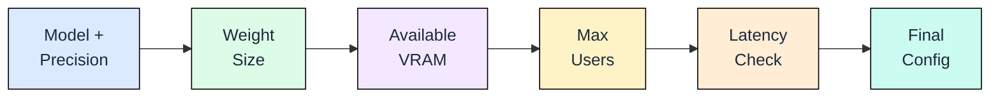
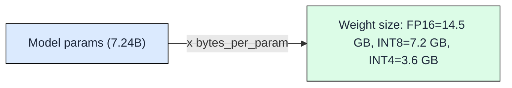
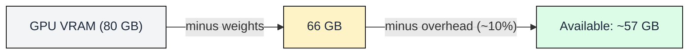
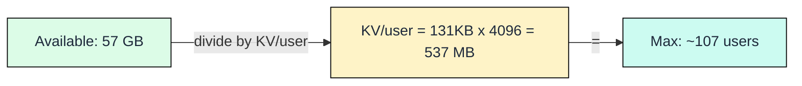
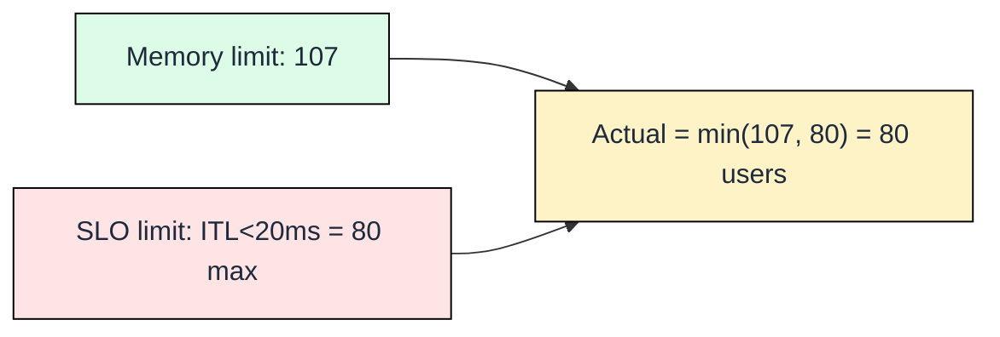
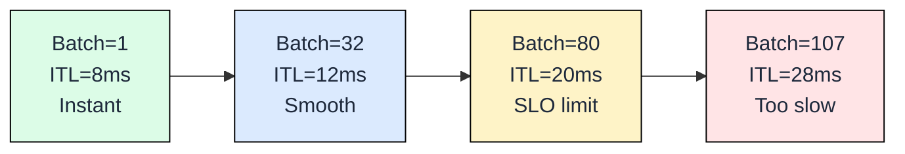
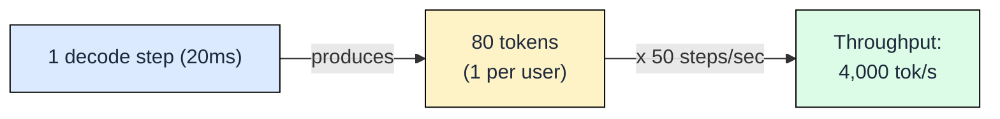
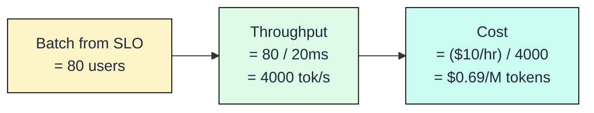
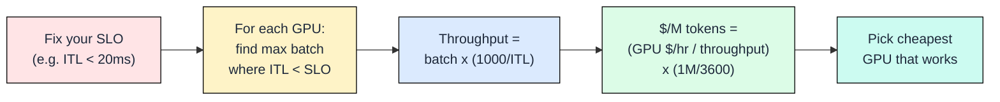

[](https://colab.research.google.com/github/harshuljain13/llm-inference-at-scale/blob/master/content/02_sizing_and_serving/02.1_deploying_your_model/lab.ipynb) [](https://molab.marimo.io/github/harshuljain13/llm-inference-at-scale/blob/master/content/02_sizing_and_serving/02.1_deploying_your_model/lab.ipynb)

# 2.1 Capacity Planning

You understand why LLM inference is expensive. This module gives you the complete decision framework for **one GPU**: what fits, how many users, at what cost. To serve more users than one GPU can handle, you add replicas (covered in Chapter 8).

## The Decision

Every deployment decision follows one pipeline. Each step narrows what is possible until you arrive at a concrete configuration.



## Step 1: Weight Memory



The first number you need is how much VRAM the model weights consume. The formula is straightforward:

```
weights_gb = parameters_billions x bytes_per_param
```

Bytes per parameter depends on precision: FP16 uses 2 bytes, INT8 uses 1 byte, INT4 uses 0.5 bytes.

| Model | FP16 (GB) | INT8 (GB) | INT4 (GB) |
|-------|-----------|-----------|-----------| 
| Mistral-7B | 14.0 | 7.0 | 3.5 |
| Llama-70B | 140.0 | 70.0 | 35.0 |
| Llama-405B | 810.0 | 405.0 | 202.5 |

This number is fixed once you choose your model and precision. It does not change with batch size or sequence length.

## Step 2: Available VRAM for KV Cache



Not all GPU memory goes to weights. You need a buffer for activations, CUDA kernels, and framework overhead (roughly 10% of total VRAM). Everything remaining is what you can spend on serving users.

```
available_vram = gpu_vram - weights - overhead (~10% of gpu_vram)
```

| GPU | Total VRAM | After 7B FP16 | After 70B INT4 |
|-----|-----------|---------------|----------------|
| A10G (24 GB) | 24 GB | 7.6 GB | — (doesn't fit) |
| A100 (80 GB) | 80 GB | 58.0 GB | 37.0 GB |
| H100 (80 GB) | 80 GB | 58.0 GB | 37.0 GB |

Everything left goes to KV cache, which stores your users' conversation state.

## Step 3: Max Concurrent Users



Each user's conversation occupies KV cache memory proportional to their context length. The per-token KV memory for a model is:

```
kv_per_token = num_kv_heads x head_dim x num_layers x 2 (K+V) x bytes_per_param
```

For Mistral-7B (FP16): 8 KV heads x 128 dim x 32 layers x 2 (K+V) x 2 bytes = 131 KB per token.
*(Why 8 KV heads instead of 32? Mistral uses Grouped-Query Attention (GQA), which shares K,V across groups of query heads. This 4x reduction is why GQA exists. Chapter 3 explains the mechanism.)*

The maximum concurrent users is:

```
max_users = available_vram / (kv_per_token x tokens_per_conversation)
```

| Context Length | KV per User (Mistral-7B FP16) | Max Users on A100 (58 GB available) |
|---------------|-------------------------------|-------------------------------------|
| 512 tokens | 67 MB | 865 |
| 2048 tokens | 268 MB | 216 |
| 8192 tokens | 1.07 GB | 54 |

This is the memory ceiling. You cannot exceed this regardless of how fast your GPU is.

## Step 4: How Many Should I Actually Serve?



Even if memory allows 216 users at 2048 context, serving that many simultaneously makes each user's tokens stream slower. Why? The GPU must read all model weights plus all active KV caches from HBM on every decode step. More users means more bytes read per step.

```
time_per_decode_step = (model_bytes + batch_size x kv_bytes_per_user) / memory_bandwidth
```

On an A100 (2 TB/s bandwidth) with Mistral-7B FP16 (14 GB weights) and 2048-token conversations (268 MB KV each):

- Batch=32: (14 + 32 x 0.268) / 2000 = 11.3 ms per token
- Batch=80: (14 + 80 x 0.268) / 2000 = 17.7 ms per token
- Batch=120: (14 + 120 x 0.268) / 2000 = 23.1 ms per token

If your SLO requires inter-token latency under 20 ms, the actual limit is roughly 90 users, not the 216 that memory allows.

Your actual limit = min(memory limit, latency limit).



| Batch Size | ITL (ms) | User Experience |
|-----------|----------|----------------|
| 1 | 8 | Instant streaming |
| 8 | 9 | Instant streaming |
| 32 | 12 | Smooth |
| 64 | 16 | Smooth |
| 80 | 20 | Acceptable (SLO limit) |
| 107 | 28 | Stuttering |

Your SLO determines where you stop on this line. If SLO = 20ms, you stop at batch=80 (amber). Everything to the right (rose) is too slow for your users.

ITL grows because each decode step must process more KV caches and more compute. The relationship is roughly:

```
ITL = (model_bytes + batch x kv_bytes_per_user) / bandwidth
```

As batch increases, the KV read cost (batch x kv_bytes) adds to the fixed weight-read cost. At batch=80, total read per step = 14.5 GB (weights) + 80 x 537 MB (KV) = ~57 GB. At 2 TB/s, that takes ~28ms. But in practice, weight reads and KV reads partially overlap, so actual ITL is lower (~20ms).

The takeaway: benchmark your actual hardware. The formula gives a rough estimate; real ITL depends on kernel implementation and memory access patterns.

## Step 5: Throughput

Throughput is how many tokens the GPU produces per second across ALL users combined.

Here is how it works: each decode step takes ITL milliseconds. In that single step, the GPU produces one token for EVERY user in the batch simultaneously (it reads the weights once and serves everyone in one pass).

The formula:

```
Throughput = batch_size x (1000 / ITL_ms)
           = 80 x (1000 / 20)
           = 80 x 50
           = 4,000 tokens/second
```

```
One decode step (20ms):  produces 80 tokens (1 per user, 80 users)
One second (50 steps):   produces 80 x 50 = 4,000 tokens
```



More users in the batch = more tokens per step = higher throughput. But recall from Step 4: more users also means higher ITL (fewer steps per second). These two effects partially cancel, which is why throughput eventually plateaus.

## Step 6: Cost Comparison

Throughput comes from Step 5 based on the max batch (from SLO) and the ITL at that batch.

Then compute cost per million tokens:

```
cost_per_M_tokens = (gpu_cost_per_hour / throughput_tok_s) x (1,000,000 / 3600)

Example: ($10/hr / 4000 tok/s) x (1M / 3600) = $0.69 per million tokens
```



Compare GPUs by repeating this calculation for each option:

| GPU | Max Batch (SLO=20ms) | ITL at max batch | Throughput | $/hr | $/M tokens |
|-----|---------------------|-----------------|-----------|------|-----------| 
| A10G | 25 | 18ms | 1,389 tok/s | $1.00 | $0.20 |
| A100-80 | 80 | 20ms | 4,000 tok/s | $3.50 | $0.24 |
| H100 | 120 | 18ms | 6,667 tok/s | $5.50 | $0.23 |

Pick the cheapest GPU that fits your model AND meets your SLO. Often a smaller GPU at lower batch beats a bigger GPU running half-empty.

## Scaling Beyond One GPU

This entire framework calculates capacity for a **single GPU**. To serve more users, deploy multiple replicas behind a load balancer:

```
Total capacity = users_per_replica x num_replicas
Example: 80 users/GPU x 10 GPUs = 800 concurrent users
```

Horizontal scaling (more replicas) is simple and linear. Vertical scaling (bigger GPUs or tensor parallelism) is covered in Chapter 7. Production serving systems (load balancing, autoscaling, routing) are covered in Chapter 8.

## Summary: The Decision



In plain English: fix your latency requirement first. Then for every GPU option, find the largest batch that stays within that requirement. That batch determines your throughput. Throughput plus GPU cost determines your cost per token. Pick the cheapest option that passes all checks.

**All formulas in one place:**

| Step | Formula | Example (Mistral-7B FP16 on A100-80GB) |
|------|---------|----------------------------------------|
| 1. Weight size | params x bytes_per_param | 7.24B x 2 = 14.5 GB |
| 2. Available VRAM | gpu_vram - weights - overhead | 80 - 14.5 - 8 = 57.5 GB |
| 3. KV per user | kv_per_token x tokens_per_conversation | 131 KB x 4096 = 537 MB |
| 3. Max users (memory) | available / kv_per_user | 57.5 GB / 537 MB = 107 |
| 4. Actual limit | min(memory_limit, slo_limit) | min(107, 80) = 80 |
| 5. Throughput | batch x (1000 / ITL_ms) | 80 x (1000/20) = 4,000 tok/s |
| 6. Cost | ($/hr / throughput) x (1M/3600) | ($10 / 4000) x 278 = $0.69/M |

The companion lab lets you run this calculation interactively for any model/GPU combination.

## FAQ

**Q: What if my model doesn't fit in a single GPU?**
Split across multiple GPUs using tensor parallelism. Weight memory divides evenly (70B INT4 on 2x A100 = 17.5 GB each), but you pay a communication overhead of 5-15% and lose some VRAM to tensor-parallel buffers.

**Q: Should I always quantize to INT4?**
Not necessarily. INT4 halves weight memory but introduces quality degradation, especially on reasoning tasks. For models under 13B, FP16 often fits comfortably on a single A100. Quantize when the model would otherwise require multi-GPU.

**Q: What about multi-GPU for throughput (not fit)?**
Data parallelism (running independent copies) scales throughput linearly. Two A100s each running 7B FP16 serve 2x the users at the same latency. This is simpler than tensor parallelism and preferred when the model fits on one GPU.

**Q: How accurate are these back-of-envelope calculations?**
Within 15-20% of real measurements. Actual engines (vLLM, TensorRT-LLM) use PagedAttention, continuous batching, and kernel fusion that shift numbers in both directions. Use these formulas for GPU selection, then benchmark for production SLOs.

**Q: What about activation memory during inference?**
Activation memory during decode is negligible (a few hundred MB) because you process one token per sequence. During prefill it scales with sequence length, but engines process prefill chunks to bound this. The 10% overhead buffer accounts for it.

## References

1. Pope et al., "Efficiently Scaling Transformer Inference," MLSys 2023.
2. Kwon et al., "Efficient Memory Management for Large Language Model Serving with PagedAttention," SOSP 2023.
3. NVIDIA, "H100 Tensor Core GPU Datasheet," 2023.
4. Dettmers et al., "GPTQ: Accurate Post-Training Quantization for Generative Pre-trained Transformers," ICLR 2023.
5. Aminabadi et al., "DeepSpeed Inference: Enabling Efficient Inference of Transformer Models at Unprecedented Scale," SC 2022.
