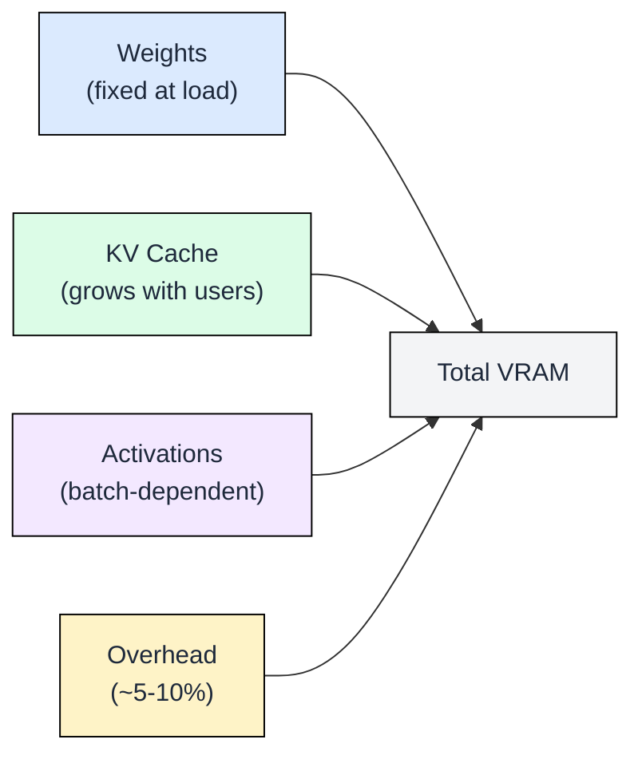
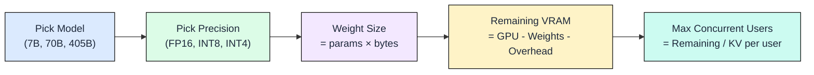
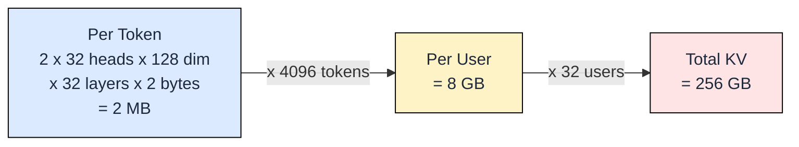

# 2.1 Capacity Planning

You know what consumes GPU memory: model weights, KV cache, activations, and runtime overhead (covered in Ch00). This module teaches you to turn that knowledge into deployment decisions: which GPU, what precision, how many cards, and how many concurrent users you can serve.

## The VRAM Equation (Recap)

**Total VRAM = Weights + KV Cache + Activations + Overhead**

That is the entire budget. Every deployment decision comes down to how you allocate these four slices. See Ch00.1 for the weights formula and Ch00.3 for KV cache derivation.

The key insight: weights are fixed once you choose a model and precision. KV cache grows in two dimensions: more users (each holds their own cache) and longer conversations (each token adds to the cache). Both compete for the same VRAM.

## Decision Framework

Every capacity planning exercise follows the same sequence:

**What "max concurrent users" means:** the number of people who can have an active, streaming response at the same instant. Each active user holds a KV cache in GPU memory until their request finishes. Once a response completes, that memory is freed for the next user. This is not total users per day; it is simultaneous active conversations.

**KV cache per user** depends on context length:

The formula: KV per token = 2 (K+V) x kv_heads x head_dim x layers x bytes. Multiply by context length for per-user cost. Multiply by concurrent users for total KV demand.

## Worked Examples

| Scenario | Weights | Available VRAM | KV/User (4K) | Max Users |
|----------|---------|---------------|--------------|-----------|
| Llama 8B FP16, 1×A100 80GB | 16 GB | 80 - 16 - 5 = 59 GB | 8 GB | **29** |
| Llama 70B INT8, 2×H100 80GB | 70 GB | 160 - 70 - 10 = 80 GB | 10 GB | **8** |
| Llama 70B INT4, 1×A100 80GB | 35 GB | 80 - 35 - 5 = 40 GB | 10 GB | **4** |

**Llama 8B FP16 on A100 80GB:**
- Weights: 8B × 2 bytes = 16 GB. Overhead ~5 GB. Remaining: 59 GB.
- KV per user at 4K context: 8 GB. Max concurrent: 59/2 = 29 users.

**Llama 70B INT8 on 2×H100:**
- Weights: 70B × 1 byte = 70 GB. Overhead ~10 GB. Remaining: 80 GB.
- KV per user at 4K: ~10 GB (70B has 80 KV heads × 128 dim × 80 layers). Max: 8 users.

**Llama 70B INT4 on single A100:**
- Weights: 70B × 0.5 bytes = 35 GB. Overhead ~5 GB. Remaining: 40 GB.
- KV per user at 4K: ~10 GB. Max: 4 users.

These numbers explain why production deployments use KV cache optimizations (PagedAttention, quantized KV) covered in Ch04.

## When to Add GPUs vs Quantize

| Factor | Add GPUs | Quantize |
|--------|----------|----------|
| Quality impact | None | Risk of degradation (especially INT4) |
| Cost | Linear increase | Near-zero marginal cost |
| Latency | Communication overhead (tensor parallel) | Slightly faster (less memory traffic) |
| Complexity | Networking, NCCL tuning | Calibration dataset, quality validation |
| Best for | Quality-critical workloads | Cost-sensitive, latency-sensitive |

**Decision rule:** Try INT8 first. Modern INT8 quantization (GPTQ, AWQ) causes negligible quality loss on most tasks. If quality degrades on your evaluation set, scale GPUs instead. Reserve INT4 for scenarios where cost constraints are absolute and you can tolerate slight accuracy drops.

## FAQ

**Q: Why do my real-world numbers differ from these calculations?**
Frameworks reserve memory for CUDA contexts, memory pools, and intermediate buffers. Expect 10-20% less usable VRAM than the theoretical maximum. Always benchmark with your actual serving framework.

**Q: Should I count activations separately from overhead?**
For back-of-envelope capacity planning, folding activations into a 5-10% overhead budget works well. For precise planning with large batch sizes, compute activations explicitly: roughly `batch_size × seq_len × hidden_dim × 2 bytes` per layer.

**Q: How does tensor parallelism change the math?**
Weights split evenly across GPUs. KV cache also splits. So 70B on 2 GPUs means each GPU holds 35 GB weights and half the KV cache. Total capacity scales linearly minus communication overhead (~5-10%).

**Q: What about long-context models (32K, 128K)?**
KV cache scales linearly with context length. At 128K context, Llama 8B needs 256 GB KV per user, making it impossible to serve even one user without KV compression techniques (Ch04).

**Q: When does it make sense to use multiple smaller GPUs vs one large GPU?**
Multiple smaller GPUs add communication overhead but cost less per GB. Use them when: (a) the model does not fit on a single GPU, or (b) you need more total KV budget than one GPU provides.

## References

1. NVIDIA A100 Datasheet: 80 GB HBM2e, 2 TB/s bandwidth
2. NVIDIA H100 Datasheet: 80 GB HBM3, 3.35 TB/s bandwidth
3. Llama 3 Model Card (Meta, 2024): Architecture details, GQA head counts
4. Frantar et al., "GPTQ: Accurate Post-Training Quantization" (ICLR 2023)
5. Lin et al., "AWQ: Activation-aware Weight Quantization" (MLSys 2024)
