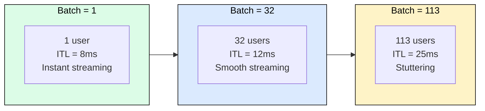
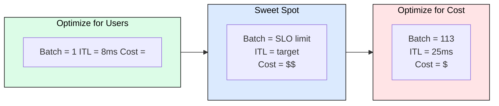

# 2.2 Batch Size and Throughput

[](https://colab.research.google.com/github/harshuljain13/llm-inference-at-scale/blob/master/content/02_sizing_and_serving/02.2_batch_size_and_throughput/lab.ipynb)
[](https://molab.marimo.io/github/harshuljain13/llm-inference-at-scale/blob/master/content/02_sizing_and_serving/02.2_batch_size_and_throughput/lab.ipynb)

Module 02.1 told you the memory limit: a single A100-80GB can fit roughly 113 concurrent users for Llama-3.1-8B. But should you actually serve 113 at once? This module explains why cramming more users per GPU makes each user's experience worse, and how to find the batch size that balances cost against quality.

## What Happens When You Add More Users



Why does inter-token latency (ITL) grow with batch size? Two reasons:

**More compute per step.** Each decode step runs a matrix multiply for every user in the batch. At batch=113, the GPU performs 113x more arithmetic than batch=1 before any single user gets their next token.

**More KV cache reads.** Attention must scan each user's separate KV cache. At batch=113, the GPU reads 113 independent caches from HBM every step, and memory bandwidth is the bottleneck during decode (see Module 01.3).

Both effects add time to each decode step. Since ITL equals the duration of one decode step, more users means slower per-user streaming.

## The Business Tradeoff



| Batch Size | Throughput (tok/s) | ITL (ms) | User Experience | Relative Cost/1M tokens |
|---|---|---|---|---|
| 1 | 125 | 8 | Instant streaming | $$$$ |
| 16 | 1,600 | 10 | Smooth | $$ |
| 64 | 4,800 | 18 | Acceptable | $ |
| 113 | 5,500 | 25 | Stuttering | $ |

Notice: throughput scales sub-linearly (113x batch gives only 44x throughput) because memory bandwidth saturates. You get diminishing returns while user experience degrades linearly.

## Finding Your Limit: The SLO

Your Service Level Objective (SLO) determines the maximum batch size you can actually use:

| Use Case | ITL SLO | Practical Batch Limit |
|---|---|---|
| Consumer chatbot | < 30ms | ~100 |
| Code copilot | < 15ms | ~30 |
| Real-time agent | < 10ms | ~8 |

The formula is simple:

```
max_batch = largest batch where ITL <= your SLO
actual_capacity = min(memory_limit, SLO_limit)
```

**Worked example:** Llama-3.1-8B on A100-80GB. Memory allows 113 concurrent users (from 02.1). Your chatbot SLO requires ITL < 20ms. You benchmark and find that at batch=80, ITL hits 20ms. Your actual capacity is min(113, 80) = 80 users per GPU, not 113.

This means 33 GPU slots go unused, not because of memory, but because filling them would violate your latency promise.

## FAQ

**Why not just buy more GPUs instead of optimizing batch size?**
You should do both. Batch size optimization determines how efficiently each GPU is used. Even with unlimited budget, running batch=1 per GPU wastes 95%+ of available compute. The goal is maximizing batch size up to your SLO, then scaling horizontally beyond that.

**Does batching affect TTFT (time to first token)?**
Yes. Prefill is compute-bound, so batching prefill requests competes for the same ALUs. Most serving engines handle this with disaggregated prefill/decode or priority scheduling so new users get fast TTFT while existing users continue decoding.

**What if my users are async and don't care about latency?**
Batch summarization, offline translation, and similar workloads can tolerate ITL > 100ms. For these, maximize batch size up to the memory limit and ignore the SLO constraint entirely. Your effective capacity equals your memory limit.

**How do I measure ITL in production?**
Instrument the serving engine's decode loop. Measure wall-clock time between consecutive token emissions per request. Track p50, p95, and p99 ITL separately since tail latency (p99) is what users actually feel during stuttering.

**Can continuous batching help?**
Continuous batching (Module 04.3) lets you swap finished users out and new users in without waiting for the entire batch to complete. It improves throughput and GPU utilization, but does not change the fundamental ITL-vs-batch tradeoff: more concurrent decodes still means more time per step.

## References

- Pope et al., "Efficiently Scaling Transformer Inference" (2022). Google. Batch size scaling analysis.
- Yu et al., "ORCA: A Distributed Serving System for Transformer-Based Generative Models" (OSDI 2022). Continuous batching.
- Agrawal et al., "Sarathi-Serve: Chunked Prefills for Fair and Efficient LLM Serving" (2024). Prefill/decode scheduling.
- NVIDIA TensorRT-LLM Documentation: Inflight Batching and Performance Tuning.
- Kwon et al., "Efficient Memory Management for Large Language Model Serving with PagedAttention" (SOSP 2023). vLLM memory/batch analysis.
