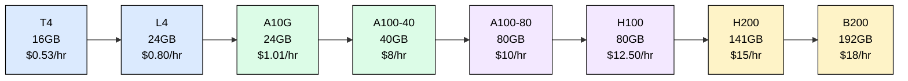
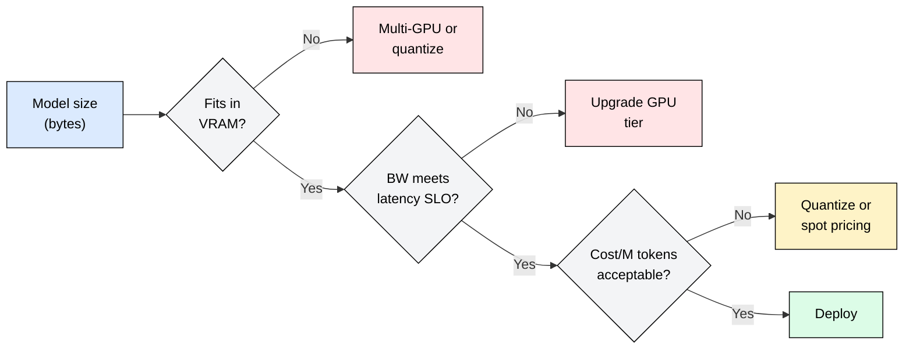

# 2.3 Instance Selection

You know how much VRAM your model consumes (02.1) and what throughput your batch size delivers (02.2). The remaining question is concrete: which GPU instance do you actually rent, and what does it cost?

## The GPU Landscape

| Instance (AWS) | GPU | VRAM (GB) | BW (TB/s) | FP16 TFLOPS | ~Cost/hr |
|---|---|---|---|---|---|
| g4dn.xlarge | T4 | 16 | 0.3 | 65 | $0.53 |
| g6.xlarge | L4 | 24 | 0.3 | 121 | $0.80 |
| g5.xlarge | A10G | 24 | 0.6 | 125 | $1.01 |
| p4d.24xlarge (per GPU) | A100-40 | 40 | 2.0 | 312 | $8.00 |
| p4de.24xlarge (per GPU) | A100-80 | 80 | 2.0 | 312 | $10.00 |
| p5.48xlarge (per GPU) | H100 | 80 | 3.35 | 990 | $12.50 |
| p5e.48xlarge (per GPU) | H200 | 141 | 4.8 | 990 | $15.00 |
| p6.48xlarge (per GPU) | B200 | 192 | 8.0 | 2250 | $18.00 |

Costs are approximate on-demand pricing. Spot and reserved instances reduce costs 40-70%.

## Selection Criteria

Three factors determine your instance choice:

1. **Does the model fit?** Compare model weight bytes (from 02.1) against available VRAM, leaving 20-30% headroom for KV cache and activations.
2. **Does bandwidth meet latency SLO?** Decode is memory-bound. Required bandwidth = model bytes / target ITL. If an A10G delivers 0.6 TB/s and your 14GB model needs tokens in 50ms, you get 14/0.6 = 23ms per token, which meets the SLO.
3. **Cost per million tokens.** Divide hourly cost by achievable throughput (tokens/sec x 3600). Lower is better, but only after constraints 1 and 2 are satisfied.

## Quick Reference

| Model Size | Precision | Recommended Instance(s) |
|---|---|---|
| 7B | FP16 (14 GB) | A10G (single GPU, headroom for KV cache) |
| 7B | INT4 (3.5 GB) | T4 or L4 (budget-friendly) |
| 13B | FP16 (26 GB) | A100-40 (comfortable fit) |
| 13B | INT4 (6.5 GB) | A10G or L4 |
| 70B | FP16 (140 GB) | 2xH100 or 2xH200 (tensor parallel) |
| 70B | INT4 (35 GB) | A100-80 (single GPU, tight) or H100 |
| 405B | FP16 (810 GB) | 8xH200 or 5xB200 (tensor parallel) |
| 405B | INT4 (203 GB) | 2xB200 or 3xH100 |

These recommendations assume 25% VRAM headroom for KV cache at reasonable batch sizes. Production deployments with large batches may require the next tier up.

## FAQ

**Q1: Should I always pick the cheapest GPU that fits my model?**
Not necessarily. Bandwidth matters as much as capacity. A T4 can hold a 7B INT4 model, but its 0.3 TB/s bandwidth means slow decode. An A10G costs twice as much but delivers 2x the bandwidth, halving latency.

**Q2: When does multi-GPU become cheaper than a single larger GPU?**
When the larger GPU is significantly more expensive per GB of bandwidth. Two A100-40s cost ~$16/hr with 4 TB/s combined bandwidth, while one H100 costs $12.50/hr with 3.35 TB/s. For bandwidth-hungry workloads, H100 wins on cost-per-bandwidth. Multi-GPU adds communication overhead.

**Q3: How much VRAM headroom should I leave for KV cache?**
20-30% is a safe default. At batch size 32 with 4096 context length on a 7B model, KV cache consumes ~4 GB. Higher batch sizes or longer contexts require more. Refer to 02.1 for the exact formula.

**Q4: Does quantization always make economic sense?**
Almost always for inference. INT4 reduces model size 4x with minimal quality loss on most tasks, letting you use cheaper instances. The exception: tasks requiring maximum precision (code generation, math reasoning) where FP16 measurably outperforms INT4.

**Q5: How do I choose between spot and on-demand instances?**
Use spot for batch/offline workloads (summarization queues, embeddings) where interruptions cause retries, not failures. Use on-demand or reserved for latency-sensitive serving where a preemption means dropped requests.

## References

- NVIDIA GPU specifications: https://www.nvidia.com/en-us/data-center/
- AWS EC2 instance pricing: https://aws.amazon.com/ec2/pricing/on-demand/
- Anyscale "Choosing GPUs for LLM Inference" (2024)
- vLLM benchmarks across GPU tiers: https://docs.vllm.ai/en/latest/performance/benchmarks.html
- Pope et al., "Efficiently Scaling Transformer Inference" (2023), Google Research
