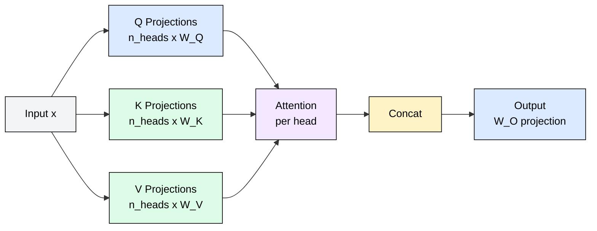
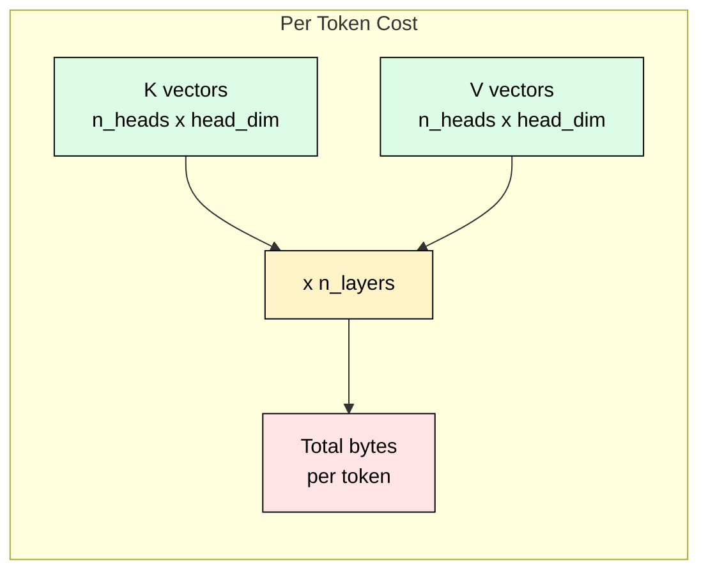
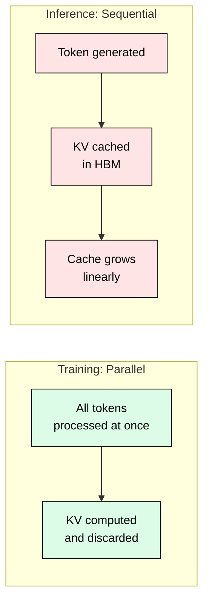

# 3.1 Multi-Head Attention (MHA)

[](https://colab.research.google.com/github/harshuljain13/llm-inference-at-scale/blob/master/content/03_attention_variants/03.1_mha/lab.ipynb)
[](https://molab.cloud/github/harshuljain13/llm-inference-at-scale/blob/master/content/03_attention_variants/03.1_mha/lab.ipynb)

Multi-Head Attention is the original attention mechanism from "Attention Is All You Need" (Vaswani et al., 2017). Every attention head gets its own independent Key and Value projections, giving the model maximum representational power. This module explains how MHA works, derives its KV cache cost, and shows why this design becomes the dominant memory bottleneck during inference at scale.

## How MHA Works

In MHA, the input hidden state of dimension `d_model` is projected through three weight matrices per head. Each head independently attends to different aspects of the input: one head might track syntactic relationships, another semantic similarity, another positional proximity.

```
Q_i = x @ W_Q_i    # shape: [seq_len, head_dim]
K_i = x @ W_K_i    # shape: [seq_len, head_dim]
V_i = x @ W_V_i    # shape: [seq_len, head_dim]
```

where `i` ranges from 1 to `n_heads`, and `head_dim = d_model / n_heads`. Each head computes attention independently, then outputs are concatenated and projected back:

```
Attention_i = softmax(Q_i @ K_i^T / sqrt(head_dim)) @ V_i
Output = Concat(Attention_1, ..., Attention_n) @ W_O
```



The key property: every head has its own K and V, meaning `n_kv_heads = n_heads`. This gives maximum expressiveness but maximum KV cache cost.

## KV Cache Memory Formula

During autoregressive inference, every generated token adds its K and V vectors to the cache for ALL heads across ALL layers:

```
KV_cache_per_token = 2 x n_heads x head_dim x n_layers x bytes_per_element
```

The factor of 2 accounts for both K and V tensors stored per head per layer.



## Concrete Example: GPT-3 175B

GPT-3 uses pure MHA with 96 heads, head dimension 128, 96 layers, in FP16:

```
KV per token = 2 x 96 x 128 x 96 x 2 = 4,718,592 bytes = 4.5 MB/token
```

For a 2048-token context: `4.5 MB x 2048 = 9.2 GB` per request. Eight concurrent users at 2K context need 73.6 GB just for KV cache, consuming nearly all of an 80 GB A100. This is why MHA does not scale for serving.

## Why MHA Works for Training but Fails for Serving

During training, the entire sequence is processed in parallel. KV projections are computed once and used immediately with no persistent cache. Memory cost is transient.

During inference, the KV cache persists for the entire generation. Each new token requires reading the full cache from memory (memory bandwidth bound), and the cache remains allocated until the request completes. A mechanism designed for parallel training creates an unbearable memory burden during sequential generation.



## The Bandwidth Bottleneck

Loading KV cache from HBM dominates decode time. For GPT-3 with a 2K context, each decode step loads 9.2 GB of KV data. On an A100 with 2 TB/s HBM bandwidth, just reading the cache takes 4.6 ms per token. The actual attention compute (matrix multiplies on small head_dim vectors) is negligible by comparison. MHA makes the decode step memory bandwidth bound, not compute bound.

## Models Using MHA

| Model | Year | n_heads | head_dim | Layers | KV/token |
|-------|------|---------|----------|--------|----------|
| GPT-2 | 2019 | 12-25 | 64 | 12-48 | 36-600 KB |
| GPT-3 | 2020 | 96 | 128 | 96 | 4.5 MB |
| BERT-Large | 2018 | 16 | 64 | 24 | 49 KB |
| OPT-175B | 2022 | 96 | 128 | 96 | 4.5 MB |
| BLOOM-176B | 2022 | 112 | 128 | 70 | 4.0 MB |

The pattern is clear: as models scale, MHA's KV cache becomes the dominant memory consumer, leaving less room for batching concurrent requests. This motivates the variants covered in subsequent modules (MQA in 3.2, GQA in 3.3).

## FAQ

**Q: Why not just use fewer heads to reduce KV cache?**
Reducing heads shrinks model capacity. Each head captures different relationship patterns (syntactic, semantic, positional). Removing heads degrades model quality, especially on complex reasoning tasks.

**Q: Does MHA waste memory during prefill?**
No. During prefill, all tokens are processed in parallel and KV is computed in one pass. The waste occurs during decode, where the cache must persist and grow with each generated token.

**Q: How does head_dim relate to d_model?**
By construction, `head_dim = d_model / n_heads`. A 4096-dimensional model with 32 heads uses head_dim=128. Larger head_dim means more expressive per-head representations but more KV bytes per token.

**Q: Can you prune individual heads after training?**
Yes. Head pruning (Michel et al., 2019) removes less important heads post-training. However, pruning requires careful evaluation and retraining. MQA and GQA achieve similar cache savings architecturally without post-hoc surgery.

**Q: Is the attention matrix square?**
During prefill, yes: shape is [seq_len, seq_len]. During decode, it is [1, seq_len] since you compute attention for one new token against all cached keys. This asymmetry is why decode is bandwidth bound.

**Q: Why does every layer need its own KV cache?**
Each transformer layer learns different abstractions. Layer 1 might attend to surface syntax while layer 30 attends to high-level semantics. Sharing KV across layers would collapse these learned distinctions.

**Q: What fraction of A100 memory does KV cache typically consume?**
For large MHA models at production context lengths (4K-8K tokens) with reasonable batch sizes (8-32), KV cache easily consumes 50-80% of available HBM. This leaves minimal room for model weights and activations.

## References

1. Vaswani, A., Shazeer, N., Parmar, N., et al. (2017). "Attention Is All You Need." NeurIPS 2017.
2. Brown, T., Mann, B., Ryder, N., et al. (2020). "Language Models are Few-Shot Learners." NeurIPS 2020. (GPT-3)
3. Zhang, S., Roller, S., Goyal, N., et al. (2022). "OPT: Open Pre-trained Transformer Language Models." arXiv:2205.01068.
4. Scao, T.L., Fan, A., Akiki, C., et al. (2022). "BLOOM: A 176B-Parameter Open-Access Multilingual Language Model." arXiv:2211.05100.
5. Michel, P., Levy, O., Neubig, G. (2019). "Are Sixteen Heads Really Better than One?" NeurIPS 2019.
6. Shazeer, N. (2019). "Fast Transformer Decoding: One Write-Head is All You Need." arXiv:1911.02150.
