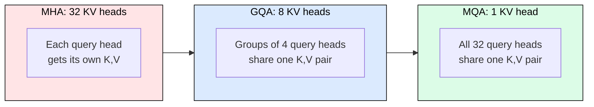
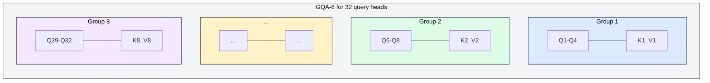
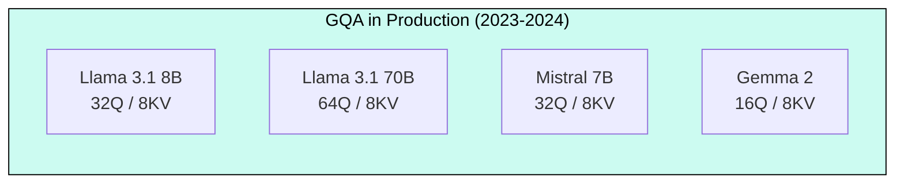
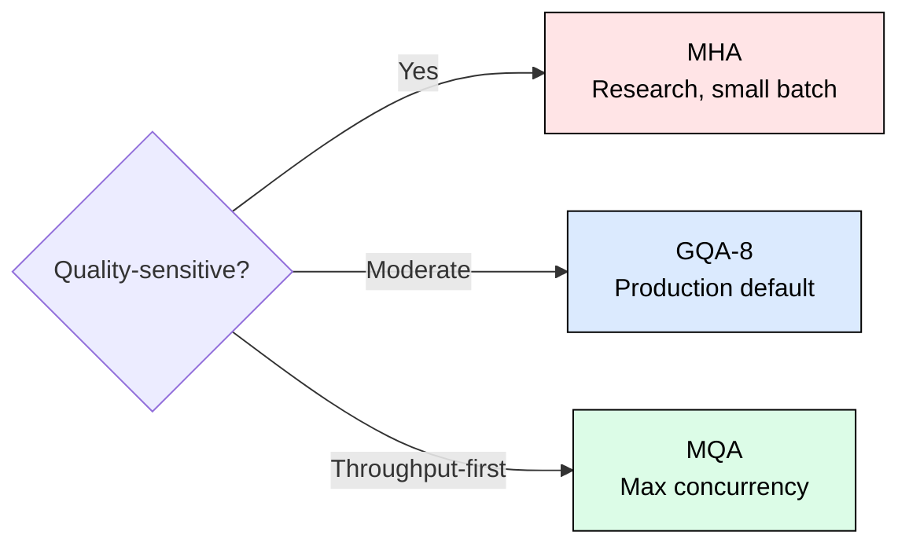

# 3.2 Multi-Query and Grouped-Query Attention

[](https://colab.research.google.com/github/harshuljain13/llm-inference-at-scale/blob/master/content/03_attention_variants/03.2_mqa_gqa/lab.ipynb) [](https://molab.cloud/github/harshuljain13/llm-inference-at-scale/blob/master/content/03_attention_variants/03.2_mqa_gqa/lab.ipynb)

Multi-Head Attention (MHA) stores independent Key and Value projections for every attention head. This provides maximum representational capacity but consumes KV cache memory proportional to the number of heads. Multi-Query Attention (MQA) and Grouped-Query Attention (GQA) reduce this cost by sharing KV projections across query heads, trading a small quality margin for dramatically higher serving throughput.

## The KV Sharing Spectrum

The three mechanisms form a spectrum from full independence to full sharing:



The KV cache formula for any variant is:

```
KV_cache_per_token = 2 x n_kv_heads x head_dim x n_layers x bytes_per_element
```

Compression relative to MHA equals  (the group size).

## Multi-Query Attention (MQA)

Shazeer (2019) proposed MQA to eliminate KV cache redundancy entirely. All query heads share a single K and single V projection. The computation becomes:

```python
Q_i = x @ W_Q_i       # i = 1..n_heads (32 separate projections)
K   = x @ W_K         # one shared projection
V   = x @ W_V         # one shared projection
```

For a 32-head model with head_dim=128 and 32 layers in FP16, MQA stores only 16 KB per token compared to 512 KB for MHA. This 32x compression enables hundreds of concurrent users on a single GPU. The cost: all query heads must form their attention patterns from identical key-value representations, limiting the model's ability to attend to different aspects of the input simultaneously.

## Grouped-Query Attention (GQA)

Ainslie et al. (2023) introduced GQA as a middle ground. Query heads are divided into groups that share KV projections:



With 8 KV heads instead of 32, the model retains 8 distinct "views" of the input. Different groups can still specialize their attention patterns through different KV representations, which is sufficient for most tasks.

### Why GQA Preserves Quality

Ainslie et al. (2023) showed that GQA-8 matches MHA within 0.2 points on average across benchmarks (MMLU, HellaSwag, TriviaQA), while MQA drops 1.4 points. The reason: complex reasoning requires multiple independent attention patterns. Eight KV heads provide enough diversity; one does not.

### Converting MHA to GQA

Existing MHA checkpoints convert to GQA by mean-pooling KV weights within each group, followed by 5-10% additional pretraining ("uptraining"). This is how Meta converted Llama 2 70B from MHA to GQA with minimal quality loss.

## Concrete Numbers: Memory and Concurrency

For a 32-head, 32-layer model with head_dim=128 in FP16:

| Variant | KV Heads | Memory/Token | Compression | Users at 4K (20 GB budget) |
|---------|----------|-------------|-------------|---------------------------|
| MHA | 32 | 512 KB | 1x | 9 |
| GQA-8 | 8 | 128 KB | 4x | 39 |
| GQA-4 | 4 | 64 KB | 8x | 78 |
| MQA | 1 | 16 KB | 32x | 312 |

Going from 9 to 39 concurrent users on the same GPU translates directly to 4x higher revenue per device at equivalent latency. This is why GQA became the industry default within a year of publication.

## Production Adoption



Meta keeps n_kv_heads=8 constant across model sizes (8B, 70B, 405B), increasing group size as models scale. Larger models have more query heads that can share KV projections without quality loss because their increased capacity compensates for shared representations.

| Model | Query Heads | KV Heads | Group Size | KV/Token |
|-------|-------------|----------|------------|----------|
| Llama 3.1 8B | 32 | 8 | 4 | 128 KB |
| Llama 3.1 70B | 64 | 8 | 8 | 256 KB |
| Llama 3.1 405B | 128 | 8 | 16 | 512 KB |
| Mistral 7B | 32 | 8 | 4 | 128 KB |
| Qwen 2 72B | 28 | 4 | 7 | 64 KB |

## The Design Decision

The choice between MHA, GQA, and MQA reduces to: how many concurrent users must you serve, and what quality loss can you tolerate?



For most production deployments, GQA-8 is the correct answer. It provides 4x memory reduction with negligible quality impact, and the entire industry has converged on this configuration.

---

## FAQ

**Q1: Does GQA reduce compute (FLOPs) or only memory?**
GQA primarily reduces KV cache memory and memory bandwidth during decoding. The compute savings are modest because the query projections (which dominate prefill FLOPs) remain unchanged. The real benefit is fitting more concurrent sequences in GPU memory.

**Q2: Can I use different group sizes for different layers?**
Yes, though no major production model does this yet. Research suggests early layers benefit from more KV heads (diverse patterns needed for token mixing) while later layers can share more aggressively. This is an active research direction.

**Q3: Why not just use MQA everywhere if it saves 32x memory?**
MQA forces all query heads to form attention patterns from identical keys and values. For simple tasks this works fine, but multi-hop reasoning and long-form generation degrade measurably (0.5-2% across benchmarks). The compounding effect across multiple reasoning steps makes this gap noticeable in production.

**Q4: How does GQA interact with KV cache quantization?**
They compose multiplicatively. GQA-8 gives 4x compression, INT8 quantization gives another 2x, yielding 8x total reduction. This combination is the standard production configuration for high-throughput serving.

**Q5: What is the relationship between GQA and Multi-Latent Attention (MLA)?**
MLA (DeepSeek-V2, covered in module 3.4) takes a fundamentally different approach: it compresses the entire KV representation into a low-rank latent space rather than reducing the number of heads. MLA achieves higher compression ratios than GQA but requires architectural changes that prevent simple checkpoint conversion.

**Q6: Does the group size affect training stability?**
No significant instability has been reported for group sizes between 2 and 16. However, group sizes below 4 KV heads provide diminishing memory returns while introducing measurable quality loss, which is why the industry converges on 4-8 KV heads.

**Q7: Can I convert a GQA model back to MHA for fine-tuning?**
Technically yes (duplicate each KV head group_size times), but this defeats the memory advantage during inference. A better approach is to fine-tune in GQA configuration directly, which preserves the serving efficiency.

**Q8: Why does Meta keep exactly 8 KV heads across all Llama 3 sizes?**
Eight KV heads provide sufficient representational diversity for most tasks while giving a clean power-of-two group size for larger models. It also simplifies the serving infrastructure: one KV cache management strategy works across the entire model family.

---

## References

1. Shazeer, N. (2019). "Fast Transformer Decoding: One Write-Head is All You Need." arXiv:1911.02150.
2. Ainslie, J., Lee-Thorp, J., de Jong, M., Zemlyanskiy, Y., Lebron, F., & Sanghai, S. (2023). "GQA: Training Generalized Multi-Query Transformer Models from Multi-Head Checkpoints." EMNLP 2023. arXiv:2305.13245.
3. Touvron, H., et al. (2023). "Llama 2: Open Foundation and Fine-Tuned Chat Models." arXiv:2307.09288.
4. Jiang, A. Q., et al. (2023). "Mistral 7B." arXiv:2310.06825.
5. Dubey, A., et al. (2024). "The Llama 3 Herd of Models." arXiv:2407.21783.
