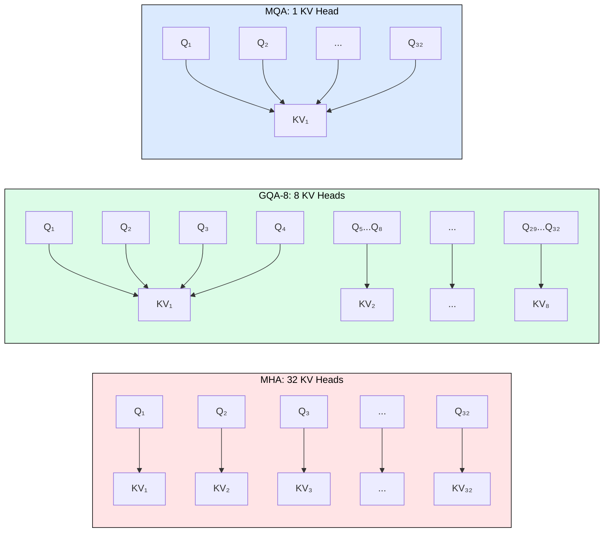
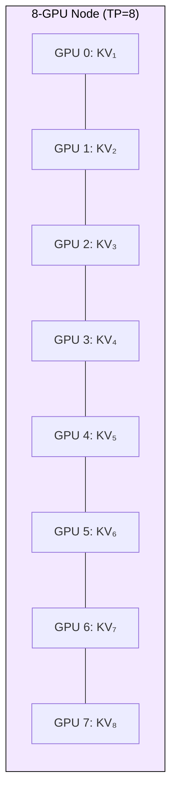
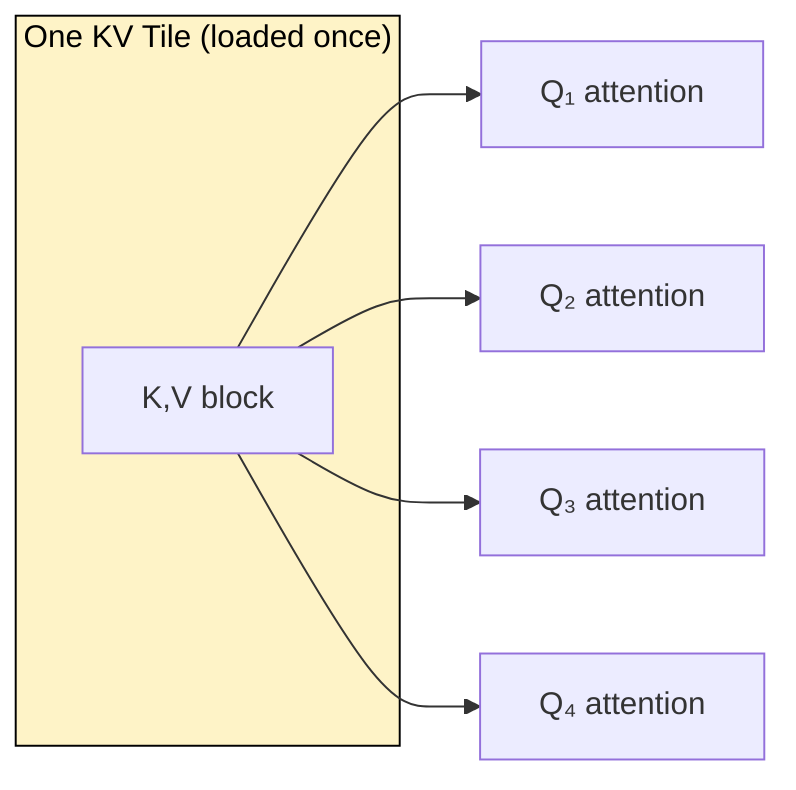
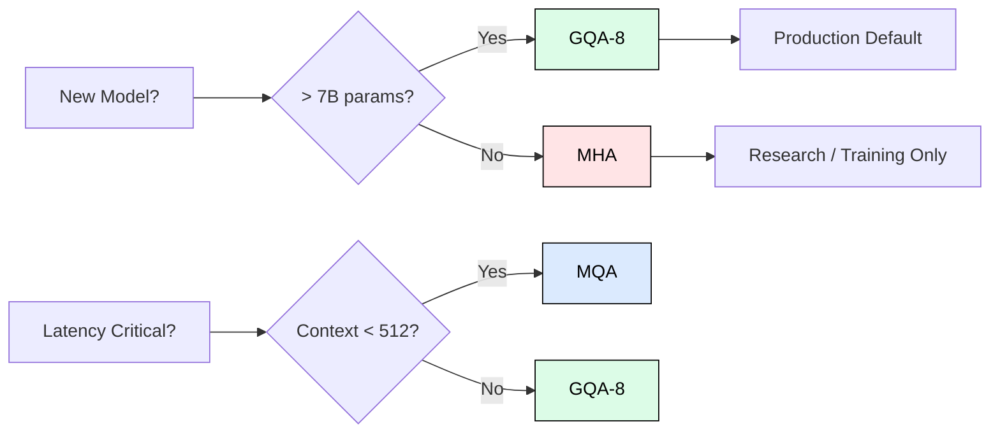

[](https://colab.research.google.com/github/harshuljain13/llm-inference-at-scale/blob/master/content/03_attention_variants/03.3_gqa_deep_dive/lab.ipynb)
[](https://molab.marimo.io/github/harshuljain13/llm-inference-at-scale/blob/master/content/03_attention_variants/03.3_gqa_deep_dive/lab.ipynb)

# 3.3 Grouped-Query Attention Deep Dive

GQA is the production default for every major LLM released since 2023. This module explains exactly why: how head grouping works at the tensor level, the memory and bandwidth implications, and the engineering constraints that made GQA-8 the universal choice.

## Why GQA Exists

MHA gives each of 32 query heads its own independent Key and Value projection. During decoding, the GPU must load all 32 KV head vectors from HBM for every token generated. With 128-dimensional heads across 32 layers in FP16, a single token costs:

```
KV per token (MHA) = 2 * 32 heads * 128 dim * 32 layers * 2 bytes = 524 KB
```

At 4,096 context length, that is 2 GB of KV cache per sequence. On an A100-80GB serving a 16 GB model, you fit roughly 30 concurrent users before memory runs out.

GQA reduces this by having multiple query heads share a single KV head. Llama 3.1 8B uses 32 query heads but only 8 KV heads (group size 4), cutting KV cache to 131 KB per token and supporting over 100 concurrent users on the same hardware.



## The Group Size Decision

Group size determines the compression ratio. Industry practice scales group size with model capacity:

| Model | Params | Query Heads | KV Heads | Group Size | KV per Token |
|-------|--------|-------------|----------|------------|--------------|
| Mistral 7B | 7B | 32 | 8 | 4 | 131 KB |
| Llama 3.1 8B | 8B | 32 | 8 | 4 | 131 KB |
| Llama 3.1 70B | 70B | 64 | 8 | 8 | 131 KB |
| Llama 3.1 405B | 405B | 128 | 8 | 16 | 131 KB |

Larger models tolerate higher compression because their increased parameter count compensates for the shared KV representation. The pattern is consistent: 8 KV heads regardless of model size.

## Why 8 KV Heads Specifically

The choice of 8 KV heads is an engineering constraint, not a quality optimum. Modern GPU nodes contain 8 GPUs. When using tensor parallelism, KV heads are sharded across devices. The constraint `n_kv_heads % TP_degree == 0` must hold:



With 8 KV heads, tensor parallelism works cleanly for TP=1, 2, 4, and 8. MQA (1 KV head) cannot shard at all and must replicate, wasting memory. GQA-4 fails at TP=8. This hardware alignment is why Meta standardized on 8 KV heads across the entire Llama 3 family.

## Bandwidth Savings During Decode

Decoding is memory-bandwidth bound. The GPU loads the entire KV cache from HBM to compute one attention score per token. The time to compute attention:

```
T_attention = KV_cache_size / HBM_bandwidth
```

On an A100 (2 TB/s bandwidth) at 4K context with Llama 3.1 8B:

| Mechanism | KV Load per Step | Time | Speedup |
|-----------|-----------------|------|---------|
| MHA (32 KV) | 2,048 MB | 1.02 ms | 1.0x |
| GQA-8 | 512 MB | 0.26 ms | 4.0x |
| MQA (1 KV) | 64 MB | 0.03 ms | 32x |

GQA delivers 4x latency reduction over MHA purely from reduced memory traffic, independent of the batch size improvement.

## Quality Impact

Ainslie et al. (2023) demonstrated that heads within a group learn correlated KV representations. Sharing was always implicit in MHA; GQA makes it explicit without information loss. Empirical results from the original paper:

- MHA to GQA-8 conversion with 5% additional pretraining: quality matches MHA on all benchmarks
- Training GQA from scratch: identical quality to MHA, no conversion cost
- GQA-4 vs GQA-8: no measurable difference on standard benchmarks (MMLU, HumanEval, GSM8K)

MQA shows degradation only on long-context tasks (>4K tokens) where the single shared representation bottlenecks information flow. For short-context applications (code completion, voice assistants), MQA remains viable.

## FlashAttention Interaction

FlashAttention-2 includes a dedicated GQA kernel path. During prefill, the kernel loads each KV tile once and broadcasts it to all query heads in the group. This achieves within 5-10% of theoretical bandwidth-optimal computation:



## When to Use Each Variant



## Detecting Attention Type from Config

```python
from transformers import AutoConfig

config = AutoConfig.from_pretrained("meta-llama/Llama-3.1-8B")
n_heads = config.num_attention_heads       # 32
n_kv_heads = config.num_key_value_heads    # 8

if n_kv_heads == n_heads:
    mechanism = "MHA"
elif n_kv_heads == 1:
    mechanism = "MQA"
else:
    mechanism = f"GQA-{n_kv_heads} (group_size={n_heads // n_kv_heads})"
```

## Forward Pointer

GQA reduces KV cache by sharing heads, but each head still stores full 128-dimensional vectors. Module 3.4 introduces Multi-Latent Attention (MLA), used in DeepSeek-V2, which compresses KV into a low-rank latent space (64 or fewer dimensions), surpassing even MQA compression while maintaining GQA-level quality.

---

## FAQ

**Q: Does GQA require a special training procedure?**
No. When training from scratch, you define fewer KV heads in the config. The training loop is identical to MHA. "Uptraining" (mean-pooling KV weights + continued pretraining) is only needed when converting an existing MHA checkpoint.

**Q: Why not use GQA-2 for maximum compression?**
You could, but it fails the TP constraint at TP=4 or TP=8. With only 2 KV heads, you cannot shard across 4+ GPUs without replication. The savings over GQA-8 (2x) rarely justify the parallelism limitation.

**Q: Does GQA help during training or only inference?**
Primarily inference. During training, fewer KV parameters reduce gradient memory slightly (5-10%), but the effect is modest compared to the dramatic inference savings (4-16x KV cache reduction).

**Q: Can I convert an MHA model to GQA after training?**
Yes. Mean-pool the KV weights within each group, then continue pretraining for 5-10% of the original compute budget. Ainslie et al. showed this recovers MHA-level quality.

**Q: Why do all Llama 3 models use exactly 8 KV heads regardless of size?**
Hardware alignment. An 8-GPU DGX node with TP=8 needs exactly 1 KV head per GPU. This is the maximum compression that still allows clean sharding without replication.

---

## References

- Vaswani, A. et al. (2017). "Attention Is All You Need." NeurIPS 2017.
- Shazeer, N. (2019). "Fast Transformer Decoding: One Write-Head is All You Need." arXiv:1911.02150.
- Ainslie, J. et al. (2023). "GQA: Training Generalized Multi-Query Transformer Models from Multi-Head Checkpoints." EMNLP 2023.
- Dao, T. et al. (2022). "FlashAttention: Fast and Memory-Efficient Exact Attention." NeurIPS 2022.
- Dubey, A. et al. (2024). "The Llama 3 Herd of Models." arXiv:2407.21783.
- Jiang, A.Q. et al. (2023). "Mistral 7B." arXiv:2310.06825.
