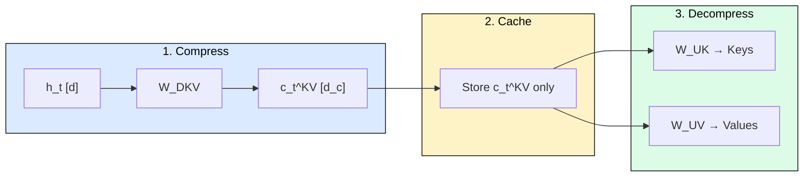
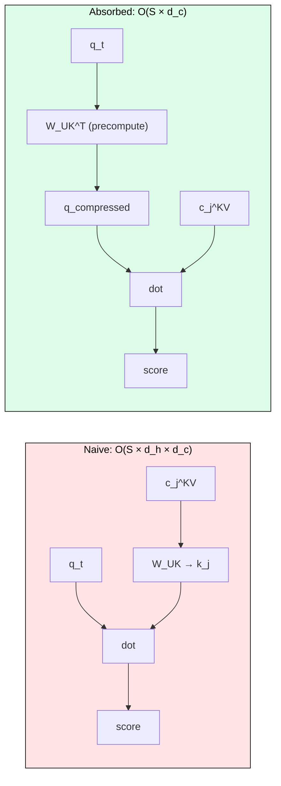
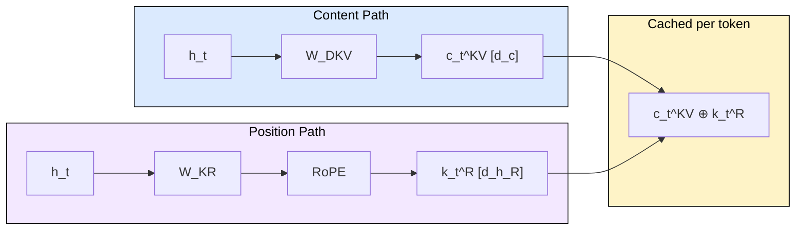
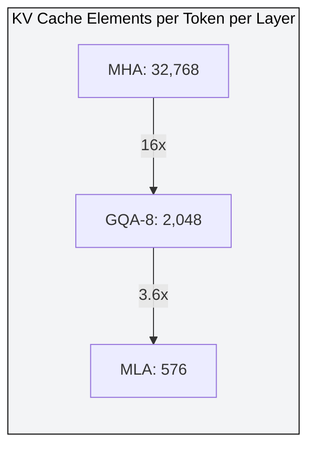

# 3.4 Multi-Latent Attention (MLA)

 

GQA reduces KV cache by sharing heads across groups, but each head still stores a full `head_dim`-dimensional vector per token. Multi-Latent Attention (MLA), introduced in DeepSeek-V2 (May 2024), takes a fundamentally different approach: compress the entire KV representation into a low-rank latent vector before caching. The result is a 93.3% KV cache reduction compared to MHA while matching or exceeding MHA quality on standard benchmarks.

## Where GQA Leaves a Gap

GQA reduces the *number* of KV heads but cannot reduce the *dimensionality* of each head. For Llama 3.1 8B (8 KV heads, head_dim=128, 32 layers), the KV cache per token is still 128 KB. At batch=32 and sequence length 4096, that totals 16 GB of GPU memory for cache alone. For longer contexts or deeper models, this linear scaling remains the primary throughput bottleneck.

The question MLA answers: what if we compress the KV vectors themselves into something much smaller?

## The Core Idea: Joint KV Compression

MLA projects the hidden state into a compact latent vector, caches only that latent, and recovers full keys and values on-the-fly during attention.

The three stages:

1. **Down-project**: `c_t^KV = W_DKV · h_t` maps from dimension `d` to `d_c` (where `d_c << n_h × d_h`).
2. **Cache**: Store only `c_t^KV`, a single vector of dimension `d_c`. No separate K and V storage.
3. **Up-project**: Recover keys via `W_UK · c_t^KV` and values via `W_UV · c_t^KV` at attention time.

## The Matrix Absorption Trick

The naive approach reconstructs full keys for every cached token, costing O(S × d_h × d_c). DeepSeek's key insight: the up-projection can be absorbed into the query projection via associativity of matrix multiplication.

Instead of `q^T · (W_UK · c)`, compute `(W_UK^T · q)^T · c`. The query is compressed once, then dotted directly against cached latents. At S=4096, this yields a 124x FLOP reduction for score computation.

## Handling Positional Encoding (Decoupled RoPE)

RoPE is position-dependent. Applying it to compressed keys would couple `W_UK` with a position-varying rotation matrix, preventing absorption. DeepSeek decouples position into a small separate key:

The decoupled RoPE key `k_t^R` (dimension `d_h_R = 64`) carries positional information, is shared across all heads, and cached alongside `c_t^KV`. Total cache per token per layer: `d_c + d_h_R` elements.

## Memory Savings: MHA vs GQA vs MLA

For DeepSeek-V2 (n_h=128, d_h=128, d_c=512, d_h_R=64, 60 layers):

| Method | Cache per token per layer | Total (60 layers, FP16) |
|--------|--------------------------|------------------------|
| MHA | 2 × 128 × 128 = 32,768 | 3.75 MB |
| GQA-8 | 2 × 8 × 128 = 2,048 | 240 KB |
| **MLA** | 512 + 64 = 576 | **67.5 KB** |

MLA achieves 56.9x reduction vs MHA and 3.6x reduction vs GQA-8, equivalent to GQA with only 2.25 groups, yet matches full MHA quality on MMLU, BBH, and C-Eval benchmarks.

## The Compute-Memory Tradeoff

MLA spends extra compute (up-projections) to save memory (smaller cache). This tradeoff is overwhelmingly favorable during autoregressive generation because:

1. Decode is memory-bandwidth-bound: smaller cache means fewer bytes loaded per step.
2. Matrix absorption eliminates most decompression cost: attention operates in compressed space.
3. Smaller cache enables larger batch sizes: DeepSeek-V2 reports 5.76x higher generation throughput vs DeepSeek 67B.

The mental model: GQA reduces the number of vectors cached. MLA reduces the dimensionality of what is cached. Both are complementary strategies attacking the same bottleneck from different angles.

## DeepSeek-V2 Configuration

| Parameter | Value | Purpose |
|-----------|-------|---------|
| d (hidden dim) | 5,120 | Model width |
| n_h (heads) | 128 | Query heads |
| d_h (head dim) | 128 | Per-head dimension |
| d_c (KV latent) | 512 | Compression target (4 × d_h) |
| d_h_R (RoPE dim) | 64 | Positional key (d_h / 2) |
| d_c' (query latent) | 1,536 | Query compression |
| Layers | 60 | Transformer depth |
| Total params | 236B | Mixture-of-Experts |
| Active params | 21B | Per-token compute |

## FAQ

**Q: Why not just use MQA (single KV head) instead of MLA?**
MQA collapses all information into one head, causing measurable quality degradation on complex reasoning tasks. MLA preserves the full representational capacity of all heads through the latent projection, losing no information that the model can learn to encode.

**Q: Does MLA work with FlashAttention?**
Yes, but requires custom kernels. The decoupled RoPE key must be concatenated with the content key before the attention kernel. DeepSeek-V3 and open-source implementations in SGLang provide optimized MLA kernels.

**Q: Can MLA and GQA be combined?**
They address different dimensions of the problem (head count vs head dimensionality), so they are theoretically composable. In practice, MLA alone achieves cache sizes smaller than aggressive GQA, making the combination unnecessary.

**Q: What is the training overhead of MLA?**
During training, the full up-projections must be computed (absorption only helps inference). DeepSeek reports approximately 5% additional training FLOPs compared to MHA, offset by enabling longer context training due to reduced memory pressure.

**Q: Why d_c = 4 × d_h specifically?**
The DeepSeek-V2 ablation (Table 9) shows that d_c = 4 × d_h (512) matches MHA quality on all benchmarks. Smaller values (2 × d_h) show degradation on reasoning tasks. Larger values provide diminishing returns while increasing cache size.

## References

1. DeepSeek-AI. "DeepSeek-V2: A Strong, Economical, and Efficient Mixture-of-Experts Language Model." arXiv:2405.04434, May 2024.
2. DeepSeek-AI. "DeepSeek-V3 Technical Report." arXiv:2412.19437, December 2024.
3. Shazeer, N. "Fast Transformer Decoding: One Write-Head is All You Need." arXiv:1911.02150, 2019. (MQA)
4. Ainslie, J. et al. "GQA: Training Generalized Multi-Query Transformer Models from Multi-Head Checkpoints." EMNLP 2023.
5. Su, J. et al. "RoFormer: Enhanced Transformer with Rotary Position Embedding." Neurocomputing, 2024.
