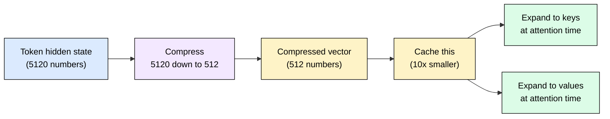
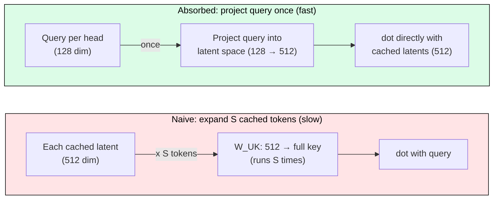
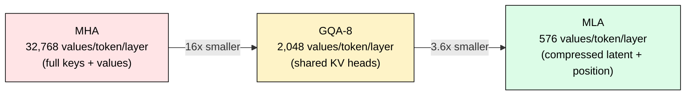

# 3.4 Multi-Latent Attention (MLA)

[](https://colab.research.google.com/github/harshuljain13/llm-inference-at-scale/blob/master/content/03_attention_variants/03.4_mla/lab.ipynb) [](https://molab.marimo.io/github/harshuljain13/llm-inference-at-scale/blob/master/content/03_attention_variants/03.4_mla/lab.ipynb)

GQA reduces KV cache by sharing heads (32 query heads share 8 KV heads = 4x savings). But each KV head still stores 128 numbers per token. MLA asks: what if we compress those 128 numbers into just 9 numbers before caching?

That is exactly what DeepSeek-V2 does. Instead of storing full key/value vectors, it stores a tiny compressed version and reconstructs the full vectors on-the-fly during attention. The result: 93% less KV cache memory with no quality loss.

## The Problem GQA Cannot Solve

GQA reduces the *count* of KV heads. But it cannot reduce the *size* of each head. For Mistral-7B with GQA-8:

```
KV cache per token = 8 heads x 128 dims x 2 (K+V) x 2 bytes = 4 KB/token
```

At 2048 tokens and batch=32: that is 256 MB of cache. For longer contexts (32K, 128K tokens), this still dominates GPU memory. GQA hit a wall.

## MLA: Compress Before Caching

The idea is simple. Instead of caching the full key/value vectors, compress them through a small bottleneck layer:



Three steps:
1. **Compress**: Multiply the hidden state by a learned matrix (5120 dims down to 512 dims).
2. **Cache**: Store only the 512-dim compressed vector. Not the full keys. Not the full values. Just 512 numbers per token.
3. **Expand**: At attention time, multiply the compressed vector by two matrices to recover full keys and values.

The compression is lossy in principle, but in practice the model learns to encode everything attention needs into those 512 dimensions.

## The Speedup Trick: Absorb the Expansion

Naive MLA would expand every cached token back to full keys before computing attention. That is expensive (you read 512 numbers and expand to 128 per head, for every token in the sequence).

The trick: instead of expanding every cached vector to compute attention, project the query into the same compressed space.



In the naive approach, you run a matrix multiply for every cached token (S times). In the absorbed approach, you project the query into the 512-dim latent space (same space the cached vectors live in), then compute cheap dot products directly against the cached latents. Same math result, but the expensive operation runs once instead of S times.

## Positional Encoding: A Separate Small Key

Rotary position encoding (RoPE) depends on position, which would break the compression trick. DeepSeek's solution: store position information in a tiny separate key (64 numbers), alongside the compressed content vector (512 numbers).

Total cached per token per layer: **512 + 64 = 576 numbers** (1,152 bytes in FP16).

## Memory Comparison

For a 60-layer model with 128 heads (DeepSeek-V2 scale):

| Method | Stored per token per layer | At 4096 tokens (FP16) | Relative |
|--------|--------------------------|----------------------|----------|
| MHA (128 heads) | 2 x 128 x 128 = 32,768 values | 15.0 GB | 1x |
| GQA-8 (8 KV heads) | 2 x 8 x 128 = 2,048 values | 960 MB | 16x smaller |
| **MLA** | 512 + 64 = 576 values | **270 MB** | **56x smaller** |



## The Tradeoff

MLA uses extra compute (the expand step) to save memory (smaller cache). This is a great deal for inference because:

1. **Decode is memory-bound**: Reading less cache per step means faster token generation.
2. **The absorption trick eliminates most expand cost**: You never actually expand.
3. **Smaller cache = larger batches**: DeepSeek-V2 reports 5.76x more throughput than their previous model.

## Who Uses MLA?

Only DeepSeek so far (V2 and V3). The technique is new (May 2024) and requires custom attention kernels. GQA remains the industry default because it works with standard FlashAttention. As MLA kernel support matures in vLLM and SGLang, adoption will likely grow for very long context deployments.

## FAQ

**Q: Is MLA just a fancy name for low-rank KV projection?**
Yes, with two important additions: (1) the absorption trick that avoids decompression cost, and (2) decoupled positional encoding that makes it work with RoPE. Without these, naive low-rank projection would be too slow.

**Q: Why not compress even more (down to 64 dims)?**
DeepSeek tested this. Below 512 dims, quality drops on reasoning benchmarks (MMLU, BBH). The 512-dim sweet spot preserves all information the model needs.

**Q: Can I use MLA with FlashAttention?**
Yes, but requires custom kernels. SGLang has MLA-optimized kernels. Standard PyTorch FlashAttention does not support it yet.

**Q: Should I use MLA for my 7B model?**
Probably not. At 7B scale with GQA-8, KV cache is already small (131 KB/token). MLA's complexity is worth it for 100B+ models with 128K+ context where cache dominates memory.

**Q: Does MLA help during training?**
Minimally. The savings are in the KV cache which matters during inference (serving). During training, activations dominate memory, not KV cache.

## References

1. DeepSeek-AI. "DeepSeek-V2: A Strong, Economical, and Efficient Mixture-of-Experts Language Model." arXiv:2405.04434, 2024.
2. DeepSeek-AI. "DeepSeek-V3 Technical Report." arXiv:2412.19437, 2024.
3. Shazeer, N. "Fast Transformer Decoding: One Write-Head is All You Need." arXiv:1911.02150, 2019.
4. Ainslie, J. et al. "GQA: Training Generalized Multi-Query Transformer Models from Multi-Head Checkpoints." EMNLP 2023.
5. Su, J. et al. "RoFormer: Enhanced Transformer with Rotary Position Embedding." Neurocomputing, 2024.
