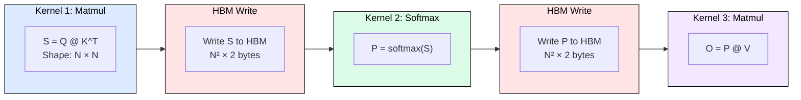
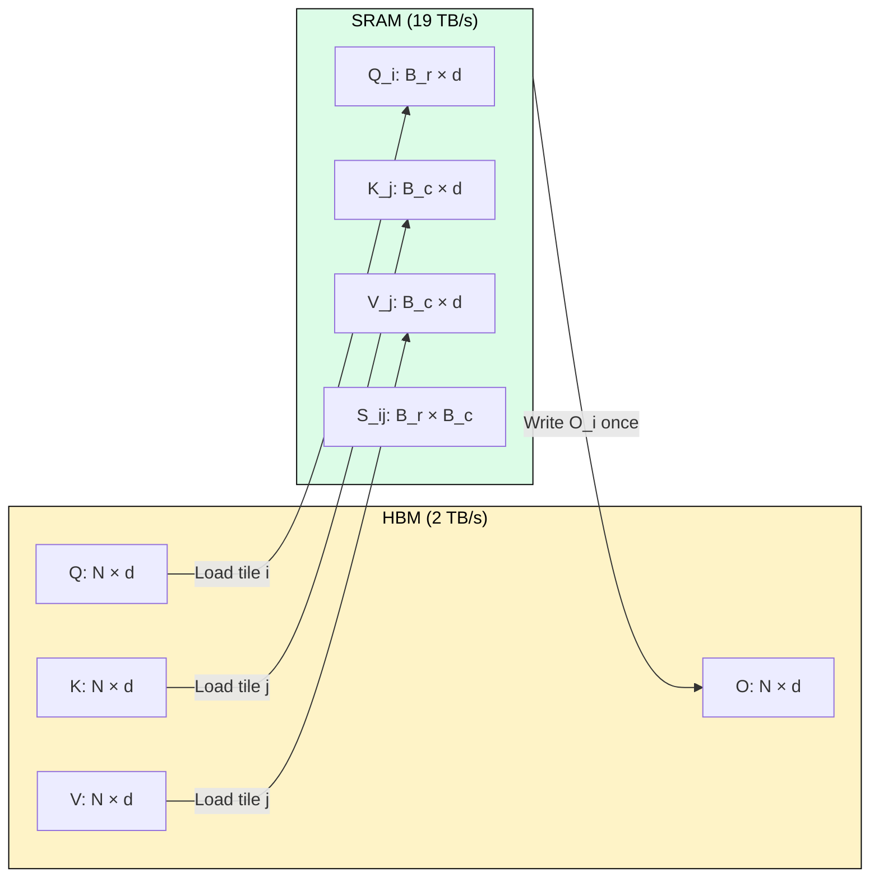
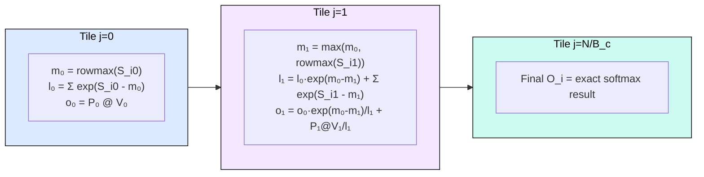

# 3.5 Flash Attention

[](https://colab.research.google.com/github/harshuljain13/llm-inference-at-scale/blob/master/content/03_attention_variants/03.5_flash_attention/lab.ipynb) [](https://molab.marimo.io/github/harshuljain13/llm-inference-at-scale/blob/master/content/03_attention_variants/03.5_flash_attention/lab.ipynb)

Standard attention materializes an N×N score matrix in HBM, making it memory-bound regardless of how much compute a GPU has. FlashAttention eliminates this materialization through tiling and online softmax, fusing all operations into a single kernel. This module covers why standard attention is slow, how FlashAttention fixes it, and how to use it in practice.

---

## Why Standard Attention is Slow

Modern GPUs have two memory tiers. SRAM (on-chip shared memory) provides 20 MB at 19 TB/s. HBM provides 80 GB at 2 TB/s. SRAM is 10x faster per byte but 4000x smaller.

Standard scaled dot-product attention computes `Output = softmax(Q @ K^T / sqrt(d)) @ V` in three separate CUDA kernels. Between kernels, every intermediate must round-trip through HBM.



For sequence length N=4096, head dimension d=128, the score matrix S is 4096×4096 = 32 MB per head in FP16. With 32 heads, that is 1 GB just for attention intermediates per layer. The GPU compute units sit idle while bytes shuttle between SRAM and HBM.

The problem scales quadratically: doubling sequence length quadruples HBM traffic. At N=128K, standard attention requires 4.4 TB of HBM traffic per layer, exceeding physical memory entirely.

---

## How Tiling and Online Softmax Fix It

FlashAttention processes attention in small tiles (blocks of size B_r × B_c) that fit entirely in SRAM. The key insight: never materialize the full N×N matrix. Load Q, K, V tiles into SRAM, compute the block of scores, apply softmax, accumulate the output, all in one fused kernel.



The challenge: softmax requires the row maximum across ALL N keys before computing any exponential. Online softmax (Milakov and Gimelshein, 2018) solves this by maintaining two running statistics per row:

1. **m**: current maximum across all tiles seen so far
2. **l**: sum of exponentials (the denominator)

When a new tile reveals a larger maximum, previous exponentials are rescaled by `exp(m_old - m_new)`. The algorithm processes tiles left-to-right, updating statistics incrementally:



The result is mathematically identical to standard attention. No approximation. The only difference is memory access pattern: O(N) HBM reads/writes instead of O(N²).

---

## Using FlashAttention in Practice

### PyTorch SDPA (Recommended)

Since PyTorch 2.0, `torch.nn.functional.scaled_dot_product_attention` automatically selects the best backend:

```python
import torch.nn.functional as F

# Automatically uses flash_attention when possible
output = F.scaled_dot_product_attention(query, key, value, is_causal=True)
```

To force a specific backend:

```python
from torch.nn.attention import SDPBackend, sdpa_kernel

with sdpa_kernel(SDPBackend.FLASH_ATTENTION):
    output = F.scaled_dot_product_attention(query, key, value)
```

### Hugging Face Transformers

```python
from transformers import AutoModelForCausalLM

model = AutoModelForCausalLM.from_pretrained(
    "mistralai/Mistral-7B-v0.1",
    attn_implementation="flash_attention_2",
    torch_dtype=torch.float16,
    device_map="auto"
)
```

Requirements: GPU with compute capability >= 8.0 (A100, H100, L40, RTX 4090). FP16 or BF16 only (no FP32).

### When FlashAttention Helps vs. Does Not

| Scenario | Benefit |
|---|---|
| Prefill with sequence > 256 tokens | 1.5-4x speedup |
| Sequence > 32K tokens | Required (score matrix exceeds HBM) |
| Decode (generating one token at a time) | No benefit (score matrix is just 1 row, not a full square) |
| Short sequences < 256 tokens | Minimal (tiling overhead offsets IO savings) |

---

## FlashAttention-2 and FlashAttention-3

**FlashAttention-2** (Dao, 2023) improves on the original by: (1) reducing non-matmul FLOPs in the inner loop, (2) parallelizing across the sequence dimension (not just batch/head), and (3) partitioning work between warps to reduce shared memory reads. Result: 2x speedup over FA-1, reaching 50-73% of theoretical FLOPS on A100.

**FlashAttention-3** (Shah et al., 2024) targets Hopper GPUs (H100) by exploiting: (1) WGMMA (warp-group matrix multiply) instructions via the Tensor Memory Accelerator, (2) hardware-assisted asynchronous memory operations to overlap computation with data movement, and (3) FP8 quantized attention with incoherent processing for low-precision without accuracy loss. Result: 1.5-2x speedup over FA-2 on H100, reaching 740 TFLOPS in FP16.

---

## FAQ

**Q: Is FlashAttention an approximation?**
No. It computes exact attention. The output is bit-for-bit identical to standard attention (up to floating-point reordering).

**Q: Why does FlashAttention not help during decode?**
Decode has N_q=1, so the "attention matrix" is a single row vector [1, N]. No quadratic term exists. The bottleneck is reading the KV cache linearly, not attention scores.

**Q: Can I use FlashAttention with GQA?**
Yes. FA-2 and FA-3 include GQA-aware tiling that loads one KV tile and processes all associated query heads against it, further improving arithmetic intensity.

**Q: What if my GPU does not support FlashAttention?**
PyTorch SDPA falls back to `mem_efficient` (xFormers) or `math` (naive) backends automatically. You still get fused attention, just without the SRAM tiling optimization.

**Q: Does FlashAttention support causal masking?**
Yes. Causal masking is handled by skipping tiles entirely when all positions in the tile are masked, avoiding wasted computation. Pass `is_causal=True` in SDPA or set the causal flag in the flash_attn package.

**Q: What block sizes does FlashAttention use?**
Block sizes are chosen at compile time based on SRAM capacity and head dimension. Typical values: B_r=B_c=128 for d=64, B_r=B_c=64 for d=128. Users do not need to tune this.

---

## References

1. Dao, T. (2022). "FlashAttention: Fast and Memory-Efficient Exact Attention with IO-Awareness." NeurIPS 2022.
2. Dao, T. (2023). "FlashAttention-2: Faster Attention with Better Parallelism and Work Partitioning." ICLR 2024.
3. Shah, J., Bikshandi, G., Zhang, Y., Thakkar, V., Ramani, P., Dao, T. (2024). "FlashAttention-3: Fast and Accurate Attention with Asynchrony and Low-precision." NeurIPS 2024.
4. Milakov, M., Gimelshein, N. (2018). "Online normalizer calculation for softmax." arXiv:1805.02867.
5. PyTorch SDPA documentation: https://pytorch.org/docs/stable/generated/torch.nn.functional.scaled_dot_product_attention.html
