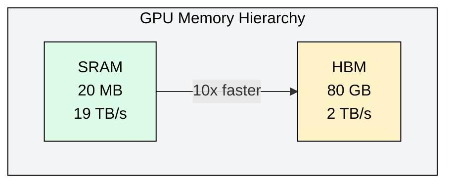
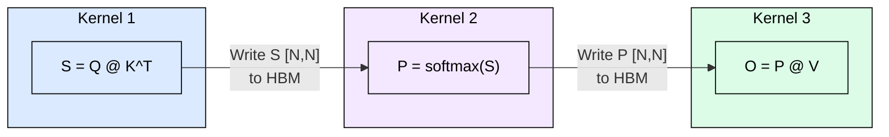
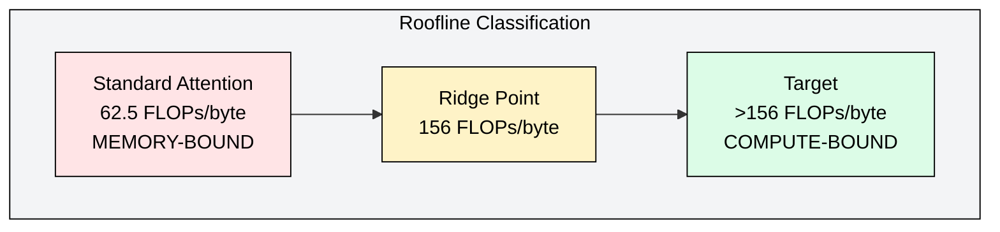

# 3.5 The Flash Attention Problem: Why Standard Attention is Slow

[](https://colab.research.google.com/github/harshuljain13/llm-inference-at-scale/blob/master/content/03_attention_variants/03.5_flash_attention_problem/lab.ipynb) [](https://molab.cloud/github/harshuljain13/llm-inference-at-scale/blob/master/content/03_attention_variants/03.5_flash_attention_problem/lab.ipynb)

Standard attention computes exact results but forces the GPU to write enormous intermediate matrices to slow main memory. The compute units sit idle while bytes shuttle back and forth. This module quantifies exactly where the bottleneck lives and why it worsens quadratically with sequence length.

---

## The Memory Hierarchy Gap

Modern GPUs have two memory tiers with drastically different characteristics. HBM (High Bandwidth Memory) provides 80 GB of capacity at roughly 2 TB/s on an A100. SRAM (on-chip shared memory) provides only 20 MB total but delivers bandwidth exceeding 19 TB/s. The ratio matters: SRAM is nearly 10x faster per byte, but 4000x smaller.



Any operation that repeatedly reads and writes large tensors to HBM becomes memory-bound regardless of how much arithmetic it performs. Standard attention does exactly this.

---

## Standard Attention: Three Kernels, Two Wasted Round-Trips

Scaled dot-product attention for one head with sequence length N and head dimension d:

```
Output = softmax(Q @ K^T / sqrt(d)) @ V
```

Q, K, V each have shape [N, d]. The intermediate attention matrix S = Q @ K^T has shape [N, N]. Standard implementations launch three separate CUDA kernels, and between kernels every intermediate must round-trip through HBM.



The attention matrix S and softmax output P are each N^2 elements. Both are written to HBM then immediately read back. These intermediates are consumed once and never needed again, yet they dominate memory traffic.

---

## Quantifying the HBM Traffic

Total HBM reads and writes for one head in FP16:

| Term | Elements | Source |
|------|----------|--------|
| Read Q, K, V (3x) | 3Nd | Input tensors |
| Write S | N^2 | Kernel 1 output |
| Read S for softmax | N^2 | Kernel 2 input |
| Write P | N^2 | Kernel 2 output |
| Read P for matmul | N^2 | Kernel 3 input |
| Read V, Write O | 2Nd | Kernel 3 |
| **Total** | **5Nd + 4N^2** | |

For N=4096, d=128, 32 heads:

- Linear terms: 5Nd = 2.6M elements per head
- Quadratic terms: 4N^2 = 67.1M elements per head
- Quadratic dominates by 26x
- Total bytes (32 heads): ~4.4 GB of HBM traffic for one attention layer

---

## The Arithmetic Intensity Argument

A100 reaches peak throughput when arithmetic intensity exceeds its ridge point:

```
Ridge point = 312 TFLOPS / 2 TB/s = 156 FLOPs/byte
Standard attention = 274.9B FLOPs / 4.4 GB = 62.5 FLOPs/byte
62.5 < 156 => Standard attention is MEMORY-BOUND on A100
```

The GPU compute units are underutilized because they wait for HBM data transfers.



---

## Quadratic Scaling with Sequence Length

The N^2 term means HBM traffic grows quadratically. Doubling sequence length quadruples memory traffic:

| Sequence Length | Attention Matrix Size | HBM Traffic (32 heads, FP16) |
|----------------|----------------------|------------------------------|
| 512 | 0.5 MB | 34 MB |
| 2048 | 8 MB | 537 MB |
| 4096 | 32 MB | 4.4 GB |
| 8192 | 128 MB | 17.2 GB |
| 16384 | 512 MB | 68.7 GB |
| 32768 | 2 GB | Exceeds A100 HBM |

At 32K tokens, the attention matrix alone exceeds the GPU's entire HBM capacity. Even at moderate lengths, the quadratic traffic dominates wall-clock time.

---

## IO Complexity: The Formal Statement

Standard attention requires Theta(Nd + N^2) HBM accesses. The Nd term is unavoidable (reading inputs, writing outputs). The N^2 term arises solely from materializing intermediates. Since d is typically 64 to 128 and N ranges from hundreds to millions, N >> d always holds, making N^2 dominant.

The question this sets up: can we compute exact attention with only O(Nd) HBM accesses, eliminating the quadratic term entirely? The next module shows the answer is yes.

---

## FAQ

**Q: Is the problem FLOPs or memory?**
The FLOPs are identical regardless of implementation. The problem is exclusively memory bandwidth. Standard attention forces unnecessary HBM round-trips for intermediate matrices that could remain in fast SRAM.

**Q: Why not just use a larger SRAM?**
SRAM is expensive silicon area. The A100 has 20 MB total across all SMs. Making SRAM large enough to hold a 4096x4096 attention matrix (32 MB in FP16) would require more area than the entire chip currently uses for compute.

**Q: Does this affect training and inference equally?**
Yes. Both forward and backward passes materialize the N^2 attention matrix. Training is worse because the backward pass requires re-reading the attention matrix for gradient computation.

**Q: At what sequence length does this become critical?**
The crossover where quadratic terms exceed linear terms occurs at N > 5d. For d=128, that is N > 640. Virtually all practical sequences exceed this threshold.

**Q: Why can't we just fuse the kernels without algorithmic changes?**
Kernel fusion alone does not solve the problem because softmax requires a full row reduction (max and sum across all N columns). Without an incremental algorithm, the kernel must still write intermediate results to synchronize across thread blocks.

**Q: Is approximate attention a solution?**
Approximate methods (Linformer, Performer) reduce the quadratic term but sacrifice exactness. FlashAttention (next module) achieves O(Nd) HBM access while computing exact attention, making approximation unnecessary for the memory problem.

---

## References

1. Dao, T., Fu, D.Y., Ermon, S., Rudra, A., Re, C. (2022). FlashAttention: Fast and Memory-Efficient Exact Attention with IO-Awareness. NeurIPS 2022.
2. Milakov, M., Gimelshein, N. (2018). Online normalizer calculation for softmax. arXiv:1805.02867.
3. Dao, T. (2023). FlashAttention-2: Faster Attention with Better Parallelism and Work Partitioning. ICLR 2024.
4. Jia, Z., Zaharia, M., Aiken, A. (2019). Beyond Data and Model Parallelism for Deep Neural Networks. MLSys 2019.
5. NVIDIA. (2023). A100 Tensor Core GPU Architecture Whitepaper.
