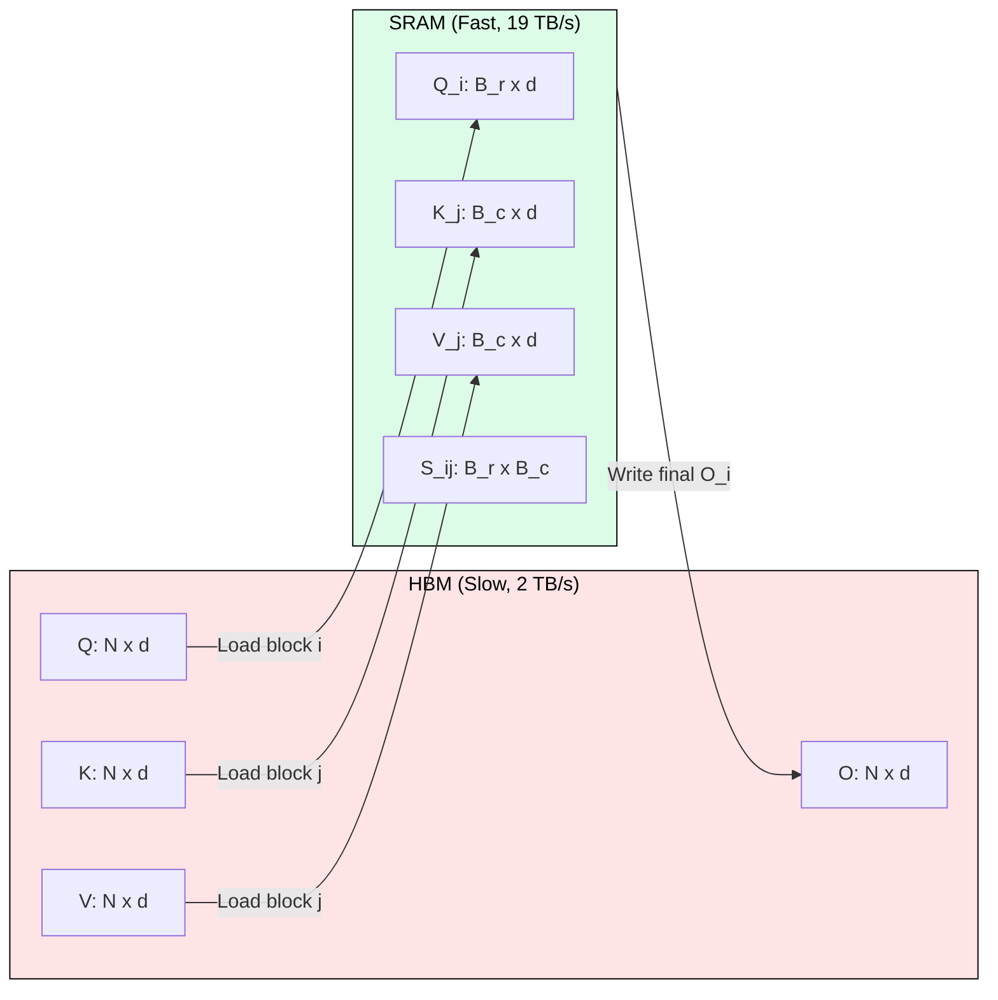
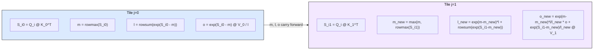

# 3.6 FlashAttention: The Algorithm

[](https://colab.research.google.com/github/harshuljain13/llm-inference-at-scale/blob/master/content/03_attention_variants/03.6_flash_attention_algorithm/lab.ipynb) [](https://molab.cloud/github/harshuljain13/llm-inference-at-scale/blob/master/content/03_attention_variants/03.6_flash_attention_algorithm/lab.ipynb)

Standard attention materializes the full N x N score matrix in HBM, making it memory-bound. FlashAttention eliminates this materialization by computing attention in tiles that fit entirely in SRAM, fusing all operations into a single kernel pass. The challenge: softmax requires a global maximum across the full row, which seems to demand the full matrix. Online softmax solves this by maintaining running statistics that update incrementally as each tile arrives.

## Why Tiling Changes Everything

A GPU's SRAM (shared memory) is small (192 KB on A100) but fast (19 TB/s). HBM is large (80 GB) but slow (2 TB/s). Standard attention writes the N x N attention matrix to HBM, then reads it back for the value multiplication. For N=4096 and d=128, that matrix alone is 32 MB per head: 167x larger than SRAM.

Tiling processes the attention computation in blocks of size B_r x B_c that fit in SRAM. Each block computes its portion of the score matrix, applies softmax corrections, and accumulates the output, all without writing intermediate results to HBM.



## The Online Softmax Trick

Standard softmax needs the row maximum across all N keys before computing any exponential. Online softmax (Milakov & Gimelshein, 2018) computes softmax incrementally by maintaining two running statistics per row: the current maximum m and the exponential sum l. When a new tile reveals a larger maximum, all previous exponentials are rescaled by `exp(m_old - m_new)`.



The correction factor `exp(m_old - m_new)` is always <= 1, so it rescales previously accumulated results downward when a new maximum is discovered. After processing all tiles, the output is numerically identical to standard attention.

## The Full Tiled Algorithm

The outer loop iterates over Q blocks (rows i). The inner loop iterates over K, V blocks (columns j). For each pair (i, j), the algorithm: (1) computes the local score tile in SRAM, (2) updates running max and sum, (3) rescales the accumulated output, (4) adds the new tile's contribution.

```
Algorithm: FlashAttention Forward Pass
Input: Q, K, V in HBM (each N x d), block sizes B_r, B_c
Output: O in HBM (N x d)

for i = 0 to ceil(N / B_r) - 1:           # outer loop over Q blocks
    Load Q_i (B_r x d) from HBM to SRAM
    Initialize: o_i = 0, l_i = 0, m_i = -inf   (in SRAM)

    for j = 0 to ceil(N / B_c) - 1:       # inner loop over K,V blocks
        Load K_j, V_j (B_c x d) from HBM to SRAM
        S_ij = Q_i @ K_j^T                 # B_r x B_c, stays in SRAM
        m_new = max(m_i, rowmax(S_ij))
        P_ij = exp(S_ij - m_new)           # local softmax numerator
        l_new = exp(m_i - m_new) * l_i + rowsum(P_ij)
        o_i = exp(m_i - m_new) * o_i + P_ij @ V_j
        m_i = m_new;  l_i = l_new

    o_i = o_i / l_i                        # final normalization
    Write O_i to HBM
```

## IO Complexity: Why It Matters

Standard attention performs Theta(Nd + N^2) HBM accesses (writing and reading the N x N matrix). FlashAttention reduces this to O(N^2 d^2 / M) where M is SRAM size. Since M >> d^2 for typical configurations (M = 192 KB, d = 128), the constant factor is much smaller.

For N=4096, d=128, M=192KB on A100: standard attention moves 17.3M elements through HBM; FlashAttention moves approximately 2.8M elements, a 6.2x reduction. This shifts the operation from memory-bound to compute-bound, allowing the GPU to reach peak throughput.

## FlashAttention-2: Squeezing Non-Matmul Overhead

FlashAttention-2 (Dao, 2023) improves utilization from 72% to 89% through three changes: (1) defer the final division to after all tiles, eliminating one division pass per inner iteration; (2) parallelize over the sequence dimension (Q blocks), not just batch and heads, ensuring full SM occupancy even at batch=1; (3) partition warps across Q rows instead of K columns, removing inter-warp synchronization barriers.

## FlashAttention-3: Hopper Hardware Exploitation

FlashAttention-3 (Dao et al., 2024) targets H100 with its Tensor Memory Accelerator (TMA) for async loads, FP8 tensor cores (2x FP16 throughput), and warp-group matmul (WGMMA) instructions. The TMA prefetches the next tile while the SM computes the current one, completely hiding memory latency. FP8 kernels reach 1200 TFLOPS (61% of FP8 peak), a 1.6x speedup over FP16.

## FAQ

**Q: Does FlashAttention change the mathematical output of attention?**
No. The output is bitwise identical (up to floating-point reordering) to standard attention. Online softmax produces the exact same result; it simply computes it incrementally.

**Q: Why not just use a bigger SRAM?**
SRAM is expensive per transistor (6T per bit vs 1T for DRAM). Increasing it significantly would reduce die area available for compute cores. Tiling is the algorithmic solution to a physical constraint.

**Q: How are block sizes B_r and B_c chosen?**
They are set to maximize SRAM utilization. On A100 with 192 KB SRAM and d=128: B_r = B_c = floor(M / (4d)) where the factor 4 accounts for Q, K, V tiles plus the score tile all resident simultaneously.

**Q: Does FlashAttention help during decode (single token)?**
Minimally. Decode processes one query token (B_r=1), so the N x N matrix is just 1 x N, which is small. FlashDecoding (a variant) helps by parallelizing across the K/V sequence dimension instead.

**Q: What happens when the new tile has a larger maximum?**
The rescale factor exp(m_old - m_new) < 1 is applied to all previously accumulated output, effectively "deflating" past contributions. The exponential sum l is similarly corrected. This is mathematically equivalent to recomputing softmax from scratch.

**Q: Can FlashAttention be combined with GQA/MQA?**
Yes. FlashAttention tiles over the Q, K, V matrices regardless of how many heads share keys/values. GQA simply means fewer distinct K, V blocks to iterate over per query head group.

## References

1. Dao, T., Fu, D. Y., Ermon, S., Rudra, A., & Re, C. (2022). FlashAttention: Fast and Memory-Efficient Exact Attention with IO-Awareness. NeurIPS 2022.
2. Dao, T. (2023). FlashAttention-2: Faster Attention with Better Parallelism and Work Partitioning. ICLR 2024.
3. Shah, J., Bikshandi, G., Zhang, Y., Thakkar, V., Ramani, P., & Dao, T. (2024). FlashAttention-3: Fast and Accurate Attention with Asynchrony and Low-precision. arXiv:2407.08691.
4. Milakov, M. & Gimelshein, N. (2018). Online Normalizer Calculation for Softmax. arXiv:1805.02867.
5. Rabe, M. N. & Staats, C. (2022). Self-Attention Does Not Need O(n^2) Memory. arXiv:2112.05682.
