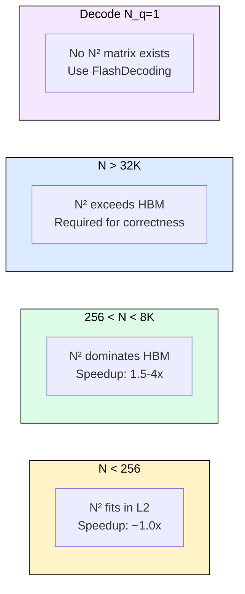
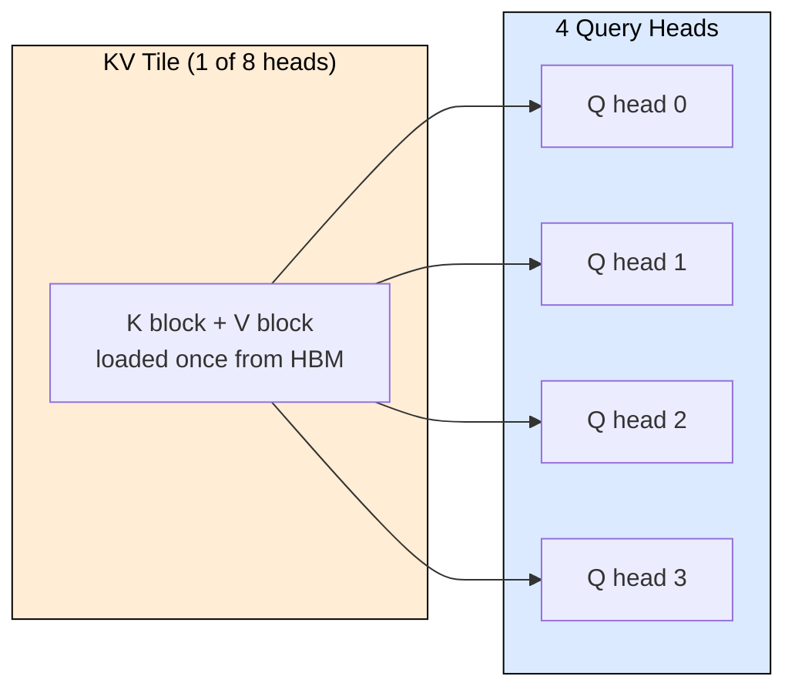
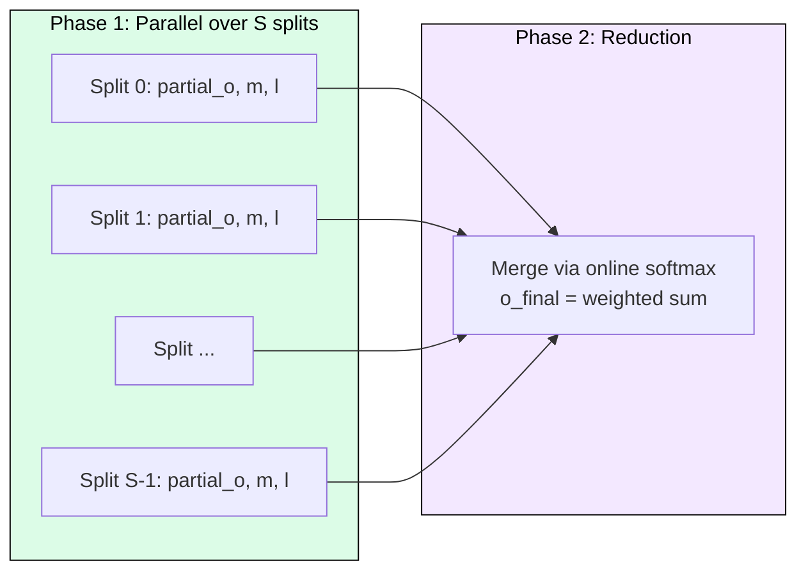

# 3.7 FlashAttention in Practice

[](https://colab.research.google.com/github/harshuljain13/llm-inference-at-scale/blob/master/content/03_attention_variants/03.7_flash_attention_practice/lab.ipynb) [](https://molab.marimo.io/github/harshuljain13/llm-inference-at-scale/blob/master/content/03_attention_variants/03.7_flash_attention_practice/lab.ipynb)

FlashAttention is exact, not approximate. It computes identical results to standard attention while eliminating the N² intermediate from HBM. This module covers when FlashAttention helps, when it does not, how inference engines integrate it, and how to use it in practice.

## When FlashAttention Helps

FlashAttention’s benefit depends on whether the N² attention matrix dominates HBM traffic. Four scenarios illustrate the boundary conditions.



**Short sequences (N < 256):** The attention matrix is small enough (128×128 = 32 KB) to fit in L2 cache. Tiling overhead offsets IO savings. Standard fused kernels match FlashAttention performance.

**Decode (N_q = 1):** The attention "matrix" is a single row vector [1, N]. No N² term exists. The bottleneck is reading the KV cache (2Nd elements), not attention scores. Use FlashDecoding or PagedAttention kernels instead.

**Medium to long prefill (256 to 32K):** FlashAttention delivers 1.5 to 4x speedup by eliminating quadratic HBM traffic. GQA amplifies the benefit because fewer KV heads increase compute per byte loaded, making attention more compute-bound.

**Very long sequences (32K+):** At 128K tokens with 32 heads, standard attention requires 4.4 TB of HBM traffic per layer, exceeding physical memory. FlashAttention is not an optimization here; it is a correctness requirement. Every model supporting 128K+ context (Llama 3.1, Claude, GPT-4) depends on tiled attention.

## GQA Interaction

GQA reduces KV heads from 32 to 8, cutting KV reads by 4x. Each KV tile is reused by multiple query heads, increasing arithmetic intensity. FlashAttention-2 and FlashAttention-3 include GQA-aware tiling that loads one KV tile and processes all associated Q heads against it:



Result: GQA makes FlashAttention’s benefit larger, not smaller.

## FlashDecoding for Decode

Standard FlashAttention parallelizes over Q blocks. During decode, Q has one row, leaving 107 of 108 SMs idle on an A100. FlashDecoding solves this by splitting KV along the sequence dimension into S splits, processing each in parallel, then merging with online softmax reduction:



With S=32 splits and 32 heads, decode uses 1024 thread blocks, saturating the GPU. FlashDecoding achieves 1.2x over PagedAttention and 1.8x over standard decode attention.

## Engine Integration

All major inference engines use FlashAttention for prefill and specialized kernels for decode:

| Engine | Prefill Kernel | Decode Kernel | GQA |
|--------|---------------|---------------|-----|
| vLLM | flash_attn_varlen | paged_attention_v2 | Native |
| SGLang | FlashInfer | FlashInfer decode | Native |
| TensorRT-LLM | flash_attention | gpt_attention | Native |
| HuggingFace | flash_attn_2 / SDPA | flash_attn_2 / SDPA | Via config |

vLLM’s `flash_attn_varlen_func` packs multiple variable-length sequences using cumulative sequence length offsets (cu_seqlens), eliminating padding waste. SGLang adds prefix-aware attention via radix tree KV sharing and chunked prefill for long prompts.

## Practical Usage

FlashAttention is available as a drop-in replacement. PyTorch 2.0+ dispatches automatically through `scaled_dot_product_attention`:

```python
# Automatic dispatch (PyTorch >= 2.0)
from torch.nn.functional import scaled_dot_product_attention
output = scaled_dot_product_attention(q, k, v)

# Explicit FlashAttention package
from flash_attn import flash_attn_func
output = flash_attn_func(q, k, v, causal=True)

# HuggingFace Transformers
model = AutoModelForCausalLM.from_pretrained(
    "meta-llama/Llama-3.1-8B",
    attn_implementation="flash_attention_2"
)
```

PyTorch’s SDPA dispatcher selects the best backend based on input shape, dtype, and GPU architecture. On Ampere+ GPUs with FP16/BF16 inputs, FlashAttention-2 is chosen automatically.

## Common Misconceptions

1. **"FlashAttention is approximate."** It computes exact attention. Output differs from standard only by floating-point reordering (last few bits of precision).
2. **"FlashAttention reduces FLOPs."** It performs the same FLOPs (slightly more due to online softmax bookkeeping). Speedup comes entirely from reduced HBM access.
3. **"FlashAttention helps all operations."** It only optimizes Q@K, softmax, P@V. Linear projections and MLP (60-70% of inference time) are unaffected. By Amdahl’s Law, a 3x attention speedup yields only 1.1x end-to-end at moderate sequence lengths.
4. **"You need custom CUDA code."** All major frameworks provide it as a one-line config or automatic dispatch.

## End-to-End Impact

For Llama 3.1 8B on A100, batch=8, prompt=2048:

| Metric | Without FA | With FA-2 |
|--------|-----------|-----------|
| Prefill attention HBM traffic | 8.7 GB | 1.4 GB |
| Prefill attention time | 5.8 ms | 2.1 ms |
| GPU utilization (attention) | ~45% | ~87% |
| Intermediate memory | 2.1 GB | 0 |
| Prefill end-to-end speedup | baseline | 1.3x |

The freed 2.1 GB of intermediate storage allows serving more concurrent sequences or longer contexts.

## FAQ

**Q: Should I use FlashAttention for all inference workloads?**
A: For prefill, yes. For decode, no. Decode benefits from FlashDecoding or PagedAttention kernels because N_q=1 eliminates the N² matrix that FlashAttention optimizes.

**Q: Does FlashAttention work with FP8?**
A: FlashAttention-3 supports FP8 on Hopper GPUs, achieving 2.1x speedup over FA-2 in FP16.

**Q: Why can’t I visualize attention weights with FlashAttention?**
A: FlashAttention never materializes the full attention matrix P. It discards tile-level softmax outputs after use. Visualization requires a separate, slower kernel that explicitly stores P.

**Q: Does context length affect which kernel to use?**
A: Below 256 tokens, standard fused attention suffices. From 256 to 32K, FlashAttention provides 1.5-4x speedup. Above 32K, it is required because the N² intermediate exceeds GPU memory.

**Q: How does FlashAttention interact with KV cache quantization?**
A: They are complementary. FlashAttention reduces HBM traffic for the attention computation. KV cache quantization (INT8/INT4) reduces the memory footprint of stored keys and values. Both can be used together.

## References

1. Dao et al. "FlashAttention: Fast and Memory-Efficient Exact Attention with IO-Awareness" (NeurIPS 2022)
2. Dao. "FlashAttention-2: Faster Attention with Better Parallelism and Work Partitioning" (2023)
3. Shah et al. "FlashAttention-3: Fast and Accurate Attention with Asynchrony and Low-precision" (2024)
4. Dao et al. "FlashDecoding" (2023)
5. Kwon et al. "Efficient Memory Management for Large Language Model Serving with PagedAttention" (SOSP 2023)
6. Milakov and Gimelshein. "Online normalizer calculation for softmax" (2018)
