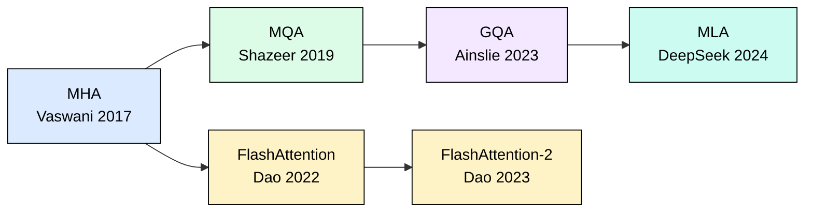
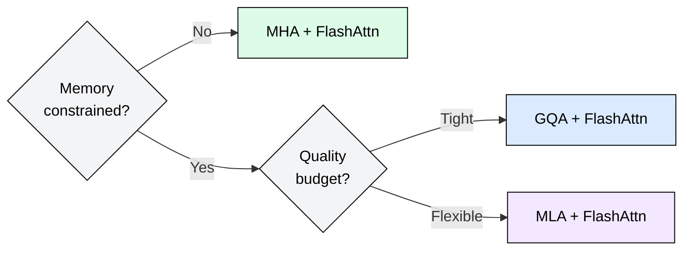

# 3.8 Attention Mechanisms Compared

Every attention variant makes a different trade-off between memory, latency, and output quality. This module puts them side by side so you can choose the right mechanism for your deployment constraints.

## Why a Comparison Matters

Production serving forces a concrete question: given a fixed GPU budget, which attention mechanism lets you serve the most concurrent users at acceptable latency? The answer depends on sequence length, batch size, and quality requirements. A single comparison table, grounded in real numbers, replaces hours of back-of-envelope math.

## The Mechanisms at a Glance

**Multi-Head Attention (MHA)** stores independent Key and Value projections for every head. With 32 heads and dimension 128 per head, each token adds 32 KV pairs to the cache. This is the original Transformer design from Vaswani et al. (2017).

**Grouped-Query Attention (GQA)** shares KV heads across groups of query heads. Mistral-7B uses 8 KV heads shared among 32 query heads (a 4:1 ratio), cutting KV cache to 25% of MHA while preserving nearly identical perplexity.

**Multi-head Latent Attention (MLA)** compresses KV representations into a low-rank latent space before caching. DeepSeek-V2 projects 128-dim per-head KV pairs down to a 512-dim shared latent, achieving 93% compression versus MHA.

**FlashAttention** does not change what is stored. It changes how attention is computed: by tiling the softmax into SRAM-sized blocks, it avoids materializing the full N×N attention matrix, reducing memory from O(N²) to O(N) and improving latency by 2-4x through better hardware utilization.

## Quantitative Comparison

The table below assumes a Mistral-7B-scale model (32 layers, hidden dim 4096, head dim 128) in FP16 at 2048-token context. "Max users" assumes 70GB available after model weights on A100-80GB.

| Mechanism | KV Heads | KV Cache/Token | Cache at 2048 Tokens | Max Concurrent Users (A100-80GB) | Latency Impact | Quality Impact |
|-----------|----------|----------------|---------------------|----------------------------------|----------------|----------------|
| MHA | 32 | 524 KB | 1.05 GB | ~66 | Baseline | Baseline |
| GQA (4:1) | 8 | 131 KB | 262 MB | ~266 | 0.95x (slightly faster) | <0.1 PPL loss |
| MLA (512-d) | N/A | ~33 KB | 66 MB | ~1060 | 0.9x (faster decode) | <0.2 PPL loss |
| FlashAttention | Same as base | Same as base | Same as base | Same as base | 0.4-0.6x (2-4x faster) | Numerically identical |

**How to read this table:**
- KV Cache/Token = num_kv_heads × head_dim × 2 (K+V) × 2 bytes (FP16) × num_layers
- MHA: 32 × 128 × 2 × 2 × 32 = 524,288 bytes = 524 KB
- GQA: 8 × 128 × 2 × 2 × 32 = 131,072 bytes = 131 KB
- MLA: 512 × 2 × 32 = 32,768 bytes ≈ 33 KB (latent dim replaces per-head storage)
- FlashAttention reduces compute time, not storage

## Production Models

| Mechanism | Notable Models |
|-----------|---------------|
| MHA | GPT-3, OPT-175B, BLOOM |
| GQA | Llama 2/3, Mistral-7B, Mixtral, Gemma |
| MLA | DeepSeek-V2, DeepSeek-V3 |
| FlashAttention | Used in serving all of the above (orthogonal optimization) |

## Evolution Timeline

The KV-compression line (MHA → MQA → GQA → MLA) reduces memory. The compute-efficiency line (FlashAttention → FlashAttention-2) reduces latency. These are orthogonal: you can combine GQA with FlashAttention (as Mistral does) or MLA with FlashAttention.

## Decision Framework

If memory is not your bottleneck, MHA with FlashAttention gives the best quality with fast compute. If you need to serve more concurrent users, GQA offers 4x memory savings with negligible quality loss. If you need extreme density (1000+ users per GPU), MLA achieves 16x compression with slightly more quality trade-off.

## Key Takeaways

1. GQA is the current industry default: it eliminates 75% of KV cache with near-zero quality cost.
2. MLA pushes further (93% reduction) but requires model retraining from scratch.
3. FlashAttention is always beneficial: it reduces latency without touching model weights or quality.
4. These optimizations compose: GQA + FlashAttention is strictly better than either alone.

## FAQ

**Q: Can I retrofit MLA into an existing GQA model?**
No. MLA requires architectural changes (low-rank projection layers) that must be present during pretraining. You cannot convert a GQA checkpoint to MLA post-hoc.

**Q: Does FlashAttention change model outputs?**
No. FlashAttention computes mathematically identical results using a numerically stable online softmax. Outputs are bit-for-bit equivalent (within floating-point tolerance).

**Q: Why not always use MLA if it saves the most memory?**
MLA adds latent projection compute on every token. For short sequences where memory is not the bottleneck, the extra compute may increase latency. Also, MLA models must be trained from scratch with the compressed architecture.

**Q: Does GQA quality loss accumulate over longer sequences?**
Empirically, no. The perplexity gap between MHA and GQA remains constant (< 0.1 PPL) across context lengths up to 32K tokens in Llama 2 ablations.

**Q: Can FlashAttention help with prefill or only decode?**
Both. FlashAttention is most impactful during prefill (where the full N×N attention matrix would otherwise be materialized) but also speeds up decode by improving memory access patterns for the growing KV cache.

**Q: What is the minimum sequence length where FlashAttention matters?**
FlashAttention shows measurable speedup starting around 512 tokens. Below that, the overhead of tiling exceeds the memory-bandwidth savings.

## References

1. Vaswani, A. et al. "Attention Is All You Need." NeurIPS 2017.
2. Shazeer, N. "Fast Transformer Decoding: One Write-Head is All You Need." arXiv:1911.02150, 2019.
3. Ainslie, J. et al. "GQA: Training Generalized Multi-Query Transformer Models from Multi-Head Checkpoints." EMNLP 2023.
4. Dao, T. "FlashAttention: Fast and Memory-Efficient Exact Attention with IO-Awareness." NeurIPS 2022.
5. Dao, T. "FlashAttention-2: Faster Attention with Better Parallelism and Work Partitioning." ICLR 2024.
6. DeepSeek-AI. "DeepSeek-V2: A Strong, Economical, and Efficient Mixture-of-Experts Language Model." arXiv:2405.04434, 2024.
7. Touvron, H. et al. "Llama 2: Open Foundation and Fine-Tuned Chat Models." arXiv:2307.09288, 2023.
