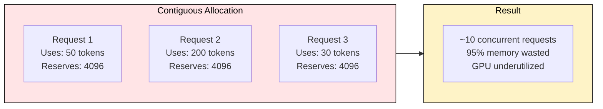
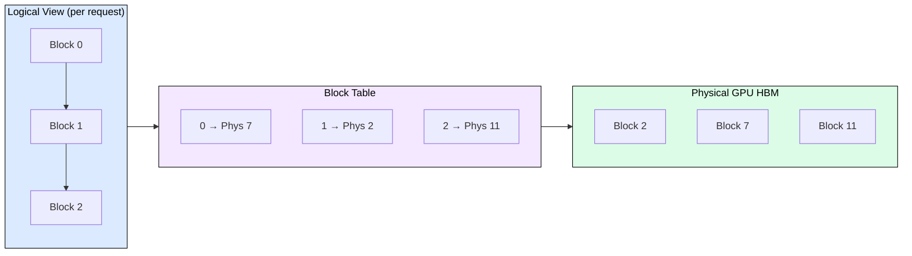
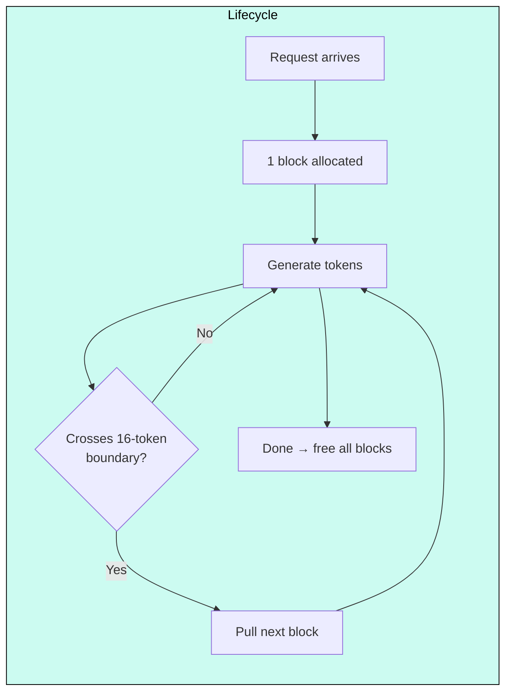
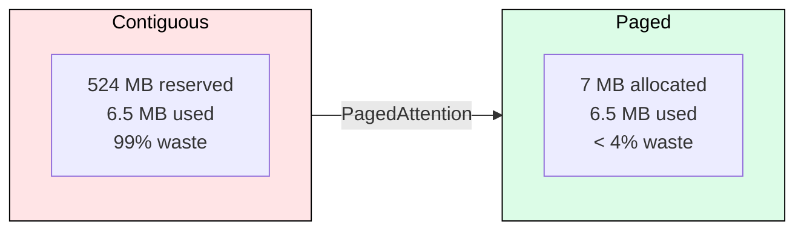

# 4.1 PagedAttention

Without PagedAttention, a 80GB A100 serves ~10 concurrent requests. With PagedAttention, it serves 40+. The difference is not a better algorithm for computing attention. It is eliminating the 60-80% memory waste that traditional KV cache allocation forces on every request. This module explains why that waste exists, how PagedAttention removes it, and what you pay for the improvement.

---

## 4.1.1 What Problem Does This Solve?

Traditional serving engines pre-allocate a contiguous KV cache per request at the maximum sequence length. A 12-token query reserves space for 4,096 tokens, wasting 99.6% of that memory. For Llama 3.1 8B with GQA (8 KV heads, 128 dim, 32 layers), each token costs 131 KB. One request reserving 4,096 tokens locks 524 MB regardless of actual generation length.

On an 80 GB A100, model weights consume ~16 GB (FP16). The remaining 64 GB supports only ~122 max-length reservations. In practice, most requests generate 50-200 tokens, meaning 95%+ of reserved memory sits idle. That idle memory directly caps your batch size, which caps your throughput and revenue per GPU.

**What this unlocks**: Eliminating this waste means 4-10x more concurrent requests on the same hardware, which translates directly to 2-4x throughput and proportionally lower cost per token.

---

## 4.1.2 The Mechanism: Virtual Memory for KV Cache

The fix borrows from operating systems. Processes do not get contiguous RAM sized to their maximum need. They get virtual address spaces backed by physical pages allocated on demand. PagedAttention applies this to KV cache:

| OS Concept | KV Cache Equivalent | What It Unlocks |
|---|---|---|
| Physical page frame | KV block (fixed 16 tokens) | Allocate only what is used |
| Page table | Block table per request | Non-contiguous blocks appear sequential |
| Page fault | New block on boundary crossing | Grow allocation incrementally |
| Free page pool | GPU block pool | Instant reuse when requests finish |

The key property: physical blocks need not be contiguous. The attention kernel gathers KV vectors from scattered locations via the block table. This one level of indirection costs ~2-5% latency but reclaims the majority of GPU memory.

---

## 4.1.3 Allocation Flow

Each block holds 16 tokens (vLLM default). When a request arrives, one block is allocated. As generation crosses block boundaries, new blocks are pulled from the free pool. When the request completes, all blocks return instantly.

**What this unlocks**: A 50-token response uses 4 blocks (64 tokens worth = 8 KB), not the 524 MB that contiguous allocation would reserve. The freed memory serves other requests immediately.

---

## 4.1.4 Fragmentation: Near Zero

With paged allocation, waste is limited to the last partially-filled block per request: on average, `(block_size - 1) / 2` = 7.5 tokens = ~1 KB for Llama 8B. External fragmentation (unusable gaps) is eliminated entirely because any free block can serve any request.

**What this unlocks**: The same 80 GB GPU now serves 2,000+ concurrent requests (bounded by actual token consumption), turning a $2/hr GPU from 10 concurrent users into 40+ at no additional hardware cost.

---

## 4.1.5 Two Bonus Optimizations Paged Layout Enables

Contiguous allocation makes these impossible. Paged allocation makes them trivial:

**Prefix caching**: Requests sharing a system prompt point to the same physical blocks. For 1,000-token prefix shared across 100 requests: savings = 99 × 1000 × 131 KB = 12.7 GB. Enable in vLLM with `--enable-prefix-caching`.

**Copy-on-Write for beam search**: Beams share blocks until divergence. A block copies only when modified. With 4 beams sharing 80% of tokens, memory drops from 4x to 1.8x vs. full duplication.

---

## 4.1.6 Tradeoffs: What You Pay

PagedAttention is not free. Three costs to understand:

**1. CPU overhead of block table lookup (~2-5% latency)**
Every attention computation adds one gather indirection. The kernel reads the block table to locate physical KV vectors instead of computing a simple offset. On modern GPUs with large L2 caches, the block table (a few KB per request) stays cached, so the penalty is 2-5% per decode step. For latency-critical applications (real-time voice), this matters. For throughput-oriented batch serving, the 4x concurrency gain dwarfs it.

**2. Memory overhead of block metadata**
Each block table entry is a 32-bit integer. A 4,096-token request at block_size=16 needs 256 entries = 1 KB. At 10,000 concurrent requests, total block table metadata is ~10 MB. Negligible compared to the GB of KV cache it manages, but worth noting in memory accounting.

**3. Copy-on-Write complexity for beam search**
CoW requires tracking reference counts per block and triggering copies on write. This adds CPU-side bookkeeping per beam expansion step. For greedy decoding (no beam search), this cost is zero. For beam_width=4, the copy overhead is measurable but small compared to the memory savings. The implementation complexity is the real cost: debugging CoW race conditions in a concurrent scheduler is non-trivial.

**Block size tuning tradeoff**:
- Smaller blocks (4-8): less fragmentation, more metadata, more scattered memory access
- Larger blocks (32-64): more fragmentation per request, better memory locality
- Default 16: empirical sweet spot for mixed workloads. Tune with `--block-size` in vLLM.

---

## FAQ

**Q1: Is PagedAttention used in all engines now?**
Yes. vLLM introduced it (SOSP 2023), and SGLang, TensorRT-LLM, and DeepSpeed-FastGen all use paged KV managers. It is the industry standard.

**Q2: What happens when the block pool runs out?**
The scheduler preempts lower-priority requests (evicts blocks) or rejects new arrivals. This is analogous to OS page replacement policies.

**Q3: How does it interact with tensor parallelism?**
Each GPU maintains its own block table for its KV shard. Logical indices synchronize across GPUs so attention remains consistent.

**Q4: Can I combine PagedAttention with KV quantization?**
Yes. Blocks store quantized values (FP8, INT4). Paging eliminates waste; quantization compresses what remains. They stack.

**Q5: When would I NOT want PagedAttention?**
If all requests have identical, predictable lengths (fixed-output batch jobs) and you can size allocation exactly, contiguous allocation avoids the 2-5% indirection cost. This scenario is rare in production.

---

## References

1. Kwon, W. et al. "Efficient Memory Management for Large Language Model Serving with PagedAttention." SOSP 2023.
2. Zheng, L. et al. "SGLang: Efficient Execution of Structured Language Model Programs." arXiv 2312.07104, 2023.
3. NVIDIA. "TensorRT-LLM: A TensorRT Toolbox for Optimized Large Language Model Inference." 2024.
4. vLLM Documentation. "Automatic Prefix Caching." https://docs.vllm.ai/en/latest/features/automatic-prefix-caching.html
