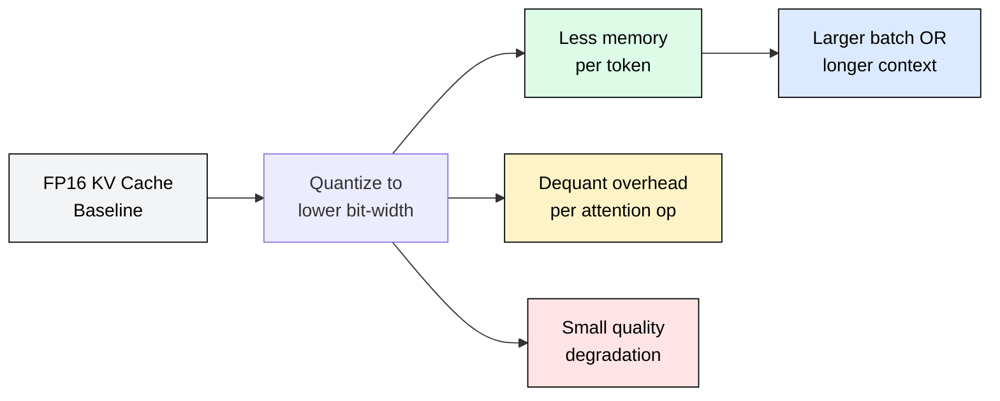
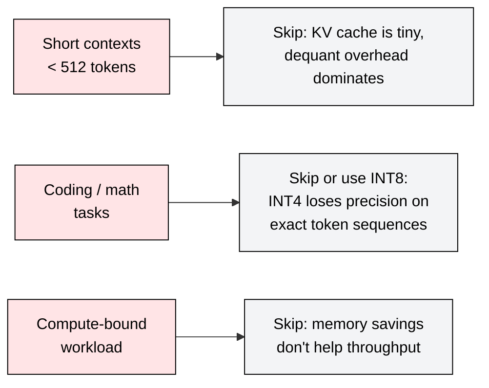
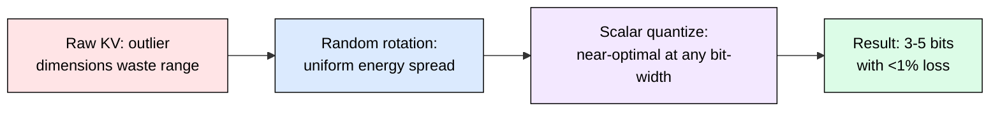
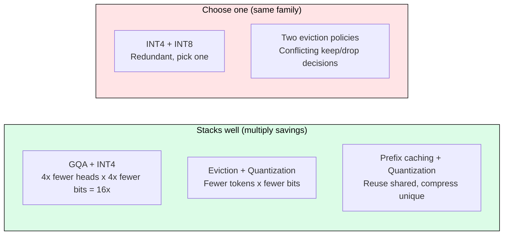
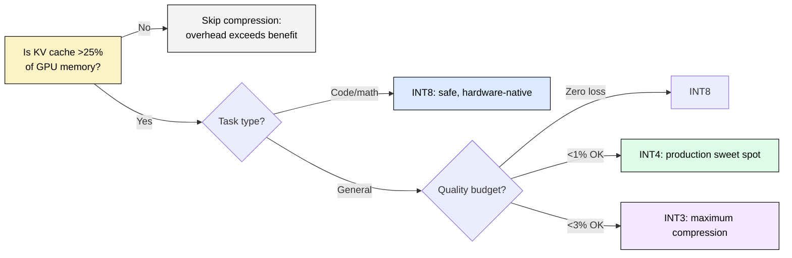

# 4.2 KV Cache Compression

 

INT4 KV quantization doubles batch size on the same GPU with less than 1% quality degradation on most benchmarks. This single fact makes KV compression the highest-leverage optimization for memory-bound decode workloads. This module covers which bit-width to choose, when compression helps or hurts, how techniques compose, and what overhead you pay.

---

## The Core Tradeoff: Memory vs Quality vs Latency

KV cache compression reduces the bytes stored per token, letting you fit more sequences (larger batch) or longer contexts in the same GPU memory. The cost is twofold: a small quality degradation from reduced precision, and a dequantization latency overhead during attention computation.

The right bit-width depends on your workload. The table below summarizes the production-tested options.

---

## Bit-Width Selection: Quality vs Memory

| Format | Bits/element | Memory vs FP16 | Typical quality loss | Best for |
|--------|:---:|:---:|:---:|------|
| FP16 | 16 | 1x (baseline) | None | Safety-critical, short contexts |
| INT8 | 8 | 2x savings | <0.1% perplexity | Conservative default, minimal risk |
| INT4 | 4 | 4x savings | <1% on most tasks | Production sweet spot for batch scaling |
| INT3 | 3 | 5.3x savings | <1% general, 2-3% on coding | Maximum compression when quality allows |

**INT4 is the production sweet spot.** It delivers 4x memory reduction, which directly translates to 2x batch size (since KV cache typically consumes ~50% of decode-phase memory at batch >16). Quality loss stays under 1% for summarization, QA, chat, and most generative tasks.

**INT8 is the safe default.** Hardware-native FP8/INT8 on H100/B200 requires zero software effort (just a flag in vLLM/SGLang) and delivers 2x savings with effectively zero quality loss. Use this when you have moderate memory pressure and want zero risk.

**INT3 pushes the boundary.** 5.3x compression is remarkable, but coding tasks and precise numerical reasoning show 2-3% degradation. Use only after validating on your specific evaluation suite.

---

## When Compression Hurts

Not every workload benefits. Compression adds overhead and introduces error. Three scenarios where you should skip it:

**Short contexts (< 512 tokens).** The KV cache is already small. Dequantization latency per attention operation (3-8 microseconds per head on H100) exceeds any throughput gain from reduced memory bandwidth. The breakeven point is roughly 512 tokens at batch 8 or higher.

**Coding and exact-match tasks.** Code generation requires precise token-level fidelity. INT4 quantization introduces rounding that occasionally flips a variable name or operator. INT8 is acceptable; INT4/INT3 show measurable degradation on HumanEval, MBPP, and similar coding benchmarks (1.5-3% pass@1 drop).

**Compute-bound workloads.** If your decode step is bottlenecked by matmul compute (rare, but happens at batch=1 with very large models on fast GPUs), reducing KV memory does not improve generation speed. Profile first: if GPU utilization is >80% during decode, compression will not help throughput.

---

## Dequantization Latency Overhead

Compression is not free at inference time. Every attention operation must dequantize the stored KV entries before computing dot products. This adds per-step latency:

| Format | Dequant overhead per head (H100) | Impact on ITL |
|--------|:---:|:---:|
| INT8 | ~1 μs | Negligible (<1%) |
| INT4 | ~3-5 μs | 2-4% at short sequences |
| INT3 | ~5-8 μs | 3-6% at short sequences |

The overhead is fixed per attention operation regardless of sequence length. At long sequences (4K+ tokens), the bandwidth savings from reading fewer bytes far exceeds the dequant cost, making compression a net latency win. At short sequences, the fixed overhead dominates, making compression a net latency loss.

**Rule of thumb:** if your median sequence length exceeds 1K tokens and batch size exceeds 4, INT4 compression reduces both memory AND end-to-end latency simultaneously. Below these thresholds, measure before committing.

---

## Quality Sensitivity by Task Type

Not all tasks degrade equally under quantization. The pattern is consistent across models:

| Task category | INT8 impact | INT4 impact | INT3 impact |
|---------------|:---:|:---:|:---:|
| Summarization | None | <0.5% | <1% |
| Open-ended chat | None | <0.5% | <1% |
| QA (factual) | None | <1% | 1-2% |
| Long-context retrieval | None | <1% | 1-2% |
| Code generation | None | 1-1.5% | 2-3% |
| Math reasoning | <0.1% | 1-2% | 2-4% |
| Exact extraction | <0.1% | 1-2% | 3-5% |

Tasks requiring exact token-level fidelity (code, math, extraction) degrade most because quantization noise compounds across the precise multi-step reasoning chain. Fluency-based tasks (chat, summarization) are robust because small attention score perturbations rarely change the selected token.

---

## How Quantization Works (Outcome, Not Algorithm)

The key insight enabling near-lossless 4-bit compression: random rotation prevents outliers, enabling near-lossless 4-bit compression.

Raw KV vectors have non-uniform distributions with outlier dimensions that force naive quantizers to waste dynamic range. Applying a random orthogonal rotation (implemented as a fast Hadamard transform) spreads energy uniformly across all dimensions. After rotation, no dimension is special, and a simple uniform scalar quantizer achieves near-optimal compression with minimal distortion.

This rotation-then-quantize approach (TurboQuant, ICLR 2026) requires no model retraining, works on any transformer, and is already integrated into vLLM. The rotation matrix is fixed at initialization; the quantizer boundaries depend only on head_dim, not on model weights.

---

## Composability: What Stacks and What Conflicts

KV compression techniques from different families compose multiplicatively. Techniques from the same family conflict.

**The strongest production stack:** GQA (architectural, built into the model) + prefix caching (reuse shared context) + INT4 quantization (compress unique per-request tokens). For a GQA model like Mistral-7B (8 KV heads instead of 32), this yields: 4x from GQA + 4x from INT4 + variable reuse from prefix caching = 16x+ effective compression for multi-tenant RAG workloads.

**Eviction + quantization** also composes: evict clearly unimportant tokens first (reduce count), then quantize survivors (reduce bits). The savings multiply.

---

## Decision Framework

---

## FAQ

**Q: Does KV quantization require model retraining?**
No. Rotation-based quantization is entirely post-hoc and works on any transformer. Set a flag in your serving engine and it applies automatically.

**Q: Why not just use FP8?**
FP8 gives 2x compression with zero effort (hardware-native on H100/B200). INT4 gives 4x with slightly more engineering but still <1% quality loss. Use FP8 when you want the simplest path; use INT4 when memory pressure demands more aggressive compression.

**Q: Does compression help at batch size 1?**
Rarely. At batch 1, decode is often compute-bound, and the KV cache is small relative to weights. Compression shines at batch 8+ where KV cache dominates memory.

**Q: How does this interact with GQA?**
GQA reduces the number of KV heads; quantization reduces the bits per head. They stack multiplicatively. Mistral-7B with GQA (8 KV heads) + INT4 uses 16x less KV memory than a full MHA model at FP16.

**Q: Can I apply different bit-widths to different layers?**
Yes. Mixed-precision KV quantization applies higher precision to early layers (where attention patterns are more sensitive) and lower precision to later layers. This recovers 30-50% of the quality gap versus uniform quantization at the same average bit-width.

**Q: What is the latency impact of INT4 on long sequences?**
Net positive. At 4K+ tokens, reading 4x fewer bytes from HBM saves more time than dequantization adds. INT4 reduces both memory AND per-step latency for long-context workloads.

---

## References

1. Zandieh et al. "TurboQuant: Online Vector Quantization with Near-optimal Distortion Rate." ICLR 2026. arXiv:2504.19874
2. Zhang et al. "H2O: Heavy-Hitter Oracle for Efficient Generative Inference." NeurIPS 2023. arXiv:2306.14048
3. Hooper et al. "KVQuant: Towards 10 Million Context Length LLM Inference with KV Cache Quantization." NeurIPS 2024. arXiv:2401.18079
4. Ramachandran et al. "ThinKV: Thought-Adaptive KV Cache Compression." ICLR 2026. arXiv:2510.01290
5. Liu et al. "KIVI: A Tuning-Free Asymmetric 2bit Quantization for KV Cache." ICML 2024. arXiv:2402.02750
6. "Training Transformers for KV Cache Compressibility." arXiv:2605.05971
