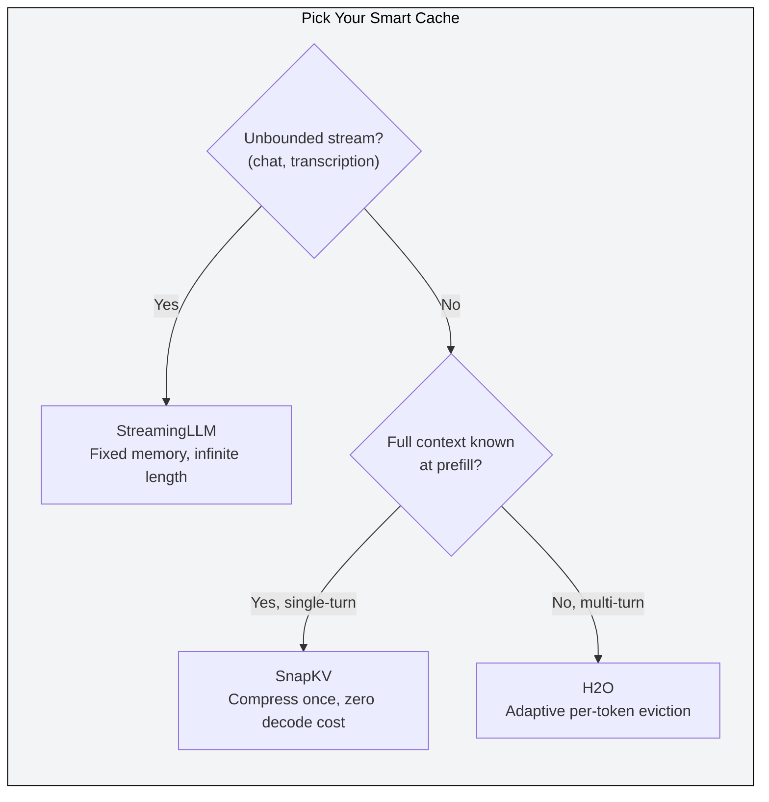
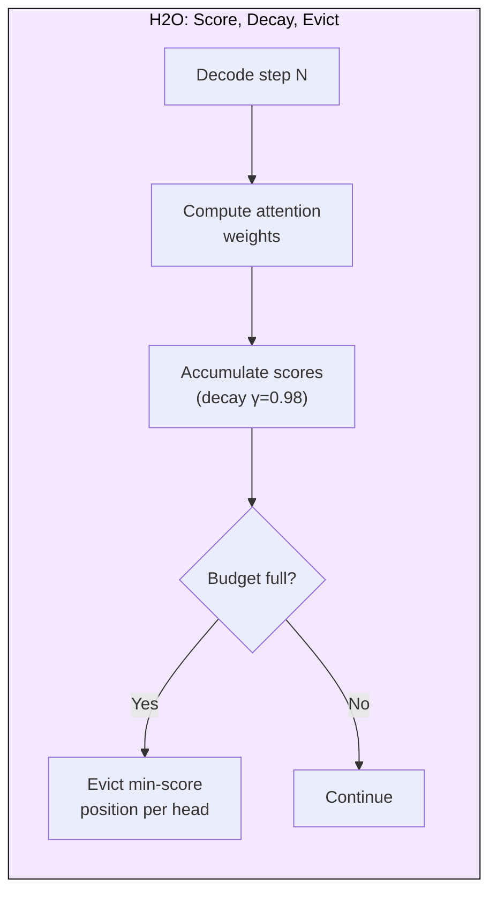
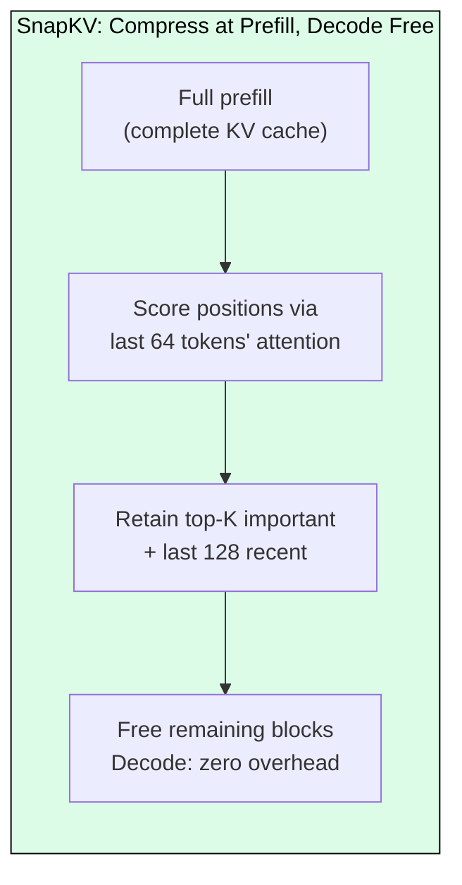
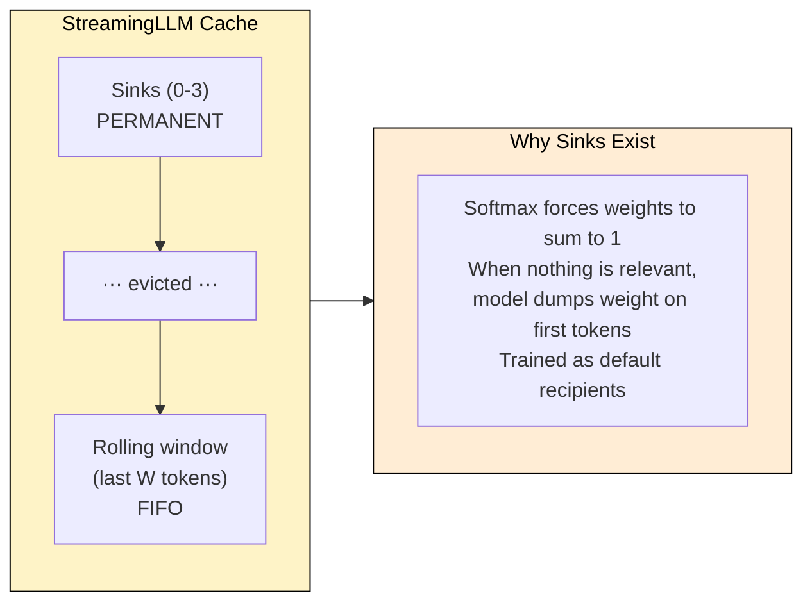
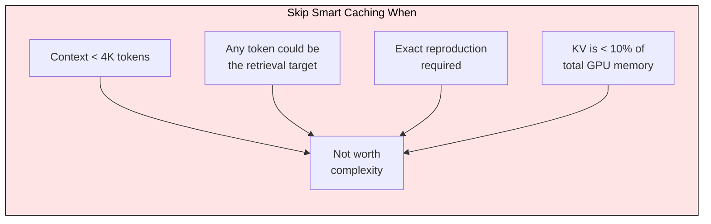

# 4.3 Smart KV Caching

 

H2O fits 10x longer contexts on the same GPU by discarding 90% of KV entries the model barely uses. The insight is simple: attention follows a power law where the top 5% of positions capture 60-80% of total weight, while the bottom 50% receive less than 5%. Three techniques exploit this asymmetry for different workloads. This module tells you which one to reach for, what breaks when you use it wrong, and when you should skip smart caching entirely.

---

## The Decision: Which Technique for Which Workload

| | H2O | SnapKV | StreamingLLM |
|---|---|---|---|
| **Best for** | Batch inference, varied request patterns | Long-doc QA, RAG, summarization | Infinite chat, streaming audio |
| **Compression** | 5-10x | 3-5x | Infinite (fixed budget) |
| **Decode overhead** | 5-15% latency (score tracking) | Zero | Zero |
| **Batching friendly** | No (irregular layouts per head) | Yes (uniform post-compression) | Yes (fixed size) |
| **Long-range retrieval** | Good (adapts to query) | Good (stable rankings) | Gone (evicted middle) |
| **Implementation** | Hard (per-head scores, decay tuning) | Medium (observation window) | Easy (FIFO + sinks) |

---

## H2O: Adaptive Eviction for Batch Inference

H2O (Zhang et al., NeurIPS 2024) tracks cumulative attention scores per cached position and evicts the lowest when the budget is full. Each attention head maintains independent scores, so different heads retain different token subsets.

**Why batch inference:** When you serve 100 different requests simultaneously, each has a unique attention profile. H2O adapts in real time because it re-evaluates importance at every token. A code completion request and a summarization request running in the same batch will retain completely different token subsets.

**Quality results (LLaMA-7B/13B):** At 20% budget (5x compression), perplexity increases less than 0.5 on WikiText-103. LAMBADA accuracy drops under 2%.

**The catch:** Per-head independent eviction creates irregular memory layouts that break efficient batched attention kernels. You either accept the throughput hit or periodically compact the cache (adding complexity). The 5-15% decode latency overhead from score extraction compounds over long sequences.

---

## SnapKV: One-Shot Compression for Document Workloads

SnapKV (Li et al., ICML 2024) compresses the KV cache once during prefill and never touches it again. It observes attention patterns over the last 32-64 prefill tokens (the "observation window"), ranks all positions by average attention received, keeps the top-K plus a recent window, and frees the rest.

**Why this works:** Position importance rankings are remarkably stable. Kendall's tau between prefill-time and decode-time importance exceeds 0.85 for 90% of layers. The one-shot decision is correct because the model already "knows" which tokens matter before generation starts.

**Why interactive/RAG:** Zero decode overhead means latency-sensitive applications get memory savings for free. Uniform post-compression layout means it slots directly into FlashAttention and PagedAttention without modification.

**Quality results (Mistral-7B):** At 4x compression, Needle-in-a-Haystack accuracy holds at 100% up to 32K. LongBench average drops under 1.5%. Decode throughput improves 3.6x.

---

## StreamingLLM: Fixed Memory for Infinite Context

StreamingLLM (Xiao et al., ICLR 2024) retains 4 "attention sink" tokens permanently plus a rolling window of recent tokens. Everything in between is evicted FIFO. Memory never grows regardless of conversation length.

**Why this and not just a sliding window:** A naive window that drops the first tokens causes perplexity to explode past 1000. The model needs those sink positions as attention "dumps." Four sink tokens plus re-indexed positions (for RoPE compatibility) solve this completely.

**Quality results:** Perplexity on 4M-token sequences stays within 0.2 of full-cache baseline with S=4, W=2048. Throughput improves 22x over full cache at 4M tokens.

**The hard limit:** StreamingLLM cannot retrieve anything from evicted middle tokens. If the user asks "what did we discuss 2 hours ago?" and that content has left the window, the model hallucinates or refuses.

---

## When NOT to Use Smart Caching

This is the section most guides skip. Smart caching is not universally beneficial.

**Short contexts (under 4K tokens):** The KV cache for a 4K-token Mistral-7B request is 131 KB/token x 4096 = 537 MB. With PagedAttention this is already efficiently managed. Smart caching adds implementation complexity (eviction logic, score tracking, observation windows) for negligible memory savings. The overhead of compression logic may exceed what you save.

**Factual retrieval where any token could be the answer:** Needle-in-a-Haystack tests show SnapKV maintains 100% accuracy, but this uses a synthetic single-fact needle. Real retrieval tasks (multi-hop QA, legal document search, code navigation across large files) require the model to attend to arbitrary positions unpredictably. Evicting the "unimportant" position that happens to contain the answer is catastrophic, not graceful.

**Tasks requiring exact reproduction:** Code generation from spec, translation, or any task where dropping a token means dropping a constraint. Smart caching optimizes for the common case (most tokens are noise), but these tasks have no noise tokens.

**Already memory-bound by weights, not KV:** If your GPU is 80% weights and 5% KV cache, compressing KV by 10x saves 4.5% of total memory. Focus on quantization or model parallelism instead.

---

## Quality Tradeoffs: What Degrades and What Doesn't

**Tasks that tolerate aggressive compression (20-30% budget):**
- Summarization: model only needs salient sentences, most filler is genuinely irrelevant
- Sentiment/classification: decision depends on a few key phrases
- Open-ended chat: conversational fluency doesn't require verbatim recall

**Tasks that need conservative compression (50-75% budget):**
- Code generation: long-range variable dependencies, any evicted binding causes bugs
- Multi-hop reasoning: chain of facts where intermediate steps matter
- Translation: word-by-word alignment means every source token participates

**Tasks where smart caching actively hurts:**
- Multi-document QA with adversarial distractors: model may retain distractor tokens (high attention) over answer tokens (low attention in early layers)
- Arithmetic/structured reasoning: attention to formatting and delimiters is critical but scores low

The failure mode is always the same: the eviction heuristic (attention score) is a proxy for importance, and proxies fail when importance diverges from attention weight. A parenthesis in a math expression receives minimal attention but removing it changes the answer.

---

## Combining Techniques in Production

Stack methods for multiplicative compression:

- SnapKV (4x positional) + KIVI quantization (4x bit reduction) = 16x total
- PyramidKV: larger budgets for shallow layers (diffuse attention), smaller for deep layers (concentrated), improving quality 0.3-0.8 perplexity over uniform budgets
- Cross-layer sharing: adjacent layers have cosine similarity 0.92-0.97, enabling another 2x

A practical production stack: SnapKV at 25% budget + 4-bit KV quantization + cross-layer sharing at 2x = 32x compression. A 128K-context Mistral-7B request that normally needs 16.8 GB of KV cache fits in 525 MB.

---

## FAQ

**Q: Does smart caching require model retraining?**
No. All three techniques work on any pre-trained transformer. They observe attention patterns at inference time without modifying weights.

**Q: Can I combine SnapKV with PagedAttention (vLLM)?**
Yes. Prefill fills paged blocks normally, SnapKV compression gathers important entries into fewer blocks, and the freed blocks return to the block manager for other requests.

**Q: How do I set the cache budget?**
Sweep 10-75% on your actual production prompts. Plot perplexity delta vs. compression to find the "knee" where degradation accelerates. Most workloads knee at 20-30%.

**Q: What if SnapKV evicts a token needed later?**
Quality degrades gracefully (slightly higher perplexity), not catastrophically. Monitor perplexity delta in production and increase budget if it exceeds 1.0.

**Q: Does StreamingLLM work with absolute position embeddings?**
It was designed for RoPE. Absolute embeddings need different position management, though the sink principle still applies.

---

## References

- Zhang, Z. et al. (2024). "H2O: Heavy-Hitter Oracle for Efficient Generative Inference of Large Language Models." NeurIPS 2024.
- Li, Y. et al. (2024). "SnapKV: LLM Knows What You are Looking for Before Generation." ICML 2024.
- Xiao, G. et al. (2024). "Efficient Streaming Language Models with Attention Sinks." ICLR 2024.
- Cai, Z. et al. (2024). "PyramidKV: Dynamic KV Cache Compression based on Pyramidal Information Funneling."
- Liu, Z. et al. (2024). "KIVI: A Tuning-Free Asymmetric 2bit Quantization for KV Cache."
- Kwon, W. et al. (2023). "Efficient Memory Management for Large Language Model Serving with PagedAttention." SOSP 2023.
