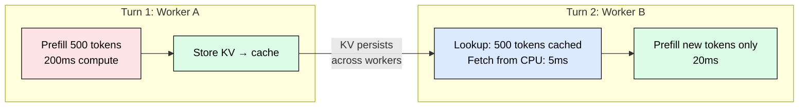
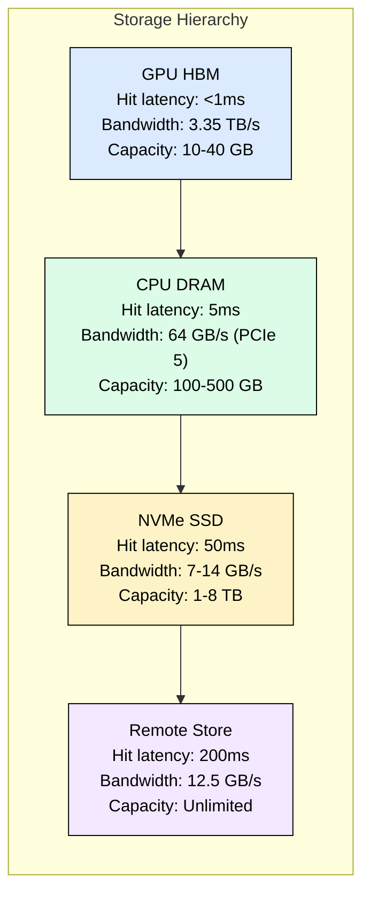
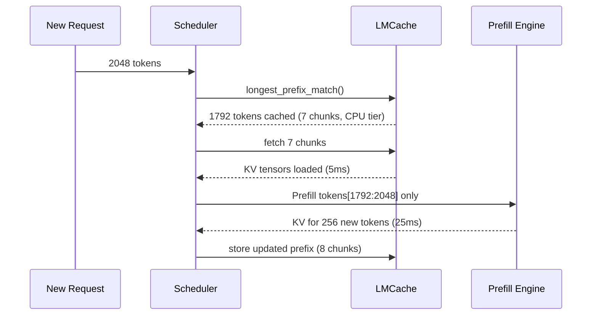
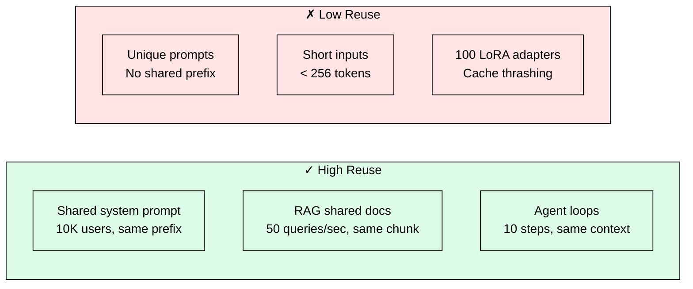

# 4.4 LMCache: Persistent KV Reuse Across Requests

 

System prompt prefill costs 200ms once. With LMCache, every subsequent request reuses the result: 0ms prefill for the system prompt forever. The KV tensors computed during the first request persist across a storage hierarchy, and every future request sharing that prefix skips straight to decoding.

This module covers where persistent KV caching delivers the biggest wins, what the storage tiers actually cost in latency, when caching actively hurts, and the operational complexity you inherit by running it.

## Where LMCache Helps Most

Not all serving patterns benefit equally. Three scenarios dominate the return on investment.

### RAG with Shared Context

A retrieval-augmented pipeline feeds the same 3,000-token document chunk to dozens of requests within seconds. Without LMCache, each request recomputes identical KV for those 3,000 tokens. With LMCache, the first request pays the 200ms prefill cost; requests 2 through N pay zero for the shared prefix.

The math: 50 requests/second sharing a 3,000-token prefix on Llama-70B. Each prefill costs 300ms of GPU time. Without caching: 15 GPU-seconds wasted per second on redundant computation. With caching: one 300ms prefill, then 49 free lookups. That is a 50x reduction in prefill GPU load for the shared portion.

### Multi-Turn Chat

Turn 1 produces 500 tokens of KV. Turn 2 arrives on a different worker (load balancer does not guarantee session affinity). Without LMCache, the engine recomputes all 500 tokens before processing the new user message. With LMCache, the full conversation KV transfers from the storage tier in 5-50ms depending on where it landed.

The benefit compounds over turns. By turn 5, the conversation prefix might be 2,000+ tokens. Recomputing that from scratch costs 200ms; fetching from CPU DRAM costs 5ms.

### Agent Loops

An agent executing a 10-step tool-calling loop sends the same system prompt (1,500 tokens) plus growing conversation context on every iteration. Each tool call is a new request to the inference engine. Without LMCache, the system prompt alone costs 150ms of redundant prefill per step: 1.5 seconds wasted across 10 steps on identical computation.

## The Storage Hierarchy: What Each Tier Actually Costs

LMCache stores KV tensors in 256-token chunks across four tiers. The numbers below are for a Llama-70B model with GQA (8 KV heads, 128 dim, 80 layers), where each token produces 320 KB of KV:

| Tier | Retrieval for 2048 tokens (640 MB) | When it wins vs recompute |
|------|-------------------------------------|---------------------------|
| GPU HBM | <1ms | Always (free lookup) |
| CPU DRAM | 5ms | Prefixes > 64 tokens |
| NVMe SSD | 50ms | Prefixes > 512 tokens |
| Remote | 200ms | Prefixes > 2048 tokens |

The crossover point: recomputing 2,048 tokens on Llama-70B costs 200-400ms. Even the slowest tier (remote, 200ms) matches or beats recomputation. For prefixes shorter than 256 tokens, recomputation is faster than the cache lookup overhead, so the engine skips the cache entirely.

### Tier Placement Strategy

Hot prefixes (system prompts reused every second) stay in GPU HBM. Warm prefixes (conversation histories accessed within minutes) sit in CPU DRAM. Cold prefixes (documents accessed hourly) spill to NVMe. The remote tier serves cross-node sharing in disaggregated architectures where prefill and decode run on different machines.

## How It Works: Token-Indexed Chunks

LMCache indexes by token sequence, not request ID. Two requests with the same prefix automatically share cached KV without application-level coordination. The storage unit is a 256-token chunk, enabling partial reuse: if 1,792 of 2,048 tokens match, the engine fetches 7 cached chunks and prefills only the remaining 256.

Total time: 5ms fetch + 25ms partial prefill = 30ms. Without cache: 200ms full prefill. A 6.7x TTFT improvement for this request.

## When NOT to Use LMCache

Caching is not free. Three scenarios where LMCache actively hurts:

### Highly Variable Prompts

If every request has a unique prefix (random document retrieval with no overlap, user-specific prompts with no shared structure), the cache hit rate drops below 10%. You pay the storage cost (memory, NVMe wear, network for remote tier) and the metadata overhead (64 bytes per chunk for the prefix tree index) with near-zero benefit.

### Single-Turn QA with Short Inputs

A question-answering service receiving 50-token queries from different users. The system prompt might be cacheable, but if it is only 128 tokens, recomputation costs 12ms. The cache lookup, fetch, and validation overhead can exceed 5ms, leaving only 7ms of savings. At 50 requests/second, you save 350ms of GPU time per second while paying continuous memory and operational costs.

### High LoRA Diversity

Different LoRA adapters produce different KV for the same input tokens. If you serve 100 adapters on the same base model, the effective cache hit rate drops by 100x because each adapter needs its own namespace. The prefix tree bloats, eviction becomes aggressive, and the cache thrashes without delivering reuse.

## Operational Complexity You Inherit

LMCache is not a flag you toggle. It introduces stateful infrastructure into a previously stateless serving layer.

### Cache Invalidation

Model weight updates silently invalidate all cached KV. The cache keys include a weight hash, so new weights produce new keys and old entries stop being hit. But until eviction runs, stale entries consume storage. If you deploy model updates frequently (daily fine-tuning), the cache churns through storage budget rapidly.

LoRA hot-swapping requires namespaced cache keys. Forgetting to include the adapter identifier in the key causes silent correctness bugs: the model produces wrong outputs because it uses KV computed with a different adapter.

### Storage Costs

| Tier | Cost for 100K cached prefixes (25.6M tokens) |
|------|-----------------------------------------------|
| GPU HBM | 8 TB of KV tensors (impractical, subset only) |
| CPU DRAM | 8 TB spread across nodes ($2-4/GB/month) |
| NVMe | 8 TB on local SSDs ($0.10-0.30/GB/month) |
| Remote | 8 TB on S3/GCS ($0.023/GB/month) |

In practice, you cache the hottest 1-5% of prefixes in GPU, the next 10-20% in CPU, and the long tail on NVMe or remote. The operational question is tuning eviction policies: LRU works for chat, LFU works for shared system prompts, and TTL-based eviction works when documents have known freshness windows.

### Monitoring Requirements

You need visibility into: cache hit rate per tier (target: >60% combined for caching to justify itself), eviction rate (high eviction means undersized tiers or poor access patterns), stale entry ratio after model updates, and cross-node transfer latency for disaggregated setups. Without these metrics, you are flying blind on whether the cache is helping or wasting resources.

### Failure Modes

Cache corruption (bit flip in NVMe-stored KV) produces silent wrong outputs. LMCache does not checksum stored tensors by default. A cache node going offline means all prefixes stored only on that node require full recomputation until the cache warms again. In disaggregated serving, if the KV transfer network saturates, decode workers stall waiting for KV, and latency spikes above the no-cache baseline.

## Production Deployments

Three systems use LMCache as core infrastructure:

**NVIDIA Dynamo** uses it as the KV transport layer between disaggregated prefill and decode workers. KV-aware routing sends requests to decode workers holding warm caches, reducing inter-node transfer by 60-80%.

**ByteDance AIBrix** enables cross-tenant prefix sharing. Teams using the same base model with overlapping system prompts share cached KV across tenant boundaries, reporting 5-8x throughput on multi-tenant RAG where 70-90% of prefill tokens overlap.

**Red Hat llm-d** maps the NVMe tier to Kubernetes PersistentVolumeClaims that survive pod restarts, and uses cache locality as a pod placement constraint.

## Decision Framework

Before enabling LMCache, answer three questions:

1. **What fraction of prefill tokens are shared across requests?** If < 30%, caching will not pay for itself. Measure by logging token prefixes and computing pairwise longest common prefix.

2. **Is prefill your bottleneck?** If decode dominates (long outputs, short inputs), reducing prefill time has minimal impact on end-to-end latency. Check: prefill GPU time / total GPU time > 30%.

3. **Can you afford the operational overhead?** Cache invalidation on model updates, storage provisioning across tiers, eviction policy tuning, and monitoring dashboards are non-trivial. A team without SRE capacity may prefer the simplicity of stateless serving with in-process prefix caching (vLLM's built-in, GPU-only, zero operational burden).

## FAQ

**Q: Does LMCache replace vLLM's built-in prefix caching?**
Yes. vLLM's internal prefix cache is GPU-only and single-process. LMCache replaces it with multi-tier, multi-server persistence. You disable vLLM's prefix caching when enabling LMCache.

**Q: Is partial prefix reuse mathematically correct?**
Yes. In causal attention, KV at position i depends only on tokens 0..i. Reusing cached KV for a matched prefix and computing only the suffix produces identical outputs to full recomputation.

**Q: What is the minimum reuse frequency for caching to pay off?**
If a prefix is accessed at least twice before eviction, GPU-tier caching is net positive. For CPU/NVMe tiers (cheaper storage), even one reuse within the TTL window justifies the storage cost because the alternative is 200ms of GPU compute.

**Q: How does LMCache handle tensor parallelism?**
Each TP rank stores and retrieves its own KV shard independently. Eviction is coordinated across ranks to prevent partial KV states that would corrupt attention computation.

**Q: Can LMCache work with MLA (Multi-head Latent Attention)?**
Yes. MLA compresses KV to 40-80 KB/token versus 320 KB/token for standard GQA on 70B models. LMCache stores the compressed latents, fitting 4-8x more cached tokens per GB of storage.

**Q: What happens if I update model weights without clearing the cache?**
Cache keys include a weight hash. New weights produce different keys, so old entries stop being hit and are eventually evicted by LRU/TTL policies. No manual invalidation needed, but stale entries occupy storage until evicted.

**Q: How much memory does the prefix tree index consume?**
Approximately 64 bytes per 256-token chunk. For 100K chunks (25.6M tokens of cached KV): 6.4 MB. Negligible relative to the KV tensors themselves.

## References

- LMCache: KV Cache Management for Efficient LLM Serving (arXiv 2510.09665)
- vLLM KVConnector Interface: github.com/vllm-project/vllm/blob/main/vllm/distributed/kv_transfer/kv_connector/base.py
- NVIDIA Dynamo: KV Cache Routing and Transfer
- ByteDance AIBrix: github.com/vllm-project/aibrix
- Red Hat llm-d: github.com/llm-d/llm-d
- NVIDIA NIXL: Network-Interconnect Transfer Library for KV movement
