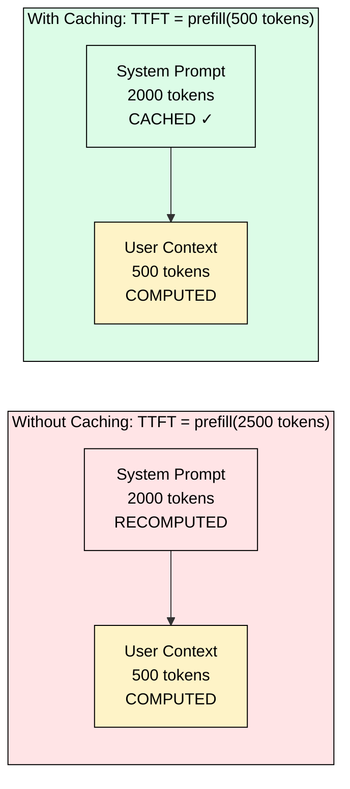
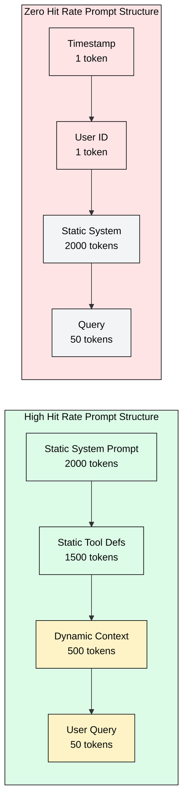
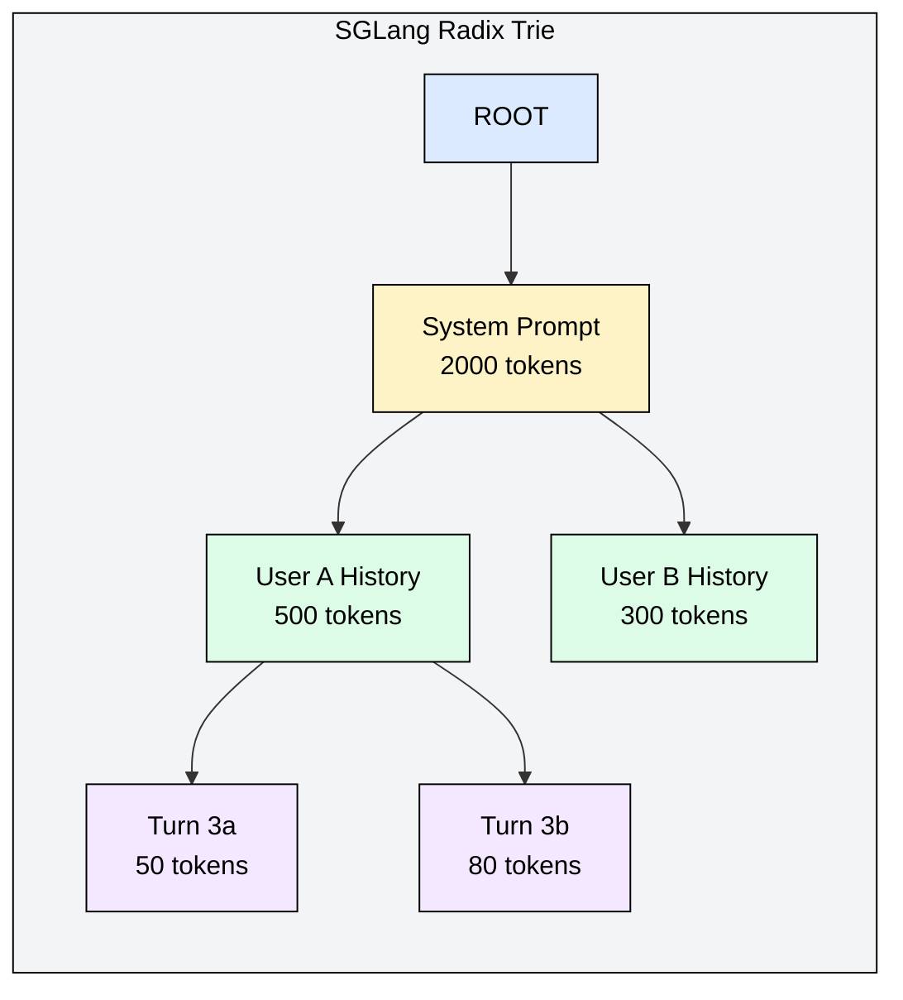

# 4.5 Prefix Caching

[](https://colab.research.google.com/github/harshuljain13/llm-inference-at-scale/blob/master/content/04_kv_cache_engineering/04.5_prefix_caching/lab.ipynb) [](https://molab.marimo.io/github/harshuljain13/llm-inference-at-scale/blob/master/content/04_kv_cache_engineering/04.5_prefix_caching/lab.ipynb)

System prompt prefill is the single biggest TTFT optimization available without changing the model. Anthropic charges 10% for cached tokens vs 100% for new ones, because it costs them 90% less to serve them. The reason is simple: cached tokens skip the entire prefill forward pass. No matrix multiplications, no attention computation, no memory bandwidth consumed. The KV tensors already exist in GPU memory, ready to use.

This module covers when prefix caching delivers 60-90% TTFT reductions, when it fails completely, and how to engineer your prompts for maximum cache hit rates.

## 4.5.1 Why Prefix Caching Dominates TTFT

TTFT is determined by prefill latency: the time to process all input tokens through every transformer layer. Prefix caching eliminates prefill for any token sequence the engine has seen before. The savings are proportional to the fraction of input that is cached.



For the 2500-token input above, 80% of tokens are cached. TTFT drops by 80%. This is not approximate: prefill compute scales linearly with uncached token count (ignoring attention's quadratic term, which is dominated by linear projections at typical lengths).

**Real-world TTFT reductions by workload:**

| Workload | Typical Cached % | TTFT Reduction | Why |
|----------|-----------------|----------------|-----|
| Chatbot (returning user, same session) | 85-95% | 85-95% | System prompt + conversation history cached |
| RAG with fixed retrieval template | 70-85% | 70-85% | Template + common document chunks cached |
| Agent with tool definitions | 80-90% | 80-90% | Tool schema (often 3000+ tokens) cached |
| Code completion in IDE | 60-80% | 60-80% | File context partially stable across keystrokes |
| One-shot diverse prompts | 0-10% | Negligible | Nothing repeats |

## 4.5.2 The Cache Hit Rate Formula

Cache hit rate determines whether prefix caching helps or wastes memory. The formula:

```
hit_rate = cached_tokens / total_input_tokens
TTFT_reduction ≈ hit_rate (for prefill-dominated latency)
```

But the useful metric is the effective hit rate across your traffic:

```
effective_hit_rate = Σ(requests_i × cached_tokens_i) / Σ(requests_i × total_tokens_i)
```

Three factors control effective hit rate:

**1. Prefix stability.** How much of your prompt is identical across requests. A 2000-token system prompt shared by all requests contributes 2000/(2000+user_tokens) to hit rate. Longer static prefixes produce higher hit rates.

**2. Request volume per unique prefix.** Caches evict under memory pressure. A prefix used once per hour will be evicted; one used 100 times per second stays hot. The cache is an LRU: frequency of reuse determines survival.

**3. Prompt structure.** Static content must come first. A single dynamic token at position 0 invalidates the entire cache.



The bad structure wastes 2000 tokens of computation because a single dynamic token at position 0 prevents any prefix match.

## 4.5.3 Maximizing Hit Rate in Practice

**Rule 1: Static content first, dynamic content last.** Every token before the first dynamic token is cacheable. Every token after is not (from the cache's perspective of that prefix path).

**Rule 2: Remove timestamps and request IDs from prompts.** If your system prompt includes `Current time: 2024-03-15T10:23:45Z`, that changes every second. Move time-sensitive context to the end, after the static prefix.

**Rule 3: Normalize few-shot examples.** If you rotate few-shot examples per request, the cache sees a different prefix each time. Fix the example set, or sort examples deterministically so the same subset always appears in the same order.

**Rule 4: Share prefixes across users.** Multi-tenant platforms should structure prompts as:

```
[Platform safety prefix]          ← shared by ALL requests (Level 0)
[Application system prompt]       ← shared by all users of one app (Level 1)
[Conversation history]            ← shared across turns in one session (Level 2)
[Current user message]            ← never shared (Level 3)
```

Each level multiplies cache efficiency. A platform with 50 apps, 200 users per app, and 8 turns per session gets 50x sharing at Level 1, 200x at Level 2, and 8x at Level 3.

**Rule 5: Align to block boundaries.** vLLM caches in 16-token blocks. If your static prefix is 2001 tokens, only 1984 (124 blocks) are cacheable. Pad or trim to block boundaries for maximum reuse.

## 4.5.4 When Prefix Caching Fails

Prefix caching provides zero benefit in these scenarios:

**Dynamic system prompts.** If the system prompt changes per request (personalized instructions, rotating personas, A/B test variants injected early), every request sees a cache miss.

**User-specific context at the start.** Patterns like `You are helping [User Name] who prefers [preferences]...` at position 0 make every user's prefix unique.

**Low request volume per prefix.** A long-tail of 10,000 unique system prompts, each used once per hour, will thrash the cache. Memory spent storing rarely-hit prefixes could serve active sequences instead.

**Short prompts.** Both Anthropic and OpenAI require 1024+ tokens for caching to activate. Below that threshold, prefill is fast enough that caching overhead exceeds savings.

**Model/adapter changes.** KV values depend on model weights. LoRA swaps, quantization changes, or model updates invalidate the entire cache. Each (model_version, adapter_id) needs its own cache partition.

**Cold starts.** New instances have empty caches. The first request for each unique prefix sees full TTFT. Pre-warming (computing known prefixes at startup before accepting traffic) mitigates this at the cost of startup latency.

## 4.5.5 How Engines Implement It

**vLLM (Automatic Prefix Caching):** Hashes token sequences at 16-token block granularity. Each block's hash incorporates all predecessor blocks (chain hash), ensuring position-dependent uniqueness. Enabled with `--enable-prefix-caching`. LRU eviction for blocks with zero active references. Transparent to clients.

**SGLang (RadixAttention):** Stores all cached sequences in a radix trie. Each edge represents a token subsequence; branches mark divergence points. Supports sub-block granularity (a 17-token prefix matches 17 tokens, not just the 16-token block floor). Longest-prefix queries are O(L/B) where L is input length and B is average edge length.



The 2000-token system prompt compresses to a single edge. All users share it. Branching only occurs where conversations diverge.

## 4.5.6 Cost Impact: The API Pricing Signal

API pricing reveals the true cost structure of inference:

| Provider | Cached Token Price | New Token Price | Ratio | Cache TTL |
|----------|-------------------|----------------|-------|-----------|
| Anthropic | 0.1x base | 1.0x base | 90% off | 5 minutes |
| OpenAI | 0.5x base | 1.0x base | 50% off | Automatic |

Anthropic's 90% discount reflects the actual compute saved: cached tokens require only a memory read (pointer to existing KV blocks), not a forward pass. The 5-minute TTL means you need sustained request volume to keep the cache hot.

**Break-even calculation for Anthropic:** Cache writes cost 1.25x (the extra 0.25x pays for storing the KV blocks). After 4 reuses within 5 minutes, caching is profitable. For a chatbot handling 10+ requests per user session, caching pays for itself immediately.

**Annual savings example:** 10K requests/day, 2000-token system prompt, Claude Sonnet pricing. Without caching: ~$60/day on input tokens. With caching (assuming 90% hit rate after warmup): ~$9/day. Annual savings: ~$18K.

## FAQ

**Q: My chatbot already feels fast. Is prefix caching worth enabling?**
Measure your P50 and P99 TTFT. If P99 exceeds 1 second and your system prompt is 1000+ tokens, prefix caching can cut it to under 200ms for returning users. The improvement is most noticeable on long context windows.

**Q: Does prefix caching reduce decode latency (ITL)?**
No. Prefix caching only affects prefill (TTFT). Once generation begins, each new token still requires a full forward pass through all layers. Decode speed depends on batch size and memory bandwidth, not caching.

**Q: Can prefix caching and chunked prefill work together?**
Yes. Chunked prefill splits long inputs into chunks to interleave with decode. If 80% of a 2500-token input is cached, only 500 tokens need chunking (2 chunks of 256 instead of 10). They compose multiplicatively.

**Q: How do I monitor cache hit rate in production?**
vLLM exposes `vllm:prefix_cache_hit_rate` as a Prometheus metric. SGLang provides `cache_hit_rate` in its metrics endpoint. Track this alongside TTFT P50/P99 to correlate.

**Q: Does prefix caching conflict with continuous batching?**
No. Continuous batching schedules when requests enter/exit the batch. Prefix caching reduces how much prefill work each request needs. They operate on orthogonal dimensions and compose naturally.

**Q: What about semantic or approximate prefix caching?**
Research-stage only. Production systems require exact token-level match because attention is position-sensitive: changing token i changes the KV values at all positions >= i. Approximate matching would produce incorrect outputs, not just degraded quality.

## References

1. Zheng, L., et al. "Efficiently Programming Large Language Models using SGLang." arXiv:2312.07104, 2023.
2. vLLM Docs. "Automatic Prefix Caching." https://docs.vllm.ai/en/latest/automatic_prefix_caching/apc.html
3. Anthropic. "Prompt Caching." https://docs.anthropic.com/en/docs/build-with-claude/prompt-caching, 2024.
4. OpenAI. "Prompt Caching." https://platform.openai.com/docs/guides/prompt-caching, 2024.
5. Kwon, W., et al. "Efficient Memory Management for Large Language Model Serving with PagedAttention." SOSP 2023.
6. Agrawal, A., et al. "Sarathi-Serve: Efficient Hybrid Decode-Prefill Serving." arXiv:2403.02310, 2024.
