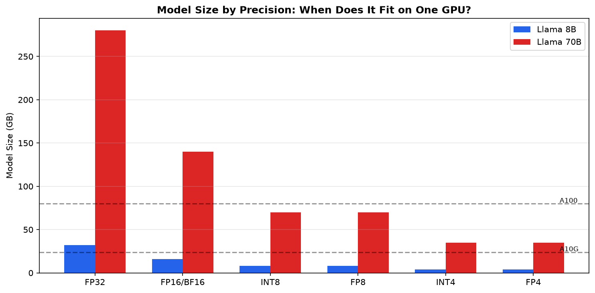

# 4.1 Quantization

> Every optimization in LLM inference attacks the same fundamental problem: you're reading 16 GB of weights to generate one token. The question is always: how do we read fewer bytes, or get more tokens per byte read?

---

## Learning Objectives

By the end of this module, you will:

- Understand quantization at the bit level—not just "INT4 is smaller" but exactly how weights are represented and why some methods preserve quality better
- Explain PagedAttention's memory management and calculate the exact fragmentation savings
- Understand why continuous batching is essential and how it interacts with the scheduler
- Know when speculative decoding helps (and when it hurts) based on arithmetic intensity analysis
- Make informed optimization decisions based on your specific workload characteristics

---


> **Where this fits:** From Module 00.0, you know model weights are stored in FP16 (2 bytes per parameter, 16 GB for 8B). From Module 01.1, you know memory bandwidth limits decode speed. Quantization attacks both: fewer bytes means the model fits on fewer GPUs AND reads faster from HBM. This module covers the full optimization toolkit: quantization, PagedAttention, continuous batching, speculative decoding, and chunked prefill.

---



## The Optimization Landscape

Before diving into techniques, let's understand what we're optimizing against:

```
┌─────────────────────────────────────────────────────────────────────┐
│                    THE THREE BOTTLENECKS                            │
├─────────────────────────────────────────────────────────────────────┤
│                                                                     │
│   1. MEMORY BANDWIDTH (decode phase)                                │
│      Problem: Read 16 GB of weights for each token                  │
│      Solutions: Quantization, batching, tensor parallelism          │
│                                                                     │
│   2. MEMORY CAPACITY (KV cache)                                     │
│      Problem: KV cache grows with batch × sequence length           │
│      Solutions: PagedAttention, GQA, KV cache quantization          │
│                                                                     │
│   3. COMPUTE (prefill phase, large batches)                         │
│      Problem: O(seq²) attention, large matrix multiplications       │
│      Solutions: FlashAttention, chunked prefill, faster GPUs        │
│                                                                     │
└─────────────────────────────────────────────────────────────────────┘
```

The dominant theme across these optimizations is that most of them attack memory bandwidth, because the decode phase is fundamentally memory-bound. Quantization, batching, and tensor parallelism all reduce the bytes-per-token ratio. PagedAttention targets memory capacity instead. FlashAttention is unique in that it attacks both bandwidth (less HBM traffic) and capacity (no materialized N×N attention matrix).

---

## Quantization: A Deep Dive

### What Quantization Actually Does

Quantization maps continuous floating-point values to a smaller set of discrete values. The key insight: neural network weights are approximately normally distributed, and you don't need 32 bits of precision to represent them.

```python
# The core quantization operation
def quantize_symmetric(weights: torch.Tensor, bits: int) -> tuple:
    """
    Symmetric quantization: map floats to integers.

    FP16 weight range: roughly [-1, 1] for most layers
    INT8 range: [-128, 127]
    INT4 range: [-8, 7]
    """
    # Find the scale factor
    max_val = weights.abs().max()
    qmax = 2 ** (bits - 1) - 1  # 127 for INT8, 7 for INT4
    scale = max_val / qmax

    # Quantize: float → int
    quantized = torch.round(weights / scale).clamp(-qmax - 1, qmax).to(torch.int8)

    # To dequantize: int → float
    # dequantized = quantized.float() * scale

    return quantized, scale

# Example: A weight matrix
weights = torch.randn(4096, 4096) * 0.02  # Typical LLM weight scale
q_weights, scale = quantize_symmetric(weights, bits=8)

print(f"Original size: {weights.numel() * 2 / 1e6:.1f} MB (FP16)")
print(f"Quantized size: {q_weights.numel() * 1 / 1e6:.1f} MB (INT8)")
print(f"Scale factor: {scale:.6f}")
```

The critical point here is that quantization error comes from rounding, and rounding error is proportional to the scale factor. If your weight tensor contains outliers (large maximum values), the scale factor must accommodate them, which increases rounding error for every other weight in the tensor. This is precisely why outlier handling becomes the central challenge of practical quantization.

### The Outlier Problem

Understanding the scale factor's role reveals the next challenge. LLM weight matrices are not uniformly distributed: they contain rare but extreme outlier values that disproportionately affect quantization quality. Here is what most quantization tutorials fail to explain:

```python
# LLM weights have outliers that ruin naive quantization
layer_weights = model.layers[0].mlp.gate_proj.weight.data

# Typical distribution
mean = layer_weights.mean().item()      # ~0.0
std = layer_weights.std().item()        # ~0.01
max_val = layer_weights.abs().max().item()  # ~0.5 (50x the std!)

# The problem:
# If max = 0.5 and we quantize to INT4 (range [-8, 7]):
# scale = 0.5 / 7 = 0.071
# A typical weight of 0.01 becomes: round(0.01 / 0.071) = round(0.14) = 0
# We've lost the signal entirely!
```

This example illustrates a devastating failure mode: a single outlier can destroy quantization quality for an entire tensor. When one weight sits at 0.5 while most cluster around 0.01, the scale factor is dictated by that outlier. The typical weights, divided by the large scale factor, round to zero and lose their signal entirely.

### How AWQ Solves the Outlier Problem

Given that outliers destroy naive quantization, researchers developed methods that handle them gracefully. AWQ (Activation-aware Weight Quantization) takes an elegant approach: instead of treating all weights equally, it observes that weights connected to frequently-activated channels matter more than those connected to rarely-activated ones. Weights that multiply large activations matter more.

```python
# AWQ's key insight: weight importance = weight × typical activation magnitude

def awq_quantize(weights, activations_sample):
    """
    AWQ: Scale weights by activation importance before quantizing.
    """
    # Measure activation magnitudes from calibration data
    act_scales = activations_sample.abs().mean(dim=0)  # Per-channel importance

    # Scale weights: important weights get larger (less relative quantization error)
    # Less important weights get smaller (more error, but who cares)
    importance = act_scales / act_scales.mean()
    scaled_weights = weights * importance.unsqueeze(0)

    # Now quantize the scaled weights
    q_weights, scale = quantize_symmetric(scaled_weights, bits=4)

    # At inference: dequantize and undo the scaling
    # output = (q_weights * scale / importance) @ activations

    return q_weights, scale, importance
```

AWQ does not remove outliers. Instead, it makes important weights relatively larger so they survive the quantization rounding step. The math is elegant: if a weight is 10× more important (because it multiplies a large activation), scaling it up by 10× before quantization means its quantization error becomes 10× less impactful on the final output.

### GPTQ: A Different Approach

While AWQ rescales weights before quantization, GPTQ (Generative Pre-trained Transformer Quantization) takes an entirely different philosophical approach. Rather than preventing quantization errors, GPTQ compensates for them after the fact by adjusting weights that have not yet been quantized: quantize weights one at a time, and adjust remaining weights to compensate for quantization error.

```python
# GPTQ's key insight: compensate for quantization error in remaining weights

def gptq_quantize_column(W, H_inv, col_idx):
    """
    Quantize one column of weights, adjust others to compensate.

    W: weight matrix [out_features, in_features]
    H_inv: inverse Hessian (measures weight sensitivity)
    col_idx: which column to quantize
    """
    # Quantize this column
    w_col = W[:, col_idx]
    q_col = quantize(w_col)
    quant_error = w_col - dequantize(q_col)

    # Compensate: adjust remaining columns to minimize output error
    # This is the key insight - we can partially undo the damage
    for j in range(col_idx + 1, W.shape[1]):
        W[:, j] -= quant_error * H_inv[col_idx, j] / H_inv[col_idx, col_idx]

    return q_col
```

GPTQ achieves better quality than naive quantization by exploiting a key property: when you quantize weights sequentially, you can adjust the remaining unquantized weights to compensate for accumulated errors. Each weight, as it gets quantized, passes its error forward for the next weights to absorb. The result is that total output error remains small even though individual weights have been aggressively rounded.

### Quantization Quality Comparison

Let's be precise about quality loss:

```
┌─────────────────────────────────────────────────────────────────────┐
│           QUANTIZATION QUALITY (Llama 2 7B, WikiText-2)             │
├─────────────────────────────────────────────────────────────────────┤
│                                                                     │
│   Method          Bits   Perplexity   Δ from FP16   Memory          │
│   ─────────────────────────────────────────────────────────────    │
│   FP16            16     5.47         baseline      14 GB           │
│   FP8 (E4M3)      8      5.48         +0.01         7 GB            │
│   INT8 (W8A8)     8      5.51         +0.04         7 GB            │
│   GPTQ-8bit       8      5.49         +0.02         7 GB            │
│   AWQ-4bit        4      5.60         +0.13         3.5 GB          │
│   GPTQ-4bit       4      5.68         +0.21         3.5 GB          │
│   RTN-4bit        4      6.29         +0.82         3.5 GB          │
│                                                                     │
│   RTN = Round-to-Nearest (naive quantization)                       │
│                                                                     │
│   Key observations:                                                 │
│   • 8-bit: <1% quality loss, safe for almost all use cases          │
│   • AWQ-4bit: ~2% quality loss, best 4-bit method                   │
│   • GPTQ-4bit: ~4% quality loss, but faster to quantize             │
│   • Naive 4-bit: 15% quality loss, don't use this                   │
│                                                                     │
└─────────────────────────────────────────────────────────────────────┘
```

The most striking pattern in this table is that the gap between AWQ and naive quantization (RTN) at 4-bit is far larger than the gap between FP16 and AWQ. This means quantization method matters more than bit width. A well-quantized 4-bit model (AWQ, perplexity 5.60) handily beats a poorly-quantized 8-bit model if naive methods were used. Always choose a sophisticated quantization algorithm over simply reducing precision.

### FP8: The H100 Sweet Spot

FP8 deserves special attention because it's the best option on H100 hardware:

```
FP8 E4M3 format:
┌─┬────┬───┐
│S│Exp │Man│
│1│ 4  │ 3 │
└─┴────┴───┘

Range: ±448 (enough for LLM weights)
Precision: 3 mantissa bits = 8 distinct values per exponent

Why FP8 is special:
1. Native hardware support on H100 (no dequantization overhead)
2. Floating-point format preserves relative precision across magnitudes
3. No calibration data needed (unlike INT8 with scales)
4. Quality nearly identical to FP16
```

For practitioners with H100 hardware, FP8 is the clear default choice. It provides 2× memory reduction with essentially zero quality loss (perplexity delta of 0.01) and benefits from native hardware acceleration with no dequantization overhead. If you have H100s, there is no reason to serve in FP16.

### KV Cache Quantization: The Forgotten Optimization

Most discussions focus on weight quantization, but KV cache can also be quantized:

```python
# KV cache memory breakdown (Llama 8B, batch=32, seq=4096)
weights_fp16 = 16  # GB (fixed)
weights_int4 = 4   # GB (with quantization)

kv_cache_fp16 = 32 * 512  # MB × batch = 16 GB
kv_cache_fp8 = 32 * 256   # MB × batch = 8 GB (with KV quantization)

# Without KV quantization:
# INT4 weights + FP16 KV = 4 + 16 = 20 GB

# With KV quantization:
# INT4 weights + FP8 KV = 4 + 8 = 12 GB

# KV quantization saves 40% more memory!
```

At high batch sizes, KV cache memory eclipses weight memory entirely. In the example above, KV cache consumes 16 GB versus 4 GB for INT4 weights. Quantizing the KV cache from FP16 to FP8 saves another 8 GB, a larger absolute saving than weight quantization provided. vLLM supports FP8 KV cache via `--kv-cache-dtype fp8`.

The catch: KV cache quantization has a larger quality impact than weight quantization because it affects attention patterns directly. Use with caution for quality-sensitive applications.

### TurboQuant: 3-Bit KV Cache Quantization Without Accuracy Loss

TurboQuant (arxiv:2504.19874, ICLR 2026) pushes KV cache quantization to the extreme: **3-bit precision with no measurable accuracy degradation**—and it requires no retraining.

The key insight: KV cache values have a different distribution than model weights. They're highly structured per-head and per-layer, with predictable magnitude patterns. TurboQuant exploits this structure with three techniques:

```
┌─────────────────────────────────────────────────────────────────────┐
│                    TURBOQUANT: 3-BIT KV CACHE                       │
├─────────────────────────────────────────────────────────────────────┤
│                                                                     │
│   1. PER-HEAD DYNAMIC SCALING                                       │
│      Each attention head gets its own scale factor per token         │
│      position, adapting to the head's activation magnitude.          │
│                                                                     │
│   2. ROTATION-BASED OUTLIER SMOOTHING                               │
│      Applies learned rotations to redistribute outlier energy        │
│      across channels before quantization. No outlier channels        │
│      means tighter quantization ranges for everyone.                 │
│                                                                     │
│   3. RESIDUAL ERROR COMPENSATION                                    │
│      Stores a low-rank correction (rank-1 per head) that            │
│      captures systematic quantization bias. Adds <1% overhead.      │
│                                                                     │
│   RESULTS (Llama 3.1 8B, LongBench):                                │
│   ─────────────────────────────────────────────────────────────    │
│   Method          Bits   Accuracy   Memory Savings                  │
│   FP16 KV         16     baseline   —                               │
│   FP8 KV           8     -0.1%      50%                             │
│   INT4 KV          4     -0.8%      75%                             │
│   TurboQuant KV    3     -0.05%     81%                             │
│                                                                     │
│   The 3-bit result matches FP8 quality while saving 81% of          │
│   KV cache memory. This is not a typo.                              │
│                                                                     │
└─────────────────────────────────────────────────────────────────────┘
```

TurboQuant demonstrates a surprising result: KV cache quantization does not have to trade quality for memory. By exploiting the structured, per-head distribution of KV values, 3-bit quantization achieves accuracy within 0.05% of FP16, essentially lossless. This requires no retraining and is already integrated in vLLM.

```python
# vLLM integration (available in vLLM 0.8+)
llm = LLM(
    model="meta-llama/Llama-3.1-8B-Instruct",
    kv_cache_dtype="turboquant_3bit",  # 81% KV memory savings
    # Combine with weight quantization for maximum compression:
    quantization="awq",  # INT4 weights + 3-bit KV cache
)

# Memory comparison (Llama 8B, batch=64, seq=4096):
# FP16 weights + FP16 KV:  16 GB + 32 GB = 48 GB
# INT4 weights + FP8 KV:    4 GB + 16 GB = 20 GB
# INT4 weights + TQ3 KV:    4 GB +  6 GB = 10 GB  ← fits on single GPU!
```

The practical impact: workloads previously requiring 2-4 GPUs for KV cache alone can now fit on a single GPU. For long-context applications (32K+ tokens), TurboQuant is transformative.

---

## PagedAttention: Memory Management for LLMs

### The Problem PagedAttention Solves

Traditional KV cache allocation is like reserving a hotel room for the maximum possible stay:

```
Traditional allocation:
┌─────────────────────────────────────────────────────────────────────┐
│                                                                     │
│   Request 1: "What is 2+2?"                                         │
│   Actual tokens: 12 (prompt) + 5 (response) = 17 tokens             │
│   Allocated: 4096 tokens (max_seq_len)                              │
│   Waste: 4079 tokens = 99.6%                                        │
│                                                                     │
│   Request 2: "Write a 1000-word essay..."                           │
│   Actual tokens: 50 (prompt) + 1200 (response) = 1250 tokens        │
│   Allocated: 4096 tokens                                            │
│   Waste: 2846 tokens = 69.5%                                        │
│                                                                     │
│   Average waste across typical workloads: 60-80%                    │
│                                                                     │
└─────────────────────────────────────────────────────────────────────┘
```

The waste is staggering: traditional KV cache allocation discards 60-80% of allocated GPU memory on padding that will never be used. This directly limits batch size and throughput, because memory consumed by padding cannot serve additional requests.

### How PagedAttention Works

PagedAttention borrows from operating system virtual memory:

```
┌─────────────────────────────────────────────────────────────────────┐
│                    PAGEDATTENTION ARCHITECTURE                      │
├─────────────────────────────────────────────────────────────────────┤
│                                                                     │
│   PHYSICAL MEMORY (GPU HBM):                                        │
│   ┌─────┬─────┬─────┬─────┬─────┬─────┬─────┬─────┬─────┬─────┐    │
│   │  0  │  1  │  2  │  3  │  4  │  5  │  6  │  7  │  8  │  9  │    │
│   │ R1  │ R2  │ R1  │FREE │ R2  │ R3  │ R1  │ R2  │FREE │ R3  │    │
│   └─────┴─────┴─────┴─────┴─────┴─────┴─────┴─────┴─────┴─────┘    │
│                                                                     │
│   BLOCK TABLES (per request):                                       │
│   ┌─────────────────────────────────────────────────────────────┐   │
│   │ Request 1: [0, 2, 6]        → 3 blocks × 16 tokens = 48     │   │
│   │ Request 2: [1, 4, 7]        → 3 blocks × 16 tokens = 48     │   │
│   │ Request 3: [5, 9]           → 2 blocks × 16 tokens = 32     │   │
│   └─────────────────────────────────────────────────────────────┘   │
│                                                                     │
│   KEY INSIGHT: Blocks are non-contiguous in physical memory         │
│   but appear contiguous to each request via the block table.        │
│                                                                     │
│   ALLOCATION FLOW:                                                  │
│   1. Request arrives → allocate 1 block                             │
│   2. Sequence grows past block boundary → allocate another block    │
│   3. Request completes → free all blocks to pool                    │
│   4. New request → reuse freed blocks                               │
│                                                                     │
└─────────────────────────────────────────────────────────────────────┘
```

### The Block Size Tradeoff

```python
# Block size affects both fragmentation and kernel efficiency

def analyze_block_size(block_size: int, sequence_lengths: list[int]) -> dict:
    """Analyze fragmentation for different block sizes."""
    total_allocated = 0
    total_used = 0

    for seq_len in sequence_lengths:
        blocks_needed = (seq_len + block_size - 1) // block_size
        allocated = blocks_needed * block_size
        total_allocated += allocated
        total_used += seq_len

    fragmentation = (total_allocated - total_used) / total_allocated
    return {
        "block_size": block_size,
        "fragmentation_pct": fragmentation * 100,
        "avg_waste_per_seq": (total_allocated - total_used) / len(sequence_lengths),
    }

# Typical sequence length distribution (bimodal: short queries + long conversations)
seq_lengths = [20] * 50 + [100] * 30 + [500] * 15 + [2000] * 5

for bs in [1, 8, 16, 32, 64]:
    result = analyze_block_size(bs, seq_lengths)
    print(f"Block size {bs:2d}: {result['fragmentation_pct']:.1f}% fragmentation, "
          f"{result['avg_waste_per_seq']:.1f} tokens wasted/seq")

# Output:
# Block size  1:  0.0% fragmentation, 0.0 tokens wasted/seq
# Block size  8:  3.2% fragmentation, 4.1 tokens wasted/seq
# Block size 16:  6.1% fragmentation, 7.8 tokens wasted/seq
# Block size 32: 11.4% fragmentation, 14.6 tokens wasted/seq
# Block size 64: 20.2% fragmentation, 25.8 tokens wasted/seq
```

The tradeoff is clear: smaller blocks reduce fragmentation but increase kernel overhead from managing more block table entries. vLLM defaults to 16 tokens per block, which provides a balanced tradeoff for typical workloads. If your traffic skews toward many short sequences, consider smaller blocks. For long-context workloads where sequences are thousands of tokens, larger blocks add negligible percentage waste.

### Prefix Caching: PagedAttention's Killer Feature

PagedAttention enables prefix caching—sharing KV cache blocks across requests with common prefixes:

```
┌─────────────────────────────────────────────────────────────────────┐
│                       PREFIX CACHING                                │
├─────────────────────────────────────────────────────────────────────┤
│                                                                     │
│   System prompt (shared by all requests):                           │
│   "You are a helpful assistant. Answer questions concisely."        │
│   = 12 tokens = 1 block                                             │
│                                                                     │
│   Without prefix caching (10 concurrent requests):                  │
│   ┌─────┬─────┬─────┬─────┬─────┬─────┬─────┬─────┬─────┬─────┐    │
│   │ Sys │ Sys │ Sys │ Sys │ Sys │ Sys │ Sys │ Sys │ Sys │ Sys │    │
│   │ R1  │ R2  │ R3  │ R4  │ R5  │ R6  │ R7  │ R8  │ R9  │ R10 │    │
│   └─────┴─────┴─────┴─────┴─────┴─────┴─────┴─────┴─────┴─────┘    │
│   Memory: 10 blocks for system prompt                               │
│                                                                     │
│   With prefix caching:                                              │
│   ┌─────┐                                                           │
│   │ Sys │ ← Shared by all 10 requests (copy-on-write)               │
│   └─────┘                                                           │
│   Memory: 1 block for system prompt                                 │
│                                                                     │
│   Savings: 9 blocks = 9 × 16 × 128 KB = 18 MB                       │
│   For 1000-token system prompt: 180 MB saved                        │
│                                                                     │
└─────────────────────────────────────────────────────────────────────┘
```

Prefix caching is a free performance win for any workload where prompts share common prefixes. RAG applications (shared retrieval context), chatbots (system prompts), and few-shot learning (shared examples) all benefit substantially. Enable it with `--enable-prefix-caching` in vLLM.

### Copy-on-Write for Beam Search

Beyond memory efficiency and prefix sharing, PagedAttention's block-based architecture enables a third optimization: copy-on-write semantics for beam search. When multiple beams share a common prefix, they can reference the same physical blocks until they diverge:

```python
# Beam search without PagedAttention:
# Each beam needs its own copy of the KV cache
# Memory: num_beams × sequence_length × kv_size

# Beam search with PagedAttention:
# Beams share blocks until they diverge
# Memory: shared_prefix + (num_beams × divergent_suffix)

# Example: 4 beams, 100 tokens generated, diverge at token 80
# Without PagedAttention: 4 × 100 = 400 tokens of KV cache
# With PagedAttention: 80 (shared) + 4 × 20 (divergent) = 160 tokens
# Savings: 60%
```

---

## Continuous Batching: Why It's Essential

### The Static Batching Problem

To understand why continuous batching is essential, we first need to see the failure mode it replaces. Static batching collects a fixed number of requests, processes them as a unit, and only begins the next batch after every request in the current batch has finished:

```
┌─────────────────────────────────────────────────────────────────────┐
│                    STATIC BATCHING TIMELINE                         │
├─────────────────────────────────────────────────────────────────────┤
│                                                                     │
│   Time →                                                            │
│   0ms        100ms       200ms       300ms       400ms       500ms  │
│   │           │           │           │           │           │     │
│   ▼           ▼           ▼           ▼           ▼           ▼     │
│                                                                     │
│   R1: ████████████████████████████████████████░░░░░░░░░░░░░░░░░░░   │
│   R2: ████████████████████████████████████████████████████████████  │
│   R3: ████████████████████████████████████████████████████████████  │
│   R4: ████████████████████████████████████████████████████████████  │
│       ▲                                       ▲                     │
│       │                                       │                     │
│       Batch starts                            Batch ends            │
│       (wait for 4 requests)                   (wait for slowest)    │
│                                                                     │
│   R5: ░░░░░░░░░░░░░░░░░░░░░░░░░░░░░░░░░░░░░░░░████████████████████  │
│   R6: ░░░░░░░░░░░░░░░░░░░░░░░░░░░░░░░░░░░░░░░░████████████████████  │
│       ▲                                       ▲                     │
│       │                                       │                     │
│       R5, R6 arrive                           Finally start         │
│       (must wait for batch 1)                 processing            │
│                                                                     │
│   Problems:                                                         │
│   1. R1 finishes early but GPU waits for R2-R4                      │
│   2. R5, R6 wait even though R1's slot is free                      │
│   3. GPU utilization drops when batch is partially done             │
│                                                                     │
└─────────────────────────────────────────────────────────────────────┘
```

### Continuous Batching: Iteration-Level Scheduling

Continuous batching makes scheduling decisions at each decode step:

```
┌─────────────────────────────────────────────────────────────────────┐
│                 CONTINUOUS BATCHING TIMELINE                        │
├─────────────────────────────────────────────────────────────────────┤
│                                                                     │
│   Time →                                                            │
│   0ms        100ms       200ms       300ms       400ms       500ms  │
│   │           │           │           │           │           │     │
│   ▼           ▼           ▼           ▼           ▼           ▼     │
│                                                                     │
│   R1: ████████████████████████████████████████                      │
│   R2: ████████████████████████████████████████████████████████████  │
│   R3: ████████████████████████████████████████████████████████████  │
│   R4: ████████████████████████████████████████████████████████████  │
│   R5:                 ████████████████████████████████████████████  │
│   R6:                         ████████████████████████████████████  │
│                       ▲       ▲                                     │
│                       │       │                                     │
│                       R1 done R5 starts                             │
│                       R5 joins immediately                          │
│                                                                     │
│   Benefits:                                                         │
│   1. R5 starts as soon as R1 finishes (no waiting)                  │
│   2. GPU always has maximum batch size                              │
│   3. No request waits unnecessarily                                 │
│                                                                     │
└─────────────────────────────────────────────────────────────────────┘
```

Continuous batching delivers 2-3× throughput improvement over static batching for workloads with variable-length outputs. The improvement is largest when output lengths vary significantly across requests, because static batching forces all requests to wait for the slowest one in the batch.

### The Scheduler's Decision Loop

```python
# Simplified continuous batching scheduler logic
class ContinuousBatchingScheduler:
    def __init__(self, max_batch_tokens: int, max_num_seqs: int):
        self.max_batch_tokens = max_batch_tokens
        self.max_num_seqs = max_num_seqs
        self.running = []  # Currently generating
        self.waiting = []  # Queued requests

    def schedule_step(self) -> list:
        """Called before each decode step."""
        batch = []
        batch_tokens = 0

        # 1. Continue running requests (they have KV cache allocated)
        for req in self.running:
            if not req.is_finished():
                batch.append(req)
                batch_tokens += 1  # Decode = 1 token per request

        # 2. Add waiting requests if we have capacity
        for req in self.waiting[:]:
            # Check constraints
            if len(batch) >= self.max_num_seqs:
                break
            if batch_tokens + req.prompt_len > self.max_batch_tokens:
                break
            if not self.can_allocate_kv_cache(req):
                break  # Out of memory

            # Add to batch
            batch.append(req)
            batch_tokens += req.prompt_len  # Prefill = all prompt tokens
            self.waiting.remove(req)
            self.running.append(req)

        # 3. Remove finished requests
        self.running = [r for r in self.running if not r.is_finished()]

        return batch
```

The scheduler's core objective is maximizing GPU utilization while respecting memory constraints. Two parameters control this balance: `max_num_seqs` sets the concurrency limit (how many requests can generate simultaneously), and `max_batch_tokens` sets the memory budget per iteration step (how many tokens can be processed in one forward pass).

---

## Speculative Decoding: Breaking the Sequential Barrier

### Why Speculative Decoding Works

Recall from Module 2: decode is memory-bound with arithmetic intensity ~1 FLOP/byte. The GPU reads 16 GB of weights to generate one token.

Speculative decoding's insight: **what if we could verify multiple tokens with one weight read?**

```
Standard decode (4 tokens):
  Step 1: Read 16 GB → generate token 1
  Step 2: Read 16 GB → generate token 2
  Step 3: Read 16 GB → generate token 3
  Step 4: Read 16 GB → generate token 4
  Total: 64 GB read, 4 tokens generated

Speculative decode (4 tokens, 75% acceptance):
  Step 1: Draft model generates 4 candidates (fast, small model)
  Step 2: Target model verifies all 4 in parallel (one forward pass)
  Step 3: Accept 3 tokens, reject 1, regenerate
  Total: ~20 GB read (draft) + 16 GB read (verify) = 36 GB, 4 tokens

Speedup: 64 GB / 36 GB = 1.8×
```

Speculative decoding amortizes the expensive weight read across multiple tokens. Where batching amortizes across sequences (one weight read serves N requests simultaneously), speculative decoding amortizes across time (one verification pass confirms K tokens that would otherwise require K separate forward passes).

### The Math of Speculative Decoding

Let's derive when speculative decoding helps:

```python
def speculative_decoding_speedup(
    draft_model_size_gb: float,
    target_model_size_gb: float,
    num_speculative_tokens: int,
    acceptance_rate: float,
    draft_overhead: float = 0.1,  # Draft model is ~10% of target time
) -> float:
    """
    Calculate speedup from speculative decoding.

    Key insight: speedup depends on acceptance rate and draft overhead.
    """
    # Standard decoding: read target model once per token
    standard_cost = target_model_size_gb

    # Speculative decoding per "round":
    # - Draft: generate K tokens (cheap)
    # - Verify: one target forward pass for K tokens
    # - Accept: acceptance_rate × K tokens on average

    draft_cost = draft_model_size_gb * num_speculative_tokens * draft_overhead
    verify_cost = target_model_size_gb  # One forward pass

    tokens_per_round = 1 + acceptance_rate * num_speculative_tokens
    # (1 guaranteed token + expected accepted tokens)

    speculative_cost_per_token = (draft_cost + verify_cost) / tokens_per_round

    speedup = standard_cost / speculative_cost_per_token
    return speedup

# Example: Llama 70B target, Llama 8B draft
for acceptance in [0.5, 0.7, 0.85, 0.95]:
    speedup = speculative_decoding_speedup(
        draft_model_size_gb=16,
        target_model_size_gb=140,
        num_speculative_tokens=4,
        acceptance_rate=acceptance,
    )
    print(f"Acceptance {acceptance:.0%}: {speedup:.2f}× speedup")

# Output:
# Acceptance 50%: 1.87× speedup
# Acceptance 70%: 2.33× speedup
# Acceptance 85%: 2.73× speedup
# Acceptance 95%: 3.04× speedup
```

The speedup formula is approximately `1 + acceptance_rate × num_speculative_tokens`. With 4 speculative tokens and 80% acceptance, you get roughly 4× fewer target model forward passes. The acceptance rate depends heavily on how well the draft model approximates the target for your specific domain.

### When Speculative Decoding Hurts

Speculative decoding isn't always beneficial:

```
┌─────────────────────────────────────────────────────────────────────┐
│            WHEN SPECULATIVE DECODING HELPS vs HURTS                 │
├─────────────────────────────────────────────────────────────────────┤
│                                                                     │
│   HELPS (use it):                                                   │
│   ✓ Small batch sizes (1-4 sequences)                               │
│   ✓ Predictable outputs (code, JSON, structured data)               │
│   ✓ Latency-sensitive applications (chat, real-time)                │
│   ✓ Target model is large (70B+)                                    │
│                                                                     │
│   HURTS (don't use it):                                             │
│   ✗ Large batch sizes (>8 sequences)                                │
│     → Batching already amortizes weight reads                       │
│   ✗ Creative/diverse outputs (low acceptance rate)                  │
│     → Draft model guesses wrong, wasted compute                     │
│   ✗ Memory-constrained (can't fit draft model)                      │
│   ✗ Small target model (8B)                                         │
│     → Draft overhead is proportionally larger                       │
│                                                                     │
│   THE KEY INSIGHT:                                                  │
│   Speculative decoding and batching solve the same problem          │
│   (amortizing weight reads). Using both gives diminishing returns.  │
│                                                                     │
└─────────────────────────────────────────────────────────────────────┘
```

A crucial architectural insight: speculative decoding and batching are substitutes, not complements. They solve the same fundamental problem (amortizing weight reads over more tokens). At batch=32, you are already reading weights once for 32 tokens. Adding speculative decoding on top introduces draft model overhead without proportional benefit because the memory bandwidth is already well-utilized.

### Speculative Decoding Variants

```
┌─────────────────────────────────────────────────────────────────────┐
│              SPECULATIVE DECODING VARIANTS                          │
├─────────────────────────────────────────────────────────────────────┤
│                                                                     │
│   1. DRAFT MODEL                                                    │
│      How: Smaller LLM generates candidates                          │
│      Pros: High acceptance for similar model families               │
│      Cons: Extra memory for draft model                             │
│      Best for: Llama 70B + Llama 8B draft                           │
│                                                                     │
│   2. MEDUSA                                                         │
│      How: Extra prediction heads on target model                    │
│      Pros: No separate draft model                                  │
│      Cons: Requires training the heads                              │
│      Best for: When you control the model                           │
│                                                                     │
│   3. EAGLE                                                          │
│      How: Lightweight feature extrapolation                         │
│      Pros: Better acceptance than Medusa                            │
│      Cons: More complex, requires training                          │
│      Best for: Maximum speedup, willing to train                    │
│                                                                     │
│   4. N-GRAM SPECULATION                                             │
│      How: Match prompt patterns, predict continuations              │
│      Pros: Zero overhead, no extra model                            │
│      Cons: Only works for repetitive content                        │
│      Best for: Code completion, templated outputs                   │
│                                                                     │
│   5. PROMPT LOOKUP                                                  │
│      How: Copy tokens from prompt that might repeat                 │
│      Pros: Zero overhead                                            │
│      Cons: Only works when output repeats input                     │
│      Best for: Summarization, extraction tasks                      │
│                                                                     │
└─────────────────────────────────────────────────────────────────────┘
```

### vLLM Speculative Decoding Configuration

```python
from vllm import LLM, SamplingParams

# Draft model speculation
llm = LLM(
    model="meta-llama/Llama-3.1-70B-Instruct",
    speculative_model="meta-llama/Llama-3.1-8B-Instruct",
    num_speculative_tokens=5,
    # Draft model can use fewer GPUs
    speculative_draft_tensor_parallel_size=1,
)

# N-gram speculation (no draft model needed)
llm_ngram = LLM(
    model="meta-llama/Llama-3.1-8B-Instruct",
    speculative_model="[ngram]",
    num_speculative_tokens=5,
    ngram_prompt_lookup_max=4,  # Look for 4-grams in prompt
)

# Prompt lookup speculation
llm_prompt = LLM(
    model="meta-llama/Llama-3.1-8B-Instruct",
    speculative_model="[prompt_lookup]",
    num_speculative_tokens=5,
)
```

---

## Chunked Prefill: Preventing Starvation

### The Long Prompt Problem

Even with continuous batching, a subtle starvation problem remains. When a new request arrives with a very long prompt (8K+ tokens), its prefill computation dominates the GPU for hundreds of milliseconds, blocking all decode operations for existing requests:

```
┌─────────────────────────────────────────────────────────────────────┐
│                    THE STARVATION PROBLEM                           │
├─────────────────────────────────────────────────────────────────────┤
│                                                                     │
│   Scenario: 10 requests generating, 1 new request with 8K prompt    │
│                                                                     │
│   Without chunked prefill:                                          │
│   ─────────────────────────────────────────────────────────────    │
│   Time:     0ms    100ms   200ms   300ms   400ms   500ms   600ms   │
│                                                                     │
│   Existing: d d d d ░░░░░░░░░░░░░░░░░░░░░░░░░░░░░░░░░░░░░ d d d d  │
│   New req:  ░░░░░░░ ████████████████████████████████████ d d d d   │
│                     ▲                                 ▲             │
│                     │                                 │             │
│                     8K prefill starts                 Prefill done  │
│                     (blocks everything)               (400ms later) │
│                                                                     │
│   Problem: Existing requests get NO tokens for 400ms!               │
│   Their users see the stream freeze.                                │
│                                                                     │
│   With chunked prefill (2K chunks):                                 │
│   ─────────────────────────────────────────────────────────────    │
│   Time:     0ms    100ms   200ms   300ms   400ms   500ms   600ms   │
│                                                                     │
│   Existing: d d d d d d d d d d d d d d d d d d d d d d d d d d d  │
│   New req:  ░░░░░░░ ██ d ██ d ██ d ██ d d d d d d d d d d d d d d  │
│                     ▲    ▲                                          │
│                     │    │                                          │
│                     2K   Decode interleaved                         │
│                     chunk                                           │
│                                                                     │
│   Benefit: Existing requests continue generating throughout.        │
│   New request takes slightly longer, but no one starves.            │
│                                                                     │
└─────────────────────────────────────────────────────────────────────┘
```

Chunked prefill trades slightly higher time-to-first-token (TTFT) for the new request in exchange for preventing latency spikes on all existing requests. In production serving where consistent user experience matters, this is almost always the correct tradeoff. A single user waiting 50ms longer for their first token is far better than 10 users experiencing a 400ms stream freeze.

### Chunked Prefill Configuration

```python
# vLLM chunked prefill settings
# In vLLM V1, chunked prefill is ON by default

# Key parameters:
# --enable-chunked-prefill: Enable the feature
# --max-num-batched-tokens: Max tokens per iteration (prefill + decode)
# --max-num-partial-prefills: How many requests can be mid-prefill

# Example: Optimize for consistent latency
vllm_args = {
    "enable_chunked_prefill": True,
    "max_num_batched_tokens": 4096,  # Chunk size effectively
    "max_num_partial_prefills": 1,   # Only 1 prefill at a time
}

# Example: Optimize for throughput (larger chunks)
vllm_args_throughput = {
    "enable_chunked_prefill": True,
    "max_num_batched_tokens": 16384,  # Larger chunks
    "max_num_partial_prefills": 4,    # Multiple concurrent prefills
}
```

---

## Putting It All Together: Optimization Strategy

### The Decision Framework

```
┌─────────────────────────────────────────────────────────────────────┐
│                 OPTIMIZATION DECISION FRAMEWORK                     │
├─────────────────────────────────────────────────────────────────────┤
│                                                                     │
│   Step 1: What's your primary constraint?                           │
│   ─────────────────────────────────────────────────────────────    │
│                                                                     │
│   MEMORY LIMITED (can't fit model or enough batch)                  │
│   → Quantization (INT4/INT8)                                        │
│   → Reduce max_seq_len                                              │
│   → Tensor parallelism (spread across GPUs)                         │
│                                                                     │
│   THROUGHPUT LIMITED (need more tokens/second)                      │
│   → Increase batch size (if memory allows)                          │
│   → Quantization (faster memory reads)                              │
│   → Tensor parallelism (more bandwidth)                             │
│   → Continuous batching (always on in vLLM)                         │
│                                                                     │
│   LATENCY LIMITED (TTFT or ITL too high)                            │
│   → Speculative decoding (for ITL, small batches)                   │
│   → Chunked prefill (for TTFT consistency)                          │
│   → Smaller model or quantization                                   │
│   → Prefix caching (for repeated prompts)                           │
│                                                                     │
│   Step 2: Apply optimizations in order of impact                    │
│   ─────────────────────────────────────────────────────────────    │
│                                                                     │
│   1. Quantization (if quality acceptable) - 2-4× memory/throughput  │
│   2. Batching tuning (max_num_seqs, max_batch_tokens) - 2-3×        │
│   3. Prefix caching (if prompts repeat) - variable, often 20-50%    │
│   4. Speculative decoding (if latency-sensitive) - 1.5-3×           │
│   5. Tensor parallelism (if multi-GPU) - ~0.8× linear scaling       │
│                                                                     │
└─────────────────────────────────────────────────────────────────────┘
```

### Real-World Configuration Examples

```python
# Configuration 1: Chatbot (latency-sensitive, variable prompts)
chatbot_config = {
    "model": "meta-llama/Llama-3.1-8B-Instruct",
    "quantization": "fp8",  # H100: best quality/speed tradeoff
    "enable_prefix_caching": True,  # System prompt reuse
    "enable_chunked_prefill": True,  # Prevent starvation
    "max_num_seqs": 256,  # High concurrency
    "max_num_batched_tokens": 8192,
    # No speculative decoding: batch size is high enough
}

# Configuration 2: Code completion (latency-critical, predictable output)
code_config = {
    "model": "meta-llama/Llama-3.1-70B-Instruct",
    "quantization": "awq",  # INT4 for memory
    "tensor_parallel_size": 4,  # Spread across GPUs
    "speculative_model": "[ngram]",  # Code is repetitive
    "num_speculative_tokens": 5,
    "enable_prefix_caching": True,  # File context reuse
    "max_num_seqs": 32,  # Lower concurrency, prioritize latency
}

# Configuration 3: Batch processing (throughput-focused)
batch_config = {
    "model": "meta-llama/Llama-3.1-8B-Instruct",
    "quantization": "int8",  # Good balance
    "max_num_seqs": 512,  # Maximum concurrency
    "max_num_batched_tokens": 32768,  # Large batches
    "gpu_memory_utilization": 0.95,  # Use all memory
    # No speculative decoding: batching is more efficient
    # No prefix caching: prompts don't repeat
}
```

---

## Key Takeaways

1. **Quantization attacks memory bandwidth.** INT4 means 4× fewer bytes to read, directly translating to higher throughput. AWQ preserves quality better than naive quantization.

2. **PagedAttention eliminates 60-80% memory waste.** Non-contiguous allocation + on-demand growth = near-zero fragmentation.

3. **Prefix caching is free performance.** If your prompts share common prefixes (system prompts, RAG context), enable it.

4. **Continuous batching is essential.** Static batching wastes GPU time waiting for the slowest request.

5. **Speculative decoding helps small batches.** At batch=1, it can give 2-3× speedup. At batch=32, the benefit disappears.

6. **Chunked prefill prevents starvation.** Long prompts shouldn't freeze other users' streams.

7. **Optimizations are composable but not always additive.** Speculative decoding + large batches = diminishing returns.

---

## What's Next

In Module 4, we'll dive deep into inference engines:

- vLLM architecture and the 6 critical tuning knobs
- SGLang's RadixAttention and when it beats vLLM
- TensorRT-LLM's compilation approach
- Choosing the right engine for your workload

In Lab 3, you'll compare quantization methods hands-on: measure throughput, latency, and quality for FP16, INT8, and INT4 on the same model.

---

## References

1. Frantar et al. "GPTQ: Accurate Post-Training Quantization for Generative Pre-trained Transformers" (2022)
2. Lin et al. "AWQ: Activation-aware Weight Quantization for LLM Compression and Acceleration" (2023)
3. Kwon et al. "Efficient Memory Management for Large Language Model Serving with PagedAttention" (2023)
4. Leviathan et al. "Fast Inference from Transformers via Speculative Decoding" (2022)
5. Cai et al. "Medusa: Simple LLM Inference Acceleration Framework with Multiple Decoding Heads" (2024)
6. Li et al. "EAGLE: Speculative Sampling Requires Rethinking Feature Uncertainty" (2024)
7. Yu et al. "Orca: A Distributed Serving System for Transformer-Based Generative Models" (2022)
