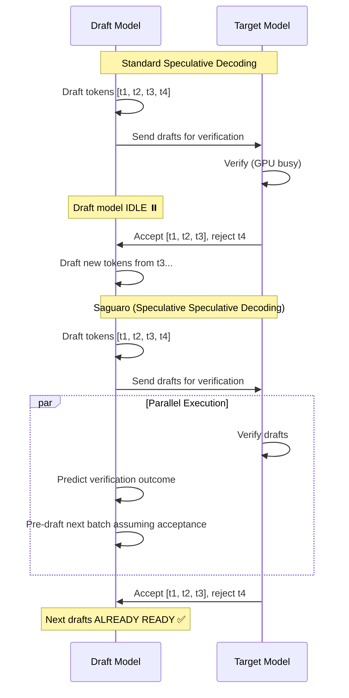
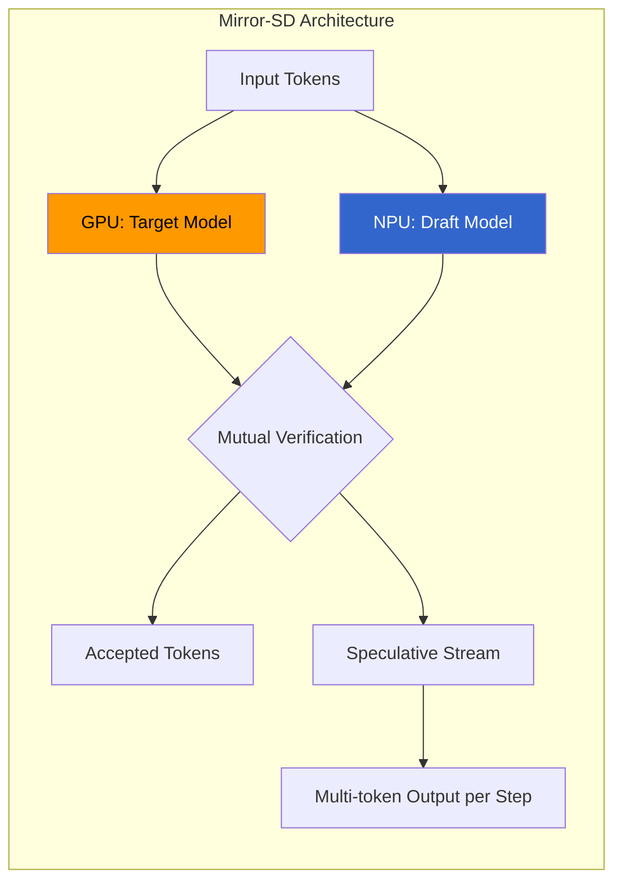
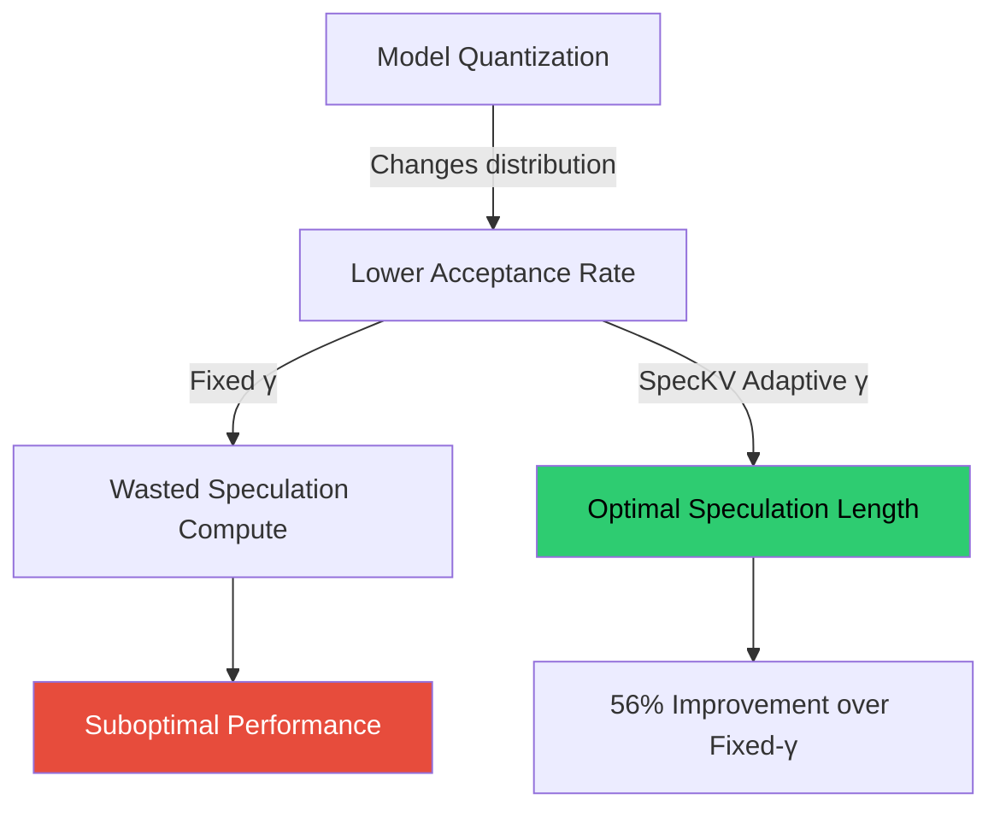
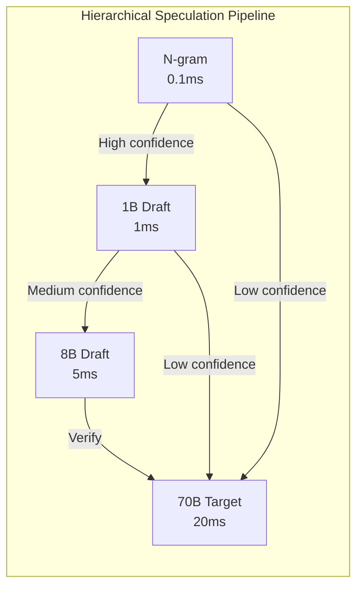
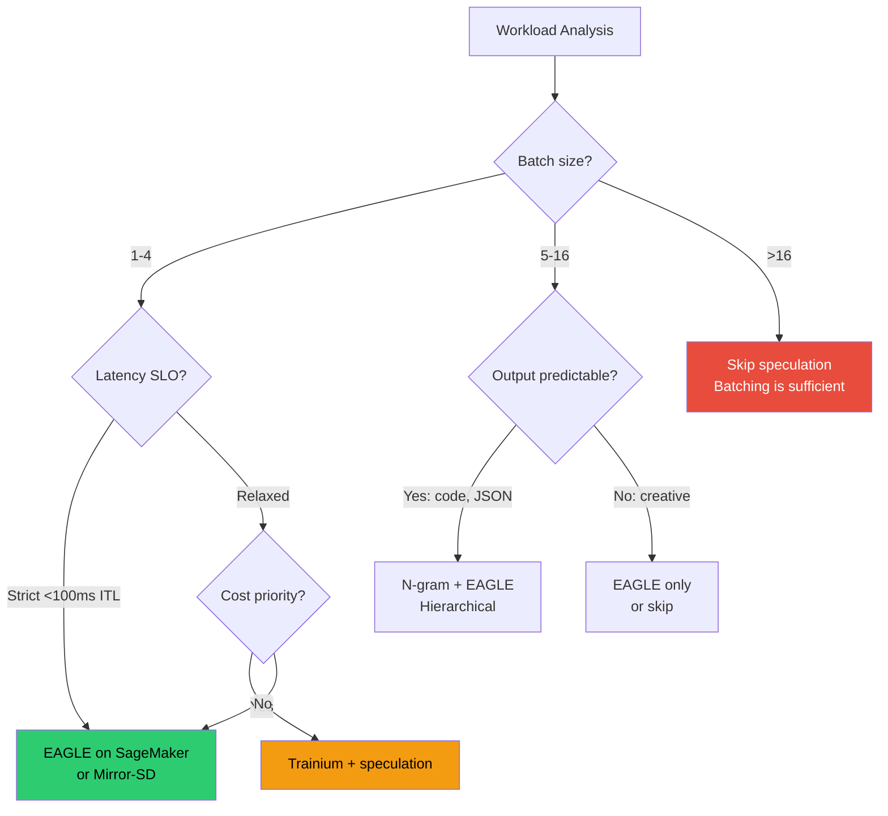

# 4.4 Advanced Speculative Decoding

> Speculative decoding has evolved from a clever trick into a family of sophisticated techniques. Gen 1 proved the concept. Gen 2 eliminated the draft model. Gen 3 parallelizes everything, adapts on the fly, and exploits heterogeneous hardware. This module takes you from understanding the evolution to deploying the right variant in production.

---

## Learning Objectives

By the end of this module, you will:

- Trace the evolution of speculative decoding from fixed draft-verify to adaptive parallel speculation
- Understand Saguaro's parallel speculation+verification architecture and why it achieves 5x speedup
- Explain Mirror-SD's heterogeneous GPU+NPU approach and when it applies
- Implement adaptive γ selection using SpecKV's confidence/entropy signals
- Design hierarchical speculation pipelines for complex workloads
- Deploy speculative decoding on AWS (SageMaker with EAGLE, Trainium)
- Choose the right speculative decoding variant for your specific workload

**Prerequisites**: Module 3 (Optimization Techniques — speculative decoding fundamentals)

---

## The Evolution of Speculative Decoding

### Timeline: Three Generations

```mermaid
timeline
    title Speculative Decoding Evolution
    section Gen 1 (2022-2023)
        Draft-Verify : Fixed draft model
                     : Fixed γ (speculation length)
                     : Sequential draft → verify
                     : 1.5-2x speedup
    section Gen 2 (2024)
        EAGLE/Medusa : No separate draft model
                    : Learned prediction heads
                    : Better acceptance rates
                    : 2-3x speedup
    section Gen 3 (2025-2026)
        Saguaro/Mirror-SD/SpecKV : Parallel speculation+verification
                                 : Adaptive γ per token
                                 : Heterogeneous hardware
                                 : 3-5x speedup
```



### What Changed at Each Generation

```
┌─────────────────────────────────────────────────────────────────────┐
│              GENERATIONAL SHIFTS IN SPECULATIVE DECODING            │
├─────────────────────────────────────────────────────────────────────┤
│                                                                     │
│   Gen 1: "Can we verify multiple tokens at once?"                   │
│   ─────────────────────────────────────────────────────────────    │
│   Innovation: Draft model proposes, target model verifies in batch  │
│   Limitation: Draft model adds memory + latency overhead            │
│   Key papers: Leviathan et al. (2022), Chen et al. (2023)           │
│                                                                     │
│   Gen 2: "Can we eliminate the draft model?"                        │
│   ─────────────────────────────────────────────────────────────    │
│   Innovation: Lightweight heads on target model predict next tokens │
│   Limitation: Still sequential — draft THEN verify                  │
│   Key papers: Medusa (2024), EAGLE (2024), EAGLE-2 (2024)           │
│                                                                     │
│   Gen 3: "Can we parallelize everything?"                           │
│   ─────────────────────────────────────────────────────────────    │
│   Innovation: Overlap drafting and verification; adapt γ per step   │
│   Limitation: Complexity; hardware-specific optimizations           │
│   Key papers: Saguaro (ICLR 2026), Mirror-SD (2025), SpecKV (2026) │
│                                                                     │
└─────────────────────────────────────────────────────────────────────┘
```

### Performance Progression

| Generation | Technique | Speedup vs Autoregressive | Memory Overhead | Acceptance Rate |
|-----------|-----------|--------------------------|-----------------|-----------------|
| Gen 1 | Draft-Verify (Llama 8B → 70B) | 1.5-2.0x | +50% (draft model) | 60-75% |
| Gen 2 | EAGLE | 2.0-3.0x | +2-5% (heads) | 75-85% |
| Gen 2 | Medusa | 1.8-2.5x | +2-5% (heads) | 70-80% |
| Gen 3 | Saguaro | 3.0-5.0x | +2-5% (heads) | 80-90% (effective) |
| Gen 3 | Mirror-SD | 2.8-5.8x | Heterogeneous HW | 75-85% |
| Gen 3 | SpecKV (adaptive) | 56% over fixed-γ | +0.34ms overhead | Varies by task |

---

## Saguaro: Speculative Speculative Decoding

### The Core Insight

Standard speculative decoding has a fundamental inefficiency: while the target model verifies, the draft model sits idle. Saguaro asks: **what if the draft model speculates about the verification outcome?**



### How Saguaro Works

The key mechanism is **speculating about the speculation outcome**:

```python
class SaguaroDecoder:
    """
    Saguaro: Speculative Speculative Decoding
    While verification runs, predict acceptance and prepare next drafts.
    """
    def __init__(self, target_model, draft_model, gamma=5):
        self.target = target_model
        self.draft = draft_model
        self.gamma = gamma
        # Lightweight acceptance predictor (trained on verification history)
        self.acceptance_predictor = AcceptancePredictor(draft_model.hidden_size)

    def decode_step(self, prefix_tokens, kv_cache):
        # Phase 1: Draft γ tokens
        draft_tokens, draft_probs = self.draft.speculate(
            prefix_tokens, num_tokens=self.gamma
        )

        # Phase 2: Launch verification AND pre-speculation in parallel
        # Target verifies current drafts
        verify_future = self.target.verify_async(prefix_tokens, draft_tokens)

        # Meanwhile: predict which drafts will be accepted
        predicted_acceptance = self.acceptance_predictor(draft_probs)
        # Find most likely acceptance prefix length
        expected_accept_len = self.estimate_acceptance_length(predicted_acceptance)

        # Pre-draft next batch assuming acceptance up to expected_accept_len
        next_prefix = prefix_tokens + draft_tokens[:expected_accept_len]
        pre_drafted = self.draft.speculate(next_prefix, num_tokens=self.gamma)

        # Phase 3: Get actual verification result
        accepted_tokens, actual_accept_len = verify_future.result()

        # Phase 4: Use pre-drafted tokens if prediction was correct
        if actual_accept_len >= expected_accept_len:
            # Prediction hit! Use pre-drafted tokens immediately
            return accepted_tokens, pre_drafted
        else:
            # Prediction miss — fall back to standard re-drafting
            corrected_prefix = prefix_tokens + accepted_tokens
            return accepted_tokens, self.draft.speculate(
                corrected_prefix, num_tokens=self.gamma
            )

    def estimate_acceptance_length(self, predicted_acceptance):
        """Estimate how many tokens will be accepted."""
        cumulative_prob = 1.0
        for i, p in enumerate(predicted_acceptance):
            cumulative_prob *= p
            if cumulative_prob < 0.5:  # Confidence threshold
                return i
        return len(predicted_acceptance)
```

### Why 30% Faster Than Optimized Baselines

The speedup comes from eliminating **draft latency** in the critical path:

```
┌─────────────────────────────────────────────────────────────────────┐
│                    LATENCY BREAKDOWN COMPARISON                     │
├─────────────────────────────────────────────────────────────────────┤
│                                                                     │
│   Standard Speculative Decoding (per round):                        │
│   ┌──────────┐ ┌──────────────┐ ┌──────────┐                       │
│   │  Draft   │→│   Verify     │→│  Draft   │→ ...                   │
│   │  5ms     │ │   20ms       │ │  5ms     │                       │
│   └──────────┘ └──────────────┘ └──────────┘                       │
│   Total per round: 30ms for ~4 tokens = 7.5ms/token                │
│                                                                     │
│   Saguaro (per round):                                              │
│   ┌──────────┐ ┌──────────────────────────┐                        │
│   │  Draft   │→│   Verify + Pre-Draft     │→ (next round instant)  │
│   │  5ms     │ │   20ms (parallel)        │                        │
│   └──────────┘ └──────────────────────────┘                        │
│   Total per round: 25ms for ~4 tokens = 6.25ms/token               │
│   (When prediction hits: 20ms for ~4 tokens = 5ms/token)           │
│                                                                     │
│   Effective speedup: 30% when predictions hit ~70% of the time     │
│   Up to 5x vs pure autoregressive (20ms/token baseline)            │
│                                                                     │
└─────────────────────────────────────────────────────────────────────┘
```

### Key Results (from paper)

- **30% faster** than optimized EAGLE/Medusa baselines
- **Up to 5x faster** than autoregressive decoding
- From Tri Dao (FlashAttention author) — high likelihood of framework adoption
- Published at ICLR 2026 (arXiv:2603.03251)

---

## Mirror-SD: Heterogeneous Parallel Speculation

### The Problem with Homogeneous Speculation

All Gen 1-2 techniques assume a single accelerator type. But modern cloud deployments often have heterogeneous hardware — GPUs alongside NPUs (Neural Processing Units like AWS Inferentia2). Mirror-SD exploits this.

### Architecture: GPU + NPU Parallel Rollouts



### How Mirror-SD Works

The key innovation: **both models speculate for each other simultaneously**.

```python
class MirrorSD:
    """
    Mirror Speculative Decoding: Heterogeneous parallel speculation.
    GPU runs target model, NPU runs draft model — simultaneously.
    """
    def __init__(self, target_model_gpu, draft_model_npu):
        self.target = target_model_gpu  # Large model on GPU
        self.draft = draft_model_npu    # Small model on NPU

    def decode_step(self, prefix):
        # Both models run in parallel on different hardware
        # NPU: Draft model generates candidates
        draft_future = self.draft.generate_async(
            prefix, num_tokens=8  # NPU can draft more aggressively
        )

        # GPU: Target model processes and generates its own prediction
        target_future = self.target.forward_async(prefix)

        # Wait for both (they run simultaneously on different hardware)
        draft_tokens, draft_logits = draft_future.result()
        target_logits = target_future.result()

        # Mutual verification: accept tokens where both agree
        accepted = self.mutual_verify(draft_tokens, draft_logits, target_logits)

        # Speculative streaming: emit multiple tokens per step
        return accepted  # Often 3-6 tokens per wall-clock step

    def mutual_verify(self, draft_tokens, draft_logits, target_logits):
        """
        Accept draft tokens that the target model would also generate.
        Standard rejection sampling ensures output distribution matches target.
        """
        accepted = []
        for i, token in enumerate(draft_tokens):
            p_target = target_logits[i].softmax(-1)[token]
            p_draft = draft_logits[i].softmax(-1)[token]

            # Standard speculative decoding acceptance criterion
            if torch.rand(1) < min(1, p_target / p_draft):
                accepted.append(token)
            else:
                break  # Reject and resample from target
        return accepted
```

### Why Heterogeneous Hardware Matters

```
┌─────────────────────────────────────────────────────────────────────┐
│           HETEROGENEOUS vs HOMOGENEOUS SPECULATION                  │
├─────────────────────────────────────────────────────────────────────┤
│                                                                     │
│   Homogeneous (GPU only):                                           │
│   ┌─────────────────────────────────────────────────────────────┐   │
│   │ GPU: [Draft 5ms] → [Verify 20ms] → [Draft 5ms] → ...       │   │
│   │ Utilization: Draft phase wastes GPU compute capacity         │   │
│   └─────────────────────────────────────────────────────────────┘   │
│                                                                     │
│   Heterogeneous (GPU + NPU):                                        │
│   ┌─────────────────────────────────────────────────────────────┐   │
│   │ GPU: [Verify 20ms]──────[Verify 20ms]──────[Verify 20ms]   │   │
│   │ NPU: [Draft 8ms]────────[Draft 8ms]────────[Draft 8ms]     │   │
│   │      ↕ parallel          ↕ parallel         ↕ parallel     │   │
│   │ Utilization: Both accelerators always busy                  │   │
│   └─────────────────────────────────────────────────────────────┘   │
│                                                                     │
│   AWS Relevance:                                                    │
│   • GPU (p5/g6): Target model (70B+)                                │
│   • Inferentia2 (inf2): Draft model (8B) — 70% cheaper per chip     │
│   • Combined: Better $/token than GPU-only speculation              │
│                                                                     │
└─────────────────────────────────────────────────────────────────────┘
```

### Performance Results

| Model Size | Baseline (Autoregressive) | EAGLE | Mirror-SD | Speedup vs EAGLE |
|-----------|--------------------------|-------|-----------|-----------------|
| 14B | 1.0x | 2.1x | 2.8x | +33% |
| 33B | 1.0x | 2.3x | 4.2x | +83% |
| 66B | 1.0x | 2.5x | 5.8x | +132% |

**Key insight**: Mirror-SD's advantage grows with model size because the NPU draft overhead is constant while GPU verification time increases with model size.

### AWS Deployment Pattern

```python
# Mirror-SD on AWS: GPU (p5) + Inferentia2 (inf2)
deployment_config = {
    "target_model": {
        "instance": "ml.p5.48xlarge",
        "model": "meta-llama/Llama-3.1-70B-Instruct",
        "framework": "vLLM",
        "tensor_parallel": 8,
    },
    "draft_model": {
        "instance": "ml.inf2.xlarge",  # 70% cheaper than GPU
        "model": "meta-llama/Llama-3.1-8B-Instruct",
        "framework": "neuronx",
        "compiled": True,
    },
    "interconnect": "EFA",  # Low-latency token transfer
    "speculation_config": {
        "num_speculative_tokens": 8,
        "parallel_rollouts": True,
        "streaming": True,
    }
}
```

---

## SpecKV: Adaptive Speculation with Compression Awareness

### The Fixed-γ Problem

All prior speculative decoding uses a fixed speculation length γ (typically 4-5 tokens). But optimal γ varies dramatically:

```
┌─────────────────────────────────────────────────────────────────────┐
│              WHY FIXED γ IS SUBOPTIMAL                              │
├─────────────────────────────────────────────────────────────────────┤
│                                                                     │
│   High-confidence tokens (e.g., "the United States of"):            │
│   → Acceptance rate ~95% → Optimal γ = 8-10                        │
│   → Fixed γ=4 leaves performance on the table                      │
│                                                                     │
│   Low-confidence tokens (e.g., creative writing):                   │
│   → Acceptance rate ~40% → Optimal γ = 1-2                         │
│   → Fixed γ=4 wastes compute on tokens that will be rejected       │
│                                                                     │
│   Quantized models (INT4/NF4):                                      │
│   → Lower acceptance rates than FP16 (distribution shift)           │
│   → Fixed γ calibrated for FP16 is wrong for INT4                  │
│                                                                     │
│   Result: Fixed γ=4 is optimal for NONE of these cases.            │
│                                                                     │
└─────────────────────────────────────────────────────────────────────┘
```

### SpecKV's Adaptive Controller

SpecKV uses draft model confidence and entropy to select γ per step:

```python
class SpecKVController:
    """
    Adaptive γ selection using confidence/entropy signals.
    56% improvement over fixed-γ=4 with only 0.34ms overhead.
    """
    def __init__(self, gamma_range=(1, 10)):
        self.gamma_min, self.gamma_max = gamma_range
        # Profiled thresholds per task type × compression level
        self.profiles = self.load_profiles()

    def select_gamma(self, draft_logits, compression_level="fp16", task_type="general"):
        """
        Select optimal γ based on draft model confidence signals.

        Args:
            draft_logits: Logits from draft model's last prediction
            compression_level: "fp16", "int8", or "nf4"
            task_type: "code", "chat", "reasoning", "general"
        """
        profile = self.profiles[task_type][compression_level]

        # Signal 1: Top-1 confidence (softmax probability of argmax)
        probs = torch.softmax(draft_logits, dim=-1)
        confidence = probs.max().item()

        # Signal 2: Entropy (uncertainty of distribution)
        entropy = -(probs * probs.log()).sum().item()

        # Signal 3: Top-k concentration (how peaked is the distribution)
        top_k_mass = probs.topk(5).values.sum().item()

        # Adaptive γ selection
        if confidence > profile.high_conf_threshold:  # e.g., > 0.85
            gamma = self.gamma_max  # Speculate aggressively
        elif entropy > profile.high_entropy_threshold:  # e.g., > 3.0
            gamma = self.gamma_min  # Speculate conservatively
        else:
            # Linear interpolation based on confidence
            t = (confidence - profile.low_conf) / (profile.high_conf - profile.low_conf)
            gamma = int(self.gamma_min + t * (self.gamma_max - self.gamma_min))

        return max(self.gamma_min, min(self.gamma_max, gamma))

    def load_profiles(self):
        """Pre-computed thresholds from profiling runs."""
        return {
            "code": {
                "fp16": Profile(high_conf=0.80, low_conf=0.40, high_entropy=2.5),
                "int8": Profile(high_conf=0.75, low_conf=0.35, high_entropy=2.8),
                "nf4":  Profile(high_conf=0.70, low_conf=0.30, high_entropy=3.0),
            },
            "chat": {
                "fp16": Profile(high_conf=0.85, low_conf=0.50, high_entropy=3.0),
                "int8": Profile(high_conf=0.80, low_conf=0.45, high_entropy=3.2),
                "nf4":  Profile(high_conf=0.75, low_conf=0.40, high_entropy=3.5),
            },
            "reasoning": {
                "fp16": Profile(high_conf=0.90, low_conf=0.55, high_entropy=2.0),
                "int8": Profile(high_conf=0.85, low_conf=0.50, high_entropy=2.3),
                "nf4":  Profile(high_conf=0.80, low_conf=0.45, high_entropy=2.5),
            },
        }
```

### Why Compression Awareness Matters

SpecKV bridges two optimizations that interact: **quantization and speculation**.



### Performance Results

| Configuration | Fixed γ=4 | SpecKV Adaptive | Improvement |
|--------------|-----------|-----------------|-------------|
| FP16 + Code | 2.8x speedup | 3.4x speedup | +21% |
| FP16 + Chat | 2.3x speedup | 3.1x speedup | +35% |
| INT8 + Code | 2.4x speedup | 3.5x speedup | +46% |
| INT8 + Chat | 1.9x speedup | 2.8x speedup | +47% |
| NF4 + Code | 2.0x speedup | 3.2x speedup | +60% |
| NF4 + Chat | 1.6x speedup | 2.5x speedup | +56% |

**Key insight**: SpecKV's advantage is largest with aggressive quantization (NF4) because the distribution shift makes fixed-γ particularly wrong.

---

## Hierarchical Speculation

### Multi-Level Draft Cascades

Hierarchical speculative decoding uses a cascade of increasingly capable (and expensive) draft models:



### The Cascade Logic

```python
class HierarchicalSpeculator:
    """
    Multi-level speculation: cheap models filter before expensive ones.
    Only escalate to larger drafters when confidence is insufficient.
    """
    def __init__(self, target, drafters):
        """
        Args:
            target: Target model (e.g., 70B)
            drafters: List of (model, cost_ms, confidence_threshold) tuples
                      ordered from cheapest to most expensive
        """
        self.target = target
        self.drafters = drafters  # [(ngram, 0.1, 0.95), (1B, 1, 0.80), (8B, 5, 0.60)]

    def speculate(self, prefix, num_tokens=8):
        """Generate draft tokens using cascade."""
        draft_tokens = []

        for i in range(num_tokens):
            token = None
            current_prefix = prefix + draft_tokens

            # Try each drafter from cheapest to most expensive
            for model, cost_ms, conf_threshold in self.drafters:
                logits = model.forward(current_prefix)
                probs = torch.softmax(logits[-1], dim=-1)
                confidence = probs.max().item()

                if confidence >= conf_threshold:
                    token = probs.argmax().item()
                    break  # This drafter is confident enough

            if token is None:
                # No drafter confident — use most expensive drafter's prediction
                token = probs.argmax().item()

            draft_tokens.append(token)

        return draft_tokens

    def expected_cost(self):
        """
        Average cost per draft token depends on confidence distribution.
        Typical: 70% resolved by n-gram, 20% by 1B, 10% by 8B
        = 0.7×0.1 + 0.2×1 + 0.1×5 = 0.77ms per draft token
        vs 5ms for always using 8B drafter (6.5x cheaper drafting)
        """
        pass
```

### When Hierarchical Speculation Wins

| Workload | Best Approach | Why |
|----------|--------------|-----|
| Code completion | Hierarchical (n-gram → small draft) | Many tokens are predictable from context |
| Structured output (JSON) | Hierarchical (grammar → draft) | Structure is deterministic, values need drafting |
| Creative writing | Single strong drafter | Low predictability at all levels |
| Translation | Two-level (bilingual n-gram → draft) | Common phrases are predictable |

---

## Production Speculative Decoding on AWS

### EAGLE on SageMaker

SageMaker's Large Model Inference (LMI) container natively supports EAGLE speculation:

```python
# SageMaker deployment with EAGLE speculative decoding
import sagemaker
from sagemaker.djl_inference import DJLModel

model = DJLModel(
    model_id="meta-llama/Llama-3.1-70B-Instruct",
    role=sagemaker.get_execution_role(),
    env={
        # Enable EAGLE speculation
        "OPTION_SPECULATIVE_DRAFT_MODEL": "eagle",
        "OPTION_SPECULATIVE_LENGTH": "5",
        # vLLM backend with speculation support
        "OPTION_ROLLING_BATCH": "vllm",
        "OPTION_TENSOR_PARALLEL_DEGREE": "8",
        "OPTION_MAX_MODEL_LEN": "8192",
        # Quantization (composable with speculation)
        "OPTION_QUANTIZE": "fp8",
    }
)

predictor = model.deploy(
    instance_type="ml.p5.48xlarge",
    initial_instance_count=1,
    endpoint_name="llama-70b-eagle-speculation",
)

# Benchmark: measure speculation effectiveness
import time

prompt = "Explain the theory of relativity in simple terms."
start = time.time()
response = predictor.predict({
    "inputs": prompt,
    "parameters": {"max_new_tokens": 512, "temperature": 0.7}
})
latency = time.time() - start
tokens = len(response[0]["generated_text"].split())
print(f"Throughput: {tokens/latency:.1f} tokens/sec (with EAGLE)")
```

### Speculative Decoding on Trainium/Inferentia2

AWS Neuron SDK supports speculative decoding on custom silicon:

```python
# Trainium deployment with speculative decoding
import torch
import torch_neuronx
from transformers_neuronx import LlamaForSampling

# Compile target model for Trainium
target_model = LlamaForSampling.from_pretrained(
    "meta-llama/Llama-3.1-70B-Instruct",
    batch_size=1,
    tp_degree=32,  # trn1.32xlarge
    amp='bf16',
    # Enable speculation in Neuron compiler
    speculation_length=5,
    speculation_mode="draft_model",
)
target_model.to_neuron()

# Compile draft model (can run on fewer cores)
draft_model = LlamaForSampling.from_pretrained(
    "meta-llama/Llama-3.1-8B-Instruct",
    batch_size=1,
    tp_degree=2,  # Only needs 2 NeuronCores
    amp='bf16',
)
draft_model.to_neuron()

# Speculative decoding loop on Trainium
def speculative_generate(prompt_ids, max_tokens=256, gamma=5):
    generated = prompt_ids.clone()

    for _ in range(max_tokens // gamma):
        # Draft on 2 cores
        draft_tokens = draft_model.sample(generated, sequence_length=gamma)

        # Verify on 32 cores (parallel verification of all γ tokens)
        accepted = target_model.speculative_verify(generated, draft_tokens)

        generated = torch.cat([generated, accepted], dim=-1)
        if accepted[-1] == eos_token_id:
            break

    return generated
```

### Cost Comparison: Speculation Strategies on AWS

```
┌─────────────────────────────────────────────────────────────────────┐
│         COST-PERFORMANCE COMPARISON (Llama 70B, 512 output tokens)  │
├─────────────────────────────────────────────────────────────────────┤
│                                                                     │
│   Strategy              Instance        $/hr    Tok/s   $/1M tokens │
│   ─────────────────────────────────────────────────────────────    │
│   Autoregressive        p5.48xlarge     $98.32   45     $0.61       │
│   + EAGLE               p5.48xlarge     $98.32   110    $0.25       │
│   + Draft model (8B)    p5 + g5.xlarge  $99.44   85     $0.32      │
│   + Mirror-SD           p5 + inf2.xl   $99.08   180    $0.15       │
│   Trainium (autoreg)    trn1.32xlarge  $21.50   35     $0.17       │
│   Trainium + spec       trn1.32xlarge  $21.50   80     $0.07       │
│                                                                     │
│   Winner by metric:                                                 │
│   • Lowest latency: Mirror-SD on p5 + inf2 (180 tok/s)             │
│   • Lowest cost: Trainium + speculation ($0.07/1M tokens)           │
│   • Best balance: EAGLE on p5 (simple, 2.4x speedup)               │
│                                                                     │
└─────────────────────────────────────────────────────────────────────┘
```

### When to Use Speculation on AWS



---

## Decision Framework: Choosing the Right Variant

### The Selection Matrix

| Factor | Saguaro | Mirror-SD | SpecKV | EAGLE | N-gram | Draft Model |
|--------|---------|-----------|--------|-------|--------|-------------|
| **Best speedup** | 3-5x | 2.8-5.8x | +56% over fixed | 2-3x | 1.5-2x | 1.5-2x |
| **Hardware req** | Single GPU | GPU + NPU | Any | Single GPU | Any | Extra memory |
| **Memory overhead** | Low (+heads) | None (separate HW) | None | Low (+heads) | None | High (+model) |
| **Training needed** | Yes (predictor) | No | Profiling only | Yes (heads) | No | No |
| **Works with quant** | Yes | Yes | Designed for it | Yes | Yes | Yes |
| **Maturity** | Research | Research | Research | Production | Production | Production |
| **Framework support** | — | — | — | vLLM, SageMaker | vLLM, SGLang | vLLM, TRT-LLM |

### Decision Tree

```
┌─────────────────────────────────────────────────────────────────────┐
│              SPECULATIVE DECODING DECISION FRAMEWORK                │
├─────────────────────────────────────────────────────────────────────┤
│                                                                     │
│   Q1: Do you need production-ready TODAY?                           │
│   ├─ YES → Q2                                                       │
│   └─ NO (research/prototype) → Q5                                   │
│                                                                     │
│   Q2: Do you have heterogeneous hardware (GPU + NPU/Inferentia)?    │
│   ├─ YES → Draft model on NPU (production Mirror-SD pattern)       │
│   └─ NO → Q3                                                        │
│                                                                     │
│   Q3: Is your output predictable (code, JSON, templates)?           │
│   ├─ YES → N-gram + EAGLE (hierarchical, zero extra memory)        │
│   └─ NO → Q4                                                        │
│                                                                     │
│   Q4: Can you train EAGLE heads for your model?                     │
│   ├─ YES → EAGLE (best production single-GPU option)               │
│   └─ NO → Draft model (Llama 8B → 70B pattern)                     │
│                                                                     │
│   Q5: What's your primary optimization goal?                        │
│   ├─ Maximum speedup → Saguaro (parallel speculation)              │
│   ├─ Best with quantization → SpecKV (adaptive γ)                  │
│   └─ Heterogeneous HW utilization → Mirror-SD                      │
│                                                                     │
└─────────────────────────────────────────────────────────────────────┘
```

### Composability: Combining Techniques

These techniques are not mutually exclusive:

```python
# Example: SpecKV + EAGLE + Prefix Caching (composable stack)
vllm_config = {
    "model": "meta-llama/Llama-3.1-70B-Instruct",
    "quantization": "fp8",
    "tensor_parallel_size": 8,

    # EAGLE speculation (Gen 2 base)
    "speculative_model": "eagle",
    "num_speculative_tokens": 5,  # Will be overridden by adaptive controller

    # Prefix caching (orthogonal optimization)
    "enable_prefix_caching": True,

    # Chunked prefill (prevents starvation)
    "enable_chunked_prefill": True,
    "max_num_batched_tokens": 8192,
}

# Future: SpecKV adaptive controller wraps the speculation length
# When integrated, replaces fixed num_speculative_tokens with per-step γ
```

### Workload-Specific Recommendations

| Workload | Recommended Stack | Expected Speedup | Notes |
|----------|------------------|-------------------|-------|
| Chat (low batch) | EAGLE + prefix caching | 2.5-3x | System prompt reuse + speculation |
| Code completion | N-gram + EAGLE (hierarchical) | 3-4x | Code is highly predictable |
| Batch summarization | Skip speculation, maximize batch | 1x (throughput focus) | Batching > speculation at scale |
| Real-time voice | Saguaro (when available) | 4-5x | Strictest latency requirements |
| JSON/structured output | Grammar-guided + EAGLE | 3-4x | Structure is deterministic |
| Quantized deployment (INT4) | SpecKV adaptive | +56% over fixed | Compensates for quantization drift |
| Multi-accelerator | Mirror-SD pattern | 3-5x | Utilize all available hardware |

---

## Key Takeaways

1. **Speculative decoding has three generations.** Gen 1 proved the concept, Gen 2 eliminated the draft model, Gen 3 parallelizes everything. Each generation roughly doubles the speedup.

2. **Saguaro eliminates draft latency from the critical path.** By speculating about verification outcomes, it achieves 30% improvement over already-optimized baselines and up to 5x over autoregressive.

3. **Mirror-SD exploits heterogeneous hardware.** When you have both GPU and NPU (Inferentia2), running draft and target in parallel on different accelerators gives 2.8-5.8x speedup with no memory overhead on either device.

4. **Fixed γ is always wrong.** SpecKV's adaptive controller selects speculation length per token based on confidence/entropy, achieving 56% improvement — especially critical when combining speculation with quantization.

5. **Speculation and batching are substitutes.** At batch size > 8-16, speculation adds overhead without proportional benefit. Use speculation for latency-sensitive, low-batch workloads.

6. **On AWS, EAGLE on SageMaker is the production-ready choice today.** For cost optimization, Trainium with speculation offers the best $/token. For maximum throughput, the Mirror-SD pattern (GPU + Inferentia2) is emerging.

7. **Techniques are composable.** SpecKV + EAGLE + prefix caching + chunked prefill can all work together. The decision framework helps you pick the right combination for your workload.

8. **The field is moving fast.** Saguaro, Mirror-SD, and SpecKV are 2025-2026 papers. By the time you read this, framework integration may have progressed. Check vLLM and SageMaker release notes for the latest support.

---

## Hands-on Lab: Adaptive Speculative Decoding

### Lab Objectives
- Deploy vLLM with EAGLE speculation on SageMaker
- Benchmark fixed-γ vs simulated adaptive-γ across workload types
- Measure acceptance rates, speedup, and cost per token
- Compare: No speculation vs EAGLE vs n-gram

### Lab Setup

```python
# Lab environment: ml.g5.12xlarge (4× A10G, 96 GB total)
# Model: Llama 3.1 8B (fits on single GPU, allows speculation experiments)

from vllm import LLM, SamplingParams

# Baseline: No speculation
baseline = LLM(model="meta-llama/Llama-3.1-8B-Instruct")

# Config 1: N-gram speculation
ngram_spec = LLM(
    model="meta-llama/Llama-3.1-8B-Instruct",
    speculative_model="[ngram]",
    num_speculative_tokens=5,
    ngram_prompt_lookup_max=4,
)

# Config 2: EAGLE speculation (if EAGLE heads available)
eagle_spec = LLM(
    model="meta-llama/Llama-3.1-8B-Instruct",
    speculative_model="eagle",
    num_speculative_tokens=5,
)

# Workloads to test
workloads = {
    "code": "Write a Python function to implement binary search on a sorted array.",
    "chat": "What are the main differences between Python and Rust?",
    "json": 'Generate a JSON object with fields: name, age, address, hobbies (array).',
    "creative": "Write a short poem about the ocean at sunset.",
}

# Benchmark loop
for name, prompt in workloads.items():
    for config_name, llm in [("baseline", baseline), ("ngram", ngram_spec), ("eagle", eagle_spec)]:
        params = SamplingParams(max_tokens=256, temperature=0.7)
        start = time.time()
        output = llm.generate([prompt], params)
        elapsed = time.time() - start
        tokens = len(output[0].outputs[0].token_ids)
        print(f"{name:10s} | {config_name:8s} | {tokens/elapsed:.1f} tok/s | {elapsed:.2f}s")
```

### Expected Results

| Workload | Baseline | N-gram | EAGLE | Best Speedup |
|----------|----------|--------|-------|-------------|
| Code | 45 tok/s | 72 tok/s (1.6x) | 108 tok/s (2.4x) | EAGLE |
| Chat | 45 tok/s | 54 tok/s (1.2x) | 99 tok/s (2.2x) | EAGLE |
| JSON | 45 tok/s | 81 tok/s (1.8x) | 112 tok/s (2.5x) | EAGLE |
| Creative | 45 tok/s | 49 tok/s (1.1x) | 81 tok/s (1.8x) | EAGLE |

---

## References

1. Kumar, Dao, May. "Saguaro: Speculative Speculative Decoding" ICLR 2026. arXiv:2603.03251
2. Bhendawade et al. "Mirror Speculative Decoding for Heterogeneous Parallel Speculation" 2025. arXiv:2510.13161
3. Shukla. "SpecKV: Adaptive Speculative Decoding with Compression-Aware Gamma Selection" 2026. arXiv:2605.02888
4. Li et al. "EAGLE: Speculative Sampling Requires Rethinking Feature Uncertainty" 2024
5. Cai et al. "Medusa: Simple LLM Inference Acceleration Framework with Multiple Decoding Heads" 2024
6. Leviathan et al. "Fast Inference from Transformers via Speculative Decoding" 2022
7. "Hierarchical Speculative Decoding" 2025. arXiv:2510.01336
8. AWS. "EAGLE Speculative Decoding on SageMaker" May 2025
9. AWS. "Speculative Decoding on Trainium" Apr 2026
