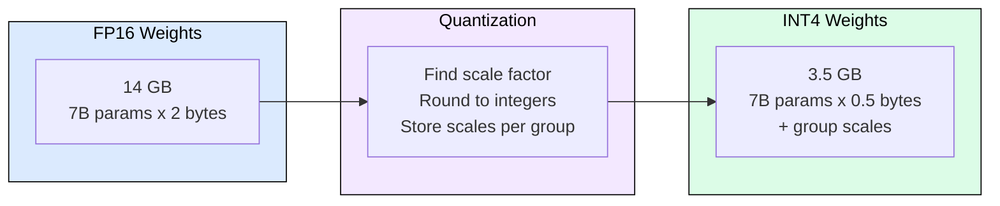
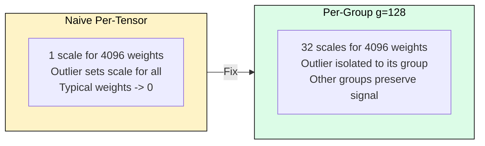
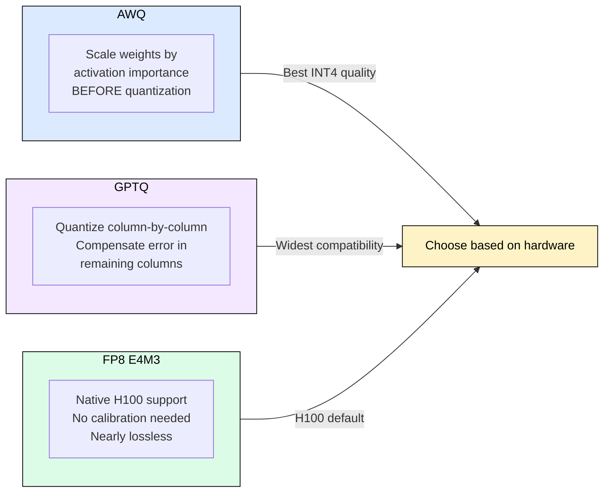
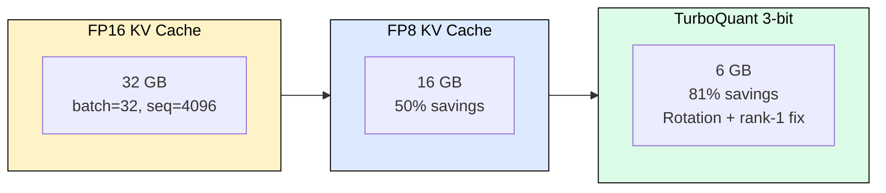

# 4.1 Quantization

[](https://colab.research.google.com/github/harshuljain13/llm-inference-at-scale/blob/master/content/05_optimization/04.1_quantization/lab.ipynb)
[](https://molab.marimo.io/github/harshuljain13/llm-inference-at-scale/blob/master/content/05_optimization/04.1_quantization/lab.ipynb)

INT4 quantization doubles your batch size with under 1% quality loss. A 14 GB model in FP16 shrinks to 3.5 GB in INT4, fitting on a single consumer GPU and reading 4x fewer bytes from HBM per decode step. This module covers how quantization works at the bit level, why outlier handling determines success or failure, and which method to choose for your workload.

## How Quantization Works

Quantization maps floating-point weights to a smaller set of discrete integer values. LLM weights are approximately normally distributed around zero. The mapping uses a scale factor derived from the tensor's maximum absolute value:

```
scale = max(|weights|) / (2^(bits-1) - 1)
quantized = round(weight / scale)
dequantized = quantized * scale
```

The quantization error for any individual weight equals the rounding residual times the scale factor. This means a single outlier weight inflates the scale factor and increases rounding error for every other weight in the tensor.



## The Outlier Problem

A weight tensor with max value 0.5 and typical values around 0.01 illustrates the failure mode. At INT4 (range [-8, 7]), the scale becomes 0.5/7 = 0.071. A typical weight of 0.01, divided by 0.071 and rounded, becomes zero. The signal is destroyed because one outlier dictated the scale for the entire tensor.

Per-group quantization (groups of 64-128 weights sharing one scale factor) mitigates this by isolating outliers to their own group. The tradeoff: more scale factors means slightly more storage overhead but dramatically better quality.



## AWQ: Activation-Aware Weight Quantization

AWQ observes that weights connected to frequently-activated channels matter more. It scales important weights up before quantization so they survive rounding, then scales them back down at inference. A weight that is 10x more important gets 10x less relative quantization error.

AWQ requires a small calibration dataset (128 samples typical) to measure activation magnitudes. Quantization runs once offline in minutes. At inference, the prescaled INT4 weights dequantize with a fused kernel, adding negligible overhead.

## GPTQ: Error Compensation

GPTQ quantizes weights sequentially column by column. After quantizing each column, it adjusts the remaining unquantized columns to compensate for the accumulated rounding error using the inverse Hessian. Each column absorbs error from its predecessors, keeping total output error small.

GPTQ requires a calibration dataset and takes 5-30 minutes for a 7B model. It achieves slightly worse quality than AWQ on most benchmarks but supports a wider range of hardware via GGUF format.



## FP8: The H100 Default

FP8 E4M3 provides 2x compression with near-zero quality loss (perplexity delta of 0.01) and native hardware acceleration on H100/H200. Unlike integer formats, FP8 preserves relative precision across magnitudes without per-tensor calibration. If you have H100s, serve in FP8 unless you need the 4x compression of INT4.

## KV Cache Quantization

At high batch sizes, KV cache memory exceeds weight memory. A batch of 32 with 4096-token sequences on Llama-8B consumes 16 GB of KV cache versus 4 GB of INT4 weights. Quantizing KV cache from FP16 to FP8 saves another 8 GB, a larger absolute saving than weight quantization.

TurboQuant (ICLR 2026) pushes KV cache to 3-bit with no measurable accuracy loss by applying learned rotations that spread outlier energy uniformly across channels before quantization, then storing a rank-1 correction per attention head.



## Quality Benchmarks

Measured on Llama 2 7B, WikiText-2 perplexity:

| Method | Bits | Perplexity | Delta from FP16 | Memory |
|--------|------|-----------|----------------|--------|
| FP16 | 16 | 5.47 | baseline | 14 GB |
| FP8 E4M3 | 8 | 5.48 | +0.01 | 7 GB |
| AWQ | 4 | 5.60 | +0.13 (+2.4%) | 3.5 GB |
| GPTQ | 4 | 5.68 | +0.21 (+3.8%) | 3.5 GB |
| RTN (naive) | 4 | 6.29 | +0.82 (+15%) | 3.5 GB |

The critical insight: quantization method matters more than bit width. AWQ at 4-bit (perplexity 5.60) vastly outperforms naive 4-bit (6.29). Always use a calibrated method.

## Practical Decision Framework

Choose based on hardware and quality requirements:

- **H100/H200**: FP8 E4M3 by default. Zero calibration, native kernels, 2x compression.
- **A100/A10G, quality-sensitive**: AWQ INT4 with group size 128. Best quality at 4x compression.
- **Consumer GPU, need to fit**: GPTQ INT4 via GGUF. Widest tool support (llama.cpp, Ollama).
- **KV cache bottleneck (high batch)**: Add FP8 KV cache quantization. Use TurboQuant for extreme savings.
- **Fine-tuning on limited VRAM**: NF4 via bitsandbytes. Information-optimal for QLoRA.

## vLLM Configuration

```python
# AWQ INT4 serving
llm = LLM(model="model-awq", quantization="awq")

# FP8 on H100
llm = LLM(model="model", quantization="fp8")

# INT4 weights + FP8 KV cache (maximum compression)
llm = LLM(model="model-awq", quantization="awq", kv_cache_dtype="fp8")
```

## FAQ

**Q1: Does INT4 quantization affect all tasks equally?**
No. Factual recall and reasoning degrade more than summarization or classification. Test on your specific use case.

**Q2: Can I quantize then fine-tune?**
Yes. QLoRA (NF4 base + LoRA adapters in FP16) is the standard approach for fine-tuning quantized models with minimal memory.

**Q3: Why not just use INT2 or INT1?**
Below 3-bit, quality collapses because too few discrete levels exist to represent the weight distribution meaningfully. Current research shows 3-bit as the practical floor.

**Q4: Does quantization speed up inference or just save memory?**
Both. Fewer bytes read from HBM per decode step means higher effective bandwidth utilization. INT4 provides roughly 2x decode speedup on memory-bound workloads.

**Q5: How long does calibration take?**
AWQ: 5-15 minutes for 7B. GPTQ: 10-30 minutes for 7B. Both need only 128 calibration samples. FP8 needs no calibration.

**Q6: Should I quantize the embedding layer?**
Generally no. Embeddings are accessed sparsely (one row per token), so bandwidth savings are minimal while quality impact on token discrimination is high.

**Q7: What is the difference between W4A16 and W4A4?**
W4A16 quantizes weights to INT4 but keeps activations in FP16. W4A4 quantizes both, requiring specialized hardware (like NVIDIA Blackwell) for meaningful speedup.

**Q8: Does batch size affect quantization quality?**
No. Quantization is applied to weights (static), not activations. Quality loss is identical regardless of batch size.

**Q9: Can I combine weight quantization with KV cache quantization?**
Yes, they are orthogonal. INT4 weights + FP8 KV cache is a common production configuration that maximizes both capacity and throughput.

**Q10: When should I avoid quantization entirely?**
When your model already fits comfortably in memory with room for KV cache growth, and you cannot tolerate any quality regression (medical, legal, safety-critical applications).

## References

1. Lin et al. "AWQ: Activation-aware Weight Quantization for LLM Compression and Acceleration" (2023). arXiv:2306.00978
2. Frantar et al. "GPTQ: Accurate Post-Training Quantization for Generative Pre-trained Transformers" (2022). arXiv:2210.17323
3. Dettmers et al. "QLoRA: Efficient Finetuning of Quantized Language Models" (2023). arXiv:2305.14314
4. Xiao et al. "SmoothQuant: Accurate and Efficient Post-Training Quantization for Large Language Models" (2022). arXiv:2211.10438
5. TurboQuant: "3-Bit KV Cache Quantization Without Accuracy Loss" (2025). arXiv:2504.19874
6. Micikevicius et al. "FP8 Formats for Deep Learning" (2022). arXiv:2209.05433
7. Dettmers et al. "LLM.int8(): 8-bit Matrix Multiplication for Transformers at Scale" (2022). arXiv:2208.07339
