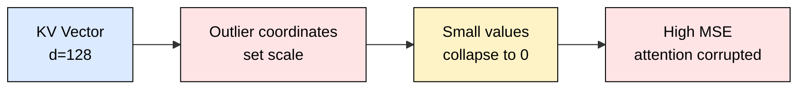
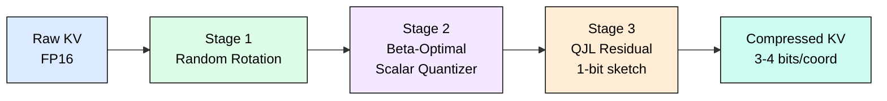
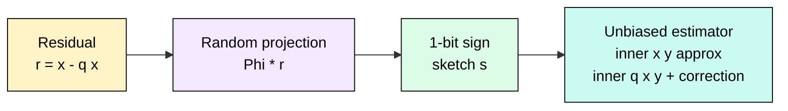
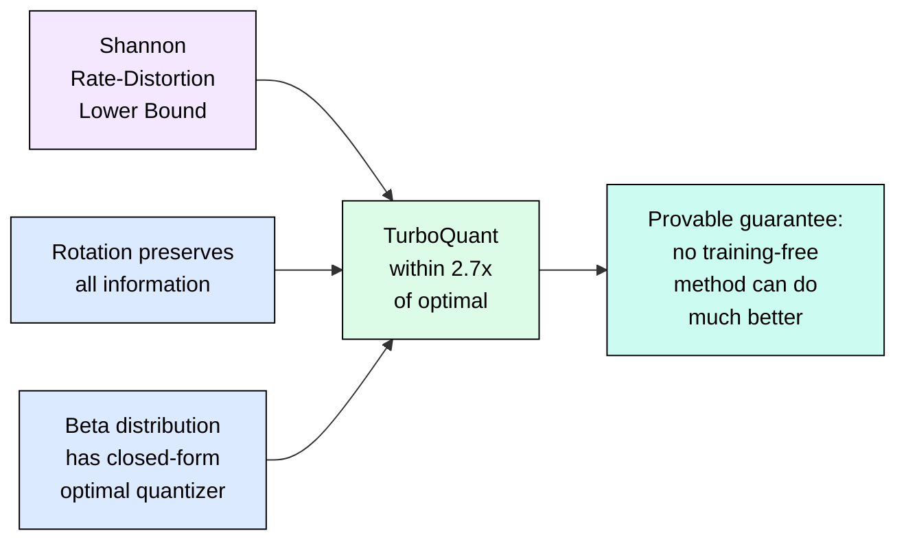

# 4.2 TurboQuant: Near-Lossless 4-Bit KV Cache Compression

[](https://colab.research.google.com/github/harshuljain13/llm-inference-at-scale/blob/master/content/05_optimization/04.2_turboquant/lab.ipynb) [](https://molab.marimo.io/github/harshuljain13/llm-inference-at-scale/blob/master/content/05_optimization/04.2_turboquant/lab.ipynb)

The KV cache is the dominant memory consumer at inference scale. At batch=64 with 8K context on a 70B model, KV cache alone exceeds 32 GB. TurboQuant compresses the KV cache to 3-4 bits per coordinate with zero meaningful accuracy loss, achieving 5.3x memory reduction and 8x attention speedup on H100. It is training-free, provably near-optimal, and already integrated into vLLM.

| Field | Detail |
|-------|--------|
| **Paper** | TurboQuant: Online Vector Quantization with Near-optimal Distortion Rate |
| **Venue** | ICLR 2026 |
| **ArXiv** | arxiv:2504.19874 |
| **Key Result** | 3-bit KV cache, zero accuracy loss, 8x attention speedup on H100 |

## Why Naive Quantization Fails on KV Vectors

KV vectors contain outlier coordinates that dominate the quantization range. A single large value forces all smaller values into the same few bins, destroying information.



TurboQuant eliminates this problem through a three-stage pipeline that first removes outliers, then quantizes optimally, then corrects residual bias.

## The Three-Stage Pipeline



### Stage 1: Random Rotation Eliminates Outliers

Multiplying by a random orthogonal matrix (fast Hadamard + random signs) concentrates all coordinate magnitudes into a predictable Beta distribution. After rotation, each coordinate satisfies `|y_i|^2 / ||x||^2 ~ Beta(1/2, (d-1)/2)`. For d=128, this means coordinates are tightly clustered around 1/128 of the squared norm with variance ~1/8192. No outliers remain.

The key insight: rotation is norm-preserving and invertible, so no information is lost. It simply redistributes magnitude uniformly across coordinates, making every coordinate equally easy to quantize.

### Stage 2: Optimal Scalar Quantization on Beta Distribution

With coordinates following a known Beta distribution, the information-theoretically optimal quantizer uses Beta CDF quantiles as boundaries and conditional means as reconstruction points:

1. Boundaries: `t_j = F_Beta_inv(j / 2^b)` for j = 0..2^b
2. Reconstruction: `r_j = E[Y | t_j <= Y < t_{j+1}]`
3. Distortion: within 2.7x of the Shannon rate-distortion lower bound

At 3 bits (8 levels), the relative error per coordinate is below 0.1% of vector norm.

### Stage 3: QJL Residual for Unbiased Inner Products

Quantization introduces bias in inner product estimation. The QJL (Quantized Johnson-Lindenstrauss) correction stores a 1-bit sign sketch of the residual `r = x - q(x)`:



Total storage: 3 bits (quantizer) + 1 bit (QJL) = 4 bits per coordinate, or 2.5 + 1 = 3.5 bits for aggressive compression. The inner product estimate is unbiased with variance bounded by `O(||r||^2 * ||y||^2 / m)`.

## Performance Results

| Bit-width | Memory Reduction | Attention Speedup | Quality (ppl) |
|-----------|-----------------|-------------------|---------------|
| FP16 (16b) | 1.0x baseline | 1.0x baseline | baseline |
| FP8 (8b) | 2.0x | 1.8x | -0.01 |
| 4-bit | 4.0x | 4.2x | -0.02 |
| 3.5-bit | 4.6x | 5.1x | -0.00 |
| 3-bit | 5.3x | 8.0x | -0.01 |

The 8x attention speedup at 3-bit comes from fewer bytes read from HBM (memory-bound operation), smaller working set improving cache utilization, and compressed dot products via QJL requiring fewer FLOPs.

## Why It Works: Theoretical Guarantees



The proof relies on three facts: (1) random rotation is an isometry so distortion is preserved, (2) the induced Beta distribution has a known optimal quantizer from rate-distortion theory, (3) QJL provides an unbiased correction with bounded variance. Together these guarantee near-optimality without any training data.

## vLLM Integration

```python
from vllm import LLM

# TurboQuant integrated into vLLM (2026+)
llm = LLM(
    model="meta-llama/Llama-3.1-70B-Instruct",
    kv_cache_dtype="turbo_quant_3bit",  # or "turbo_quant_4bit"
    tensor_parallel_size=4,
    max_model_len=32768,
    # 2x more concurrent sequences at same memory vs FP8
)
```

## When to Use TurboQuant

| Scenario | Recommendation |
|----------|---------------|
| Long context, quality-critical (medical, legal) | 4-bit (provably zero loss) |
| General production serving | 3-bit (negligible loss, maximum savings) |
| Short sequences (<128 tokens) | Skip (rotation overhead exceeds savings) |
| Already using LeanKV | Do not stack (both quantize, redundant) |
| Multi-tenant with ContextPilot | Combine (reuse + compress remaining) |

## FAQ

**Q: Does TurboQuant require model retraining?**
No. It is entirely training-free. The rotation matrix and optimal quantizer boundaries are derived mathematically from the head dimension.

**Q: What is the compute overhead of the Hadamard rotation?**
O(d log d) via the fast Walsh-Hadamard transform, where d is the head dimension (typically 128). This adds negligible latency compared to the attention computation itself.

**Q: Can I combine TurboQuant with other KV cache techniques?**
Yes with ContextPilot (reuse then compress remaining). Yes with ThinKV (thought-adaptive eviction then quantize what remains). Do not combine with LeanKV, which has its own quantization.

**Q: Why 3 bits specifically?**
At 3 bits, the Beta-optimal quantizer achieves relative error below 0.1% per coordinate due to the tight concentration of the Beta(1/2, 63) distribution at d=128. Going to 2 bits increases error significantly (the Shannon bound becomes binding).

**Q: Is the QJL residual necessary?**
For unbiased attention scores, yes. Without QJL, quantization introduces systematic bias that accumulates across long sequences. QJL adds only 1 bit per coordinate and guarantees unbiased inner products.

**Q: How does this compare to KIVI/KVQuant (prior work)?**
Prior methods use per-channel or per-token calibration without theoretical optimality guarantees. TurboQuant is the first to achieve provably near-optimal distortion at any bit-width without calibration data.

## References

1. Zandieh et al. "TurboQuant: Online Vector Quantization with Near-optimal Distortion Rate." ICLR 2026. arXiv:2504.19874
2. Kwon et al. "Efficient Memory Management for Large Language Model Serving with PagedAttention." SOSP 2023.
3. Hooper et al. "KVQuant: Towards 10 Million Context Length LLM Inference with KV Cache Quantization." 2024. arXiv:2401.18079
4. Liu et al. "KIVI: A Tuning-Free Asymmetric 2bit Quantization for KV Cache." 2024. arXiv:2402.02750
5. Shannon, C.E. "A Mathematical Theory of Communication." Bell System Technical Journal, 1948.
