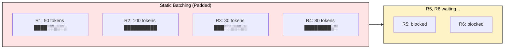
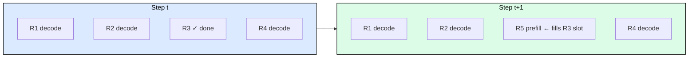
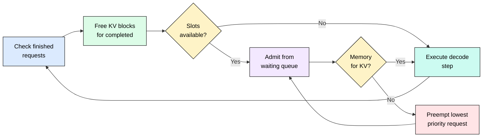
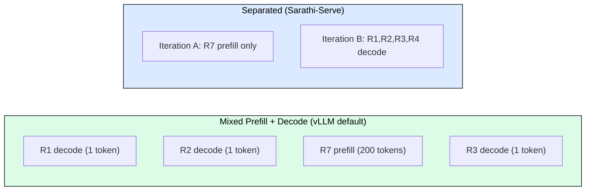

# 4.3 Continuous Batching

[](https://colab.research.google.com/github/harshuljain13/llm-inference-at-scale/blob/master/content/05_optimization/04.3_continuous_batching/lab.ipynb)
[](https://molab.marimo.io/github/harshuljain13/llm-inference-at-scale/blob/master/content/05_optimization/04.3_continuous_batching/lab.ipynb)

Continuous batching enables 3-5x GPU utilization improvement over static batching. First introduced as "iteration-level scheduling" in ORCA (Yu et al., OSDI 2022), it is the single most impactful scheduling optimization in modern inference engines. Every production serving system (vLLM, SGLang, TGI, TensorRT-LLM) uses it by default.

## Why Static Batching Fails

Static batching groups requests into fixed-size batches and processes each batch until the longest sequence finishes. Shorter sequences sit idle, wasting GPU cycles.



The problems compound: (1) short requests pad to the longest sequence length, (2) new arrivals wait for the entire batch to finish, (3) GPU utilization drops as requests complete at different times. With typical output length variance (16 to 512 tokens), static batching wastes 40-70% of GPU capacity.

## How Continuous Batching Works

Continuous batching makes scheduling decisions at every decode iteration, not per batch. When a request finishes, its slot is immediately filled by the next waiting request.



The scheduler runs a tight loop: (1) evict finished requests, (2) admit waiting requests into freed slots, (3) execute one decode step for all active requests. This keeps GPU slots near 100% occupied.

## The Scheduler Decision Loop

At each iteration, the scheduler balances three constraints: maximum batch size (concurrency), maximum batch tokens (memory), and available KV cache blocks.



When KV cache memory is exhausted, the scheduler must preempt: it evicts the lowest-priority request (typically longest-running or lowest-priority tier), frees its KV blocks, and re-queues it for later recomputation. vLLM supports two preemption policies: swap (move KV to CPU) and recompute (discard and re-prefill later).

## Preemption and Priority

Preemption is what separates a production scheduler from a toy implementation. Under memory pressure, the scheduler must choose which request to pause:

- **FCFS (default)**: newest request gets preempted first (preserves fairness for early arrivals)
- **Priority tiers**: requests carry explicit priority levels; low-priority requests preempt first
- **Longest-output**: request with most tokens generated gets preempted (controversial: penalizes long outputs)

After preemption, the request either resumes from swapped KV cache (fast, costs CPU memory) or re-prefills from scratch (slow, costs no CPU memory). vLLM auto-selects based on available CPU swap space.

## Batch Filling: Prefill vs Decode Mixing

A key design choice: should the scheduler mix prefill operations (new requests) with decode operations (ongoing generation) in the same iteration?



Mixed batching maximizes utilization but introduces interference: a large prefill can spike ITL for co-scheduled decode requests. Chunked prefill (splitting large prefills into smaller pieces interleaved with decode steps) is the standard mitigation, enabled by default in vLLM V1.

## Quantitative Impact

Across standard benchmarks (ShareGPT traces, variable output lengths):

| Metric | Static Batching | Continuous Batching | Improvement |
|--------|----------------|--------------------:|:-----------:|
| GPU utilization | 30-45% | 85-98% | 2-3x |
| Throughput (tok/s) | baseline | 2.5-5x baseline | 2.5-5x |
| p99 latency | 3-8x median | 1.3-1.8x median | 60% reduction |
| Max concurrent requests | batch_size | dynamic (memory-limited) | 3-10x |

The improvement scales with output length variance. If all requests generate exactly the same number of tokens, static and continuous batching perform identically. Real workloads always have high variance.

## Configuration in Practice

```python
# vLLM: continuous batching is always on, tune these knobs
vllm serve meta-llama/Llama-3.1-8B-Instruct     --max-num-seqs 256 \           # max concurrent requests in batch
    --max-num-batched-tokens 8192 \ # token budget per iteration
    --enable-chunked-prefill \     # prevent prefill starvation
    --preemption-mode recompute    # or "swap" if CPU RAM available

# SGLang: similar controls
python -m sglang.launch_server     --model meta-llama/Llama-3.1-8B-Instruct     --max-running-requests 256     --chunked-prefill-size 4096
```

Key tuning insight: `max-num-seqs` controls peak memory usage (more sequences = more KV cache). Start with 256, increase until you hit GPU memory limits, then back off 10%.

## FAQ

**Q: Does continuous batching add latency overhead?**
No measurable overhead. The scheduling decision takes microseconds compared to milliseconds for a decode step.

**Q: What happens when a very long request monopolizes a slot?**
It keeps generating until done or preempted. Priority scheduling or max-output-length limits prevent starvation of the queue.

**Q: Is continuous batching the same as dynamic batching in TensorFlow Serving?**
No. TF Serving dynamic batching groups requests at the API layer before inference. Continuous batching operates within the decode loop, at token-generation granularity.

**Q: Can I disable continuous batching?**
In vLLM/SGLang, no (it is fundamental to the architecture). Nor would you want to: there is no scenario where static batching outperforms.

**Q: How does continuous batching interact with speculative decoding?**
They compose well. Speculative tokens are verified in batches, and the scheduler still evicts/admits at each verify step. vLLM handles this transparently.

**Q: What is the relationship between continuous batching and PagedAttention?**
PagedAttention enables efficient memory management that makes continuous batching practical. Without paged allocation, admitting/evicting requests would require expensive memory copies. Together they form the foundation of all modern serving engines.

**Q: Does batch size fluctuate wildly with continuous batching?**
In practice, it stabilizes quickly. Under steady load, requests finish and arrive at similar rates, keeping the batch near capacity. Transient dips happen only during traffic bursts or preemption events.

## References

1. Yu et al. "ORCA: A Distributed Serving System for Transformer-Based Generative Models" (OSDI 2022). Introduced iteration-level scheduling.
2. Kwon et al. "Efficient Memory Management for Large Language Model Serving with PagedAttention" (SOSP 2023). Paged KV cache enabling efficient continuous batching.
3. Agrawal et al. "Sarathi-Serve: Chunked Prefills for Fair and Efficient LLM Serving" (2024). Analyzed prefill-decode interference, proposed chunked prefill.
4. Zhong et al. "Distserve: Disaggregating Prefill and Decoding for Goodput-optimized Large Language Model Serving" (OSDI 2024). Separated prefill/decode for tail latency.
5. vLLM Documentation: Scheduler Architecture. https://docs.vllm.ai/
