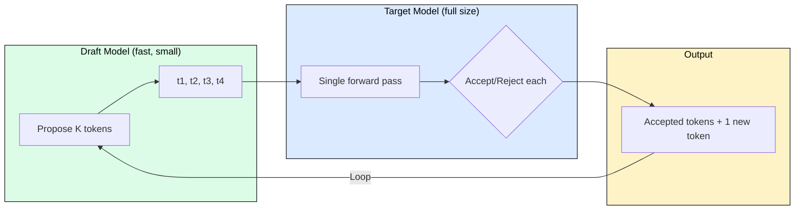
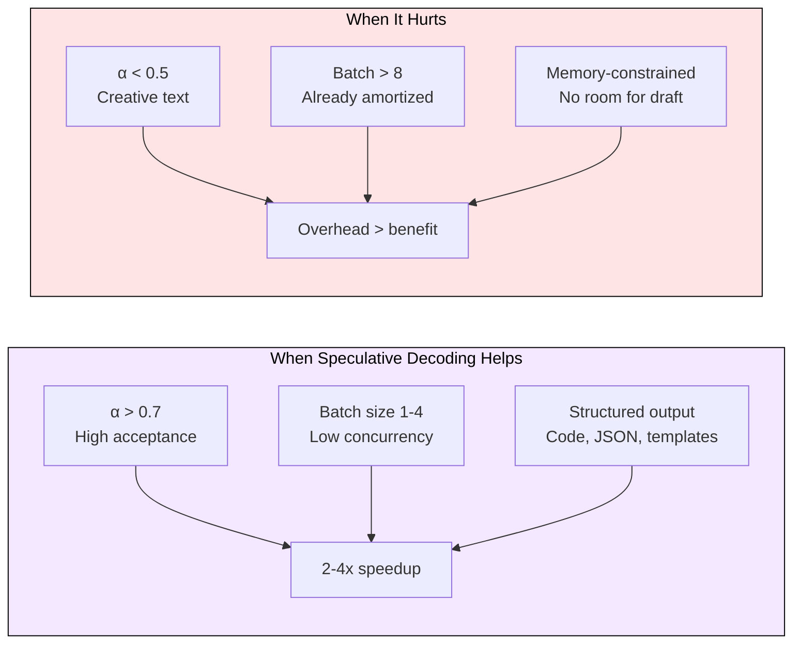
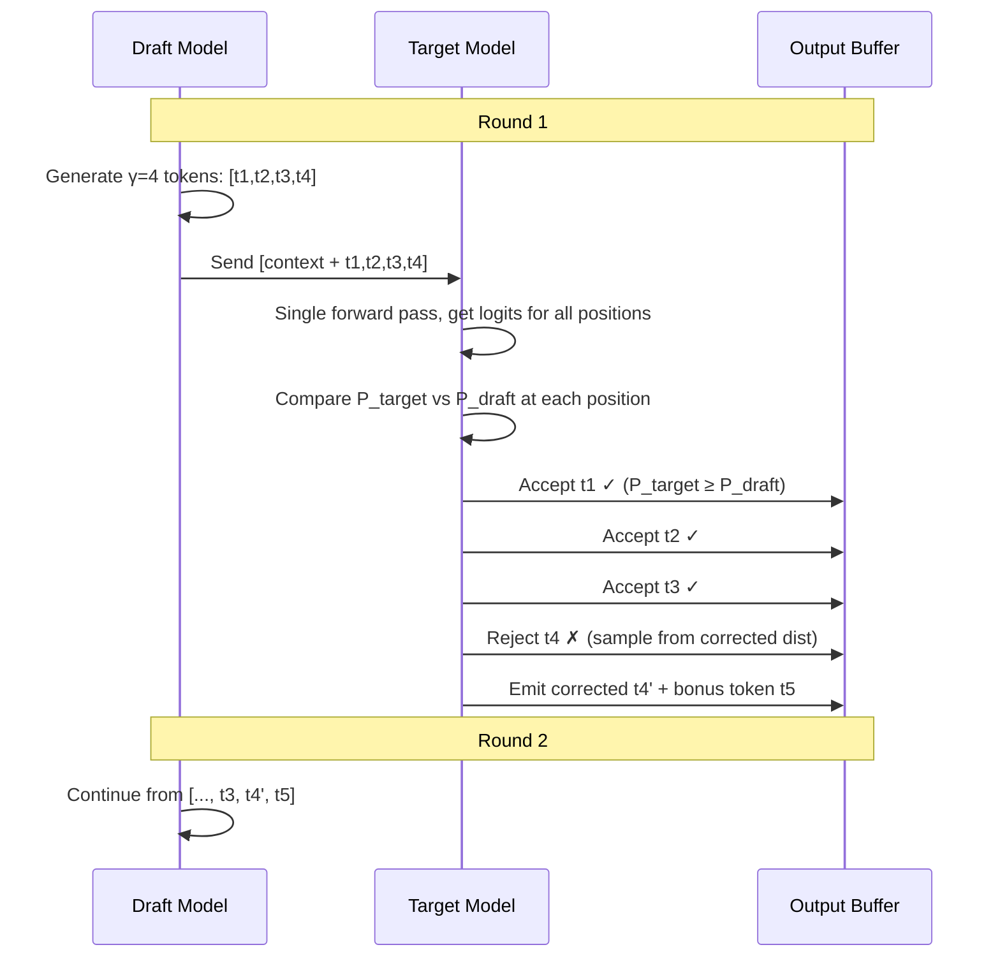

[](https://colab.research.google.com/github/harshuljain13/llm-inference-at-scale/blob/master/content/05_optimization/04.4_speculative_decoding/lab.ipynb)
[](https://molab.marimo.io/github/harshuljain13/llm-inference-at-scale/blob/master/content/05_optimization/04.4_speculative_decoding/lab.ipynb)

# 4.4 Speculative Decoding

Speculative decoding delivers 2-4x latency reduction for autoregressive LLM inference by converting sequential token generation into a draft-then-verify loop. A lightweight draft model proposes multiple tokens cheaply, and the full target model verifies them in a single forward pass. When acceptance rates are high (structured outputs, code, predictable text), this amortizes the expensive weight read across multiple tokens per step.

## Why It Works

Standard autoregressive decoding reads the full model weights (e.g., 16 GB for an 8B model) to produce one token. The GPU is memory-bandwidth-bound: arithmetic intensity is ~1 FLOP/byte. Speculative decoding exploits the fact that verification of K tokens costs the same as generating one token, because the target model runs a single forward pass over all K candidates in parallel.



The key constraint: speculative decoding produces the exact same distribution as standard decoding. Rejected tokens are replaced with a sample from the corrected distribution, guaranteeing mathematical equivalence.

## Acceptance Rate Math

The expected tokens per verification round determines speedup. Let gamma (γ) be the number of draft tokens and α be the per-token acceptance rate:

**Expected accepted tokens per round** = (1 - α^(γ+1)) / (1 - α)

For γ=4, α=0.8: expected = (1 - 0.8^5) / (1 - 0.8) = 0.672 / 0.2 = 3.36 tokens per round.

**Speedup formula** (ignoring draft cost): tokens_per_round / 1 = 3.36x

**With draft overhead** (draft takes fraction c of target time):

Speedup = expected_tokens / (1 + γ * c)

For c=0.1, γ=4, α=0.8: Speedup = 3.36 / (1 + 4*0.1) = 3.36 / 1.4 = 2.4x



## Speculative Decoding Variants

| Variant | Draft Source | Extra Memory | Training Required | Best For |
|---------|-------------|-------------|-------------------|----------|
| Draft model | Smaller LLM (e.g., 8B drafts for 70B) | Yes (draft weights) | No | General use |
| Medusa | Extra prediction heads on target | Minimal | Yes (heads only) | Controlled deployments |
| EAGLE | Feature extrapolation layer | Minimal | Yes | Maximum acceptance rate |
| N-gram | Pattern matching from prompt | None | No | Repetitive content, code |
| Prompt lookup | Copy from input tokens | None | No | Summarization, extraction |

## Draft-Verify Loop in Detail



Each round always produces at least 1 token (the resampled correction), so progress is guaranteed even with 0% acceptance.

## vLLM Configuration

```python
from vllm import LLM

# Draft model approach (most common)
llm = LLM(
    model="meta-llama/Llama-3.1-70B-Instruct",
    speculative_model="meta-llama/Llama-3.1-8B-Instruct",
    num_speculative_tokens=5,
    speculative_draft_tensor_parallel_size=1,
)

# N-gram speculation (zero memory overhead)
llm_ngram = LLM(
    model="meta-llama/Llama-3.1-8B-Instruct",
    speculative_model="[ngram]",
    num_speculative_tokens=5,
    ngram_prompt_lookup_max=4,
)
```

## Interaction with Batching

Speculative decoding and batching both amortize weight reads, making them substitutes rather than complements. At batch=1, speculative decoding gives maximum benefit (2-4x). At batch=32, the weights are already read once for 32 tokens, and the draft overhead yields diminishing returns. The crossover point is typically batch=4-8 depending on model size and acceptance rate.

## FAQ

**Q: Does speculative decoding change the output distribution?**
A: No. The rejection sampling algorithm guarantees the output distribution matches standard autoregressive decoding exactly.

**Q: How do I measure acceptance rate for my workload?**
A: vLLM logs acceptance rate per request. Run a representative sample and check `spec_decode_metrics`. Rates above 0.7 indicate good draft-target alignment.

**Q: Can I use speculative decoding with quantized models?**
A: Yes. The target model can be quantized (INT4/FP8). The draft model is typically small enough to run in FP16 without significant memory pressure.

**Q: What happens if the draft model is too different from the target?**
A: Acceptance rate drops, and each round produces fewer tokens. When acceptance falls below ~0.5, the draft overhead exceeds the benefit and standard decoding is faster.

**Q: Does it work with beam search?**
A: Not directly. Speculative decoding is designed for sampling-based generation. Beam search requires scoring multiple continuations, which conflicts with the single-verification-pass design.

**Q: How many speculative tokens (γ) should I use?**
A: Start with γ=4-5. Higher γ increases potential gain but also increases wasted work on rejection. Optimal γ depends on acceptance rate: high α supports larger γ.

**Q: Why not just use a bigger batch instead?**
A: Batching helps throughput (tokens/second across all requests) but not per-request latency. Speculative decoding reduces individual request latency, which matters for interactive applications.

## References

1. Leviathan et al. "Fast Inference from Transformers via Speculative Decoding" (2022). arXiv:2211.17192.
2. Chen et al. "Accelerating Large Language Model Decoding with Speculative Sampling" (2023). arXiv:2302.01318.
3. Cai et al. "Medusa: Simple LLM Inference Acceleration Framework with Multiple Decoding Heads" (2024). arXiv:2401.10774.
4. Li et al. "EAGLE: Speculative Sampling Requires Rethinking Feature Uncertainty" (2024). arXiv:2401.15077.
5. Sun et al. "SpecInfer: Accelerating Large Language Model Serving with Tree-based Speculative Inference" (2024). arXiv:2305.09781.
6. Stern et al. "Blockwise Parallel Decoding for Deep Autoregressive Models" (2018). NeurIPS.
