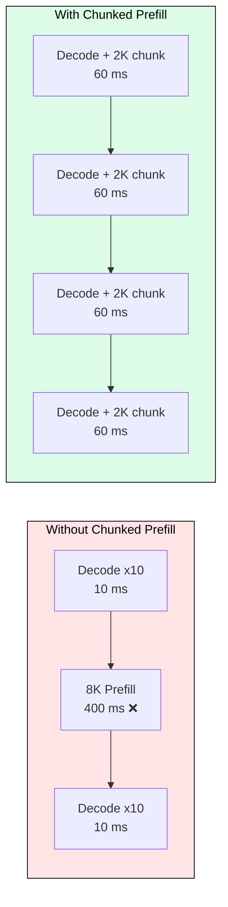
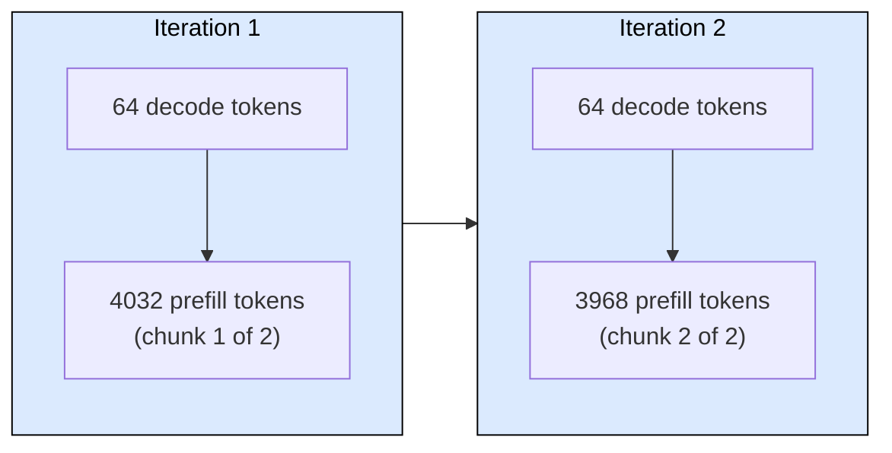
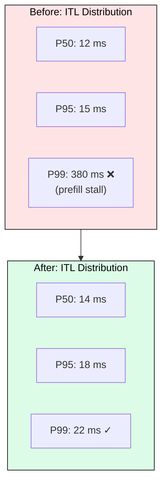

[](https://colab.research.google.com/github/harshuljain13/llm-inference-at-scale/blob/master/content/05_optimization/04.5_chunked_prefill/lab.ipynb) [](https://molab.marimo.io)

# 4.5 Chunked Prefill

Long prompts monopolize the GPU during prefill, freezing token generation for every other request in the batch. Chunked prefill breaks a single large prefill into fixed-size chunks interleaved with decode steps, eliminating head-of-line blocking in continuous batching systems.

## Why Chunked Prefill Exists

In continuous batching, a new request with an 8K-token prompt must run prefill before it can generate. Without chunking, the scheduler dedicates the entire GPU iteration to that prefill. During those 200-400 ms, every request already generating tokens receives zero service. Users see their streams freeze mid-sentence.

The core tradeoff: the new request gets slightly higher TTFT (its prefill is spread across multiple iterations) in exchange for stable, predictable inter-token latency for all existing requests.



In the first case, 10 active requests stall for 400 ms. In the second, decode continues every 60 ms while the new request is prefilled incrementally.

## How It Works

The scheduler enforces a per-iteration token budget (e.g. 4096 tokens). Each iteration can contain:

1. All decode tokens for running requests (1 token each)
2. A chunk of prefill tokens for one or more new requests, filling the remaining budget

If 64 requests are decoding (64 tokens) and the budget is 4096, the scheduler allocates up to 4032 tokens of prefill per iteration. An 8K prompt takes two iterations to complete.



After both chunks complete, the new request joins the decode batch.

## Impact on Latency Distribution

The key benefit is not average latency improvement: it is tail latency elimination. Without chunking, P99 ITL spikes whenever a long prompt arrives. With chunking, ITL stays bounded.



P50 increases slightly (decode shares the iteration with prefill compute) but P99 drops by 15-20x because no single prefill can monopolize the GPU.

## TTFT Tradeoff

Chunked prefill increases TTFT for the new request because its prefill is spread across multiple iterations instead of completing in one burst:

| Prompt Length | TTFT (No Chunking) | TTFT (2K Chunks) | ITL P99 (No Chunking) | ITL P99 (Chunked) |
|---|---|---|---|---|
| 2K tokens | 25 ms | 25 ms | 25 ms | 18 ms |
| 8K tokens | 100 ms | 130 ms | 100 ms | 18 ms |
| 32K tokens | 400 ms | 520 ms | 400 ms | 18 ms |

For interactive applications, bounded ITL matters more than minimal TTFT. A user notices a 400 ms stream freeze far more than a 120 ms delay before the first token.

## Configuration

In vLLM V1, chunked prefill is enabled by default. The key parameter is the per-iteration token budget:

```bash
# Default: balanced for typical chat workloads
python -m vllm.entrypoints.openai.api_server \
    --model meta-llama/Llama-3.1-8B-Instruct \
    --max-num-batched-tokens 4096

# Latency-optimized: smaller chunks, more responsive decode
python -m vllm.entrypoints.openai.api_server \
    --model meta-llama/Llama-3.1-8B-Instruct \
    --max-num-batched-tokens 2048 \
    --max-num-partial-prefills 1

# Throughput-optimized: larger chunks, fewer iterations per prefill
python -m vllm.entrypoints.openai.api_server \
    --model meta-llama/Llama-3.1-8B-Instruct \
    --max-num-batched-tokens 16384 \
    --max-num-partial-prefills 4
```

`max-num-partial-prefills` controls how many requests can be mid-prefill simultaneously. Setting it to 1 gives the tightest ITL bound; higher values improve prefill throughput at the cost of slightly higher decode latency.

## Interaction with Other Optimizations

Chunked prefill composes well with other techniques:

- **Prefix caching**: cached prefix tokens skip prefill entirely, reducing the chunk count needed for new requests
- **Speculative decoding**: decode tokens from speculation still fit in the iteration budget alongside prefill chunks
- **Tensor parallelism**: the token budget is per-GPU; more GPUs means larger effective chunks without ITL impact

It does not interact with quantization (orthogonal memory optimization) or PagedAttention (orthogonal allocation strategy).

## When to Disable Chunked Prefill

Rare cases where disabling helps:

- Offline batch processing with no concurrent decode (no one to stall)
- Extremely short prompts where chunking overhead exceeds benefit
- Latency-insensitive throughput maximization (every ms of TTFT matters less than total tokens/s)

For any interactive serving workload, leave it enabled.

---

## FAQ

**Q: Does chunked prefill reduce total throughput?**
A: Minimally. The same prefill compute happens either way. The overhead is scheduler bookkeeping per iteration, which is microseconds compared to the millisecond-scale GPU work.

**Q: How does chunk size relate to max-num-batched-tokens?**
A: The chunk size is implicitly `max-num-batched-tokens minus decode tokens`. With 64 active sequences and a 4096 budget, each chunk is up to 4032 tokens.

**Q: Can multiple requests prefill simultaneously?**
A: Yes, controlled by `max-num-partial-prefills`. If two 4K requests arrive, they can each get 2K per iteration instead of one getting 4K.

**Q: What happens if a prompt is shorter than one chunk?**
A: It prefills in a single iteration, same as without chunking. No overhead.

**Q: Does this affect model quality?**
A: No. The same attention computation happens regardless of chunking. Results are mathematically identical.

**Q: Is chunked prefill the same as Sarathi-Serve?**
A: Sarathi-Serve (OSDI 2024) introduced the technique. vLLM and SGLang both implement it. The concept is identical; implementations differ in scheduling details.

**Q: How do I monitor if chunked prefill is helping?**
A: Compare P99 ITL with and without `--enable-chunked-prefill`. A drop from hundreds of ms to tens of ms confirms the benefit.

---

## References

1. Agrawal et al. "Taming Throughput-Latency Tradeoff in LLM Inference with Sarathi-Serve" (OSDI 2024)
2. Kwon et al. "Efficient Memory Management for Large Language Model Serving with PagedAttention" (SOSP 2023)
3. vLLM Documentation: Chunked Prefill, https://docs.vllm.ai
4. DeepSpeed-FastGen: "Decomposed Prefill" (2023), similar concept under different name
5. Zhong et al. "DistServe: Disaggregating Prefill and Decoding for Goodput-optimized Large Language Model Serving" (OSDI 2024)
