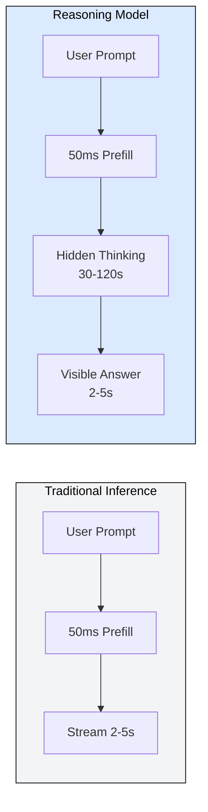
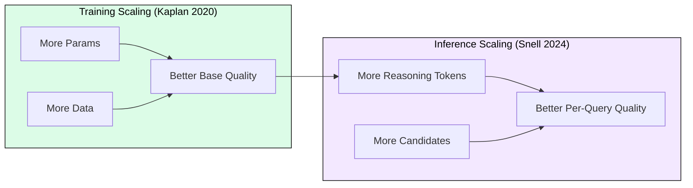
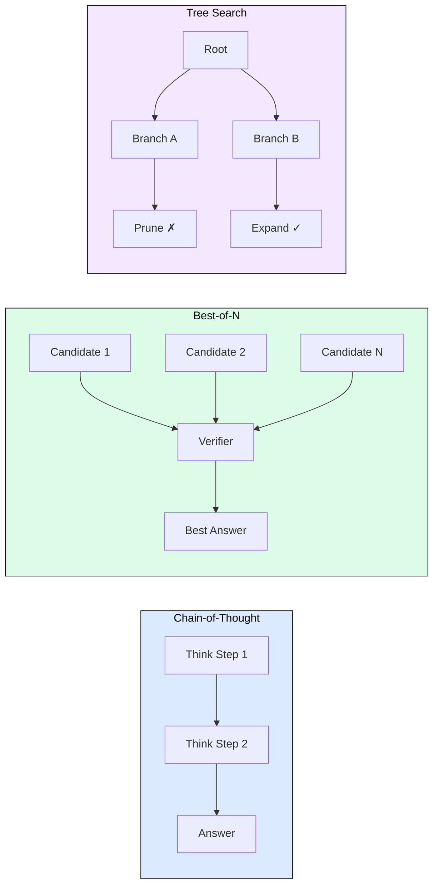
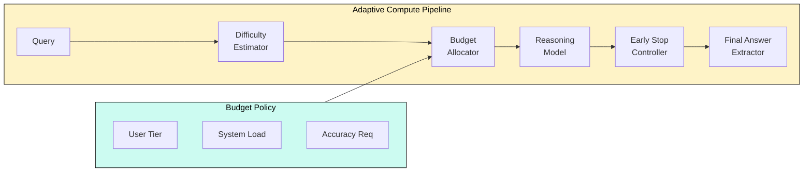
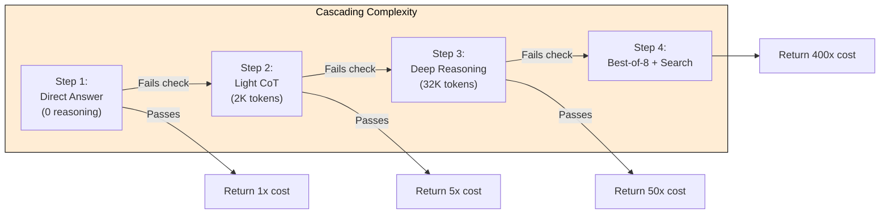

# 4.6 Inference-Time Compute

Every module so far pursued one goal: generate tokens faster. Inference-time compute flips this. Instead of generating fewer tokens faster, we deliberately generate more tokens to produce better answers. The model "thinks" before it responds, exploring solution paths, verifying intermediate steps, and allocating compute as a first-class resource.

This is the mechanism behind OpenAI o1, DeepSeek-R1, and the emerging class of reasoning models. On AIME 2024, GPT-4o scored 13.4% while o1-preview scored 74.4%: same architecture family, 10-100x more inference tokens, dramatically better accuracy.

## Why This Matters for Infrastructure

A traditional request generates 50-500 tokens. A reasoning model generates 5,000-50,000 tokens for the same query, most of them hidden "thinking" tokens. Your KV cache grows proportionally, latency shifts from seconds to minutes, and cost variance per query spans 1000x.

## Test-Time Scaling Laws

Snell et al. (2024) demonstrated a power-law relationship at inference time: for a fixed model, accuracy on hard tasks improves predictably as you spend more inference compute.

Key findings:
1. **Log-linear accuracy scaling** on hard problems when doubling inference tokens
2. **Cross-size equivalence**: a 7B model with 100x inference compute can match a 70B model with 1x inference compute on reasoning tasks
3. **Difficulty-dependent returns**: easy problems gain little from extra compute; hard problems gain enormously

## Four Techniques

### Chain-of-Thought
Generate explicit reasoning steps before the final answer. Token multiplier: 3-20x. Sequential, no parallelism. KV cache grows linearly with reasoning length.

### Best-of-N Sampling
Generate N independent answers, score with a verifier, return the best. Token multiplier: Nx. Embarrassingly parallel. Diminishing returns beyond N=64.

### Tree Search
Explore branching reasoning paths with a value function to prune dead ends. Variable cost (10-1000x). Benefits from prefix KV cache sharing since branches share common prefixes.

### Iterative Refinement
Generate, critique, regenerate. Each iteration adds to context. Sequential, K rounds, context grows with each pass.

## Strategy Selection

| Strategy | Parallelizable | Memory | Best For |
|----------|---------------|--------|----------|
| Chain-of-thought | No | 1x linear | Moderate problems |
| Best-of-N | Yes | Nx independent | Verifiable answers |
| Tree search | Partial | Variable, shared prefixes | Combinatorial/math |
| Iterative refinement | No | Growing context | Writing, code review |
| Cascading complexity | Partial | 1x per attempt | Mixed-difficulty workloads |

## Budget-Aware Inference

The most critical system design question: how much should each query think?

**Tiered budget allocation:**
- Trivial: 0 reasoning tokens (bypass reasoning entirely)
- Easy: 256 tokens
- Medium: 2,048 tokens
- Hard: 16,384 tokens
- Extreme: 65,536+ tokens

**Early exit signals:** confidence patterns in output, entropy drop in next-token distribution, or repetition detection (reasoning loop).

## Cascading Complexity Pattern

Start cheap. Escalate only on failure.

With 70% easy queries, average cost drops to ~8x baseline instead of 50x if all queries get deep reasoning.

## DeepSeek-R1: Reasoning from Pure RL

DeepSeek-R1 (January 2025) showed reasoning capability emerges from reinforcement learning alone (GRPO with accuracy rewards), without supervised chain-of-thought examples. Infrastructure implications:

- **Highly variable reasoning length**: the model learns its own budget allocation, creating bimodal distributions (trivial: 50 tokens, hard: 50,000 tokens)
- **MoE efficiency**: R1 uses 671B total / 37B active per token, making long reasoning cheaper per token than dense models
- **Distillation spectrum**: R1 distills into 1.5B-70B dense models that trade size for reasoning length

## KV Cache Pressure Example

Traditional request (Llama 70B, 8K context, 512 output):
- 80 layers x 8 KV heads x 128 dim x 8,192 tokens x 4 bytes = ~2.6 GB

Reasoning request (32K reasoning + 8K context):
- Same formula at 40,192 tokens = ~12.8 GB (5x per request)

On 80 GB HBM with 35 GB for weights: 17 traditional requests vs. 3 reasoning requests in flight.

## FAQ

**Q: Can speculative decoding and inference-time compute coexist?**
Yes. Speculative decoding accelerates the generation of reasoning tokens. One reduces latency per token, the other deliberately generates more tokens for quality.

**Q: How do you bill for reasoning tokens users never see?**
Token-based billing with reasoning multipliers. The "thinking budget" API pattern exposes `max_reasoning_tokens` as a parameter, giving callers control over cost.

**Q: What prevents a reasoning model from thinking forever?**
Budget controllers set per-request token limits. Early-exit detectors watch for confidence signals or repetition loops. System-level timeouts force answer extraction from partial reasoning.

**Q: When should I use a reasoning model vs. a larger base model?**
Reasoning models win on hard, verifiable problems (math, code, logic). Larger base models win on creative/open-ended tasks and when latency matters more than peak accuracy.

**Q: How does difficulty estimation work in practice?**
Heuristics (query length, math notation presence), small classifiers trained on historical reasoning-length data, or "probe" the first N reasoning tokens to gauge complexity.

## References

1. Snell, C., Lee, J., Xu, K., Kumar, A. (2024). "Scaling LLM Test-Time Compute Optimally can be More Effective than Scaling Model Parameters." arXiv:2408.03314.
2. OpenAI. (2024). "Learning to Reason with LLMs." OpenAI Blog.
3. DeepSeek-AI. (2025). "DeepSeek-R1: Incentivizing Reasoning Capability in LLMs via Reinforcement Learning." arXiv:2501.12948.
4. Wei, J., et al. (2022). "Chain-of-Thought Prompting Elicits Reasoning in Large Language Models." NeurIPS 2022. arXiv:2201.11903.
5. Wang, X., et al. (2023). "Self-Consistency Improves Chain of Thought Reasoning." ICLR 2023. arXiv:2203.11171.
6. Lightman, H., et al. (2024). "Let's Verify Step by Step." ICLR 2024. arXiv:2305.20050.
7. Kaplan, J., et al. (2020). "Scaling Laws for Neural Language Models." arXiv:2001.08361.
