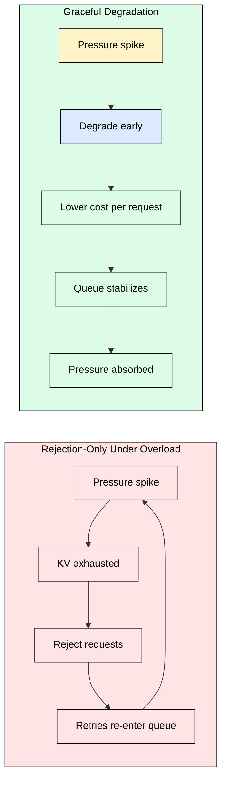
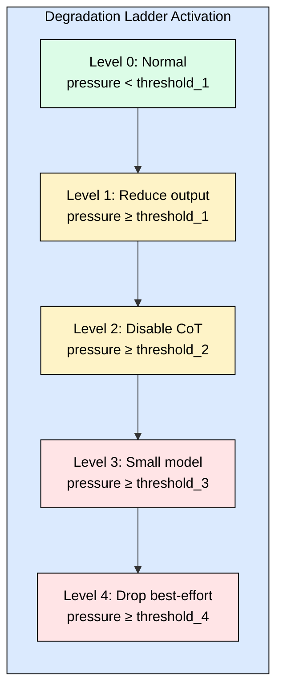
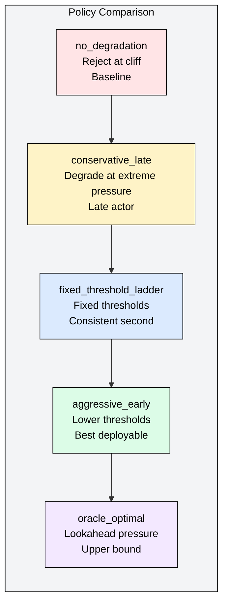
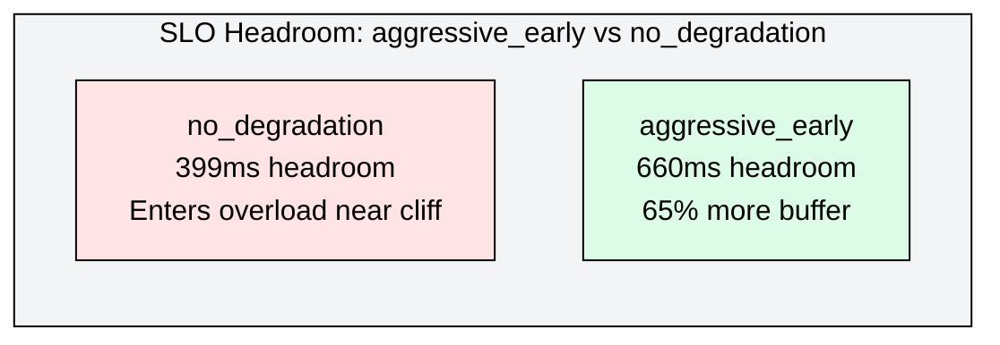
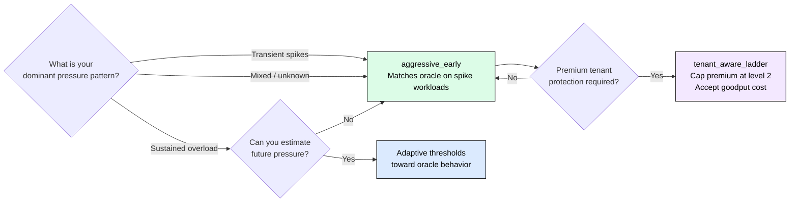

# 4.7 Graceful Degradation Under Serving Pressure

[](https://colab.research.google.com/github/harshuljain13/llm-inference-at-scale/blob/master/content/05_optimization/04.7_graceful_degradation/lab.ipynb)
[](https://molab.marimo.io/github/harshuljain13/llm-inference-at-scale/blob/master/content/05_optimization/04.7_graceful_degradation/lab.ipynb)

Aggressive early degradation outperforms rejection-only policies by 16-38% in
composite serving score across all workload types. The gap is never a near-tie.
This module covers why waiting for extreme pressure before degrading is the wrong
default, which degradation ladder to implement, and when oracle-level lookahead
stops mattering.

## The Problem With Rejection as the First Response

Continuous batching (Module 4.3) keeps GPU slots occupied under normal load.
Under overload, the scheduler runs out of KV memory and must make a harder
choice: preempt an active request or reject the incoming one.

Most production systems default to rejection. A request arrives, KV budget is
exhausted, the system returns a 429. The user retries. The retry joins the back
of the queue. The queue grows. The pressure increases. More rejections follow.

The cascade is self-reinforcing: rejection does not reduce load, it redistributes
it. Retried requests re-enter the system and amplify the pressure that caused
rejections in the first place.

Graceful degradation breaks this cycle by reducing per-request service cost
before the queue builds. A request served at reduced quality consumes less KV
memory, less compute, and less output budget than a fully-served request. The
system absorbs more traffic at lower cost per request instead of rejecting traffic
at full cost per refusal.



## The Degradation Ladder

A degradation ladder defines an ordered sequence of service reductions, each
activated at a higher pressure threshold than the previous. The design principle
is minimum quality impact at each level: the system takes the cheapest action
available before taking a more expensive one.

| Level | Action | Cost reduction | Quality impact |
|---|---|---|---|
| 0 | Normal service (full model, full output, CoT) | Baseline | None |
| 1 | Reduce output budget (512 → 256 tokens) | ~35% | Low — user gets shorter response |
| 2 | Disable chain-of-thought | ~45% | Moderate — reasoning quality drops |
| 3 | Downgrade to small model (7B → 1.5B) | ~75% | Significant — capability reduction |
| 4 | Selective drop of best-effort requests | 100% for dropped | Full — best-effort requests rejected |

Level 4 is still rejection, but selective: it protects premium and standard tenants
by absorbing excess load from the lowest-priority tier first. The ladder converts
binary rejection into a continuous spectrum of service reduction.



## Degradation Policies: Which Threshold Strategy Wins

The ladder structure is fixed. What varies across policies is when each level
activates. Six policies were evaluated across five workload regimes: steady
moderate, ramp to overload, spike then recover, sustained overload, and
premium-heavy. Source benchmark:
[github.com/JohnScheuer/graceful-degradation-bench](https://github.com/JohnScheuer/graceful-degradation-bench)

**no_degradation**: reject when over capacity. Baseline. Accumulates the
retry cascade described above.

**conservative_late**: engage degradation only at extreme pressure. Preserves
quality for longer but allows queue buildup before acting. Pays for delay with
a larger rejection spike when thresholds finally trigger.

**fixed_threshold_ladder**: fixed pressure thresholds per level. Consistent
behavior regardless of workload shape. Strong second-place across most workloads.

**aggressive_early**: lower thresholds per level — acts before the pressure
cliff rather than after. The central hypothesis is that earlier degradation
prevents queue buildup that later policies cannot recover from.

**tenant_aware_ladder**: same as fixed threshold but caps premium tenants at
level 2, protecting them from model downgrade. Sacrifices overall goodput to
preserve premium quality.

**oracle_optimal**: uses future pressure knowledge to calibrate degradation depth.
Theoretical upper bound. Not deployable.



## Empirical Results

### Finding 1: Aggressive early degradation is the best deployable policy

**aggressive_early** outperforms rejection-only by 16-38% in composite serving
score across all five workload regimes. The gap versus **fixed_threshold_ladder**
(the next best deployable policy) is 3-8 points and never a near-tie. Early
degradation is robustly better, not just marginally better in edge cases.

| Policy | vs no_degradation | vs fixed_threshold | Rank |
|---|---|---|---|
| aggressive_early | +16-38% | +3-8 pts | 1st (deployable) |
| fixed_threshold_ladder | +10-28% | baseline | 2nd |
| conservative_late | +4-12% | −6 pts | 3rd |
| no_degradation | baseline | −10-28% | 4th |
| tenant_aware_ladder | below fixed | −4 pts | 3rd-4th |
| oracle_optimal | +20-42% | +5-12 pts | 1st (undeployable) |

### Finding 2: Oracle advantage is workload-dependent

**oracle_optimal** wins convincingly under sustained overload and premium-heavy
workloads, where future pressure is predictable and lookahead lets the oracle
calibrate degradation depth more precisely. Under transient pressure — ramp to
overload and spike then recover — **aggressive_early** matches or beats oracle.

The practical implication: if your dominant failure mode is sustained overload,
the gap between oracle and aggressive_early is real and worth engineering toward
adaptive threshold estimation. If your dominant failure mode is transient spikes,
aggressive_early already achieves near-oracle performance without lookahead.

### Finding 3: Graceful degradation creates SLO headroom

**aggressive_early** provides 65% more premium SLO margin than **no_degradation**:
660ms versus 399ms of headroom before SLO breach. Degrading early converts
pressure into buffer rather than violations. The system enters the overload period
with slack instead of entering it at the edge of SLO compliance.



### Finding 4: Quality-adjusted goodput is the right metric

Raw goodput overrates policies that serve many requests at severely degraded
quality. A policy that serves 95% of requests at level 3 (small model) looks
better than one that serves 85% at level 1 (output reduction) under raw goodput.
Quality-adjusted goodput (goodput × average quality) correctly ranks the latter
higher: more requests at lower degradation cost is better than more requests at
higher degradation cost.

When evaluating policies, track both. If they disagree, quality-adjusted goodput
is the more honest signal.

### Finding 5: Tenant-aware degradation sacrifices overall goodput

**tenant_aware_ladder** protects premium tenants from model downgrade (caps them
at level 2) but consistently underperforms **fixed_threshold_ladder** in overall
composite score. Protecting premium tenants from level 3 uses more capacity that
could otherwise serve additional standard requests. This is a design choice, not a
bug — but it should be made deliberately, not by default.

## Implementing the Pressure Signal

Policies compare a pressure measurement to their thresholds. A robust pressure
signal combines KV memory, batch capacity, and queue depth:

```python
def compute_pressure(
    kv_used_bytes: float,
    kv_budget_bytes: float,
    active_requests: int,
    max_batch_size: int,
    queued_requests: int,
) -> float:
    kv_frac    = kv_used_bytes / kv_budget_bytes
    batch_frac = active_requests / max_batch_size
    queue_frac = queued_requests / max_batch_size

    return max(kv_frac, batch_frac) + 0.15 * queue_frac
```

The `max(kv_frac, batch_frac)` term ensures either KV exhaustion or batch
saturation alone can trigger degradation. The `queue_frac` term adds leading
sensitivity: a growing queue signals incoming pressure before KV or batch
capacity is actually exhausted.

## Threshold Configuration

**aggressive_early** uses lower activation thresholds than **fixed_threshold_ladder**.
A practical starting configuration:

```python
# aggressive_early thresholds (tune to your workload)
THRESHOLDS = {
    "level_1_output_reduction": 0.55,   # act early
    "level_2_disable_cot":      0.68,
    "level_3_model_downgrade":  0.78,
    "level_4_selective_drop":   0.90,
}

# fixed_threshold_ladder thresholds (conservative reference)
THRESHOLDS_FIXED = {
    "level_1_output_reduction": 0.70,
    "level_2_disable_cot":      0.80,
    "level_3_model_downgrade":  0.88,
    "level_4_selective_drop":   0.95,
}

def select_degradation_level(pressure: float, thresholds: dict) -> int:
    if pressure >= thresholds["level_4_selective_drop"]:
        return 4
    elif pressure >= thresholds["level_3_model_downgrade"]:
        return 3
    elif pressure >= thresholds["level_2_disable_cot"]:
        return 2
    elif pressure >= thresholds["level_1_output_reduction"]:
        return 1
    return 0
```

Start with aggressive_early thresholds. If quality-adjusted goodput drops below
acceptable levels in light-pressure periods (false-positive degradation), raise
threshold_1 toward 0.65. If queue buildup still appears before degradation
triggers, lower threshold_1 toward 0.50.

## Decision Framework



## Limitations

This module is based on a calibrated simulation benchmark. It does not run real
LLM inference. Key limitations before applying these findings:

**Synthetic arrival distributions.** Workload regimes use parameterized pressure
curves. Real traffic has burstiness patterns — diurnal cycles, viral spikes, retry
storms — that may differ from the modeled shapes.

**Proxy quality model.** Quality scores are calibrated proxies, not measured task
accuracy. Results indicate relative ordering of quality cost across policies, not
exact accuracy delta for a specific task or model pair.

**Two model profiles only.** The benchmark uses a 7B and a 1.5B model. The quality
gap between levels 0 and 3 depends heavily on the specific model pair chosen. A
smaller gap (e.g., 8B to 3B) makes level 3 more acceptable; a larger gap makes
tenant-aware protection more compelling.

**No preemption or work-stealing.** The benchmark does not model KV preemption
(covered in Module 4.3). Real systems may preempt before degradation triggers,
depending on scheduler priority configuration.

## FAQ

**Q: How does this interact with continuous batching from Module 4.3?**
Directly. Continuous batching manages slot occupancy and KV allocation per
iteration. Graceful degradation sets the policy for what to do when slot demand
exceeds supply. They operate on the same pressure signal: KV utilization and
batch occupancy. Degradation reduces per-request cost, which directly helps the
continuous batching scheduler maintain throughput without preemption.

**Q: Should I implement all four degradation levels?**
Start with levels 1 and 2 (output reduction and CoT disabling). They cover most
pressure regimes with low implementation complexity and modest quality impact.
Level 3 (model downgrade) requires routing infrastructure and a second model
loaded in memory. Level 4 (selective drop) requires tenant classification. Add
levels 3 and 4 only when levels 1-2 are insufficient for your peak load.

**Q: What if my model does not use chain-of-thought?**
Skip level 2. Collapse the ladder to three levels: output reduction, model
downgrade, selective drop. Adjust thresholds accordingly.

**Q: How do I detect false-positive degradation (degrading when not necessary)?**
Track degradation level distribution during known low-pressure periods. If level
1 activates more than 5% of the time during off-peak hours, threshold_1 is too
low. Raise it in 0.05 increments until off-peak degradation is near zero.

**Q: Does aggressive_early hurt quality during normal load?**
In the benchmark, no. Threshold_1 at 0.55 pressure is still above typical
steady-state operating pressure. The aggressive label refers to acting earlier
than fixed_threshold relative to the cliff, not acting during normal conditions.
Validate your operating pressure distribution before setting thresholds.

**Q: How does this relate to autoscaling?**
They operate on different time scales. Autoscaling responds in 5-60 seconds
(instance provisioning). Graceful degradation responds in milliseconds (per
request decision). Use degradation to absorb spikes that autoscaling cannot
respond to in time. Use autoscaling to bring capacity in line with sustained
demand. They are complementary, not alternatives.

## References

1. De Souza, J.F. "Graceful Degradation Bench." 2026.
   [github.com/JohnScheuer/graceful-degradation-bench](https://github.com/JohnScheuer/graceful-degradation-bench)

2. Yu, G. et al. "Orca: A Distributed Serving System for Transformer-Based
   Generative Models." OSDI 2022.

3. Kwon, W. et al. "Efficient Memory Management for Large Language Model Serving
   with PagedAttention." SOSP 2023.

4. Agrawal, A. et al. "Sarathi-Serve: Chunked Prefills for Fair and Efficient
   LLM Serving." 2024.

5. Zhong, Y. et al. "DistServe: Disaggregating Prefill and Decoding for
   Goodput-optimized Large Language Model Serving." OSDI 2024.
