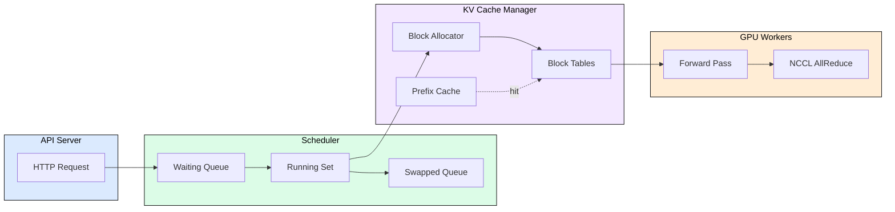
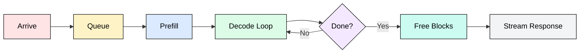
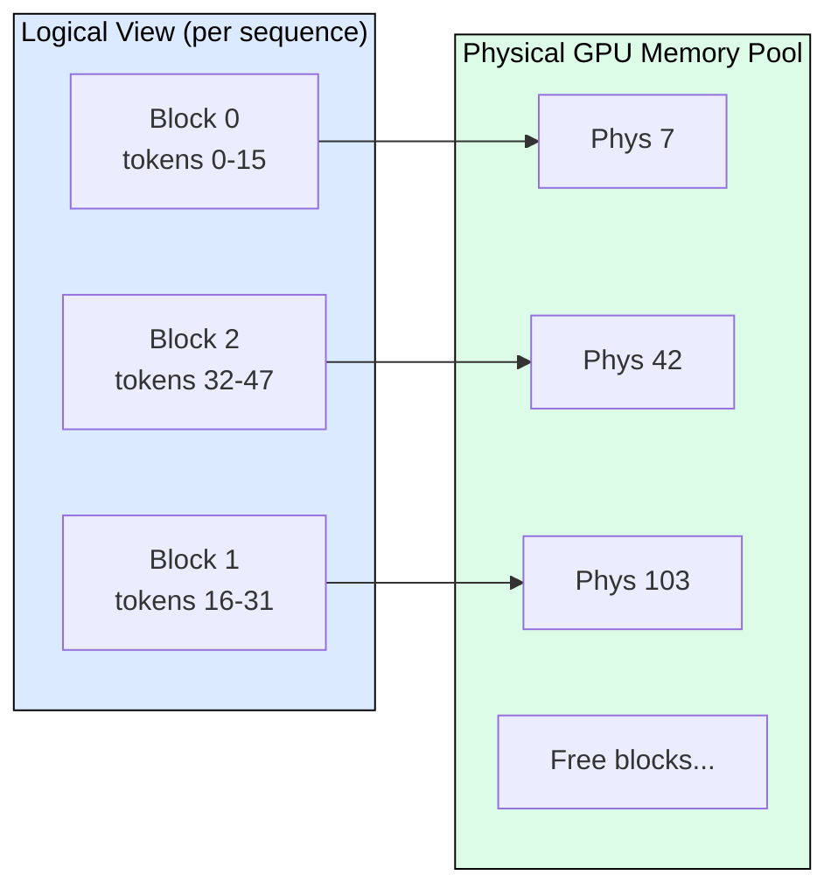
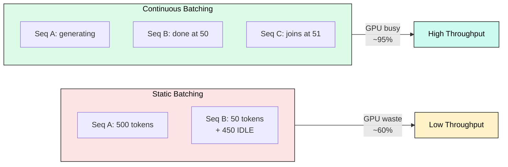

# 5.1 vLLM

vLLM achieves 24x throughput improvement over naive HuggingFace generation by combining PagedAttention, continuous batching, and iteration-level scheduling into a single production-grade serving system. Built at UC Berkeley (SOSP 2023), it is the most widely deployed open-source inference engine, supporting 50+ model architectures with a one-command deployment path.

---

## Why vLLM Wins

The throughput gap comes from three compounding innovations:

1. **PagedAttention** eliminates KV cache fragmentation, enabling near-100% memory utilization vs 20-40% in naive systems
2. **Continuous batching** keeps the GPU productive every iteration instead of waiting for the longest sequence
3. **Automatic Prefix Caching** avoids redundant prefill computation when prompts share common prefixes

Together these allow a single A100 to serve 230+ concurrent sequences at 2048 tokens each, compared to 8-16 with static batching.

---

## Architecture

vLLM separates concerns into four components communicating through well-defined interfaces.

**Scheduler** operates at iteration granularity. Every forward pass (~20ms), it decides which sequences join the batch, which complete, and which get preempted. Three queues: waiting (new), running (active), swapped (preempted to CPU).

**KV Cache Manager** implements PagedAttention's block allocation. Fixed-size blocks (16 tokens default) are allocated on demand, freed immediately on completion, and shared via copy-on-write for beam search.

**GPU Workers** execute model forward passes. In tensor-parallel mode, multiple workers coordinate via NCCL. Workers are stateless from the scheduler's view.

**Tokenizer** runs async on CPU, overlapped with GPU compute to avoid bottlenecks at high request rates.

---

## Request Lifecycle

1. Request arrives and joins the waiting queue with metadata (priority, max tokens, sampling params)
2. Scheduler allocates KV cache blocks for the prompt length
3. Worker processes all prompt tokens in one forward pass (prefill), populating KV cache
4. Each iteration: scheduler includes this sequence in the batch, worker generates one token, allocates a new block every 16 tokens
5. On stop condition (EOS, max length): free all blocks immediately, stream final output

The GPU never idles waiting for a batch to complete because new prefills inject between decode steps.

---

## PagedAttention Memory Model

Blocks are non-contiguous in physical memory. The PagedAttention CUDA kernel uses a block table as indirection: instead of reading K/V from `seq_id * max_len`, it gathers from scattered physical blocks. Waste is bounded to one partial block per sequence (average 8 tokens).

**Memory calculation** for Llama 3.1 8B FP16, 16-token blocks, A100-80GB:
- Model weights: ~16 GB
- Per block: 16 tokens x 2 (K+V) x 32 layers x 128 dim x 8 KV heads x 2 bytes = 2.1 MB
- Available blocks: ~29,500 = ~472K tokens of KV capacity

**Copy-on-Write** shares blocks across beam search candidates. Only divergent blocks get copied, saving 69% memory for beam width 4.

**Automatic Prefix Caching** hashes token content per block. Matching prefixes reuse existing KV cache, eliminating redundant prefill. Chat with fixed system prompt achieves 95%+ cache hit rate.

---

## Continuous Batching and Scheduling

**Iteration-level decisions** (every ~20ms): remove completed sequences, free blocks, schedule waiting requests if blocks available, preempt lowest-priority if memory exhausted.

**Preemption modes**: Recompute (discard KV, re-prefill later, best for short prompts <512 tokens) or Swap (copy KV to CPU via PCIe, restore later, best for long prompts).

**Chunked prefill** splits long prompts into 512-token chunks interleaved with decode steps. Tradeoff: individual TTFT increases but all other sequences maintain consistent inter-token latency. Enable with `--enable-chunked-prefill`.

---

## Configuration Quick Reference

| Parameter | Default | Throughput | Latency |
|-----------|---------|-----------|---------|
| `--max-num-seqs` | 256 | 512+ | 8-32 |
| `--gpu-memory-utilization` | 0.90 | 0.93-0.95 | 0.80-0.85 |
| `--enable-chunked-prefill` | off | on | off |
| `--enable-prefix-caching` | off | on (if shared prefixes) | off |
| `--enforce-eager` | off | off | on (debug) |
| `--max-model-len` | model max | set to actual max needed | same |

**Throughput scaling** (Llama 8B, A100-80GB, output 256 tokens):
- 16 seqs: ~800 tok/s (15% GPU util)
- 128 seqs: ~4,800 tok/s (70% GPU util)
- 256 seqs: ~7,500 tok/s (88% GPU util)
- 512 seqs: ~9,000 tok/s (93%, diminishing returns)

---

## When to Choose vLLM

**Choose vLLM when**: widest model support needed (50+ architectures), production stability required, multi-LoRA serving, general-purpose workloads, operational simplicity (`pip install vllm && vllm serve model`).

**Choose alternatives when**: maximum NVIDIA throughput critical (TensorRT-LLM, +20-40%), complex prefix patterns (SGLang RadixAttention), edge/CPU deployment (llama.cpp), disaggregated prefill/decode (Splitwise, Mooncake).

---

## FAQ

**Q: How does vLLM compare to HuggingFace generate()?**
A: HuggingFace uses static batching with contiguous KV allocation. vLLM's continuous batching + PagedAttention delivers 10-24x throughput at high concurrency by eliminating idle GPU cycles and memory fragmentation.

**Q: When should I enable prefix caching?**
A: Always for chat applications with system prompts (95%+ hit rate). Skip for workloads where every prompt is unique (0% reuse, overhead from hash computation).

**Q: What causes preemption and how do I reduce it?**
A: Preemption occurs when GPU KV cache blocks are exhausted. Reduce `--max-model-len` to actual needs, increase `--gpu-memory-utilization`, or scale horizontally.

**Q: Does PagedAttention add latency overhead?**
A: ~3-5% on decode (scattered block reads). Prefill uses FlashAttention on contiguous data, so zero overhead where it matters most.

**Q: How do I serve multiple fine-tuned models?**
A: Use `--enable-lora --lora-modules name1=path1 name2=path2`. ~100-150 MB per adapter vs 16 GB base model. Requests specify adapter via the `model` field.

**Q: What quantization should I use?**
A: H100: FP8 (native, no pre-quantization). A100: AWQ with Marlin kernels (best 4-bit decode). A10G/L40S: AWQ (fits larger models on smaller GPUs).

---

## References

1. Kwon, W. et al. (2023). "Efficient Memory Management for Large Language Model Serving with PagedAttention." SOSP 2023.
2. Yu, G. et al. (2022). "Orca: A Distributed Serving System for Transformer-Based Generative Models." OSDI 2022.
3. Agrawal, A. et al. (2024). "Taming Throughput-Latency Tradeoff in LLM Inference with Sarathi-Serve." OSDI 2024.
4. vLLM Documentation. https://docs.vllm.ai/
5. vLLM GitHub. https://github.com/vllm-project/vllm
