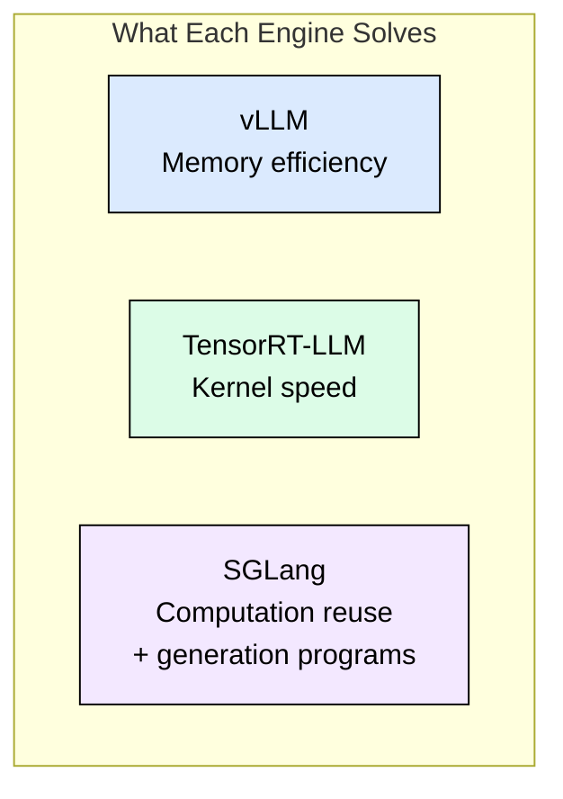
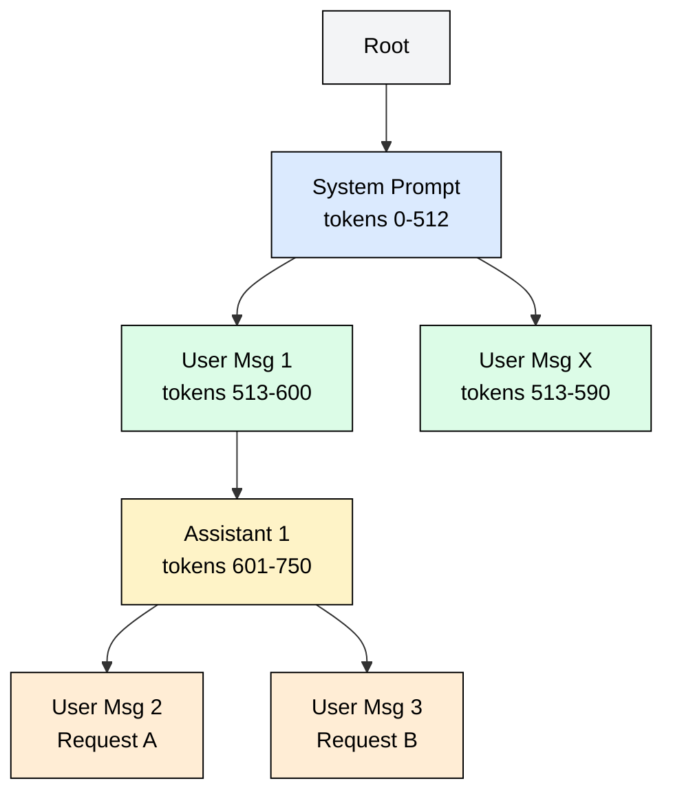
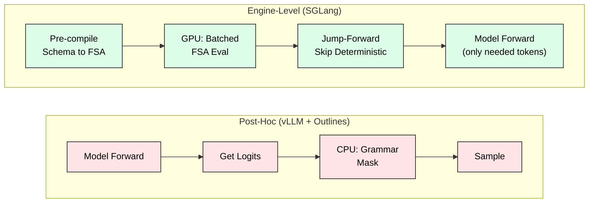
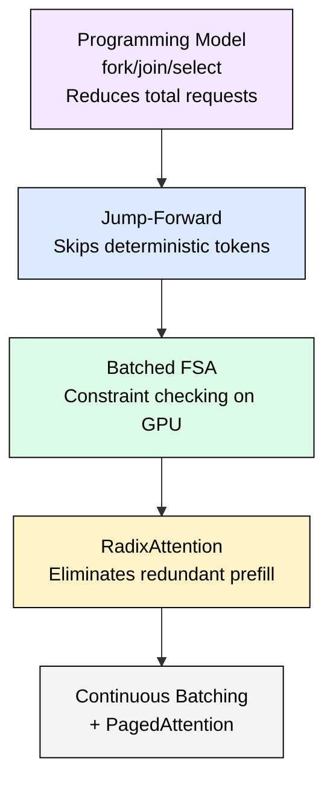

# 5.2 SGLang

[](https://colab.research.google.com/github/harshuljain13/llm-inference-at-scale/blob/master/content/06_engines/05.2_sglang/lab.ipynb)
[](https://molab.marimo.io/github/harshuljain13/llm-inference-at-scale/blob/master/content/06_engines/05.2_sglang/lab.ipynb)

SGLang's RadixAttention enables 5x better prefix cache hit rates than hash-based approaches, while its engine-level structured generation skips 60-75% of decode steps for JSON workloads through jump-forward optimization. Built at UC Berkeley by the co-creator of vLLM, SGLang treats LLM inference as a programmable computation rather than a request/response API.

## Why SGLang Exists

vLLM solved GPU memory management. TensorRT-LLM solved kernel performance. Neither solved the programming problem: expressing complex generation patterns (constrained JSON, multi-step reasoning, parallel tool calls) without fighting the serving layer.

SGLang combines two innovations:
1. **RadixAttention**: a tree-based KV cache sharing prefixes across arbitrary request patterns
2. **Native structured generation**: constrained decoding integrated at the scheduling layer, not bolted on as post-processing

The result: 5-10x throughput on structured output workloads, 2-3x on prefix-heavy workloads like RAG and multi-turn chat.



## RadixAttention: Tree-Based KV Cache

Hash-based prefix caching (vLLM APC) hashes fixed-size token blocks and reuses matching entries. This fails when: (1) branches diverge mid-block, (2) partial block matches occur, (3) cross-request prefixes don't align to block boundaries.

RadixAttention organizes the KV cache as a radix tree where each edge represents a token sequence and each node stores KV tensors. New requests traverse the tree to find the longest matching prefix in O(log n) time.



Key advantages over hash-based APC:
- **Variable-length sharing**: matches at any token boundary, not fixed block multiples
- **O(log n) lookup**: single tree traversal vs O(k) hash lookups per block
- **Tree-aware eviction**: leaf nodes evicted first, shared prefixes preserved
- **Cache-aware scheduling**: prioritizes requests whose prefixes are already hot

| Dimension | vLLM APC | SGLang RadixAttention |
|-----------|----------|----------------------|
| Data structure | Hash table (block-level) | Radix tree (token-level) |
| Match granularity | Fixed 16-token blocks | Variable length |
| Lookup complexity | O(k) per block | O(log n) traversal |
| Branching support | Limited | Native (branches share parent) |
| Eviction policy | Flat LRU | Tree-aware (leaves first) |

### Quantitative Impact

For a RAG system with 100 concurrent users, 400-token system prompt, 3 retrieved docs (600 tokens each), 60% document overlap:

| Approach | Prefill tokens per batch | Reduction |
|----------|--------------------------|-----------|
| No caching | 225,000 | baseline |
| vLLM APC | 125,000 | 44% |
| RadixAttention | 65,000 | 71% |

The 71% reduction translates to 3.5x throughput, 60% lower TTFT, and 40% less KV cache memory.

## Structured Generation at the Engine Level

Most frameworks implement constrained decoding as post-hoc logit masking: generate logits, then zero out invalid tokens. This is slow because grammar evaluation runs on CPU per token (1-5ms overhead), cannot batch across requests, and the scheduler cannot predict masked tokens.

SGLang integrates constraints into the engine core:



### Jump-Forward Optimization

For JSON with schema `{"name": string, "age": integer}`, most tokens are deterministic (braces, quotes, field names, colons). Only the actual values require model inference. Jump-forward skips all deterministic tokens in one step, reducing decode iterations by 60-75%.

| Workload | Post-hoc (tok/s) | SGLang (tok/s) | Speedup |
|----------|-----------------|----------------|---------|
| Simple JSON (5 fields) | 850 | 4,200 | 4.9x |
| Nested JSON (3 levels) | 620 | 3,800 | 6.1x |
| Complex regex | 740 | 5,100 | 6.9x |
| Tool call (fn + args) | 690 | 4,800 | 7.0x |

*Benchmarks from arXiv 2312.07104, Llama-2 7B, A100 80GB, batch size 32.*

## The SGLang Programming Model

SGLang exposes generation programs (not just request/response). Multiple generation calls, control flow, and constraints compose into a single optimizable unit:

```python
@sgl.function
def react_agent(s, task, tools):
    s += f"Task: {task}\nTools: {tools}\n"
    s += "Thought: " + sgl.gen("thought", max_tokens=150)
    s += "\nAction: " + sgl.select("action", choices=tools + ["finish"])
    s += "\nInput: " + sgl.gen("input", regex=r'\{[^}]+\}')
```

Key primitives:
- **gen**: generate with optional regex/JSON constraints
- **select**: efficient classification via log-probability comparison (O(1) vs O(N*L) decode)
- **fork/join**: parallel branches sharing parent KV cache via RadixAttention

Fork/join memory savings for Llama-3 70B with 2000-token prefix, 3 branches of 100 tokens: 7.5 GB without sharing vs 2.9 GB with RadixAttention (61% reduction).

## Performance Stack



Each layer multiplies the effect below it. The compound advantage grows with workload complexity.

## Deployment

```bash
pip install "sglang[all]"
python -m sglang.launch_server \
    --model-path meta-llama/Meta-Llama-3-8B-Instruct \
    --tp 4 --schedule-policy lpm --mem-fraction-static 0.85
```

The `--schedule-policy lpm` (Longest Prefix Match) is critical: it prioritizes requests whose prefixes are already cached, maximizing hit rates. Without it, FCFS scheduling can evict hot prefixes.

SGLang exposes an OpenAI-compatible API, making it a drop-in replacement for vLLM. Structured generation is accessed via `response_format` or `extra_body={"regex": ...}`.

## When to Choose SGLang

**Choose SGLang when:**
- Agent/tool-calling systems needing valid JSON (5-7x over vLLM+outlines)
- High prefix-sharing: chatbots, RAG, batch processing (2-3x throughput)
- Multi-step pipelines benefiting from KV cache continuity across steps
- Structured output at scale where jump-forward provides 5-10x speedup

**Choose vLLM instead when:**
- Simple diverse-prompt completions with minimal prefix sharing
- You need maximum model architecture coverage (vLLM supports more)
- Existing vLLM deployment already meets SLOs

**Choose TensorRT-LLM when:**
- Absolute minimum single-request latency is the priority

## FAQ

**Q: Does RadixAttention work with tensor parallelism?**
Yes. The radix tree is replicated across TP ranks, with each rank storing its shard of the KV tensors at each node.

**Q: How does SGLang handle cache pressure with many unique prefixes?**
Tree-aware eviction removes leaf nodes first (no dependents), preserving shared internal nodes. A system prompt shared by 500 conversations survives even under heavy eviction pressure.

**Q: Can I use SGLang with the OpenAI Python client?**
Yes. SGLang is fully OpenAI-API compatible. Point your client at the SGLang server URL and use `response_format` for structured output.

**Q: What models does SGLang support?**
Llama, Mistral, Qwen, Gemma, Mixtral, and other major architectures. The list is smaller than vLLM but covers production-relevant models.

**Q: How does jump-forward interact with sampling temperature?**
Jump-forward only skips tokens that are uniquely determined by the grammar. When multiple tokens are valid, normal sampling (with temperature) proceeds.

**Q: Is RadixAttention compatible with speculative decoding?**
Yes. The speculated tokens are verified against the radix tree, and accepted tokens extend the tree path.

## References

1. Zheng, L. et al. "SGLang: Efficient Execution of Structured Language Model Programs." arXiv:2312.07104, 2023.
2. Zheng, L. et al. "Efficiently Programming Large Language Models using SGLang." ICLR 2024 (oral).
3. SGLang GitHub: https://github.com/sgl-project/sglang
4. Kwon, W. et al. "Efficient Memory Management for Large Language Model Serving with PagedAttention." SOSP 2023.
5. Willard, B., Louf, R. "Efficient Guided Generation for Large Language Models." arXiv:2307.09702, 2023.
