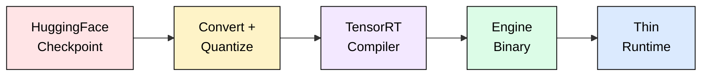
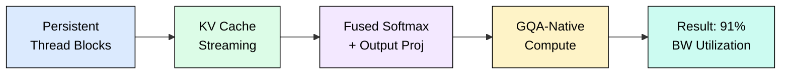
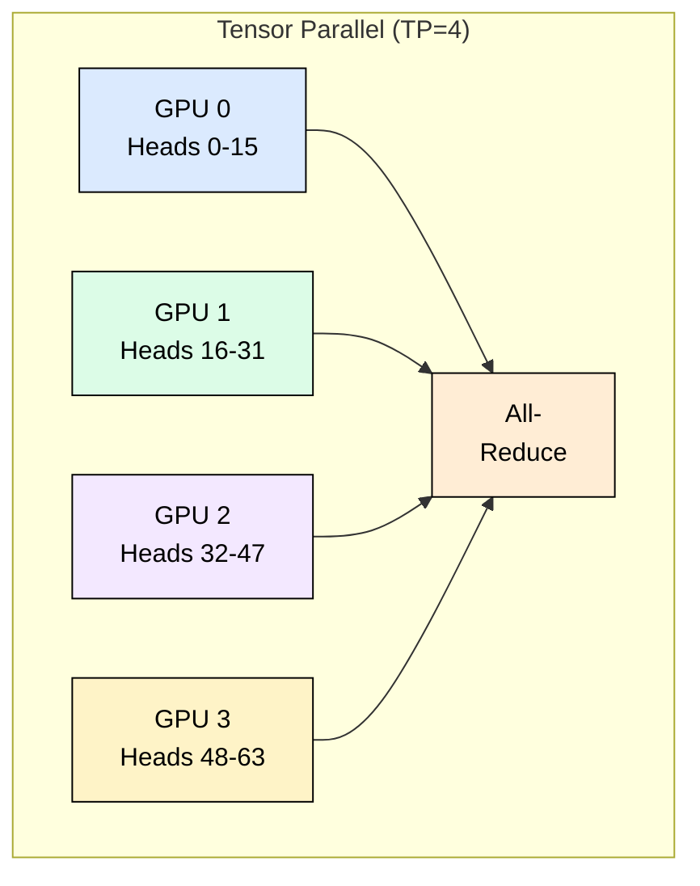
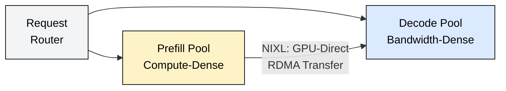

# 5.3 TensorRT-LLM

TensorRT-LLM achieves the highest single-GPU throughput of any serving engine on NVIDIA hardware. It does this through ahead-of-time (AOT) compilation: your model is analyzed, fused, and compiled into a hardware-specific binary before a single token is generated. The result is 15-30% higher throughput than vLLM on identical hardware, with near-theoretical bandwidth utilization during decode.

The tradeoff: you pay compilation time upfront (8 min for 8B, 3 hours for 405B). Every configuration change requires a rebuild. In exchange, inference runs with zero graph interpretation overhead.

## How AOT Compilation Works

During compilation, TensorRT performs layer fusion (40+ kernel launches per layer reduced to 5-8), kernel auto-tuning (benchmarks multiple implementations per fused op), memory planning (every buffer address known at compile time), and precision calibration (optimal quantize/dequantize placement for FP8/INT4).

The compiled engine is architecture-specific: an H100 engine will not run on A100 or B100.

## XQA Kernel: Near-Optimal Decode

The decode phase is memory-bandwidth bound. TensorRT-LLM's XQA (Cross-Query Attention) kernel achieves 91% HBM bandwidth utilization on H100 (vs 62% for standard MHA kernels) through persistent thread blocks, streaming KV cache loads optimized for L2 hits, fused softmax+output projection, and GQA-native computation.

On H100 SXM with Llama 70B (batch 128, seq 4096): standard MHA yields 1,850 tok/s, FlashDecoding 2,900 tok/s, XQA 4,440 tok/s (2.4x improvement).

## Key Optimizations

**Inflight Batching**: New sequences enter the batch at every decode step. When a sequence finishes, its KV pages are immediately reclaimed and a new prefill begins in the freed slot. GPU utilization stays above 85% vs 50-60% with static batching.

**FP8 Quantization**: On H100/H200, FP8 (E4M3) delivers 2x tensor core throughput over FP16 with per-tensor scaling. Llama 70B drops from 140 GB (FP16) to 70 GB (FP8) with less than 1% accuracy loss. NVFP4 on Blackwell further halves weight memory to 35 GB.

**EAGLE Speculative Decoding**: A lightweight head (~0.5% of model params) predicts next hidden states, generating a tree of candidates verified in one forward pass. Achieves 75-85% acceptance rate and 2.0-2.8x latency reduction, outperforming draft-model speculation (60-70% acceptance, 1.5-1.8x speedup).

**Compiled Paged KV Cache**: Unlike vLLM's runtime page tables, TRT-LLM bakes page lookups into the kernel binary. Zero runtime overhead for address computation, with pre-fetch patterns optimized at compile time.

## Multi-GPU Parallelism

Parallelism is compiled into the engine. When you set `tp_size=4`, four separate engine files are generated with NCCL all-reduce patterns baked in. Pipeline parallelism (PP) assigns whole layers to GPUs. Expert parallelism (EP) distributes MoE experts across GPUs with compiled all-to-all dispatch. All three combine for models like DeepSeek-V3 (671B, 256 experts): TP=8 + EP=4 + PP=2 = 64 GPUs.

## Disaggregated Serving with NIXL

NIXL transfers KV cache between pools at 900 GB/s (NVLink) or 200 GB/s (InfiniBand). For Llama 70B with 4K context, the 2.5 GB KV cache transfers in ~2.8 ms over NVLink. Disaggregation improves throughput 30-50% when average input exceeds 2K tokens and batch sizes exceed 64.

## PyTorch-First Backend (v1.0+)

TRT-LLM v1.0 accepts standard HuggingFace PyTorch models and compiles them automatically via `torch.export`. This eliminates manual graph construction for standard architectures (Llama, Mistral, Phi) while achieving 95-98% of the manual API's performance.

Use PyTorch-first for rapid prototyping and well-supported architectures. Use the manual API for custom attention patterns or the last 2-3% of performance on stable production models.

## When to Choose TRT-LLM

**Choose TRT-LLM when**: maximum throughput on NVIDIA hardware is the goal, models are stable (served unchanged for weeks+), FP8 precision is needed, or you need EAGLE speculative decoding.

**Choose vLLM/SGLang when**: models change frequently, you need multi-vendor portability (AMD, Intel), you want simpler operations (single-command deploy), or you need complex constrained decoding.

## Benchmarks (H100 SXM, Llama 70B FP8, TP=4)

| Metric | TRT-LLM 1.0 | vLLM 0.6 | SGLang 0.3 |
|--------|-------------|-----------|------------|
| Throughput (batch 128) | 12,800 tok/s | 10,200 tok/s | 11,100 tok/s |
| TTFT (4K input) | 180 ms | 220 ms | 195 ms |
| ITL P50 | 38 ms | 48 ms | 43 ms |
| GPU Utilization | 89% | 78% | 82% |

## FAQ

**Q: How long does compilation take?**
8 min for 8B, 45 min for 70B (TP=4), ~3 hours for 405B (TP=8). PyTorch-first adds 15-20% to build times.

**Q: Can I reuse an H100 engine on A100?**
No. Engines are architecture-specific (sm_90 vs sm_80). Mixed-generation fleets need separate builds per GPU type.

**Q: How does FP8 accuracy compare to FP16?**
Less than 1% degradation on standard benchmarks with proper calibration. Use 512+ representative samples for calibration data.

**Q: What if I need to swap models frequently?**
Use vLLM. TRT-LLM's build step makes rapid iteration impractical for experimentation.

**Q: Does disaggregated serving always help?**
Only when input length > 2K tokens and batch > 64. For short prompts, the NIXL transfer overhead exceeds the benefit.

**Q: What is the memory overhead for EAGLE?**
~1.4 GB for a 70B model (0.5-1% of main model parameters). Minimal compared to draft-model speculation (+14 GB for a 7B draft).

**Q: How do I debug incorrect outputs from a compiled engine?**
Validate at FP16 first, then enable quantization and compare. Use `--strongly_typed` during development. The compiled engine is a binary blob, so isolate issues by precision level.

## References

1. NVIDIA TensorRT-LLM Documentation. https://nvidia.github.io/TensorRT-LLM/
2. NVIDIA. "XQA Kernel: Optimizing Decode-Phase Attention for LLMs." TRT-LLM Technical Blog, 2024.
3. Li et al. "EAGLE: Speculative Sampling Requires Rethinking Feature Uncertainty." ICML 2024.
4. NVIDIA. "NIXL: NVIDIA Inference Transfer Library." https://github.com/ai-dynamo/nixl
5. NVIDIA. "TensorRT-LLM v1.0: PyTorch-First Backend." GTC 2025.
6. NVIDIA. "FP8 Training and Inference." H100 Whitepaper, 2023.
7. Agrawal et al. "Sarathi-Serve: Efficient LLM Inference with Chunked Prefills." OSDI 2024.
